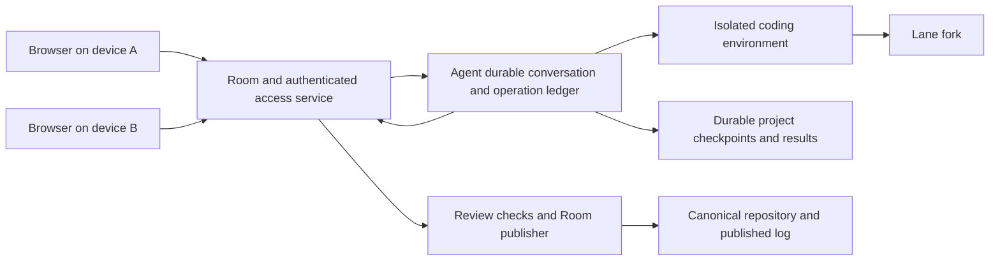

# Durable browser coding across devices

2026-10-03. Draft 2 for independent review. Planning request `b5f1fb3f`.
Reconciles the six findings in independent Draft 1 review `25065edf`.
Planned against main `e6e6782830e0ca8a68f0d11c4d4ece5e4e98c967`;
the active acts and MCP composition at `a1990c94` is a dependency,
not an approved release. This note proposes product and protocol decisions;
it does not claim that the experience is implemented.

A person should start a coding task in the browser, close the laptop, and
later watch, steer and review the same work from another device. That needs
three connected things: a durable agent conversation, a recoverable coding
environment, and several authorized device keys for one Room member.
The Room remains the authority for membership, lanes, proposals, reviews
and publication. Conversation text and command output are activity, not
proof that a change was proposed, approved or landed.

## The initial complete experience

**Proposed decision.** Deliver one hosted coding agent per task, working on
a real repository, with browser task input, progress, steering, attention,
pause, cancel, proposal review and publication status. Support a desktop
browser and a phone browser as separate devices of the same member.
The initial path uses the code-review declarations; it must still bind
their actual meanings and preserve earlier meanings when policy changes.

Initially each task has a new, separate member with role `agent`, controlled
by a named person. One Agent DO per `(room, agent member)` holds that task's
conversation and lane; returning devices find that same task and DO.
Reusing an agent identity across tasks can follow with explicit ownership
and conversation isolation. Its signing key stays outside the coding
container. This uses the
agent-member option already proposed in the pi-durable design. It allows
the person to meet a review obligation that names them: the agent is the
author, and the person is a distinct member. An agent delegated by that
person would act as the person, so their review would normally be refused
as self-review (R-ADM-3, R-OBL-2). Keep that delegation option for other
deployments and explain the difference.

Use Workers AI by default, as already planned. This work does not require
a browser IDE, terminal, preview server, harness marketplace, automatic
device-key synchronization, member self-service enrollment, firm mandates
or arbitrary external deployment tools. Those can follow. Dependency
installation and real commands in the hosted environment are included.
Normal reviewer and checker qualification remains unchanged.

Test reduction `ecbc722a` remains the builder's highest priority.
These stories do not become additional gates for the builder's decision
to start Jam. They extend the planned onboarding and hosted-agent work;
the acts and documentation backlog remains owed.

## Existing work and planning gaps

| Capability | Current evidence | What this story adds |
|---|---|---|
| Lane fork, lease and fork credential | Protocol R-LANE and R-WS; `packages/git/src/workspace/workspaces.ts` | A Linux working directory is a separate resource. A fork does not preserve unstaged or untracked files |
| Durable conversation and signed act outbox | Pi-durable design sections 3 and 4; `spikes/pi-durable/src/agent.ts` | Promote the alarm, attention, renew/release and UI integration already specified; add real filesystem and command tools |
| Crash-safe fork push | Pi-durable Q7; spike's `Workspace.prepare/head/push` interface | The spike uses a controlled workspace double. Persist real Git objects and reconcile a real remote |
| Receipt recovery after revocation | Pi-durable section 5; `packages/client/src/connect.ts` | Existing `resubmit` is HTTPS-only. Add binding submission of retained bytes without reconnecting, or use HTTPS for settlement |
| Browser Room views | `packages/ui/src/room/live/live-room.ts`; four existing screens | On main and a199 the page entry still chooses a mock. Add live entry, onboarding, task controls and device management |
| Multiple keys for one member | R-GEN-6; client-custody invitations and signed join | Browser persistence, device labels, enrollment UX, revocation impact and recovery |
| Agent authority and independent review | R-GEN-5, R-ADM-3, R-OBL-2/3 | Record which person controls each hosted agent; authenticate controls against current Room authority |
| Import and initial policy | Plan lane J; R-GEN-10/12/13; existing request `a13a0bf5` | A browser import broker and progress/recovery UX. Reuse the policy-bootstrap task |
| Cleanup visibility | Existing request `8d249233` and durable provider ledgers | Extend its eventual read/UI with coding-environment duties; do not replace unknown-effect settlement |
| User guides | Existing 67-page docs plan, especially Parts B and C | One tested browser journey, device recovery and the actual durability limits |

The pi-durable spike implements an act outbox and simulated file push; its
`run()` is driven by a caller. The design itself labels autonomous alarms,
attention subscriptions, lane ownership and browser watch/steer as
production work still needed. This note adds a coding environment rather
than crediting those proposals as delivered.

## Shared architecture and authority

**Proposed decision.** Add a production agent package beside the client.
One Agent Durable Object owns the durable conversation, input receipts,
act outbox, coding-operation ledger and checkpoint manifests. A separately
isolated coding container executes repository code. Its controller maps
a workspace to `(room, lane, holder, lease generation, workspace epoch)`.
A controller restart preserves that mapping; a replacement execution
instance gets a new instance ID. IDs and content hashes are data, not
credentials.

**New contract decision required.** Expose an authenticated Room-to-Agent
access boundary for discovery, minimal activity reads and control.
Existing sessions stay read-only (R-CRED-7); a delegated read session does
not grant task control. Initially control requests are signed by an active
key of the owner or an admin, in a distinct Agent-control domain binding
room, agent/task, action, body digest, operation ID, nonce and expiry.
The amendment must finalize that domain and nonce/replay behavior before
implementation. The Room judges current key, member, role and resource
ownership, then sends a trusted action-specific result over a service
binding. A client-supplied `viewer`, member handle, conversation address,
read token or signed-in website account never establishes control authority.
A future delegated control capability needs its own explicit scope rules.

An admin authorizes agent creation and records its controlling member
and agent identity. Initially there is no in-place owner reassignment.
The owner and admins may start, steer, pause, resume and cancel. Removing
the owner or revoking their last active key pauses new task dispatch and
lease renewal under controller policy, even while the agent's independent
Room membership remains active. Admins may inspect/export retained data
and stop or reconcile the task. An active owner restored with a new key
must explicitly resume; a removed owner cannot be restored. An admin can
start a new task for a new owner using an explicitly authorized export.
Losing physical access to a still-active key is not a revocation event;
work continues within its lease/budget until recovery or an authorized stop.

Authorized Room readers see a minimal projection of phase, saved-work
status and recorded outcomes. Do not publish arbitrary transcript/command
text under a promise of complete secret detection (R-SEC-6). Raw transcripts,
uncommitted filesystem contents and command artifacts are owner/admin
resources; reviewer status does not expose them. Render repository and
command output as inert content in the browser key's origin; future previews
need a separate origin. Recheck read/control authority and end watches when
access is revoked. Enforce configured run time, spend and resource limits
without a connected browser.

The coding environment shares no filesystem, cache or credentials with
the publisher or checker runners. It can run untrusted repository commands
with controlled dependency network access. Its credential broker allows
the lane fork and rechecks the lease before a write; it never gives the
container a Room signing key, operator key, model credential or canonical
write token. Preserve the existing git-only publisher and read-only
checker boundaries (R-EXEC). Agent-run tests inform the proposal; only a
qualified checker result can meet a check obligation.

## Story 1 Durable cloud coding workspace

### Proposed user flow

The person gives the agent a task and scope. The agent records a claim,
opens the lane's existing workspace operation, then provisions its coding
environment from the authorized fork/base. The UI distinguishes waiting
for the fork from waiting for compute and dependencies. The agent reads
and edits files, installs dependencies and runs commands; the person sees
saved work and command status, with a link to the corresponding lane.

After an interruption the controller recovers the conversation and ledger,
revalidates the Room holder/lease, restores saved files, then reconciles
each unfinished operation. It does not ask the model to reconstruct lost
edits. The agent prepares one exact commit, pushes it to its fork, proposes
that head and follows the ordinary reviews, checks and landing operation.

### Persistence and retry decisions

**Provider evidence.** Cloudflare documents an ephemeral instance disk,
filesystem snapshots that exclude processes, and an application-managed
restore. A durable sandbox name is not a durable filesystem. Its automatic
checkpoint example explicitly loses changes after the last checkpoint.
These are provider descriptions, not an Artroom crash test.
[Sandbox lifetime](https://developers.cloudflare.com/sandbox/concepts/lifetime/),
[automatic saving](https://developers.cloudflare.com/sandbox/files/save-a-sandbox-automatically/).

**Proposed decision.** Make a quiesced project backup in our R2 bucket the
authoritative checkpoint. The initial owned saved root contains the working
tree and self-contained Git storage, including index, refs and prepared
objects. Preserve tracked edits/deletions, untracked and ignored project
files, generated/dependency files, modes and symlink text. Do not follow
symlinks outside it. External Git directories/alternates must be made
self-contained or refused before starting. Unsupported special files fail
the save explicitly. Temporary files, OS installations and caches outside
the declared root are volatile; tools cannot acknowledge them as saved work.
Persistent work outside the root is initially unsupported. Any later cache
exclusions must be declared before work, with an explicit rebuild policy.

Serialize mutating tools and quiesce every writer, including detached child
processes after a shell exits. The spike must prove freeze/termination and
restore behavior rather than assuming that serialized calls stop children.
Persist and verify all payload bytes and Git-object closure first, then an
immutable integrity-checked manifest. In one durable controller transaction,
check current epoch, instance, operation and base checkpoint, commit the
operation receipt and current-checkpoint pointer, then acknowledge saved
work. Restore validates that closure before exposing files. Old-epoch
callbacks may settle their own outstanding duty; they cannot replace the
current pointer, receipt or prepared commit. On save/byte/output/process-limit
failure retain the last good checkpoint and show observed execution status
separately from an acknowledged durable result. Do not place the Git working
directory on an object-store mount and assume POSIX semantics.

[File persistence options](https://developers.cloudflare.com/sandbox/files/),
[directory backups](https://developers.cloudflare.com/sandbox/files/back-up-a-directory-to-r2/).

Store edit intents, content blobs and base hashes before applying them.
A tool result says “saved” only after the checkpoint is durable. Commands
need a durable intent before dispatch, redacted output chunks with
sequence numbers, and a terminal receipt containing exit status and the
checkpoint it produced. Completed command results survive; unacknowledged
live output or partial writes may not. Show the last durable boundary.
An interrupted command remains interrupted/unknown until definite evidence
settles that attempt. A new authorized attempt gets a distinct linked ID;
its success cannot settle the earlier unknown outcome or prove the first
external write absent. Never label it completed because a conversation resumed.

| Operation | Retry or reconciliation rule |
|---|---|
| Read files/status | Re-read after restoring and checking the manifest; a read can observe newer state |
| Apply an edit | Reuse its operation ID and intended bytes. Compare the stored base/result hashes; do not apply it twice over later edits |
| Completed local command | Return its stored receipt. Do not run it again just to recover the answer |
| Running command after controller restart | Reattach only to the matching live instance and job ID. A PID alone is insufficient |
| Command after execution-host loss | Processes do not survive. Mark interrupted; inspect saved outputs/files. A declared read-only check may run as a new attempt; arbitrary shell, install scripts, network writes and migrations are unsafe to replay |
| Prepare commit | Save the exact object bytes, metadata and OID before acknowledging preparation. Recovery reuses that OID, including when no ref was pushed |
| Push to fork | Persist destination ref, expected old OID, prepared OID and epoch first. Read back after a lost reply. If it is our OID, recover success; if still the expected OID, retry only with valid authority and compare-and-swap; if it moved elsewhere, reconcile without overwriting |
| Room act | Keep the signed envelope outside the tool's temporary memo and replay those exact bytes (R-IDEM-2). In a declared room keep the original binding; a changed meaning needs an explicit new action. Receipt recovery after revocation uses session-free submission, not a fresh connection |
| External effect with an unknown result | Keep its ledger entry and attention item. No timeout or model assertion proves that it did not occur |

There is no promise to preserve process memory or every partial write of
an interrupted arbitrary command. There is a promise to preserve all
acknowledged edits, completed command checkpoints and prepared commits.
That recovery contract must be proved with a real repository and abrupt
host loss before this experience ships; a periodic snapshot alone is
insufficient. A missing or corrupt checkpoint is a recovery failure,
never permission to start an empty workspace.

### Pause retention and cleanup

**Proposed initial defaults, configurable by the operator:** retain saved
project data for seven days after pause, idle attention or terminal completion,
with the deadline visible and export/extension available before it expires.
Active work renews its retention deadline. Reference current checkpoints,
retained exports and unresolved operations as purge roots. Pin every byte or
Git object still needed to reconcile an unsettled effect beyond that deadline;
release those pins only on definite settlement. Keep minimal operation
tombstones and duties after permitted payload cleanup. Repeating the same
ID returns its retained result, explicit expired/unavailable data, or still
unknown; it never silently becomes a fresh operation. Pending deletion is
durable work, not a closed task.

At an eligible deadline, an epoch-guarded purge transaction expires the
checkpoint/export roots whose retention ended and marks their payloads
unavailable. It cannot release an unsettled-operation pin. The deletion
worker removes only the resulting unreferenced owned objects and records
actual deletion outcomes; an expired pointer does not claim that deletion
has succeeded.

| Event | Required lifecycle |
|---|---|
| Browser disconnect | Continue the hosted task, renew its lease while actively authorized, and keep alarms running. No browser heartbeat owns the task |
| Pause or waiting for attention | Stop new tools; finish/reconcile the current one, save work and stop idle compute and renewals. Keep the existing lease until expiry unless explicitly released, and show the deadline. Resume after expiry requires a new claim/take-over and epoch; the same authorized task can restore its own retained checkpoint |
| Finish | A proposal waiting for review is not a landed change. Suspend idle compute and renew only within the visible configured review window and budget. Then pause, with expiry/reclaim shown. Terminal landing or explicit release stops renewals and starts final-checkpoint retention |
| Cancel | Persist the request, stop new work, cancel/reconcile jobs, checkpoint and request release when authorized. Show cancellation pending while any effect or publication remains unresolved |
| Lease lost or holder changed | Fence the old epoch immediately; stop writes and renewals, terminate compute where possible, retain the former holder's checkpoint privately. A new holder gets a fresh environment; uncommitted handover requires explicit authorized export |
| Relevant authority lost | Revoked agent/delegation or owner removal/last-active-key revocation stops new tools, broker writes and renewals. A single owner-device revocation with another active owner key does not stop an independent agent. Admitted outcomes stay recorded; settlement and existing fork-token cleanup debts remain owned |
| Retention ends | After a durable purge decision, delete only owned payloads not pinned by a checkpoint/export/unsettled operation. Keep Room history and operation tombstones/duties. Retry failed deletions and report actual outcomes; elapsed time proves neither deletion nor an external effect's absence |

Full-disk provider snapshots may be an optional warm-start cache, not the
initial retention authority. Cloudflare's current snapshot example says
there is no snapshot-delete API and snapshots expire after 30 days.
Do not advertise seven-day physical deletion for that storage.
[Automatic snapshot retention](https://developers.cloudflare.com/sandbox/files/save-a-sandbox-automatically/).

### Dependencies unresolved choices and acceptance

Dependencies: reviewed acts/client access, existing fork and credential
ledgers, the already specified production pi-durable scheduler/attention
integration, and the new access contract. A bounded provider spike must
confirm backup consistency (including a detached child writer), restore of
Git metadata and ignored files, abrupt-stop behavior, network credential
isolation, command reattachment and the guarded receipt/ack boundary.
Production receipt settlement owns the existing client gap: add a binding
helper that submits retained signed bytes without a read session, reconnect,
new signature or new authority; existing HTTPS `resubmit` remains an available
settlement path (pi-durable section 5).

Unresolved implementation choices: backup format and incremental strategy;
instance sizing and per-run budgets; output byte limits; how safe local
checks declare replay policy. These must meet the contract above. Any
failure to preserve acknowledged state is a design problem to report, not
a reason to weaken the acceptance story.

Acceptance: edit tracked and untracked files in a real repo, complete a
command and prepare an unpushed commit; abruptly stop the execution host
and restart the Agent DO. Recover the exact saved files, result and OID.
Interrupt one side-effecting command after dispatch and show reconciliation
without repeating it; an authorized new attempt leaves the first unknown
duty open. Include a detached writer and stale-epoch save callback; neither
can corrupt the acknowledged checkpoint. Lose one fork-push response and
recover one pushed
head, then propose, obtain a distinct member's review and follow a real
landing. Also fence a stale epoch after lease take-over without copying
the former holder's private environment to the new holder. Recover an admitted
act receipt after revocation without reconnecting, and show pinned bytes,
failed cleanup and explicit expired retries after permitted deletion.

## Story 2 One complete browser workflow

### Proposed journey and controls

| Step | What the person sees and does | Recorded basis and recovery |
|---|---|---|
| Create or join | Choose a room name/source or open an invitation; make and save a device key; save offline recovery material at founding | R-GEN draft/found and R-CRED redemption. Persist the same genesis/join intent before sending; lost replies recover the same room/member |
| Import | Choose the initial supported repository source, see validation/import/founding progress and an explicit initial policy | A browser broker creates an isolated Artifacts copy of a public GitHub repo, or accepts an operator-approved existing Artifacts identity. It issues the R-GEN-12 onboarding grant only after verifying authority; a URL is not a repository identity |
| Give a task | Choose the hosted agent, goal and scope; see identity, owner, limits and initial review policy | Durable input receipt before UI confirmation. Room claim then records intent, holder and overlaps; task submission alone is not a claim |
| Start | See fork, compute and dependency preparation separately, with actionable failures | Existing workspace op plus the new controller ledger; retry resumes the same attempt or reconciles it |
| Watch | See agent activity, saved-work status, current command and pending attention alongside lane/proposal/landing facts | Separate conversation and Room cursors. Reconnect from saved positions or a complete snapshot; stale/offline status keeps the last confirmed Room watermark |
| Steer | Submit a changed instruction and see accepted, queued and applied states | Owner/admin authorization and durable input ID; steering joins after the current tool boundary. It does not change an already signed act or recorded proposal |
| Attend | Answer a question, inspect a refusal or restore lost authority | Distinguish agent questions from Room attention. A reply to the agent cannot satisfy a Room obligation |
| Pause or cancel | See the acknowledged control, current operation, lease expiry, saved checkpoint and remaining duties | The Story 1 lifecycle. Closing the tab has neither effect; cancellation cannot undo a completed external effect |
| Review | Read the exact head/diff, scope, obligations and current/carried/stale evidence; approve or request changes with a reason | The person's own key signs the Room review. A newer proposal or policy change prompts refresh; agent prose does not count as evidence |
| Follow publication | Request landing through the holder agent, follow preparation/waiting/reservation/conflict/unresolved/terminal states, and see main plus published-through | Existing Room landing and publication records. “Agent finished,” “proposal recorded,” “landed” and “log published through N” are distinct facts |

For the first complete path, public-source import and authorized existing
Artifacts import are supported. Private-source host OAuth, upstream mirroring
and additional providers follow after their authorization design; website
sign-in would not replace Room keys. Import failures preserve a durable
attempt and show retry, wait for authorization or cleanup owed, rather than
creating another repository blindly.

Use the existing four screens. Add onboarding/device panels and a task
panel linked to the Room/lane; a permanent agent-chat screen is unnecessary
to prove this journey. Small-screen review must expose the head and verdict
scope before the person signs, not hide them behind activity text.

### Dependencies unresolved choices and acceptance

Dependencies: Story 1, Story 3, the live UI/client work already owed in
stage 5, browser onboarding in lane J, policy bootstrap `a13a0bf5`, and
cleanup visibility `8d249233`. Preserve their functional outcomes; this
note does not file replacements for them.

Unresolved choices: the initial hosted instance's operator and access
policy; import-broker authentication/rate limits and provider cleanup
details; the selected real demo repo and useful task; default spend and
retention limits. The browser journey must show these settings and blocked
states without requiring local CLI work.

Acceptance: a new user imports a real repository, gives a useful small
change to the separate agent member, watches commands and recorded progress,
responds to one attention item, requests one correction, signs a qualified
review and follows a real landing and log publication. Include a lost
submission reply and a browser disconnection. A deliberately false “done”
message must leave the authoritative proposal/landing status unchanged.
Pause/cancel and a publication with an uncertain outcome must have visible,
different recovery actions. Use a fresh-user walkthrough as well as an
automated browser scenario.

## Story 3 Identity and continuity across devices

### Proposed enrollment and return flow

Each browser stores its own non-extractable Ed25519 CryptoKey in IndexedDB,
with room IDs and device metadata; read-only sessions are short-lived and
renewed by signed requests. Task controls use the signed resource/action
requests described above, never these read sessions. Another device makes
another key. It does not
copy a private key, gain authority from an email address, or create another
member. The WebCrypto specification permits CryptoKey storage through
serialization, but warns that users can clear browser storage; test the
chosen browsers rather than claiming indefinite custody.
[WebCrypto key storage](https://www.w3.org/TR/webcrypto/#key-storage).

Use the existing admin-authorized client-custody invitation for the same
active member (R-GEN-4/6). An admin on an enrolled device issues a short-lived,
single-use invitation and transfers its fragment link privately, for
example by QR. The new browser signs join with its new key, receives the
same member identity, obtains its own read session and discovers that
member's ongoing hosted tasks. Show device label, public-key fingerprint,
join record and current status; labels are not authority.

The existing invitation deliberately does not bind a particular public key
before redemption. Do not present this as cryptographically approving a
specific device fingerprint. Possession of the invitation secret authorizes
redemption. A future fingerprint-bound pairing or member self-enrollment
flow needs explicit new authority and invitation rules. Initially, a
non-admin member asks an admin to add or remove their device.

Returning later requires an enrolled device or fresh authorized enrollment.
For a sole admin, enroll a second device or save the recovery key offline
during setup. For an active member whose device key is lost or revoked,
another admin can invite a replacement key; the recovery key can issue that
invitation when no admin can act (R-GEN-3). The recovery key cannot itself
join, delegate or do task/lane work. A removed member handle cannot be
reactivated, invited again or reused (R-ID-5); a newly admitted member is a
different identity. No trusted active device, admin or recovery key means
there is no same-member recovery path in the current protocol. Do not invent
operator impersonation or silently found a substitute room.

### Revocation and hosted-work decisions

| Event | Access and work effects |
|---|---|
| Device tab closes or goes offline | No key revocation. Its independent hosted agent continues within lease and budget; the next authorized device sees the same task/conversation and Room history |
| One human device key is revoked | Its sessions/watches and new controls stop. Other active keys of that same member retain their role, review authority and task ownership |
| Owner's last active key is revoked | Pause new task tools, broker writes and renewals; keep work and reconcile admitted/in-flight effects. The still-active member can regain a key through an admin/recovery invitation, then explicitly resume |
| Owner member is removed | Pause under controller policy although the independent agent's Room membership may still be active. Admins retain private inspection/export and stop/settlement authority. The removed handle is not recoverable; initial delivery has no in-place owner transfer |
| Initial separate-member agent after one device revocation, with another active owner key | It continues under its own active member key and lease. UI offers “revoke device” separately from “stop agent work”; the owner's last-active-key row remains a separate controller-policy stop |
| Agent delegated by the revoked device key | Its delegation becomes invalid even if another device of that member remains active (R-ADM-3). Stop dispatch/broker access; retain work. A new explicit delegation from an active device and epoch rebind can resume under the same member holder; no automatic transfer of authority |
| Agent key revoked, agent member removed or relevant authority expires | Stop affected hosted work and fence new operations; keep recorded outcomes, saved data within retention and owed reconciliation |
| Compromised or retired key | Apply existing evidence invalidation and reserved-publication rules (R-REV). Revocation is not a rollback of work already admitted or publication already reserved |

The initial agent identity avoids an accidental device lifetime for the
coding task. It still has a visible, revocable key, role and lease. If the
person wants all hosted work stopped, the UI sends an authorized stop
control and, for an admin, offers the appropriate agent-key/member
revocation. Current contracts do not guarantee that revoking a human key
automatically revokes an agent's independent membership.

The controller revalidates authority before new dispatch and Git writes.
If access is lost during an already running command, try to terminate it,
retain the operation and reconcile its outcome. Neither revocation nor
closing a stream proves that a remote side effect stopped. Exact replay
of an already accepted signed act may recover its receipt after revocation
(R-IDEM-2), using existing HTTPS resubmit or the specified session-free binding
helper. It gives no permission for a new act or renewed workspace grant.

### Dependencies unresolved choices and acceptance

Dependencies: existing roster/invitation/session/revocation contract,
browser key persistence and management UI, and the shared authenticated
Agent access boundary. Member-scoped delegation and firm representative
handover remain separate, already tracked designs; neither is needed for
the initial separate-agent-member path.

Unresolved choices: device-label metadata storage; supported browser/version
matrix; recovery-material presentation and temporary key handling during
recovery; future self-enrollment and bound-key pairing. The initial admin
approval requirement is a decision, not a missing role grant to assume away.

Acceptance: device A starts a task; enroll B as another key of the same
member, close A, then use B to watch, steer and sign a qualified review.
A fresh uninvited browser cannot read private task data or control work;
an expired or used invitation is refused. Revoke A and prove its old read
session and controls fail while B and the independent hosted agent remain
available. Revoke the owner's last active key and remove an owner in separate cases:
the controller pauses new work, while admin recovery/export follows the
rules above. A read-only delegated session must fail task control while a
qualified signed control succeeds. If the optional key-delegated agent mode
is later selected, revoke its grantor and prove pause, preservation and an
explicit replacement grant before writes; this is not an initial runtime
mode requirement. Recover the same active member through an admin and the
offline recovery path; a removed handle and last-admin refusal are clear.

## Implementation handoff after design review

The following are proposed work packages, not claims of assigned or
completed implementation. Commission them only after this note's review
is reconciled. Each request must inline its scope, decisions, dependencies
and acceptance; an executor must not need this conversation.

| Order | Work package and source scope | Distinguishing delivery |
|---|---|---|
| 1 | Contract: `docs/protocol.md`, `packages/contract/src/transports.ts` and affected roster/client types. Define signed resource/action-bound Agent controls, read-only sessions, owner registration/removal/last-key policy, lifecycle/status and idempotent input/operation records; preserve R-GEN/R-IDEM/R-WS/R-REV and declared bindings | Current trusted member/key controls only their authorized resource; stale/revoked/foreign access cannot control or expose another workspace; no authority taken from UI identity |
| 2 | Bounded coding-environment recovery spike, isolated from publisher/checkers | A real dirty repo and Git closure survive abrupt loss after epoch-guarded receipt/ack; include a detached writer, stale callback, new-attempt/unknown duty and purge/expiry. Record provider/version, timing, costs and failed contracts |
| 3 | Production agent/runtime package, reusing `spikes/pi-durable/src/do-sqlite.ts`, outbox pattern and existing client/Git owners | Autonomous alarms run without a browser; attention is delivered once; leases/owner authority fence tools; receipts/checkpoints/results persist; session-free accepted-act settlement and real fork proposal succeed |
| 4 | Browser identity/onboarding and import integration in `packages/ui/src`, client key helpers and the hosted Worker; reconcile lane J/policy bootstrap rather than duplicate it | Persisted browser key; same-member invitation/recovery/revocation; authorized import with one retry-safe Room identity and explicit policy |
| 5 | Browser task/progress/control/review integration through the existing UI adapter and the new Agent API | One complete real browser journey, offline/unknown states and the two-device acceptance, with conversation activity separated from Room records |
| 6 | Joint acceptance and user docs in the existing documentation lane | One deployed real-repository walkthrough with host interruption and two devices; docs accurately explain saved work, processes, revocation and recovery limits |

Orders 2 and 4 can develop in parallel after the relevant contract decisions;
3 needs the recovery spike, and 5 needs the live portions of 3 and 4.
Keep owned fork/token/landing cleanup in the Git/Room packages. Do not
move it into the agent package or give the coding container main access.

Match existing TypeScript, signed Result/refusal shapes, UI adapter
boundaries and gitseq request/promise/exact-evidence review. Known current
commands are `npm run typecheck`, package-scoped Vitest, Git's
`node --test`, and UI `npm run e2e`; the test-economy work is changing
their delivery scope. Each implementation request must name its actual
affected runner commands and one final retained gate at its delivered
head. Do not revive per-guard mutation sweeps or install/compile the whole
repository for each scenario. Use a few controls that distinguish the
named invariants, and the real storage/transport/process boundary where
it matters. This planning note has run no application test or deployment.

Stop and report a design discrepancy if durable acknowledgements cannot
be backed by persisted bytes, resource authorization requires a broader
identity contract, an existing protocol rule must change, or an uncertain
external result is being classified as definitely absent. Reconcile source
drift before implementation; the active acts/MCP branches and test runner
changes are not approved simply by being cited here.
