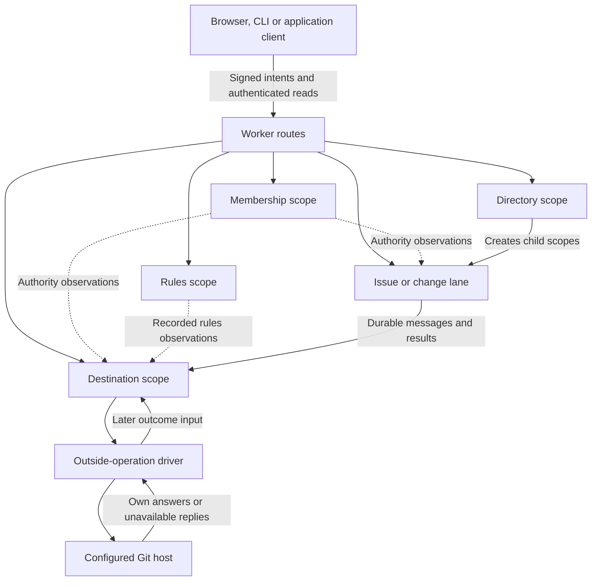

# Architecture in one page

For an application builder or operator, this page shows which part of
Artroom owns a decision, stores its record and reaches an outside system.

Clients sign requests. A Cloudflare Worker routes them to a scope's Durable
Object. That object keeps the scope's history and derived state in SQLite.
The pure judges in `derive` determine the allowed changes; the runtime
controls reads, clocks, bounded turns and storage transactions.

Each scope owns a separate order and transaction. Dashed observations are
checked inputs to judgment, not shared storage. Cross-scope messages have
durable send identities; receivers verify their source facts and record
their own decisions. A result in one scope can arrive after the caller's
original action has returned.

| Part | Owns |
|---|---|
| Register and directory | Repository founding and the room's child-scope relationships |
| Membership | Members, enrolled keys, roles and the authority a scope may observe |
| Rules | Published room configuration and review requirements |
| Lane | The application's work items, versions, reviews and declared interactions |
| Destination | Judgment of publication and its recorded outside-operation duties |
| Git host adapter | Bounded Git reads and authorized host requests; it reports evidence, not native policy decisions |
| Replay | Independent checking of recorded history, with stated coverage and trusts |

## Boundaries that matter

Code publication moves through the Git host. Work requests, authority and
judgments move through scopes. A Git commit does not itself become an
Artroom act, and a recorded act does not itself prove a Git write finished.

The outside driver marks attempts before sending mutations. A missing reply
can leave an unknown outcome and a cleanup duty. Private credential custody
is separate from public history. The gateway fences a granted ref update;
discarding a token's plaintext does not prove the provider revoked it.

The checker package supplies runner and signer interfaces with explicit
trust boundaries. A source interface is not a deployed sandbox. The broader
durable-conversation, supervisor, guest and workspace architecture remains
owned by IA (`b538c5ea` / `d55da8ef`); this page does not present that planned
composition as a current production fleet. Native `platform:task@1` is not
supplied at this baseline. Real lane hold/Git-read host adapters and complete
cross-device acceptance retain their own dependencies.

## Source and acceptance

Draft complete explanation, inspected 2026-10-09 against main
`9d7e4c2777ea8d35441b4a9d79b407cd701065fa`; no tested public release is
established. See [Worker routes](../../packages/scope/src/worker.ts),
[turns](../../packages/scope/src/turn.ts),
[platform versions](../../packages/platform/src/index.ts),
[outside operations](../../packages/scope/src/operations.ts),
[gateway](../../packages/git/src/gateway.ts), and
[checker interfaces](../../packages/checkers/src/index.ts).
The [full ledger](ledger.md) names feature owners and acceptance still owed.
