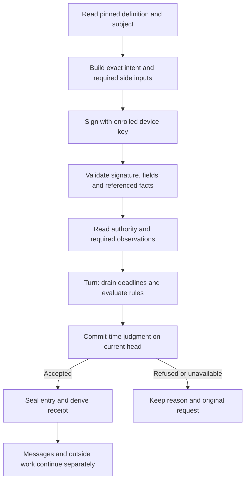

# The life of an act

For a client or application builder, this page follows a request from the
meaning the application declares to the receipt the participant keeps.

An **act** is an action declared by a scope's application. The participant
signs an **intent** requesting that action. The scope decides whether the
request may take effect. This page describes the native scope API in current
main, not the older parked Room API or an unlanded intent-v2 wire format.

## Choose the exact meaning and subject

A scope pins its definition at founding. That definition declares each
act's target item type, fields, required authority, guards, changes and
messages. A client discovers or reads that actual definition; a familiar
action name is insufficient to choose its meaning.

The current intent binds the target scope **and incarnation**, signing key,
action kind, local item ID, expected item revisions, field values,
idempotency key and deadline. For example, a verdict must name the actual
version it reviews. A changed selected version is a new decision for the
participant, not permission to retarget the existing request silently.

Fields may name exact foreign facts. Detached text travels beside its
digest; platform fields can require separately supplied values under their
declared byte domains. A client must supply those bytes according to the
actual declaration. Hashing a label or substituting the latest head does
not manufacture the required evidence.

## Read before committing; judge in the transaction

The service checks the signed input and reads foreign facts against their
references. It obtains the authority observation needed for this request.
Rules that need evaluation run on a snapshot before the storage commit.

A turn first drains due deadlines in bounded order. It then checks that the
head has not moved, judges the input on the transaction's clock reading and
either commits the derived entry or answers without accepting the act. If
another input moved the head during preparation, it starts that judgment
again within its restart budget. A missing authority read is unavailable,
not a grant inferred from the client's view.

Only the accepted entry, its retained inputs, sends and folded state share
that local transaction. Other scopes do not join it. Their messages and
outside-operation replies become later inputs with their own judgments.

## Distinguish the four answers

| Answer | Meaning and next step |
|---|---|
| Accepted | The scope recorded this act. Keep its receipt and exact request; follow any remaining messages or publication work. |
| Refused | This request failed a check at the stated head. Read its reason and any named guard; inspect before deliberately changing the request. |
| Unavailable | This reply establishes no acceptance. Keep the original request and inspect; due entries or a prior acceptance can exist despite the reply. |
| Mismatch | The actor's idempotency key already belongs to a different accepted intent. Inspect that record; do not substitute new bytes under the same key. |

A transport failure gives no native answer. A lost reply does not mean the
scope did nothing. The caller needs the same original signed intent to ask
for settlement or exact replay. With an accepted actor/key pair, exact
replay can return the earlier receipt without accepting a second act.
Timed work can still prevent that receipt from being returned on a given
turn. A read saying “not found” is not universal permission to sign a new
mutation.

The native API supports settlement, but a client must actually retain the
request to use it. Current clients have different custody boundaries: CLI
Join has its own saved-request journal; generic `act`, `edit` and `merge`
do not promise a universal durable outbox. Browser memory is not recovery
after device loss or reload. Follow the documented client path rather than
assuming platform idempotency supplies missing local records.

## Follow effects to their own outcomes

Attention names members and reasons; it does not confer permission.
Messages have send duty IDs and receiver decisions. Outside operations keep
attempts and confirmed, refused or unknown outcomes. Unknown mutation
attempts remain duties; their driver does not re-send the original mutation
just because its reply was lost.

For a merge, the accepted act opens the workflow. Later destination and
change records establish publication and Merged. Read those records when
you need the result, not only the first accepted receipt.

Definition versions remain immutable for the scope's lifetime. Historical
entries are judged with their pinned meaning. The broader declaration-change,
stale-binding, retirement and name-reuse tutorial remains an explicit manual
obligation; this page does not assert that a new intent protocol has landed.

## Source and acceptance

Draft complete explanation, inspected 2026-10-09 against main
`9d7e4c2777ea8d35441b4a9d79b407cd701065fa`; no tested public release is
established. Sources: [intent](../../packages/contract/src/intent.ts),
[submission and settlement](../../packages/scope/src/core.ts),
[turn](../../packages/scope/src/turn.ts),
[declared field shaping](../../packages/client/src/declared.ts), and
[outside operations](../../packages/scope/src/operations.ts).
Existing [turn witnesses](../../packages/scope/test/turn.test.ts) show the
native boundary under their fixture conditions; no new run is claimed.
Independent review and the complete release acceptance remain in
[the ledger](ledger.md).
