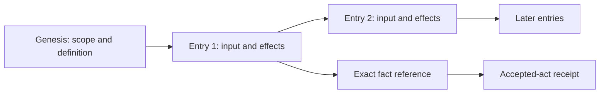

# The record

For a participant checking what happened, this page explains what an
Artroom receipt proves, where to find the underlying evidence and what a
consistency report leaves open.

Every scope has its own numbered history. The first entry records its
founding; each later entry names the hash of the previous entry. An entry
records one input, the facts used to judge it, prepared rule results, derived
item changes and messages to send. Folding those entries produces the
scope's current state. Views and summaries help you read that state; the
entries explain how it was reached.

An exact **fact reference** names a scope, its incarnation, an entry position
and that entry's hash. A position such as “entry 12” is meaningful only
inside its own scope. An incarnation distinguishes this lifetime from a
different lifetime under the same scope ID.

## Keep the accepted receipt

An accepted act returns a receipt containing its fact reference, pinned
definition, intent digest, effects and send duty IDs. It identifies the
local entry the scope committed. The receipt is built after sealing; it is
not inserted into that entry's own bytes.

That is enough to locate the accepted request and its immediate changes.
It does not say that another scope accepted a message, a Git host published
a commit, or a provider revoked a token. Those outcomes need their own
entries and evidence. Keep the original signed request too if you need to
settle a lost reply.

The word “commit” can refer to three different things here:

| Evidence | What happened |
|---|---|
| Local storage commit | One scope atomically kept an entry and its derived state |
| Git commit object | Git bytes identify a tree, parents and commit metadata |
| Recorded publication | The destination recorded its publication outcome, using the evidence its rules require |

An accepted merge request is the first of these, not automatically the
third. The current change definition sets Merged after receiving a published
destination outcome. The destination also writes its publication receipt
through a separate workflow. That Git publication receipt is different from
the accepted-act receipt returned by submission.

## Read with provenance

When judging work, follow the exact references rather than a current title
or the latest branch. An entry can name foreign facts and retained text by
digest. Those links let a reader check which version, authority observation
or rule value the judgment used. They do not make later changes apply
retroactively.

The current HTTP service provides authenticated history, entries, stored log
bytes and retained-input reads. The command line provides log and verify
commands. [The first-change guide](first-change.md) shows their contribution
context; [the scope guide](../scopes.md) describes the interfaces. Do not
assume the older `refs/artroom/log` publishing scheme is a current route or
that an operator has exported the whole history offline.

Detached text may be removed under a recorded tombstone. The history still
identifies that redaction; a verifier cannot recreate the removed words.
Missing bytes without a valid recorded basis are not a complete proof.

## What verify tells you

An integrity check checks byte identity, chains and signatures. Replay also
derives judgments again from the recorded inputs, retained dependencies,
definition code and recorded times. Its report names the target head,
coverage, trusted anchors, missing dependencies and other trusts.

“Consistent” means the checks of that mode hold for that stated coverage and
those trusts. It does not prove that the history ends where the service
says, unless an independently kept head establishes the target. It does not
prove a provider's real-world action merely because the recorded answer
replays. A source whose ancestry walk cannot be derived can remain
incomplete even when its other entries match.

Use a receipt you kept to identify a head when comparing records. Read a
missing-dependency, incomplete or unsupported-definition report as a limit
on the conclusion, not as success. Room discovery in `verify --all` is also
bounded: it follows recorded creation histories for that room, not every
scope on the service. Check publication and outstanding duties separately.

## Source and acceptance

Draft complete explanation, inspected 2026-10-09 against main
`9d7e4c2777ea8d35441b4a9d79b407cd701065fa`; no tested public release is
established. Sources: [entries and receipts](../../packages/contract/src/entry.ts),
[report shape](../../packages/contract/src/report.ts),
[CLI verifier](../../packages/cli/src/commands.ts),
[replay limits](../../packages/replay/README.md), and
[change publication handler](../../packages/lanes/src/change.ts).
Existing [scope replay witnesses](../../packages/scope/test/replay.test.ts)
are reusable evidence with their stated stand-ins; this page claims no new
run, offline export or release acceptance. See [the ledger](ledger.md).
