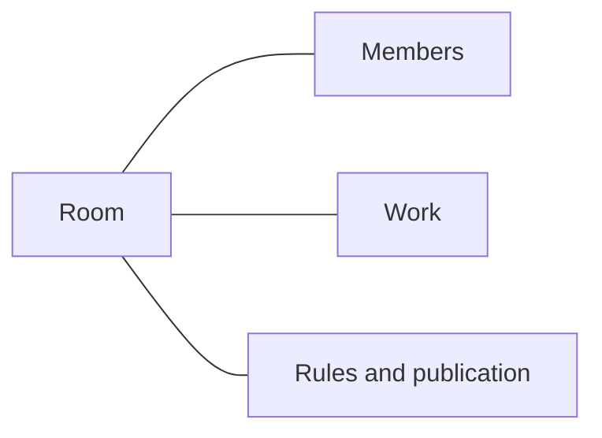
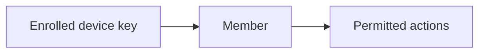
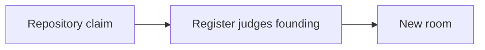
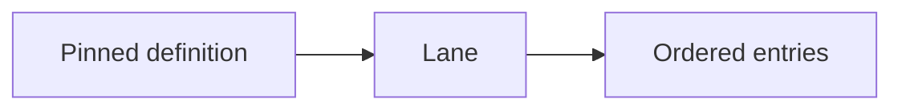
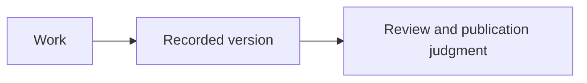
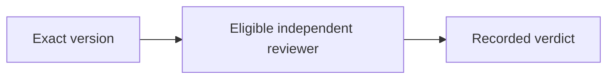
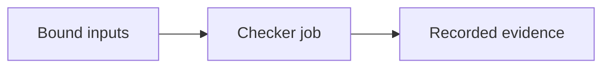
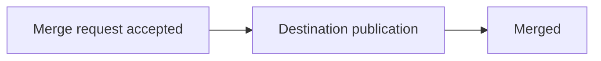
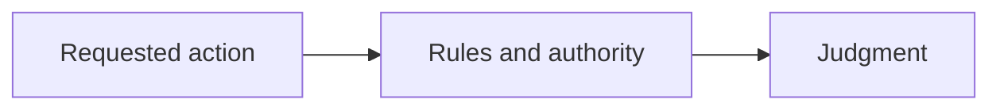
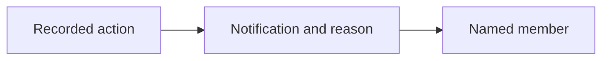

# The ten terms

For a new participant in the code-work application, these ten terms help
you read its work views and outcomes. The names preserve the approved
beginner vocabulary; their current meanings below do not restore old APIs.
Other applications may use different words for their work.

## 1. Room

A **room** brings a repository's membership, rules, work scopes and
publication destination together.

## 2. Member

A **member** is a participant whose enrolled keys may perform the actions
their current room role permits.

A person or an agent can be a member; a job such as “builder” is separate
from the role that grants authority.

## 3. Claim

A **claim**, in the current CLI, requests a new repository-backed room;
committing to work inside an existing room is a separate application act.

The earlier plan also used this word for taking work. Do not infer a
work-taking command or workspace from the repository `claim` command.

## 4. Lane

A **lane** is a work scope whose pinned application definition governs
its items and actions.

Issue lanes and change lanes have different definitions. The name alone
does not tell you which acts are supported or which host adapters exist.

## 5. Proposal

A **proposal** records a change offered for judgment, with a version
identifying the work to review.

A newer version does not silently replace evidence about an older one.

## 6. Review

A **review** is an authorized verdict about an exact proposed version
and the part of the repository it concerns.

The room judges whether a verdict counts; an author's approval does not
automatically supply an independent review.

## 7. Check

A **check** records a declared checker result for identified inputs,
under the checker and rules that make it eligible.

“Tests passed” in a note does not by itself establish the required check.

## 8. Land

To **land** is to complete the room's authorized publication workflow;
the current change application requests it with `merge` and records the
proposal as Merged after a published outcome.

An accepted merge request, a local Git commit and Merged are distinct states.
No old `land` command is promised here.

## 9. Policy

**Policy** is the set of rules that determines which actions and
outcomes a room accepts, including review requirements for repository extents.

Current definitions and the rules scope supply those judgments. The parked
older policy package is not an alternative current execution path.

## 10. Attention queue

An **attention queue** shows recorded notifications directed to a member,
with the reason the application supplied.

A notification helps you find work; it neither grants authority nor proves
that every task needing human judgment has been discovered.

## Source and acceptance

Draft complete explanation, inspected 2026-10-09 against main
`9d7e4c2777ea8d35441b4a9d79b407cd701065fa`; no tested public release is
established. Vocabulary comes from the approved plan's beginner list.
Current meanings follow [CLI help](../../packages/cli/src/line.ts),
[membership](../../packages/platform/src/membership.ts),
[issue](../../packages/lanes/src/issue.ts),
[change](../../packages/lanes/src/change.ts), and
[entry effects](../../packages/contract/src/entry.ts).
See [the ledger](ledger.md) for the independent review and acceptance owed.
