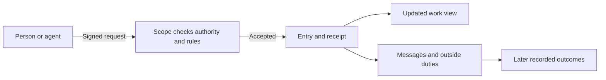

# What is Artroom?

For a person or agent evaluating Artroom, this page explains how it records
work, who can change it, and how to tell a recorded request from a finished
result.

Artroom lets an application declare its actions and keep an ordered record
of the actions it accepts. A participant signs a request with a device key.
The service checks the request against the application's rules and the
participant's authority. If it accepts, it records the action and returns
a receipt identifying that entry. A conversation saying “done” is useful
context; the recorded outcome supplies the evidence.

## A room brings related records together

A repository-backed room brings membership, rules, work and publication
together. Each part has its own **scope**: a record with its own definition
and order. A scope's definition says which items it holds, which actions
are allowed and which changes follow from them. The room is a composition
of these scopes, not one transaction covering every participant and host.

The browser and command line show views of those records. They help you
choose an action; they do not grant permission themselves. An action offered
by a client can still be refused when the scope judges its current state.

## The code-work application

In the supplied code-work definitions, an issue describes a goal and a
change proposes a version of work. Reviews and checks name the version they
judge. Membership controls who may act; the room's rules determine which
reviews and checks count for the affected parts of the repository.

An authorized merge request asks the destination to publish. Accepting
that request records intent. The destination must still judge and perform
its publication work. The change becomes **Merged** when it receives the
appropriate recorded published outcome. A local Git commit, a proposed
version and a published destination commit are different pieces of evidence.

The [first-change guide](first-change.md) describes the current one-file
CLI path. It states its authority, review, recovery and release limits.

## Applications choose their own actions

The platform does not make “review” or “merge” universal verbs. An application
defines its own items, actions, guards and outcomes using the supported
definition forms. Code work is one application.

Jam is a second application being developed alongside Artroom: its local
interface builds musical phrases into a sketch. A sketch that sounds useful
is a musical outcome, not a code-review approval. Jam's current local
prototype does not establish that its musical actions are attached to native
Artroom records. That attachment retains its separate owner and delivery.
The example explains why application vocabulary must remain application-owned.

## Read the outcome, then choose the next step

- Keep an accepted receipt: it locates the exact recorded act.
- Read a refusal at the head where it was judged; it may explain missing
  authority, an outdated revision or unmet rules.
- Treat a lost or unavailable reply as unresolved. Inspect the original
  request and records before signing another mutation.
- Follow a confirmed publication when you need published code. A latest-page
  link may later show a newer published version.

For the model behind those choices, read [the ten terms](ten-terms.md),
[the life of an act](life-of-an-act.md), or [the record](record.md).

## Source and acceptance

Draft complete explanation, inspected 2026-10-09 against main
`9d7e4c2777ea8d35441b4a9d79b407cd701065fa`; no tested public release is
established. Sources: [scope guide](../scopes.md),
[current lane definitions](../../packages/lanes/src/index.ts),
[native answers](../../packages/contract/src/result.ts), and
[Jam room design](../../notes/2026-10-01-jam-room.md). The separate local
Jam source was inspected at `2de923524ef893b50d7bd319c5cd5dcd721dfa54`;
its local delivery does not establish native attachment.
The [manual ledger](ledger.md) retains independent page review, release and
reader acceptance. This page claims no new test or hosted journey.
