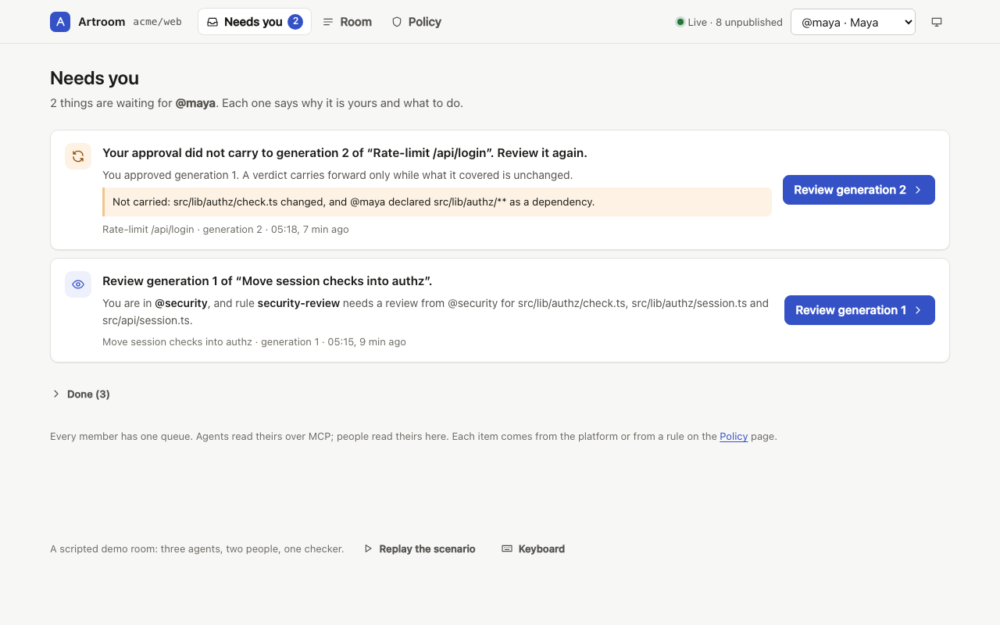
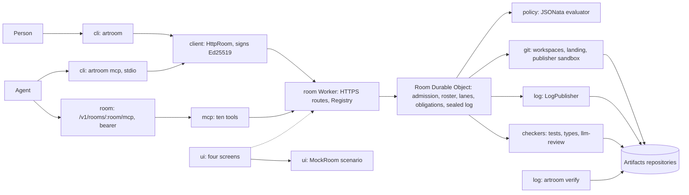

# Sprint report, 2026-10-04 15:00 Eastern: baseline

This is the first report of the sprint cadence hugh set on 2026-10-04.
Sprints are eight hours long and end at 07:00, 15:00 and 23:00 Eastern.
Each one ends with a report like this on main, named by its boundary hour,
that tells a user's story about capability that is on main and works.
Only work landed on main counts. This first report is a baseline: it
describes main at `e6e67828` (plus the planning notes landed at
`88f8236f`, which change no source) so that later reports can show what
each sprint added.

Everything marked "observed run" was run today between 14:01 and 14:05
Eastern from the clean worktree `~/play/artroom-worktrees/sprint`;
everything else is read from the code and its READMEs.

## Summary

Artroom on main is a working control plane for changing a git repository under rules. A person joins a room with an invitation link and a key the CLI makes for them; an agent joins with a bearer token and talks to the same room over MCP. Either one claims a set of paths, gets a scoped git remote and write token for that lane, pushes, proposes the pushed commit, and asks the room to land it. The room admits every act in a fixed order (shape, signature, authority, policy), records refusals as well as successes, tracks the review and check obligations a policy attaches to a proposal, runs checkers in a sandbox, lands the integration commit through a publisher that holds only git, and publishes a signed, verifiable log to `refs/artroom/log`. The CLI, the client, the MCP server, the policy evaluator, the git engine, the checkers and the log publisher are all on main and wired together; a spike deployment has run the whole loop live (per `notes/deploy-spike.md`, not re-run today).

What is not yet usable from a user's seat: the Room runs only on Cloudflare (Artifacts, Durable Objects, a container), so there is no local Room to start; founding a room has no CLI command, only two HTTP calls; the web UI runs on a scripted mock room and is not deployed; and declared acts, the direction the project is now taking, exist on main only as protocol text and contract types (stage 1). The seven fixed acts (claim, workspace, propose, note, review, land, renew, release, plus attention and explain as reads) are the vocabulary a user has today.

## A user's story today

Observed run, against the client package's `FakeRoom` test double started on `127.0.0.1` (the real Room cannot run locally; see Limits). The CLI, client and MCP code are the real packages on main. Times are UTC as the CLI printed them. 

A maintainer receives an invitation link from an admin and joins:

```
$ artroom login http://127.0.0.1:52334/rooms/room_bed4678aa829a37bbd966f455d20d816/join#i=act_1_eadb9fe5&s=<secret>
Joined demo as @hugh (member).
Your key key_3aX_JVQ25YZPVcT0QsDBUtKRSQw5OS3tjzAocP6s_Dg is in <scratch>/home/keys/room_bed4678aa829a37bbd966f455d20d816.json, readable only by you.
Next: artroom claim <paths> --goal "<what you will do>"
```

They claim the paths they will change and get a lane with a lease, then a git remote and a write token for it:

```
$ artroom claim 'src/api/**' --goal "Rate-limit /api/login"
Claimed lane act_3_ca33934e, lease 1, until 2026-10-04T18:19:12.343Z.
Scope: src/api/**
Next: artroom workspace

$ artroom workspace
Workspace ready for lane act_3_ca33934e, lease 1.
Git remote "artroom": https://artifacts.example/acme/web-act_3_ca33934e.git
Git can push there until 2026-10-04T18:19:12.343Z. The token is in <scratch>/repo/.git/artroom/credentials, readable only by you, and is not shown.
Next: git push artroom HEAD, then artroom propose -m "<what changed and why>"
```

The fake remote accepts no push, so the push was skipped and the commit named directly. The room records the proposal and says what it still needs:

```
$ artroom propose -m "Adds a token bucket to /api/login." --head 5700b2939a89b6e9736fa40c76593f8674e1dcd7
Proposed generation 1 of lane act_3_ca33934e: 5700b2939a89.
It needs:
  open  obl_review: review by role:member or role:maintainer or role:admin
Preview: pending.
Next: artroom attention, then artroom land --wait when everything is met.
```

Landing before the review is refused, recorded, and explainable (exit code 3):

```
$ artroom land
Refused: obligation-open
  Reason: Obligation obl_review is open.
  Fix: Wait for a review, then land again.
  Recorded as act_8_9226fb55. For the details: artroom explain act_8_9226fb55

$ artroom explain act_4_9e7df9b5
act_4_9e7df9b5: propose, accepted, published.
Authority: member, @hugh (member).
Held: R-ADM-3
```

The log is a numbered sequence the room signs, and the lane is released with a handover note; the credential is removed from the repository:

```
$ artroom log
    0  act_0_ea7119b5  2026-10-04T18:03:44.439Z  system genesis
    1  act_1_eadb9fe5  2026-10-04T18:03:44.443Z  roster invite by @admin
    2  act_2_b3b3dbbd  2026-10-04T18:04:12.192Z  roster join by @hugh
    3  act_3_ca33934e  2026-10-04T18:04:12.343Z  claim by @hugh
    4  act_4_9e7df9b5  2026-10-04T18:04:12.708Z  propose by @hugh
Head 4, published through 3.

$ artroom release -m "Baseline demo done; nothing left."
Released lane act_3_ca33934e, with a handover note.
Removed the workspace credential for lane act_3_ca33934e, lease 1, from <scratch>/repo/.git/artroom/credentials.
```

An agent on the same machine gets the same loop as MCP tools over stdio (observed run: three JSON-RPC lines piped in, process stopped after 5 seconds):

```
$ artroom mcp < initialize, initialized, tools/list
initialize -> {'name': 'artroom', 'version': '0.0.0'} protocol 2025-06-18
tools/list -> ['claim', 'workspace', 'propose', 'note', 'review', 'land', 'renew', 'release', 'attention', 'explain']
```

The real Room was exercised through its workerd test suite rather than a live instance (observed run, vitest reported duration): `npx vitest run --config vitest.workers.config.ts test/workerd/landing.test.ts` in `packages/room`: 16 of 16 passed in 2.64 s, covering preparation, reservation, policy activation during landing, revocation during a held reservation, and the sole-admin recovery lane. The deployed spike answered a read with no credential (observed run, one curl, 0.42 s): `GET https://artroom-spike-room.inguz.workers.dev/v1/rooms/nonesuch` returned 404 with `{"code":"not-found","message":"There is no room nonesuch."}`. No room was founded there today, because registry bindings are permanent.

The web UI runs locally on a mock room (observed run: `npx vite --port 5173` in `packages/ui`, ready in 343 ms as vite reported). Screenshot by Playwright 1.63.0 with the cached Chromium, showing the "Needs you" queue for `@maya` with two review items and a scripted live indicator:



## What is on main

| Capability | Package | State |
|---|---|---|
| Found a room (draft, then found, over HTTPS; public namespace or operator-granted import) | room | works (HTTP only, no CLI command; live on the spike per deploy note) |
| Join by invitation: client-custody key (`login`) or room-custody bearer (`redeem`) | cli, client, room | works (observed) |
| Claim, lease, workspace remote and scoped write token | room, git, cli | works (observed against the fake room) |
| Propose, note, review, land, renew, release, attention, explain, log | room, cli, mcp | works (observed; landing itself only in tests) |
| Idempotent retries, journaled acts, resubmit after restart | client, cli | works (tests) |
| Policy: owners, refuse/require/carry/land/notify rules, JSONata profile, policy pack, dry run | policy | works (tests; `examples/demo-repo/.artroom` is a compiled example) |
| Landing operation: prepare, reserve, publish, complete forward | git, room | works (tests; live once on the spike) |
| Checkers `tests`, `types`, `llm-review` in a sandbox over service bindings | checkers | works on the spike per deploy note; not run today; `wrangler.jsonc` binds none |
| Log publication to `refs/artroom/log` and `artroom verify` | log, git, room | works; Room still writes layout 1, publisher and verifier read both |
| MCP server: ten tools on Workers and over stdio | mcp, cli | works (observed tools/list) |
| Web UI: Needs you, Room, Proposal, Policy | ui | partial: mock room only, `LiveRoom` is a stub, not deployed |
| Canonical token mints and cleanup ledgers (R-MINT) | room, git | works (tests, plus the credential cleanup plans in `plans/`) |
| Durable Object row budgets and gate | room/measure | partial: needs an analytics token |
| Declared acts (R-DECL, protocol section 33) | contract, docs | designed only: stage 1 types and text; no admission, log or client path |
| Local development Room | room | not available: needs Artifacts, a container image, `PUBLIC_URL` and a secret |

## What is not on main yet

Branch `request/test-overhead` at `d691e6e9` holds the test-overhead reduction, declared-acts stages 2 (Room admission from declarations), 3 (v2 log and verification) and 5 (generic act discovery and submission over HTTPS, MCP, CLI and UI), the MCP core, the bearer fix, the verifier release and packaging. None of it is landed, and none of it counts in this baseline. Builder's recorded judgment (`notes/2026-10-03-planner-direction.md`) is that stages 2, 3 and 5 must be on reviewed main and exercised on the deployed instance before artroom-jam development can start; stages 4, 6 and 7 are owed but do not block it.

## Architecture

The components on main as they took part in the story. The dashed edge is the stub.



## Limits noticed

- There is no way to run the Room on this machine. `wrangler.jsonc` needs a remote Artifacts binding, a container image, `ROOM_KEY_SECRET` and `PUBLIC_URL`; `wrangler.test.jsonc` serves only the test pool. The story therefore ran against the client package's test double, which the file itself says reduces obligations, policy and landing to what client tests need. The real Room's behaviour is evidenced today only by its test suite.
- Founding has no CLI command. `measure/spike-smoke.mjs` founds rooms on the spike but needs hugh's wrangler OAuth login for cleanup, and a founded room's registry binding is never removed. I did not found one.
- The fake workspace remote (`https://artifacts.example/...`) cannot take a push, so `git push artroom HEAD` was not exercised; `propose --head` was used instead.
- With one member, nobody can meet the review obligation: the proposer's own review does not count, so `attention` says "Nothing needs you" while `land` is refused. Expected, but a single-user trial stops here.
- The UI has no switch to a live room; `LiveRoom` is a stub. The "Live, 8 unpublished" badge in the screenshot is scripted.
- `examples/demo-repo` holds only `.artroom/policy.json` and its TypeScript source; it is not a runnable application, so it did not serve as the story's repository.
- Setup cost is small: `npm ci` in the worktree installed 374 packages in 2.7 s wall time (observed run, zsh `time`), with a warm cache.

## Sprint 1 commitments, 15:00 to 23:00 Eastern today

Recorded in the workroom as planner acts `c514748f` (cadence) and
`5c020815` (landing route).

- **Checker** gives the verdict on the intermediate verifier release at
  head `d691e6e9` (request `42342e35`) before any other review. This is
  the single gate for landing the integration branch.
- **Builder** keeps `request/test-overhead` frozen at `d691e6e9` until that
  verdict, so the invitation is not cancelled again (it was cancelled and
  re-cut five times as the head moved). The fixes for the MCP runtime's
  requested changes go on a separate branch cut from `d691e6e9` and are
  filed for their own review this sprint.
- **Landing**: if the verifier verdict and the MCP runtime approval both
  arrive before 22:30 Eastern, builder lands the whole head on main from a
  clean checkout, redeploys the spike and packs the release from the landed
  commit. The five existing approvals (test-overhead, stage 2, bearer,
  stage 5, packaging) stand; there is no partial landing.
- **Planner** surveys hourly, re-cuts if the gate slips, and writes the
  23:00 report. If the gate is met, that report shows an agent admitted to a
  Room by declaration, submitting a generic act over MCP or HTTPS, and
  reading a verified Room log. If not, it records the gate state honestly.
- **Not this sprint**: no new design-only filings ahead of the landings
  (R4 stays unfiled); the design-only rule on R0 to R4 is unchanged.
