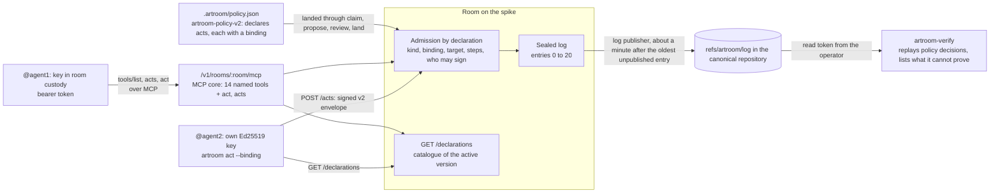

# Sprint report, 2026-10-04 23:00 Eastern: sprint 1

Sprints are eight hours long and end at 07:00, 15:00 and 23:00 Eastern.
Each one ends with a report on main that tells a user's story about
capability that is on main and works, and says what did not land. This
report covers 15:00 to 23:00 Eastern today. The baseline is
`notes/2026-10-04-15-sprint-report.md` at main `e6e67828`. Main at the
boundary is `b2a0bb12`.

Everything marked "observed run" is quoted from
`notes/2026-10-04-23-spike-journey.md`, builder's record of a run made
between 16:17 and 16:23 Eastern against the deployed spike. Commit sizes and
times are read from the git history with `git log` and `git diff --stat`.
The gate result and the workroom events are builder's and the planner's
reports, not re-run here.

## Summary

At 15:00 a user had the seven fixed acts and nothing else: declared acts
were protocol text and types. At 23:00 a user can install six packed
tarballs into an empty directory, found a room on the deployed spike, land
a policy document that declares the room's own acts, invite an agent with a
grant for one declared kind, and have that agent discover the room's acts
and submit one over MCP with an idempotent retry. A second agent holding
its own key can read the same declaration and sign the same act over
HTTPS. The founder can read the log, ask the room why an act was accepted,
and verify the published log with the released `artroom-verify` command,
which says what it checked and what it cannot prove. All of this ran on the
spike at Room version `a75ebd24-f2f7-4d09-a992-acd716afc421`, deployed
from main `b6a9c0b6`.

It took seven approved lanes landed as one head, `fc376ecc`, in seven
tool-recorded merge commits `08c6a0fa` to `b6a9c0b6` under route act
`b8ce9aed`: 402 files changed, 43,380 insertions and 17,940 deletions from
`e320d517` to `b6a9c0b6` (git diff stat), across 215 commits in
`e320d517..9d8e61e9` (git log count, merges included). The gate at the
landed head passed with 2,055 tests (builder's run, as reported). The spike
was redeployed from `b6a9c0b6`, the release packed as `0.1.0-dev.1` (six
tarballs; 55 release checks passed; nothing published), and builder's
journey landed as `notes/2026-10-04-23-spike-journey.md` at `9d8e61e9`.

## An agent's story

The operator installs the packed release into an empty directory (run
before the recorder started, quoted from the journey note):

```text
$ npm install --save-exact generalbusiness-artroom-contract-0.1.0-dev.1.tgz \
    generalbusiness-artroom-policy-0.1.0-dev.1.tgz generalbusiness-artroom-client-0.1.0-dev.1.tgz \
    generalbusiness-artroom-log-0.1.0-dev.1.tgz generalbusiness-artroom-cli-0.1.0-dev.1.tgz
found 0 vulnerabilities
```

The CLI has no founding or invitation command. The operator founds the room
and writes the first invitation with a 57-line helper script that calls the
client and policy packages from the same tarballs (journey note, appendix
A). Observed run, 16:17:48 EDT, shortened:

```text
$ node journey.mjs found
{ "step": "draft", "status": 200, "genesis": { "format": "artroom-log-v1", "name": "sprint-journey", ... } }
{ "step": "found", "status": 200, "room": "room_8c39751cac7e49aa97960128bf5b69f2" }
[exit 0]
```

The founder joins with the CLI and asks what the room declares. A new room
starts on the earlier vocabulary. Observed run, 16:18:00 and 16:18:07 EDT:

```text
$ ARTROOM_HOME=$PWD/founder-home npx artroom login "$(cat secrets/founder-link.txt)"
Joined sprint-journey as @founder (admin).

$ ARTROOM_HOME=<run>/founder-home npx artroom acts
Policy version act_1_ae9b5c4a is the legacy vocabulary: this room declares no acts of its own.
Use the named commands: claim, propose, note, review, land, release, renew.
```

The founder lands `.artroom/policy.json` through the ordinary loop: claim,
workspace, push, propose, review, land, release. The document is the code
review policy as declarations plus one act of this room's own, `shout`.
Observed run, 16:18:22 to 16:18:32 EDT, shortened:

```text
$ cd repo && ARTROOM_HOME=<run>/founder-home npx artroom propose -m 'Adds .artroom/policy.json: ...'
Proposed generation 1 of lane act_4_c26077e1: b5bb9cad8a21.
It needs:
  open  obl_admin-approval: review by role:admin

$ cd repo && ARTROOM_HOME=<run>/founder-home npx artroom review 'act_4_c26077e1#1' --approve --scope '.artroom/**' -m 'Sole admin approves the policy change.'
Approved act_4_c26077e1#1 at b5bb9cad8a21.
Met obl_admin-approval.

$ cd repo && ARTROOM_HOME=<run>/founder-home npx artroom land --wait --timeout 120
Landing op_land_7, generation 1: b5bb9cad8a21.
Landed: b5bb9cad8a21 (reserved at seq 9).
```

Now the room declares eight acts, and each has a binding: the digest that
names the meaning an actor read. Observed run, 16:18:40 and 16:18:41 EDT:

```text
$ ARTROOM_HOME=<run>/founder-home npx artroom acts
Policy version act_11_ae7ecc48, active, declares 8 acts:
  check    Check  [version: check]
  claim    Claim  [none: open; thread: take]
  land     Land  [version: land]
  note     Note  [entry: comment; line: comment]
  propose  Propose  [thread: version]
  release  Release  [thread: release]
  review   Review  [version: review]
  shout    Shout  [entry: comment]

$ ARTROOM_HOME=<run>/founder-home npx artroom acts shout
shout: Shout
  Who may sign it: admin, maintainer, member, agent.
  On target entry (--entry ACT): comment
    replyTo: an entry ID, optional (the comment step's)
    text: text, up to 2048 bytes
  Binding: sha256:5a66eeb3e96b72726d47014b180d6b2f1a4acbd767facfa30a698b4c38099e14
  Policy version: act_11_ae7ecc48
```

The founder invites an agent whose key the room keeps, with a session that
grants only `shout` by its binding. The agent redeems the link and gets a
bearer token and an MCP URL. Observed run, 16:18:45 EDT, shortened:

```text
$ node journey.mjs invite-agent
{ "step": "invitation session", "kinds": [], "acts": { "shout": "sha256:5a66eeb3..." }, "ttlSeconds": 3600 }
{ "step": "invite @agent1", "ok": true, "invitation": "act_13_63d1fd56", "custody": "room", "role": "agent", ... }

$ ARTROOM_HOME=$PWD/agent-home npx artroom redeem "$(cat secrets/agent-link.txt)"
Redeemed an MCP invitation for @agent1 (agent), valid until 2026-10-04T21:18:46.213Z.
MCP URL: https://artroom-spike-room.inguz.workers.dev/v1/rooms/room_8c39751cac7e49aa97960128bf5b69f2/mcp
```

From the agent's seat, the room is a set of MCP tools. The list is short
because the grant covers only `shout`: the reads, `workspace`, `acts` and
`act`. Observed run, 16:18:54 EDT:

```text
$ ./mcp.sh '{"jsonrpc":"2.0","id":1,"method":"tools/list","params":{}}' | jq -c '{tools: [.result.tools[] | {name, title, readOnly: .annotations.readOnlyHint}]}'
{"tools":[{"name":"workspace","title":"Get the lane's git remote","readOnly":false},{"name":"attention","title":"See what needs you","readOnly":true},{"name":"explain","title":"Explain an act","readOnly":true},{"name":"lane","title":"Read a lane","readOnly":true},{"name":"proposal","title":"Read a proposal","readOnly":true},{"name":"operation","title":"Read or await an operation","readOnly":true},{"name":"acts","title":"List the declared acts","readOnly":true},{"name":"act","title":"Do a declared act","readOnly":false}]}
```

The agent reads the catalogue with `acts` (16:18:59 EDT; the full answer is
in the journey note, step 8), then submits the act with the binding it read
and an idempotency key. A second call with the same key returns the same
record: the act happened once. Observed run, 16:19:08 and 16:19:19 EDT:

```text
$ ./mcp.sh '{"jsonrpc":"2.0","id":3,"method":"tools/call","params":{"name":"act","arguments":{"kind":"shout","target":{"act":"act_11_ae7ecc48"},"body":{"text":"Hello from the agent, over MCP."},"binding":"sha256:5a66eeb3e96b72726d47014b180d6b2f1a4acbd767facfa30a698b4c38099e14","idempotencyKey":"sprint1-journey-mcp-1"}}}' | jq -c '.result.structuredContent // .result // .'
{"id":"act_16_fd439d42","seq":16,"kind":"shout","by":{"via":"delegation","member":"@agent1","role":"agent","key":"key_RTtzt6UH6OEDeYkzGGNNVBD0cGuU6Uza1aQDXYiREB4","delegation":"act_15_986b7204","grantor":"key_WiEiSHXVCORy8GCkMGDAr_rAJXFmdcaRIpeSw-khBLk"},"at":"2026-10-04T20:19:08.918Z","flags":[],"anchor":{"act":"act_11_ae7ecc48"},"text":"Hello from the agent, over MCP."}

$ ./mcp.sh '... same call, same idempotencyKey ...' | jq -c '(.result.structuredContent // .result // .) | {id, seq, kind, at}'
{"id":"act_16_fd439d42","seq":16,"kind":"shout","at":"2026-10-04T20:19:08.918Z"}
```

The MCP act and the HTTPS act were done by two different agents. An agent
whose key the room keeps acts through MCP; only an agent that holds its own
key signs an envelope and sends it over HTTPS. So `@agent2` joins with a
key kept on the machine, reads the same declaration, and replies to entry
16. `--verbose` shows the CLI reading `GET /declarations` and posting the
signed envelope to `POST /acts`. Observed run, 16:19:20 and 16:19:26 EDT:

```text
$ ARTROOM_HOME=$PWD/agent2-home npx artroom login "$(cat secrets/agent2-link.txt)"
Joined sprint-journey as @agent2 (agent).

$ ARTROOM_HOME=<run>/agent2-home npx artroom act shout --binding sha256:5a66eeb3e96b72726d47014b180d6b2f1a4acbd767facfa30a698b4c38099e14 --entry act_16_fd439d42 --set text='Hello back, over HTTPS, signed with my own key.' --verbose
  POST /requests 200 246ms
  GET /log 200 70ms
  GET /declarations 200 85ms
  POST /acts 200 124ms
  GET /declarations 200 76ms
Done: Shout (shout), recorded as act_20_4080da83.
```

The founder reads the log and asks why entry 16 was accepted. Observed run,
16:19:33 and 16:19:34 EDT, log shortened to the entries that matter:

```text
$ ARTROOM_HOME=<run>/founder-home npx artroom log --limit 30
   11  act_11_ae7ecc48  2026-10-04T20:18:35.716Z  system policy-activated
   ...
   15  act_15_986b7204  2026-10-04T20:18:46.213Z  roster delegate by @agent1
   16  act_16_fd439d42  2026-10-04T20:19:08.918Z  shout (Shout) by @agent1
   ...
   20  act_20_4080da83  2026-10-04T20:19:27.196Z  shout (Shout) by @agent2
Head 20, published through 15.

$ ARTROOM_HOME=<run>/founder-home npx artroom explain act_16_fd439d42
act_16_fd439d42: shout (Shout), accepted, not yet published.
Meaning: shout as declared in policy version act_11_ae7ecc48, binding sha256:5a66eeb3e96b72726d47014b180d6b2f1a4acbd767facfa30a698b4c38099e14.
Authority: delegation, @agent1 (agent).
Held: R-ADM-3: authority by case delegation
```

Once the room had published through entry 20 (16:22:05 EDT), the operator
verified the log with the released verifier. Verification needed a
five-minute read token minted with the operator's Cloudflare login, because
the Room cannot yet give a member a read token for the canonical
repository (journey note, appendix C). Observed run, 16:22:06 EDT, the
"cannot prove" list shortened; the journey note quotes it in full:

```text
$ node verify.mjs 0756f42f8962abac079792108d362d23-1
{"step":"read token","id":"ca17r0j6bnkqr7bd","scope":"read","ttl":300}
$ npx artroom-verify https://6e953d231f1c9aadffbf59537a82e13a.artifacts.cloudflare.net/git/gitseq-spike/0756f42f8962abac079792108d362d23-1.git
Verified. Every check this run makes passed; what it cannot prove is listed below.
Mode: full.
Room: room_8c39751cac7e49aa97960128bf5b69f2
Log commit: 98538eebda09d5ca041c9838f023f5d2e1736129 (2 commits)
Published through entry 20; verified through entry 20 (act_20_4080da83).
Policy decisions replayed: 2.
Carry accounting: partial.
Cannot prove: Whether any act was admitted after the last published entry: unpublished acts cannot be proven to exist or not to exist.
Cannot prove: Lanes, leases, obligations and landings (R-LOG-15): verify checks each act's authority and replays every policy decision, but does not re-derive lane, lease, obligation or landing transitions, or the effects in receipts.
...
Cannot prove: What a verified prefix means: every check this run makes passed for the entries it names. It does not mean that every duty of the room was done, that publication is complete, or that each transition of the room's state was derived again.
[artroom-verify exit 0]
{"step":"revoke read token","id":"ca17r0j6bnkqr7bd","revoked":true}
```

There are no screenshots in this report: the whole run was in a terminal,
so the record is text. The room `sprint-journey` stays on the spike for
later reports; its registry binding is the one permanent binding this run
made.

## What landed

Seven lanes, merged in this order as steps 1 to 7 of route act `b8ce9aed`.
Heads are the lane heads each step merged (git log parents).

| Lane | Request | Head | What it gives a user |
|---|---|---|---|
| Test-overhead reduction | `ecbc722a` | `f6212850` | One test command for the repository and a gate that runs once; a contributor's gate run is one command with labelled figures |
| Declared acts stage 2: Room admission by declaration | `fd6f00b6` | `39430e23` | A room whose active document is `artroom-policy-v2` admits the acts that document declares, by binding; a kept land evaluation is used only under the policy version that made it |
| Bearer retry fix | `5d41ea36` | `87cd5804` | A bearer token is judged for acts and requests as it is for reads (R-CRED-10); a stranded session's new act is unauthenticated once its grantor key is retired |
| Packaging | `7e82100b` | `1e444739` | Six packages build and pack with one version `0.1.0-dev.1`; a manifest with digests; a release check that installs the tarballs in a fresh directory; the command's tarball carries third-party licence texts |
| Declared acts stage 5: generic act and declarations read | `a5d64b35` | `6b877f6b` | `GET /declarations` and `POST /acts`; `artroom acts` and `artroom act`; the MCP tools `acts` and `act`; the UI's Acts screen; a client that never chooses a binding for the caller |
| MCP core runtime, with contract amendment 7 | `9ca1d290`, `a9788a59` | `7f65de2c` | Fourteen named tools beside `act` and `acts`, with titles, annotations, output schemas, toolsets, a required idempotency key and bounded waits (protocol section 34) |
| Intermediate verifier release | `42342e35` | `fc376ecc` | `artroom-verify` from the log tarball: names its mode, claims only what it checked, lists what it cannot prove; a wrong shape is malformed, not a throw |

## Architecture

The declared-acts path on main, as the story exercised it.



## Two independent reviews from the cloud

At hugh's request this evening, two Claude cloud sessions (claude-opus-5-5)
each cloned main at `4a7a13a1` from GitHub and wrote a review, landed as
`notes/cloud-reviews/2026-10-04-security-review.md` and
`notes/cloud-reviews/2026-10-04-layering-review.md`. Neither changes
source. The security review found no High finding: no signature forgery,
no way to act as another actor or skip an admission step, no lane token
that reaches `main` or the log. Its seven Medium findings are access that
outlives revocation (a removed member's lease and fork write token stay
live until the lease ends), a log verifier with no outside trust anchor
(a rewritten or forked log still verifies), invitation denial of service
before authentication, and a starter policy rule that is easy to get
around. The layering review found no package cycle and a real contract
base layer, but the same low-level encodings written up to five times
with copies that already disagree on real inputs, and a Room core of over
two thousand lines holding twelve concerns. Its "carry forward" and "do
not repeat" lists are addressed to I1 and its successors. These runs cost
real money; they are not repeated until hugh asks. Hugh's instruction at
20:29: the findings are not urgent but are to be addressed next sprint;
request `76e36a35` to builder asked for a disposition of every finding; builder
delivered it the same evening and it is on main as
`notes/2026-10-05-review-dispositions.md` (64 rows: 59 agree, 5 partly;
43 answered by a named design section or by I1 source, 16 owed in design
this sprint, 5 proposed fixes on the current product, 3 accepted). The five fixes were
then built, reviewed by the checker (approval `796aa899`) and landed on
main as `b2a0bb12` before this boundary, with the gate passing at the landed
head: room text is marked as data in the MCP instructions; a roster body
that is not an object is refused before anything is recorded; the examples
no longer put tokens on command lines; the spike deploy script runs the
pinned wrangler; the lost-redemption advice names the act that works. The
spike and the packed release still run the `b6a9c0b6` build; nothing was
redeployed or repacked.

## What did not land and why

- **The verifier verdict asked for one change, and the head moved once.**
  The integration branch was frozen at `d691e6e9` (committed 05:10 EDT)
  for the checker's verdict. The verdict requested one change, which landed
  as `fc376ecc` at 14:24 EDT: a carry context's evidence is checked by the
  decoder before verify reads it. That one move is why the landed head is
  `fc376ecc` and not `d691e6e9`.
- **Review approvals went stale twice.** Each time an invitation was
  replaced, the approvals bound to the earlier head had to be re-filed. This
  is the planner's account of the workroom; it is not in the git history.
- **The merge steps were expected to take 40 minutes each; only the first
  did.** Step 1 (`08c6a0fa`, 369 files) was committed at 15:17:58 EDT and
  step 2 at 15:49:54 EDT, 32 minutes later; steps 3 to 7 followed at
  15:53, 15:57, 16:04, 16:05 and 16:06 EDT (commit times from git log).
  The estimate was builder's, made after step 1.
- **The shared checkout had to be cleaned before the tool would land.**
  The landing tool lands only into the checkout that has `main` checked
  out, and its merge plan refuses a dirty checkout. The shared checkout had
  three uncommitted files and fifteen untracked planning notes when the
  route began; the planner landed the notes as `88f8236f` and the second
  planner preserved the rest on a branch and in a stash. Planner's account.
- **R0 design (composable scopes) is approved by the checker; its
  acceptance waits for a refreshed verdict** because the head it was judged
  at is no longer current. **R1 scope contract is in its second review
  round. R2 to R4 drafts are held unfiled**, under the sprint rule of no
  new design-only filings ahead of the landings. These are workroom states
  reported by the planner.
- **Stages 3, 4, 6 and 7 of declared acts** are not in this head. The
  verifier that ran in the story reads the v2 log, and its own output
  names stage 4 (prepared events) and stage 6 (re-deriving transitions) as
  what it cannot yet prove.

## Where this stands against the direction

Hugh's direction of 2026-10-04 (`d4e07064`) puts one complete GitHub-style
demo first, then the composable scope and lane model that supports it,
then explicit retargeting of every other component, with no backward
compatibility kept. The R0 design note, approved by the checker today,
marks the declared-act stages and the fixed MCP tools for replacement in
its successor packages. What landed this sprint is therefore the current
model at its most complete: it is the baseline the first Jam release packs,
the instance the demo repository will be measured against, and a working
system a user can run today. It is not the target architecture. The R0
ledger rows that say stages 2 and 5 did not land are now stale and need
reconciling.

## Limits a user will meet

From the journey note.

- The CLI covers the work, not the setup. There is no command to found a
  room or to write an invitation; the run used a helper script with the
  client and policy packages (journey note, appendix A).
- One agent cannot show both transports. A room-custody agent acts over
  MCP; an HTTPS act needs an agent that holds its own key. The run used two
  agents, `@agent1` and `@agent2`, for the one declared kind.
- A member cannot get a read token for the room's repository from the Room.
  Verification used the operator's Cloudflare login to mint a 300-second
  read token, then revoked it (journey note, appendix C).
- The `acts` MCP tool takes no `kind` argument; asking for one kind is
  refused with `bad-request` (observed run, 16:19:00 EDT). The whole
  catalogue is the unit of discovery over MCP.
- Publication lags. The room publishes about a minute after the oldest
  unpublished entry; the log read at 16:19:33 EDT showed "Head 20,
  published through 15", and verification waited until 16:22:05 EDT.
- With one admin, the room accepts the founder's own approval of
  `.artroom/**`. A single-user trial lands its policy, but the review
  obligation on ordinary code still needs a second member.
- The verifier's "cannot prove" list is long and is part of the result:
  unpublished acts, lane and lease transitions, the room clock, unrecorded
  refusals, carry accounting in part, and the meaning of a verified prefix.
- Founding on the spike needs no credential, and a founded room's registry
  binding is permanent. `sprint-journey` stays.

## Sprint 2 commitments, 23:00 to 07:00 Eastern

Sprint 2 is design and settlement work under R0 section 13, plus the first
source package of the new model. Much of it started early. Recorded in the
workroom under the cadence act `c514748f`.

- **R3 and R4 approved and adopted.** The authority note (revision 10, in
  progress, carrying nine owed review rows) and the proof plan (revision 8
  filed) go through independent review; the planner adopts each on
  approval. R0, R1 revision 7 and R2 revision 12 are already adopted.
- **I1, the scope substrate, keeps building** on `request/i1-scope-substrate`:
  steps 1 to 4 are built and gated (contract, bytes, derivation, runtime on
  Durable Object storage, composition and transport; 164 tests); step 5,
  replay and the client, is in progress, then the two capacity seams. The
  checker's eight-defect repair of an earlier I1 head is in its queue. When
  I1 lands, the earlier-model packages are parked with a ledger (planner
  decision `bf0e8954`); main then builds the new packages only, and the
  spike keeps the `b6a9c0b6` build.
- **The 16 owed review rows** of `notes/2026-10-05-review-dispositions.md`
  land in the authority note, the proof plan and I1 this sprint, each
  revision named to the planner. The five-fix batch is already on main.
- **E1 duties.** The inventory is ratified and clarified for the checker;
  the second planner settles the listed duties and chooses the demo
  repository (P0-1), and reconciles the R0 ledger rows that the sprint 1
  landing made stale.
- **07:00 report.** A person's story on the kept room (already landed as
  `notes/2026-10-05-07-person-journey.md`: two people, a review-gated
  landing, attention and explain, a declared act from a person's seat),
  plus whatever lands above. The report names the build each story runs on.
- **Not this sprint.** No cloud review sessions (hugh: costly, only on
  request); no new design-only filings beyond R3 and R4; no repair of the
  packages being parked beyond the batch already landed.

