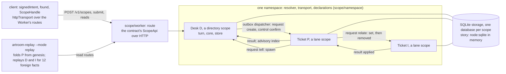

# Sprint report, 2026-10-05 07:00 Eastern: sprint 2

Sprints are eight hours long and end at 07:00, 15:00 and 23:00 Eastern.
Each one ends with a report on main that tells a user's story about
capability that is on main and works, and says what did not land. This
report covers 23:00 on 2026-10-04 to 07:00 on 2026-10-05 Eastern. The
previous report landed as `59859baf` over main `b2a0bb12`. Main at the boundary is `c9a16778`.

Everything marked "observed run" is quoted from
`notes/2026-10-05-07-person-journey.md` or `notes/2026-10-05-07-i1-story.md`,
or was run for this report in the clean worktree
`~/play/artroom-worktrees/sprint` at `6b863c51`. Commit
sizes and times are from the git history. Gate results and workroom events
are builder's and the planner's reports.

## Summary

For a person at the CLI, nothing changed this sprint: the deployed spike at
<https://artroom-spike-room.inguz.workers.dev> still runs build `b6a9c0b6`
and the packed `0.1.0-dev.1` tarballs are the earlier product's last
release (as the notes state; nothing was redeployed or repacked). What is
new is that a person's story on that build is told in full, from a recorded
run in the kept room `sprint-journey`: two people, a push with plain git,
notes both ways, a landing decided by a second person's review, a refusal
explained, a declared act from a person's own key, a log verified through
entry 56. What is new for a developer: main now holds I1, the scope
substrate, the first implementation package of the demo-first direction
(`plans/017`, `plans/018`; design notes R0 to R4). In one Node process a
developer can found a desk, have it create a ticket, send relationship
updates and a tell between tickets, and replay one ticket's history to a
report that says `consistent`.

It took the I1 branch landing on main as `f1c456ce` at 01:16 Eastern
(request `2186c3c2`, approval `5019cff4`): 738 files changed, 15,931
insertions and 62,607 deletions (`git show --stat`). The range
`59859baf..6b863c51` holds 57 commits (`git rev-list --count`): 51 written
on the branch before 23:00, then three review repairs (23:09 to 00:08
Eastern), the landing and the I1 story. Main now builds the six new packages
only: `contract`, `bytes`, `derive`, `scope`, `replay` and `client`. The
earlier-model packages are parked under `parked/` with `parked/README.md`
as the ledger (planner's decision: park, not delete, not keep compiling);
nothing there is built, tested or edited. Builder's gate at the landed
head: typecheck, 203 vitest tests and 2 node tests (builder's run, as
reported). The earlier product lives on in the deployed spike and the
packed release until a separately authorized retirement.

## A person's story

Observed run, quoted from the person journey note: 2026-10-04 16:36 to
16:41 Eastern, in the kept room `sprint-journey` on the spike at build
`b6a9c0b6`, with the packed `0.1.0-dev.1` CLI.
The note landed at `4a7a13a1` (16:40 Eastern, before this sprint); the
23:00 report deferred its story to this one. Ana (member), Ben (maintainer)
and the founder (admin) are seats driven by one operator.

The founder writes two invitations with a helper script (the CLI has no
invitation command), and Ana and Ben join. Observed run, 16:36:03 EDT:

```text
$ ARTROOM_HOME=$PWD/ana-home npx artroom login "$(cat secrets/ana-link.txt)"
Joined sprint-journey as @ana (member).
Your key key_dm7p3-umVnSmVgcyRbnZCCmNyZFDQGij9dXTTw4ZQN8 is in <run>/ana-home/keys/room_8c39751cac7e49aa97960128bf5b69f2.json, readable only by you.
```

Ana claims `README.md` and `docs/**`, commits two files and pushes to the
lane remote with plain git. Observed run, 16:36:10 to 16:36:23 EDT,
shortened:

```text
$ ARTROOM_HOME=<run>/ana-home npx artroom claim 'README.md' 'docs/**' --goal 'Say what this room is for' ...
Claimed lane act_26_b4d699dc, lease 1, until 2026-10-04T21:06:11.649Z.

$ git push artroom HEAD
To <lane remote>
   b5bb9ca..e3a410c  HEAD -> main

$ ARTROOM_HOME=<run>/ana-home npx artroom propose -m 'Adds a README and docs/using.md, which say what this room is for.'
Proposed generation 1 of lane act_26_b4d699dc: e3a410cdc986.
It needs no reviews or checks.
```

Ben notes line 3 of the README; Ana's queue shows it and she replies.
Observed run, 16:36:34 to 16:36:41 EDT:

```text
$ ARTROOM_HOME=<run>/ben-home npx artroom note 'act_26_b4d699dc#1:README.md:3' -m 'Could this line also say who keeps the room? Not blocking.'
Noted act_28_316c137e.

$ ARTROOM_HOME=<run>/ana-home npx artroom attention
2 items need you:
  lane-unheld        act_4_c26077e1     act_4_c26077e1 was released.
  note               act_28_316c137e    New note on act_26_b4d699dc.

$ ARTROOM_HOME=<run>/ana-home npx artroom note act_28_316c137e -m 'Good point. I will add that in a follow-up; ...' --reply-to act_28_316c137e
Noted act_29_200c0472.
```

First plain statement: under the room's first policy a documentation
change needed no review, so the room refused Ben's approval, because a
review must meet an obligation. Ana lands without one. Observed run,
16:36:42 and 16:36:43 EDT:

```text
$ ARTROOM_HOME=<run>/ben-home npx artroom review 'act_26_b4d699dc#1' --approve --scope 'README.md' 'docs/**' -m 'Reads well. Approved as it stands.'
Refused: not-authorized-reviewer
  Reason: @ben qualifies for no review obligation on this generation.
  Fix: Ask a qualifying reviewer.
  Recorded as act_30_8841edc6. For the details: artroom explain act_30_8841edc6
[exit 3]

$ cd ana-repo && ARTROOM_HOME=<run>/ana-home npx artroom land --wait --timeout 120
Landing op_land_31, generation 1: e3a410cdc986.
Landed: e3a410cdc986 (reserved at seq 33).
```

So the run adds an owner rule: Ana proposes a change to
`.artroom/policy.json` making Ben the owner of the documentation. A policy
change needs an admin, and landing early is refused. Observed run, 16:37:36
and 16:37:48 EDT:

```text
$ cd ana-repo && ARTROOM_HOME=<run>/ana-home npx artroom propose -m 'Policy: @ben owns README.md and docs/**, and a change there needs one review from an owner.'
Proposed generation 1 of lane act_37_d8cbbc24: 8d7b31fb493e.
It needs:
  open  obl_admin-approval: review by role:admin

$ cd ana-repo && ARTROOM_HOME=<run>/ana-home npx artroom land --wait --timeout 60
Refused: obligation-open
  Reason: The obligation obl_admin-approval is open.
  Fix: Meet it, then land.
  Recorded as act_39_08c1a286. For the details: artroom explain act_39_08c1a286
[exit 3]
```

The founder's queue shows the review request; the founder approves and Ana
lands. Observed run, 16:37:49 to 16:37:51 EDT:

```text
$ ARTROOM_HOME=<run>/founder-home npx artroom attention
2 items need you:
  land-outcome       op_land_7          Landing op_land_7 is landed.
  review-requested   act_37_d8cbbc24#1  Review act_37_d8cbbc24 generation 1 for obl_admin-approval.

$ ARTROOM_HOME=<run>/founder-home npx artroom review 'act_37_d8cbbc24#1' --approve --scope '.artroom/**' -m 'Agreed: Ben owns the documentation.'
Approved act_37_d8cbbc24#1 at 8d7b31fb493e.
Met obl_admin-approval.

$ cd ana-repo && ARTROOM_HOME=<run>/ana-home npx artroom land --wait --timeout 120
Landed: 8d7b31fb493e (reserved at seq 43).
```

Ana's follow-up to Ben's note now needs an owner's review; Ben approves
and it lands. Second plain statement: Ben's queue never showed the
owner-rule review request, with or without a cursor, while the founder's
had shown the admin approval. Ben reviewed because the proposal named the
obligation. Recorded as a planner finding. Observed run, 16:38:12 to
16:38:38 EDT:

```text
$ cd ana-repo && ARTROOM_HOME=<run>/ana-home npx artroom propose -m 'README now says who keeps the room, answering the note act_28_316c137e.'
Proposed generation 1 of lane act_47_d0d3f7f9: ad268c533940.
It needs:
  open  obl_docs-owner-review: review by owners

$ ARTROOM_HOME=<run>/ben-home npx artroom attention
1 item needs you:
  note               act_29_200c0472    A reply to your note.

$ ARTROOM_HOME=<run>/ben-home npx artroom review 'act_47_d0d3f7f9#1' --approve --scope 'README.md' -m 'That answers my note. Approved.'
Approved act_47_d0d3f7f9#1 at ad268c533940.
Met obl_docs-owner-review.

$ cd ana-repo && ARTROOM_HOME=<run>/ana-home npx artroom land --wait --timeout 120
Landed: ad268c533940 (reserved at seq 53).
```

Ana asks why her early landing was refused. Observed run, 16:39:05 EDT:

```text
$ ARTROOM_HOME=<run>/ana-home npx artroom explain act_39_08c1a286
act_39_08c1a286: land (Land), refused, published.
Meaning: land as declared in policy version act_11_ae7ecc48, binding sha256:fb386c4b767b17a9fc0e3bb5cfa655617a7af7a824d74800b4d3216c7cd83543.
Refused by obligation-open: The obligation obl_admin-approval is open. Fix: Meet it, then land.
Authority: member, @ana (member).
Held: R-ADM-3: authority by case member
Failed: R-LAND-1: The obligation obl_admin-approval is open.
```

Ben does the room's declared act `shout` on the landing outcome, signed
with his own key. Observed run, 16:39:14 EDT:

```text
$ ARTROOM_HOME=<run>/ben-home npx artroom act shout --binding sha256:5a66eeb3e96b72726d47014b180d6b2f1a4acbd767facfa30a698b4c38099e14 --entry act_54_1540ccb4 --set text='Landed. Thanks, Ana.'
Done: Shout (shout), recorded as act_55_d60d97c2.
```

Ana releases her lane. About a minute later the room has published through
entry 56, and the released verifier checks the log with a five-minute
operator read token. Observed run, 16:40:10 and 16:40:11 EDT, the "cannot
prove" list shortened:

```text
$ ARTROOM_HOME=$PWD/ana-home npx artroom log --after 53 --limit 8
   54  act_54_1540ccb4  2026-10-04T20:39:00.165Z  system land-outcome
   55  act_55_d60d97c2  2026-10-04T20:39:15.596Z  shout (Shout) by @ben
   56  act_56_899ebb30  2026-10-04T20:39:17.148Z  release (Release) by @ana
   57  act_57_9d9fe9e8  2026-10-04T20:39:55.211Z  system checkpoint
Head 57, published through 56.

$ npx artroom-verify https://6e953d231f1c9aadffbf59537a82e13a.artifacts.cloudflare.net/git/gitseq-spike/0756f42f8962abac079792108d362d23-1.git
Verified. Every check this run makes passed; what it cannot prove is listed below.
Mode: full.
Room: room_8c39751cac7e49aa97960128bf5b69f2
Log commit: 9eb683d413f5065f86a01bea0c96bf428121aa35 (5 commits)
Published through entry 56; verified through entry 56 (act_56_899ebb30).
Policy decisions replayed: 9.
Carry accounting: partial.
Cannot prove: Whether any act was admitted after the last published entry: ...
...
[artroom-verify exit 0]
```

## A developer's story of the new substrate

Observed run, quoted from the I1 story note: one Node process running the
real code of the six packages, with `node:sqlite` in memory for Durable
Object storage, a fixed clock and fixed incarnations. Source: main at
`f1c456ce`.

```sh
npm ci
node notes/2026-10-05-07-i1-story/run.mjs
```

A person founds a desk by a signed intent. The desk creates a ticket,
provisional until the desk confirms it; while the confirmation is held
back, an act on the ticket is answered `unavailable`. `D.1` is entry 1 of
scope `D`; duty `1.0` is send 0 of entry 1. Transcript, step 1, shortened:

```text
Step 0. Rita founds a desk D (a directory) over the HTTP routes.
  POST /v1/scopes -> accepted, receipt for D.0

Step 1. D creates a ticket P (a lane). The confirmation is held back first.
  rita submits open-issue to D -> accepted, receipt for D.1, duties 1.0
  D.1  act open-issue; effects: open, value; sends: request create
  D.2  delivery of result applied for D.1 from P.0, clause applied; effects: item 1 is created; sends: control confirm
  P.0  genesis, created by D.1, decision applied; effects: open, party, value; sends: result, advisory index
  P is provisional, head 0. D item 1 is created.
  una submits approve to P -> {"answer":"unavailable","reason":"scope-provisional"}
  The hold is lifted and the clock moves 1 second. D's dispatcher sends the confirmation again.
  P.1  delivery of control confirm from D.2; effects: activate
  P is active, head 1.
  D duty 2.0: control; attempts: none, acknowledged; acknowledged with P.1; no result is due
```

One ticket links to another and then removes the link; the other keeps a
copy whose revision is the position of the owner's entry, and each request
gets one result. Then the ticket asks its desk for another ticket.
Transcript, step 2, shortened:

```text
Step 2a. A relationship update. P links to I, then removes the link.
  rita submits link to P -> accepted, receipt for P.2, duties 2.0
  P.2  act link; effects: open, ref; sends: request relate
  I.2  delivery of request relate "closes" set from P.2, decision applied; effects: copy "closes" of P item 2 is set at revision 2, value; sends: result
  P.3  delivery of result applied for P.2 from I.2, clause applied
  rita submits unlink to P -> accepted, receipt for P.4, duties 4.0
  I.3  delivery of request relate "closes" removed from P.4, decision applied; effects: copy "closes" of P item 2 is removed at revision 4, value; sends: result
  I item 0 slot "linked" is "removed".

Step 2b. A tell. P asks the desk D for another ticket.
  una submits ask to P -> accepted, receipt for P.6, duties 6.0. P item 6 is asked.
  D.7  delivery of request tell "spawn" from P.6, decision applied; sends: request create, result
  P.7  delivery of result applied for P.6 from D.7, clause applied; effects: item 6 is answered
  P item 6 is answered. D now has 10 entries and has created 3 tickets.
```

The replay command reads the ticket's stored bytes through the read
routes, folds its history from the genesis, and compares each derived
entry with the stored one; it replays the two other scopes for the 12
foreign facts. Transcript, step 3, shortened:

```text
  artroom-replay https://scopes.story sc_ubargs4mvguscmxa32btwnp42fmcthx43kdg22dbewes2jwuow4a --mode replay --head 7:sha256:289a276e...

Result: consistent, for the mode, target, coverage and trusts stated below.
Mode: replay. Within the coverage stated below, the history was folded from its genesis, and every guard, effect and send was derived again and compared with the entry that records it.
Coverage:
  - sc_ubargs4m..., incarnation in_ptagtftzod3spte6xwgzxsh53e, lane: entries 0 to 7
  - sc_xhcfhhv6..., incarnation in_mhufarns3icnry2lajvspxgcoy, directory: entries 0 to 7
  - sc_wwkndpn2..., incarnation in_elq6smhtm6djsdskj7rvkbtgze, lane: entries 0 to 3
Anchors: none.
Foreign facts: 12 shown by replay of their source scope, 0 taken from an anchor, 0 missing.
Trusts, which this report does not show:
  - the service clock: each entry's time is taken as recorded
  - the service's answer for each source history that was replayed: no anchor was given for it
  - that each incarnation was minted once
  ...
  exit code 0
```

The note says two runs printed the same 70 lines (SHA-256 `9211becd2b4b`).
Observed run for this report, 2026-10-05 01:22 EDT, sprint worktree at
`6b863c51`, Node v26.10.0: `npm ci --ignore-scripts` 2.4 s wall and the
script 0.48 s wall (zsh `time`), exit 0, 70 lines, SHA-256 beginning
`9211becd2b4b`, and no difference from the note's transcript by `diff`.

## What landed

| Item | Commit | What it gives a user |
|---|---|---|
| I1, the scope substrate: `contract`, `bytes`, `derive`, `scope`, `replay`, `client` | `f1c456ce` (merge of `a3e5a77e`) | A developer can found a directory scope, act on it with signed intents, compose scopes that deliver to each other, read them through bounded reads, and replay a history independently to a report that names what it trusts |
| Three review repairs of the I1 head | `34d3b656`, `ebad6f0c`, `a3e5a77e` | A client's transport reads a reply as raw bytes up to 4 MiB; an intent's actor and signature are read by their guards; the bounded reader stops with its exchange |
| `parked/` with `parked/README.md` | in `f1c456ce` | A dated ledger of each earlier module: its successor delivery, what may be kept after review, and what removal is owed |
| `docs/scopes.md` and `notes/2026-10-05-i1-delivery.md` | in `f1c456ce` | A guide to the six packages, and the witness test for each acceptance point of the request |
| I1 story, note and script | `e3b98861`, `6b863c51` | One reproducible run of the substrate, under a second, with its limits stated |
| Person journey note | `4a7a13a1` (16:40 EDT on 2026-10-04, before this sprint) | The person's story above, with the helper commands it needed |
| Active-source test reads tracked files only | `c9a16778` (merge of `df788167`, 04:41 EDT) | `npm test` passes again in a checkout that once built the parked packages; reviewed by the planner in the checker's absence (verdict `92072db3`), ratified by builder |

## Architecture

The I1 substrate as the story exercised it, from the story note,
`docs/scopes.md` and the I1 delivery note. Deployed, each scope is a
Durable Object with SQLite storage; the story calls the routes in process.



## What did not land and why

- **The checker went silent at about 00:55 Eastern and has claimed nothing
  since.** Three design reviews filed between 01:22 and 02:03 are
  unreviewed: the scope contract's revision 12 (now amended and refiled at
  `53f0e183` to answer the two I2 owner items, invitation `5a3f5863`), the
  recovery note's revision 3 with its stage-one commission (`33e6b33e`)
  and the authority note's revision 14 (`b3e55edb`). Under hugh's instruction the
  planner took over only the one-file test change (above), because a
  planner review of design notes the planners corrected would not be
  independent. These three are sprint 3's first checker duties. Planner's
  account.
- **The I2 base milestone is assembled but not landed.** Builder assembled
  the lane forms base at `744f2447` on `request/i2-lane-forms` and filed it
  for review (invitation `0fec518b`, 148 subjects): both lane definitions validate whole
  and are pinned (issue `sha256:325cb4f3…00ad`, change
  `sha256:4ff0c7f6…ca45`), 38 contract forms are added, ten scenarios run
  the pinned definitions on real scope storage and reach 21 of 50 issue act
  kinds and 12 of 52 change act kinds, and the gate at that head passed
  once with 274 vitest and 3 node tests. Under production wiring nothing of
  the lanes runs until I3. Two items needed an owner: a manifest naming an
  issue's file entry as its goal was refused (delta DK5), which blocked the
  common case of the lane forms' section 5.1; and builder's decision on
  plan question Q1 (DJ14) was unconfirmed. Both are now answered in the
  scope contract's amended revision 12 (the genesis entry records its
  definition's genesis act kind; a scope whose definition uses forms the
  runtime lacks is unsupported, and a scripted capability is stand-in test
  evidence only), with the I2 genesis follow-up recorded as an owed row.
  Builder's report, as given.

- **The I1 landing waited on two planner artifacts that stood on parked
  files and had to be retired.** Once they were, the landing went through
  at 01:16 Eastern. Planner's account; the retirements are in the landing
  commit's trailer.
- **The spike was not redeployed, by decision.** The landing commit and
  `parked/README.md` say the spike and the packed release stay until a
  separately authorized retirement (E1). The new packages have no deployed
  instance (delivery note, section 6).
- **R3 and R4 are not yet adopted.** R0 (demo contract), R1 (scope and
  replay contract) and R2 (lane forms, revision 12) were approved and
  adopted; R3 (authority note) and R4 (proof plan) went through review
  rounds and their next revisions are being written. The scope contract's
  revision 12 and a recovery stage-one commission are about to be filed;
  I2 has started from `f1c456ce`; the E1 inventory of live resources and
  duties was delivered and ratified. Workroom states reported by the
  planner, not in git.
- **The shared checkout had stale generated output after the parking.**
  Planner's account. The sprint worktree had the same kind of leftover:
  six ignored directories under `packages/` (`git status --ignored`,
  observed 01:22 EDT).
- **The attention-queue gap is recorded, not fixed.** The earlier
  product's source is parked and not edited, so main cannot take a fix; it
  stands as a planner finding for the successor.
- The two cloud reviews' 64-row dispositions (`bd24f413`) and the five-fix
  batch (`b2a0bb12`) landed at 21:05 and 21:18 Eastern on 2026-10-04 (git
  log), before this sprint, and are not counted here.

## Limits a user will meet

From the person journey note, on the deployed build:

- The CLI covers the work, not the setup. Invitations and the policy file
  were written by a helper script; there is no command for either.
- A review must meet an obligation. A reviewer who expects to "just
  approve" a change that the policy does not gate is refused, and the
  refusal is recorded.
- The attention queue did not show Ben the owner-rule review request.
- Verification needed a 300-second read token from the operator's login.
- Publication lags: the log read at 16:39:06 EDT showed "Head 54,
  published through 48"; verification ran at 16:40:11 EDT.
- The three people are seats driven by one operator.

From the I1 story note, on the new substrate:

- Not a deployed Worker: the script stands in for the Workers base classes,
  a Durable Object's state and the namespace binding.
- No restart and no alarm: the double stores the alarm time and never
  fires it, so recovery after a restart is not shown.
- No real authority or custody: every grant is called current, every
  reader allowed, the keys fixed test secrets. The production defaults
  refuse both, so a deployed scope admits no act yet.
- A fixed clock and fixed incarnations; a deployed scope mints incarnations
  at random.
- The scope package is transpiled by esbuild, which no package declares.
- Only the good path: no refusal, deadline, diagnosis, out-of-order
  update, checkpoint or mismatching replay.
- The `artroom-replay` executable was run under Node 26.10.0 only
  (delivery note, section 7).

## Sprint 3 commitments, 07:00 to 15:00 Eastern

Recorded in the workroom under the cadence act `c514748f`.

- **Checker first.** Review, in this order: the I2 base milestone at
  `744f2447` (`0fec518b`), the scope contract's revision 12 at `53f0e183`
  (`5a3f5863`), the recovery note's
  revision 3 with its stage-one commission, the authority note's revision
  14. If the checker is not back by 09:00 Eastern, hugh decides who
  reviews; the planner does not self-review designs.
- **Builder.** Confirm or revise the two owner items the I2 delivery names
  (DK5 on file-entry goals, DJ14 on Q1); answer review findings; start I3
  from the adopted contract once its revision 12 is approved; keep the
  deltas note current by owner.
- **Second planner.** Adopt R3 and R4 on approval; carry the review rows
  owed in the authority and proof-plan follow-throughs; settle the E1
  duties and the demo repository choice (P0-1); reconcile the R0 ledger
  rows made stale by the sprint 1 landing.
- **Landing.** The I2 base lands as a milestone on approval, with its
  delivery note naming the rows that still wait on I3 and other owners;
  the ledger row for the parked UI stays open until I5.
- **15:00 report.** A developer's story of the two lane definitions on the
  substrate: what the issue and change lanes declare, what the ten
  scenarios reach, and what is refused until I3; on whichever head is on
  main at 15:00. The spike stays on `b6a9c0b6`; no redeploy or repack.
- **Not this sprint.** No cloud review sessions; no repair of the parked
  packages; no new design-only filings beyond the four reviews above.

