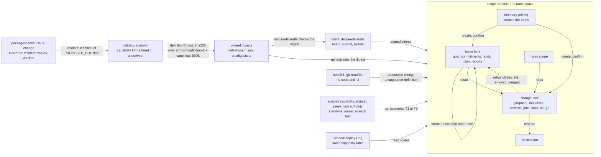

# Sprint report, 2026-10-05 15:00 Eastern: sprint 3

Sprints are eight hours long and end at 07:00, 15:00 and 23:00 Eastern.
Each one ends with a report on main that tells a user's story about
capability that is on main and works, and says what did not land. This
report covers 07:00 to 15:00 on 2026-10-05 Eastern. The previous report
landed as `45440df2` at 06:35 Eastern. Main at the boundary is `872d2537`
(13:00 Eastern), unless updated.

Everything marked "observed run" was run for this report in the clean
worktree `~/play/artroom-worktrees/sprint` at `c373f078`, Node v26.10.0,
on the shared machine. Commit sizes and times are from the git history.
Gate figures are builder's runs. Workroom states are the planner's
account, not in git.

## Summary

A developer who pulls main can now run Artroom's two lane definitions,
`issue` and `change`, on the scope substrate: file an issue, offer and
accept a commitment, take a hold, report, open a change, propose a
manifest, record a verdict and a check, merge, and watch the merge close
the linked issue. The definitions are data in `packages/lanes`,
validated whole and pinned by digest; a client handle is typed from that
data; ten scenarios run them on real scope storage. Two plain statements
first: the lanes run on the substrate in tests only: under production
wiring a scope is not founded or created under either definition
(`unsupported-definition`) until I3 supplies the code of the capabilities
`hold@1` and `git-read@1`. Second, the deployed spike at
<https://artroom-spike-room.inguz.workers.dev> and the packed
`0.1.0-dev.1` release still run the earlier build `b6a9c0b6`; nothing was
redeployed or repacked.

It took 87 commits in `45440df2..c373f078` (`git rev-list --count`). The I2
base milestone landed as `b57e8774` at 10:34 Eastern (request `efb4e323`,
approval `d73281e6`): 151 files changed, 16,206 insertions and 2,143
deletions (`git show --stat`), after three review heads (planner's
account: five findings at the first, three at the second). Around it landed root hygiene,
hugh's rule on tooling probes and three test-cost changes. Builder's gate
runs: 282 vitest and 3 node tests at `b57e8774` (7.7 s), 285 and 3 at
`06381163` (6.6 s), at `d6faca83` (6.3 s) and at `c373f078` (5.9 s).

## A developer's story of the two lane definitions

Source: `docs/lanes.md`, `notes/2026-10-05-i2-delivery.md` and
`packages/lanes`, at `c373f078`.

**What the two definitions declare.** A lane is a scope of the kind
`lane`; its definition, a value of the contract's `DeclaredDefinition`,
decides what it holds. The platform packages have no code for an issue or
a change and import nothing from `packages/lanes`. The
counts, as `packages/lanes/test/definitions.test.ts` asserts them:

| Definition | Item types | Acts | Timed rules | Handlers | Canonical bytes |
|---|---|---|---|---|---|
| `issue` | 12 | 50 | 1 | 7 | 46,160 |
| `change` | 14 | 52 | 2 | 4 | 56,293 |

From a developer's seat the flow is the one GitHub users know, each step a
declared act. An `issue` opens by `file` with a goal. A member `offer`s a
commitment and the requester or offeree `accept`s it; the guard
`terms-differ` refuses any terms but the ones offered. The performer
`take-hold`s a time-limited claim (3,600 seconds, ended by the timed rule
`hold-end`) and `report`s a commit, a tree and
evidence, which the requester accepts or refuses. `add-concern` splits the
goal and sends a `create` for a child lane under the same definition. A
`change` opens by `open` with a proposal. `propose-manifest` fixes one
version: the base, the integration commit and the exact accepted reports
selected. `link-own` sends the relationship `closes` to an issue, which
keeps a copy. `review-verdict`, `request-check` and `check` record a
verdict, a job and its result against the `rules` item. `merge` sends
`reserve` to the destination; the handler `publication` tells every set
link `merged`, and the issue's `closes` handler closes the goal.

Every row has the same parts, from `step` and `on` to `guards` with a
named `reason`, `effects`, `sends` and `attention`. A client checks no
guard; the scope judges. The handle is typed from the data:

```ts
const opened = await declaredHandle(scope, issue);
if (!opened.ok) throw new Error(opened.reason);     // definition-mismatch
const { signed, beside } = await opened.handle.intent(signer, "accept", { on: commitment, fields: { terms } });
const answer = await opened.handle.submit(signed, grants, beside);
```

**How a definition is validated whole and pinned.** Each value passes
`validateDefinition` at `PROPOSED_BOUNDS`. A digest is `definitionDigest`
of the bytes package: SHA-256 over the tag `artroom-definition-1`, a
newline and the canonical JSON of the whole value. Any changed row is a
new definition with a new digest; a scope that pinned the earlier one
keeps it. `scripts/pin.mjs` and `scripts/reference.mjs` write the byte
files, `src/digests.ts` and `docs/lanes-reference.md`; the pins test
fails while any is stale. The delivery note's pins:

| Definition | Digest |
|---|---|
| `issue` | `sha256:325cb4f33da9deb1a31d85ba0f1456068d4d9d08009978b779aed70cb08e00ad` |
| `change` | `sha256:4ff0c7f681c664a3c2dae22bd0df4a9a1bb239e19bc185db41f7f140d4dfca45` |

**What the ten scenarios reach.** T1 to T9 in
`packages/lanes/test/*.scope.test.ts` run on real scopes (Durable Objects
with SQLite storage), founded and
created under the two pinned digests, through the declared handle. One run
writes 21 of the 50 act kinds of `issue` and 12 of the 52 of `change`,
and 2 of 7 and 2 of 4 handlers (deltas note, section 20).
Each test names its stand-ins: a test authority that calls every grant
current, a made-up directory, a scripted clock, the scripted capability,
and in T3, T5b and T8 scripted peers for the rules scope and the
destination. Each has a control that distinguishes (section 7).

**What is refused until I3.** Both definitions use guards and effects of
`hold@1` and `git-read@1` (the acts `report`, `refuse-report` and
`propose-manifest`, and seven handlers), and no runtime in this
repository has that code. The validator lists those forms in
`ValidDefinition.underived`; the production runtime founds and creates no
scope under either definition, answering `unsupported-definition` for the
whole scope, not only the capability rows; the verifier answers the same
at the genesis. Witness: `packages/scope/test/founding.test.ts`,
"a definition that needs a capability record". The scenarios run only
because the test Worker supplies the scripted capability.

**Observed run**, 2026-10-05 13:34:56 to 13:35:03 EDT, worktree at
`c373f078`, wall times by bash `time`:

```text
$ npm ci --ignore-scripts
real    0m1.296s

$ npm test --workspace @generalbusiness/artroom-lanes
> vitest run --config vitest.config.ts && vitest run --config vitest.scope.config.ts
 Test Files  1 passed (1)
      Tests  3 passed (3)
   Duration  259ms (transform 114ms, setup 0ms, import 149ms, tests 73ms, environment 0ms)
 Test Files  6 passed (6)
      Tests  10 passed (10)
   Duration  3.37s (transform 241ms, setup 0ms, import 533ms, tests 1.76s, environment 0ms)
real    0m4.991s

$ node packages/lanes/scripts/reference.mjs --check; echo "exit $?"
docs/lanes-reference.md is current
exit 0
```

The three tests are the pins, the counts and whole validation; the ten are
T1 to T9, each named with its invariant and its `SCRIPTED` stand-ins
(verbose rerun at 13:35:19 EDT, 2.44 s). `pin.mjs` writes tracked files,
so the digests were computed with its two functions, writing nothing:

```text
$ node --input-type=module -e 'import { canonicalize, definitionDigest } from "@generalbusiness/artroom-bytes"; ...'
issue sha256:325cb4f33da9deb1a31d85ba0f1456068d4d9d08009978b779aed70cb08e00ad 46160 canonical bytes matches digests.ts
change sha256:4ff0c7f681c664a3c2dae22bd0df4a9a1bb239e19bc185db41f7f140d4dfca45 56293 canonical bytes matches digests.ts
```

Both digests and byte counts equal the delivery note's. `git status
--short` printed nothing afterwards.

## What landed

| Item | Commit | What it gives a user |
|---|---|---|
| Root hygiene (request `5557bf51`, approval `0d3769f8`) | `bd9c604f`, 07:24 | `.gitignore` covers `.dev.vars.*` and `.env`; the row monitor workflow is pinned. Two files |
| Agent instructions: tooling probes | `3dc8492b`, 07:58 | Hugh's rule: run a pinned tool from a scratch directory; `package.json` and the lockfile change only in a reviewed commit. One file |
| I2 base milestone: the lane forms as data | `b57e8774`, 10:34 (merge of `77555943`) | `packages/lanes` with `issue` and `change` pinned by digest; 38 contract forms across the six packages; `declaredHandle`; ten scenarios; the genesis records its act kind; `docs/lanes.md`, `docs/lanes-reference.md`, the delivery note and the 185-entry deltas note |
| I2 review repairs DR1 to DR15 | `3199a6e7` to `77555943`, 08:04 to 09:35, inside `b57e8774` | A `__proto__` item type reserves nothing; a fact inside a record travels whole; a repeat is answered before any fetch; replay settles every owed text with its depth counted from the target; a reply deeper than 64 levels is no answer; a foreign entry's field is read as its bytes hold it |
| Test economy (request `520ebceb`, approval `d195bf21`) | `06381163`, 10:57 | No test of `client`, `replay` or `scope` waits on the wall clock; the reply table runs once; the scope gate is two promises. Tests and test support only |
| Scope test cost (request `e064933f`, approval `87121e83`) | `d6faca83`, 11:24 | Replay, founding, texts and lane test T9 read histories through the route function in the test's isolate; `notes/2026-10-05-scope-test-cost.md` holds the measurements |
| Test run shape (approval `a1d8e770`) | `c373f078`, 13:00 | The Node projects of the root vitest run go at the same time; `scope` keeps its own turn. One file, no test changed |
| Plan 016, repository extents acceptance story | `872d2537` (13:39 Eastern, after this report's story was drafted) | The demo's acceptance target for three named extents, a mixed change needing both reviewers, a rules change only the rules scope's controller lands, and an infrastructure landing as an effect with recovery |

## Architecture

From `docs/lanes.md`, `docs/scopes.md` and the delivery note. Each scope
is a Durable Object with SQLite storage; the scenarios run in the workerd
test pool.



## What did not land and why

- **I3, the platform definitions and capabilities, is not on main.**
  Planner's account: it is built through most of its plan steps on
  builder's branch. Four
  capability silences (EH6 to EH11) were carried into authority revision
  21 and contract revision 16, now with the checker; they gate I3's
  production-capability step. Until then both lanes stay refused under
  production wiring (rows W1 and W2).
- **Design revisions.** Planner's account: the checker returned at about
  07:20 Eastern after being silent since 00:55. Scope contract revisions
  12 to 15 and authority revisions 18 and 20 were approved and adopted;
  recovery revisions 3 and 4 were reviewed and revision 4 adopted;
  authority revision 21 and contract revision 16 were approved and adopted
  together at 13:57; recovery revision 7 had changes requested and its
  revision 8 is being written, carrying a capacity question (a running
  task's three save rooms of three cuts each against a cut maximum of 8)
  that is owned by the common capacity design. Main's
  notes name revision 12 as adopted (act `b2833098`); the later revisions
  are not in git.
- **The I2 request stays open.** It is a milestone, not I2 (delivery note,
  first paragraph). Planner's account: the contract's revision 14 adoption
  leaves 23 must-change rows, of which 20 are owed. The note's own list is
  W1 to W5 (section 4) and its section 10.
- **The spike was not redeployed, by decision.** `parked/README.md` keeps
  the earlier product until a separately authorized retirement; no deploy
  configuration builds the seven packages (delivery note, section 6).
- **Direction taken, acceptance written, not yet built.** Planner's
  account: hugh's direction that a repository's layers (source,
  infrastructure, rules including agent instructions) be distinguishable
  by customizable rules led to two paired requests. The second planner
  delivered the acceptance story the same afternoon as
  `plans/016-2026-10-05-repository-extents-demo.md`, independently
  reviewed and landed on main at `872d2537` after this report's story was
  drafted; I3's first rules definition naming extents is promised by
  builder, sequenced after the capability silences. An identity design
  request (external identity binding, login entry, SCIM later) went to
  the second planner.
- **Builder's test-cost finding, stated plainly**
  (`notes/2026-10-05-scope-test-cost.md`, builder's observations): the `scope` project is about three quarters of test
  time; the product's cost per act is flat in history length; a call
  through the Worker's entrypoint in the test pool slows as a run makes
  more of them, which is the DK11 slowdown, not the product. In-isolate
  history reads took the project from about 4.8 s to 3.9 s wall (three
  runs each). No tenfold claim is made.

## Limits a user will meet

From the delivery note (sections 4, 6 and 7) and `docs/lanes.md`:

- Nothing of the lanes runs under production wiring; there is no deployed
  instance, browser page, command line or hosted agent for them. The
  capability rows run only on the scripted stand-in.
- `propose-manifest` staged in another lane needs an entry of the kind
  `hold@1:check`, which no source writes (DK6), so no real `pin-confirm`
  or `unpin` reaches an issue.
- No destination exists: a `reserve` nobody receives ends `refused`,
  `undelivered` (T3). The names `platform:rules`, `platform:destination`
  and `platform:task` are assumed (gap G26).
- Every grant is called current by the test authority. Capacity is
  counted in entries only (W4), and the publication entry at its limit of
  35 sends is untested (W3).
- 29 of 50 `issue` act kinds and 40 of 52 `change` act kinds are shown
  only as data; `job-deadline` and the `hold-end` of `change` never fire.
- Bytes written by I1's source changed: every act entry's hash, state
  digest and genesis (section 6). Nothing is migrated, because a search
  of tracked files finds nothing deployed from these packages; that is
  not proof.
- The test run grew from 3.5 s to 6.2 s with I2, and the three test-cost
  changes brought it to 5.9 s at `c373f078` (builder's runs).

## Sprint 4 commitments, 15:00 to 23:00 Eastern

Recorded in the workroom under the cadence act `c514748f`.

- **Checker.** Verdicts, in order: the first I3 milestone (F, the
  foundation: platform marks and the repaired preparatory findings) when
  builder files it; scope contract revision 17 (the canonical `artroom://`
  URI, `5a15b9b0`); authority revision 22 (capacity composition and the
  design of extents, `55e41dfc`); recovery revision 8 (`d90b84ac`); then
  the lane forms successor for per-extent obligations.
- **Planner.** Adopt contract revision 17, authority revision 22 and
  recovery revision 8 on approval; ratify the I3 milestone's delivery and
  land it; keep the hourly
  surveys and write the 23:00 report.
- **Builder.** File the I3 platform-marks source as a milestone when its
  gate passes, and land it on approval; run the production-capability
  step (I3 step 16), now unblocked by the adoptions of authority revision
  21 and contract revision 16; then the first
  rules definition with named extents (request `42de9e34`) under the I3
  commission; carry the I2 delivery's owed must-change rows at the next I2
  head; state the I3 gate's test count and time at each milestone.
- **Second planner.** Carry plan 016's dependency rows into the proof plan
  and lane forms follow-throughs; the identity design request (`046f88ba`)
  is not urgent and comes after.
- **23:00 report.** If the platform-marks milestone lands, a developer's
  story of a platform rule running on a real membership answer; otherwise
  the lanes on the substrate with plan 016's story as the target. The
  spike stays on `b6a9c0b6`; no redeploy or repack; no cloud sessions.

