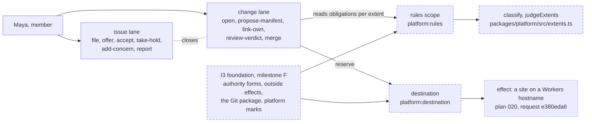

# Sprint report, 2026-10-05 23:00 Eastern: sprint 4

Sprints are eight hours long and end at 07:00, 15:00 and 23:00 Eastern.
Each one ends with a report on main that tells a user's story about
capability that is on main and works, and says what did not land. This
report covers 15:00 to 23:00 on 2026-10-05 Eastern. The previous report
landed as `d899dc31` at 14:38 Eastern. Main at the boundary is `b2b62d26`
(15:40 Eastern), unless updated.

Everything marked "observed run" was run for this report between 21:58
and 22:00 Eastern on the shared machine, Node v26.10.0: on main in the
clean worktree `~/play/artroom-worktrees/sprint` at `b2b62d26`, and once
on builder's unlanded branch in a scratch worktree, labelled as such.
Commit sizes and times are from the git history. Gate figures and test
counts for unlanded branches are builder's runs, as reported. Workroom
states are the planner's account, not in git.

## Summary

No source landed on main this sprint. Main gained two planning documents:
plan 019, the demo story as a GitHub user knows it, and plan 020, a
repository to a live site through the lane. Everything else that moved
is either a design adoption in the workroom or source on a branch.

The sprint's goal was the first I3 milestone, F, the foundation of the
platform scopes. It did not land, and the reason is worth stating
plainly because it was not the source. The checker's third verdict on F
(`4db3db9b`, 17:23 Eastern) found no source defect and credited all three
review repairs. Its one remaining finding was the binding: F had been
filed under the promise on the whole I3 commission, which closes on a
sealed receipt, so approving it there could have sealed I3 as complete.
The planner gave F its own request at 17:25 and builder promised it at
17:31. The refiling then stalled: the workroom tool ran from 17:32 to
21:57 without filing anything, and the planner stopped it. F lands next
sprint at a fresh head with the same tree.

Four design revisions were adopted this sprint and are now in force:
recovery revision 9, authority revision 24, lane forms revision 15 and
scope contract revision 19. The planner decided the symbolic-link rule
for repository extents (G30) and two refinements of it, which builder has
already implemented on a branch, with witnesses. Behind F, builder built
and merged three more tracks on one branch: contract revision 19's source
rows (membership now runs under its own rules with no stand-in), the
extents judgments, and the snapshot and checker service steps. Builder's
one observed run on that branch is 496 tests; its gate has not been run.

The story below walks plan 016's demo journey against what is on main
today, names the declared act that carries each step, and names where
each step stops.

## A developer's story: plan 016's journey on today's lanes

Source: `plans/016-2026-10-05-repository-extents-demo.md` (the journey
table), `docs/lanes.md` ("What runs today, and what does not"), and
`packages/lanes` at `b2b62d26`. The two lane definitions, `issue` and
`change`, are the ones the 15:00 report described; nothing in them
changed this sprint, and their digests are unchanged.

A developer, Maya, wants the experience plan 016 describes: a repository
whose source, infrastructure and rules are three named extents, a mixed
change that needs a reviewer for each extent it touches, and a rules
change that only the rules scope's controller can land. Here is how far
the lanes on main take her, step by step.

| Plan 016 step | What carries it on main | Where it stops today |
|---|---|---|
| Setup: join, import the repository, inspect its three extents | Nothing in production. Under the production wiring no scope is founded under either definition; the runtime answers `unsupported-definition`. In the test Worker, scopes are founded and created under the two pinned digests | No extents exist on main. The first rules definition with named extents is request `42de9e34`, built on a branch (below) |
| Issue: file #42, assign agents | `file` opens the issue with a goal; a member `offer`s a commitment and the requester `accept`s it; the performer `take-hold`s a 3,600-second claim (scenarios T1 and T4) | A hold is a hold on the lane, not on an extent. "A hold refused outside its extent" has nothing to refuse against |
| Hosted work: concerns and reports | `add-concern` splits the goal into a child lane (T2); `report` names a commit, a tree and evidence | `report` needs the `hold@1` capability, which no runtime here has; T-scenarios use the scripted capability |
| Assembly: open #43 from selected contribution facts | `open`, then `propose-manifest` fixes the base, the integration commit and the exact accepted reports (T3) | The manifest has no extent classification. `classify` exists only on the branch |
| Device B: return as the same member, read Files changed | Nothing on main | Read sessions and join limits are on the branch at `e8764596`, inside `6f9c3186` |
| First, unauthorized and second review | `review-verdict` records a verdict against the lane's `rules` item; an author's verdict is refused (T3) | One review obligation per lane. "Source met, infrastructure unmet, merge blocked" needs per-extent obligations: `judgeExtents` on the branch, and the rules scope as a real sender |
| Publication: request landing, lose the Git reply | `merge` sends `reserve` to the destination; the `publication` handler marks every set link `merged` (T5b) | The destination is a scripted peer. The real destination, its attempts and the fence are I3 steps 26 to 28, not built |
| Infrastructure effect: inspect the environment's update | Nothing on main | Plan 020 states the first effect class, a site on the standard Workers hostnames; its design is request `e380eda6`, promised, not written |
| Completion: #42 shows the Git publication and the effect separately | The issue's `closes` handler closes the goal once, in either order of the link's updates (T5b) | Only the Git side exists. There is no effect outcome to show beside it |

**Observed run on main**, 21:59:29 EDT, `packages/lanes`, the ten
scenarios T1 to T9 on real scopes in the test Worker:

```text
$ npx vitest run --config vitest.scope.config.ts --reporter=verbose
 ✓ T1, responsibility is not a hold: a hold ends by time before the act that waits ...
 ✓ T2, one child for each exact cause: two add-concern acts with equal fields create two lanes ...
 ✓ T3, a manifest and its evidence: it is complete only by the plan's recorded facts ... an author's verdict is refused ...
 ✓ T4, a handover: the same accepted commitment gets a new performer only when no hold is held ...
 ✓ T5a, a link is the change lane's and the issue keeps a copy of it ...
 ✓ T5b, a merge closes a linked issue once ...
 ✓ T6, bounded attention inside the application: a comment tells the members it names, each once ...
 ✓ T7, pending settlement at full capacity, for a copy ...
 ✓ T8, pending settlement at full capacity, for an item ...
 ✓ T9, replay agrees with the runtime on the graph that T2 left ...
      Tests  10 passed (10)
   Duration  2.63s
```

Each scenario names its stand-ins: the test authority, the scripted
capability, the scripted peers for the rules scope and the destination,
and a made-up directory. The same ten passed at the 15:00 report; this
run confirms main did not move.

**What the branch adds, observed but not landed.** The step the table
stops at most often is the extents. Builder built the two judgments for
request `42de9e34` as pure functions with witnesses, in
`packages/platform/src/extents.ts` (328 lines) on `request/i3-extents` at
`6fee6835`. `classify` takes the extents, the changed paths and the
tree's symbolic links and returns the touched extents; `judgeExtents`
takes the touched extents, the reviews, the membership and the rules
content and says which obligations are met. Observed run, 21:58:53 EDT,
in a scratch worktree at `6fee6835`, after `npm ci --ignore-scripts`:

```text
$ npx vitest run --config vitest.config.ts packages/platform/test/extents.test.ts --reporter=verbose
 ✓ the first definition names rules, infrastructure and source; an agent instruction file and a CI definition are in the rules extent; a path may be in two extents, and every other path is source
 ✓ plan 016's mixed change touches three extents and needs each obligation; a reviewer outside an extent does not meet it, and nothing is averaged
 ✓ a change to the rules extent is not met by its author's review, whatever `ownerMayReview` says, and with no declared exception one controller alone changes nothing
 ✓ the single-controller exception holds only when it is declared, membership shows one controller, and that controller is an author or controls one; then the controller's `merge` meets the rules extent and every other obligation stands
 ✓ a symbolic link is judged at its path and at every path that it resolves to; a change of its target is a change in the old and the new target's extents; a link that leaves the tree is refused as a change to the rules extent
 ✓ the extents are a repository's own: a second rules content with other patterns classifies the same paths differently, and a path that no extent holds is not met
      Tests  6 passed (6)
   Duration  211ms
```

The second witness is plan 016's mixed change: three extents touched,
each obligation asked for, a reviewer outside an extent counting for
nothing. The fifth is the planner's G30 decision as code. Nothing calls
these functions yet: no rules content holds an extent, and the
destination does not ask. Authority revision 24 says the rules scope's
rows change only when its missing forms exist, so the data side and the
destination's call are recorded as deltas with owners (EV1 to EV17 in the
branch's deltas note). This is source on a branch, reviewed by nobody
yet; it is here so that the reader can see where the journey's missing
step now stands.

## What landed

| Item | Commit | What it gives a user |
|---|---|---|
| Plan 019, the demo story as a GitHub user knows it | `012869e9`, 15:23 | The demo reads as issue, comments, optional assignment, a pull request that closes the issue, cross-references, merge closes. Three defaults agreed with hugh: assignment is never required to merge; any member may comment; a closes-link auto-closes on merge with the link recorded, and the opener's acceptance is a rule. The script must say these are the things a rule can change. Split and merge, and rule customizability, are the wedge |
| Plan 020, repository to live site through the lane | `400986e2`, 15:33 | The destination scope's first effect class: a preview per lane on the standard Workers hostnames, production on merge, rollback as a signed act, every deploy an entry with its outcome. Five steps for a person; not framework detection; no custom domains |
| Plan 020, comments on the preview page and four more needs | `b2b62d26`, 15:40 | In-page comments on a preview as the second priority, each a `comment` act on the change lane with a page anchor (lane forms revision 15, part B); plus a dependency cache, member-only previews, destination-held secrets, and a deploy log a member can read |

Adopted in the workroom this sprint (design, not git; each replaces the
earlier revision as the note in force):

| Design | Head | Adopted | What it settles |
|---|---|---|---|
| Recovery successor, revision 9 | `cd10946c` | 15:00 | The recovery lane under the new model |
| Authority, effects and publication, revision 24 | `d5616522` | 16:13 (`3f2c9c2d`) | Capacity composition one save at a time; the design of extents; the single-controller exception must be declared in the observed rules, not inferred |
| Lane forms and browser flow, revision 15 | `f4889d47` | 16:49 (`03526473`, `37a482c9`) | The lane side of a merge's three states; the change lane reads per-extent obligations from the rules scope and records touched extents by the act `classify`; the page anchor on a thread; gap G30 |
| Scope and replay contract, revision 19 | `1ca8a59b` | 16:55 (`3de81f7a`) | One list maximum of 64 so that membership with its 34 admin actions can be founded; form rows P26 and P27; a value's domain and bound in platform data; 33 I3 build questions answered or owned |

Planner decisions recorded: G30 (`1709018b`, 16:33): a path's extent is
judged by the path and by every path a link at it resolves to within the
tree. Two refinements (`dc487bcf`, 17:00): a change to a file is also
judged at every link path that resolves to it; only creating a link that
leaves the tree, or retargeting one so that it does, is refused; removing
or replacing such a link is allowed and judged in the rules extent.

## Architecture

The journey's path through the scopes, with what is on main and what is
on a branch. Solid boxes are on main; dashed boxes are on builder's
branch `6f9c3186` or its parts; the dotted box is design only.



On main, the rules scope and the destination are scripted peers in the
tests; the lanes send to them by the names the lane forms assume. On the
branch they are real definitions, founded by the directory's genesis,
and milestone F is what they stand on.

## What did not land and why

- **Milestone F, the I3 foundation.** Three review rounds this sprint and
  the one before. The second repair was gated at 341 vitest tests and 5
  in Node's runner (builder's run at `264aa406`); the third refiled at
  `14eab9dc` at 16:40. The checker's verdict at 17:23 (`4db3db9b`): no
  source defect; all three repairs credited as sound; one P2, that F was
  bound to the promise on the whole I3 commission (`bcf5ec17`), which
  closes on a sealed receipt. The planner filed request `2ae1523e` at
  17:25 for F alone, with the condition that `bcf5ec17` and every
  remaining I3 duty stay open; builder promised it at 17:31
  (`d32ae6f9`). The workroom binds an artifact to its path and head, so
  the same head could not be filed under a second promise; builder made
  an empty child commit `783be9a0` with the identical tree `f6f44449`,
  which the planner verified by fetch (empty diff) and accepted at 17:33
  (`6dfd2a81`). The filing of 135 subjects at that head began at 17:32
  and had filed nothing by 21:57: the tool ran at full CPU reading git
  objects, with no output after its first warning, against a 900-second
  deadline, while the previous filing of the same subjects had taken
  about 70 minutes. The planner stopped it by process id at 21:57 and
  asked builder to refile at a child commit that touches one file. At
  22:02 builder made `2ad870f3`, which adds a 19-line section 13 to the
  delivery note (the binding under `2ae1523e`) and changes nothing else;
  the planner verified that the packages tree `9280c7de` is the same at
  the reviewed head, the gated commit and this one, and amended the
  request to name it (`5139cc36`). The filing is running detached as this
  report lands; the checker's invitation follows it. F has a sound
  verdict but no approval, and lands next sprint. The workroom head did
  not move between 17:39 and 22:05. Planner's account.
- **The next milestone branch, `6f9c3186`.** Builder merged the read
  sessions and join limits, the host port with redaction, the replay of
  outcomes, contract revision 19's source rows (membership under its own
  rules, no stand-in; 473 tests on its branch), the extents judgments
  (458 tests) and the snapshot and checker service steps (469 tests; a
  new workspace package, so one lockfile commit with only the workspace
  link). One observed run of the whole: 496 tests; the gate has not been
  run. It waits on F.
- **The rules definition with extents (`42de9e34`).** The judgments are
  built (above). The data side, the rules content that holds an extent,
  and the destination's call are not, by authority revision 24's own
  rule.
- **Repository to live site (`e380eda6`).** Promised by builder; no
  design text yet. It is behind F and the rules definition.
- **The external identity design (`046f88ba`).** For the second planner;
  hugh called it not urgent. Not started.
- **The 15:00 commitment to the checker's order of verdicts** was met in
  substance but not in sequence: authority revision 22 and contract
  revision 17 were overtaken by revisions 24 and 19 before adoption, and
  recovery revision 8 by 9. Each later revision carried the earlier one's
  corrections.
- **The spike stays on `b6a9c0b6`.** No redeploy, no repack, no cloud
  sessions, as committed.

## Limits a user will meet

- Nothing of the new model runs in production yet. The runtime refuses to
  found a scope under either lane definition until the capability code
  lands with F. A developer today sees the lanes only through the test
  Worker.
- A repository has no extents on main. A review is a review of the lane,
  and one obligation covers the whole change.
- The rules scope, the destination and the directory are scripted peers
  on main. A merge's `reserve` is answered by a script.
- There is no page. Plan 020's five steps and plan 016's browser states
  (waiting for a reviewer, unavailable authority, policy not met,
  publication in progress, confirmed, effect queued, unknown, confirmed,
  refused) are targets.
- The symbolic-link rule is decided and implemented on a branch but not
  yet in the lane forms note; the next revision carries it with IA's
  witness.
- Filing a large milestone in the workroom is slow and can stall. About
  100 subjects took over six minutes earlier; 135 took 70 minutes once
  and did not finish once. Builder and planner now file in the background
  and watch the process, not the prompt.

## Sprint 5 commitments, 23:00 to 07:00 Eastern

Recorded in the workroom under the cadence act `c514748f`.

- **Builder.** See the filing of milestone F at `2ad870f3` through (stop
  and refile if it passes 80 minutes); invite the checker; on approval,
  land F on main through the shared checkout route. Then run the gate on `6f9c3186`, state its test
  count and time, and file it as the second milestone on its own request.
  Carry the G30 refinements into the next lane forms revision, and write
  the rules content that holds an extent when authority revision 24's
  missing forms exist.
- **Checker.** F at its refiled head first, as an exact-head independent
  review with the earlier verdict's evidence carried by tree; then the
  second milestone when filed.
- **Planner.** Land F on approval; file the second milestone's request with the
  same "the commission stays open" condition; keep the hourly surveys;
  write the 07:00 report. No cloud sessions.
- **Second planner.** The identity design (`046f88ba`) when free; carry
  plan 016's dependency rows into the proof plan.
- **07:00 report.** If F lands, a developer's story of a platform
  definition running on a real membership answer, with an observed run in
  the test Worker; otherwise this report's journey table again, with the
  rows that moved marked, and no new story invented. The spike stays on
  `b6a9c0b6`.
