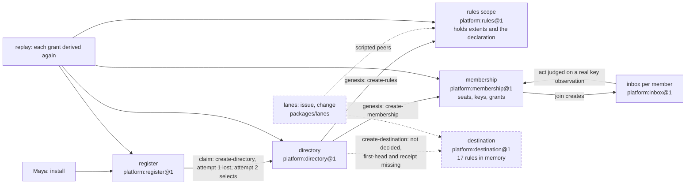

# Sprint report, 2026-10-06 07:00 Eastern: sprint 5

Sprints are eight hours long and end at 07:00, 15:00 and 23:00 Eastern.
Each one ends with a report on main that tells a user's story about
capability that is on main and works, and says what did not land. This
report covers 23:00 on 2026-10-05 to 07:00 on 2026-10-06 Eastern. The
previous report landed as `173fa644` at 22:02 and was updated as
`c0500c31` at 23:20 when milestone F landed. Main at the boundary is
`3cdc2d52` (06:27 Eastern, the jam room note landed after the plan
amendment at `8a10b6bd`, 05:20, the guide corrections at `586a7db9`,
04:39, and the third milestone at `f47fc598`, 03:04), unless updated.

Everything marked "observed run" was run for this report in the clean
worktree `~/play/artroom-worktrees/sprint` at `f47fc598`, Node v26.10.0,
on the shared machine, between 03:15 and 03:17 Eastern. Commit sizes and
times are from the git history (commit times; a push can follow a commit
by up to half an hour, since the landing tool writes the receipt after
the merge). Gate figures are builder's runs, as reported. Workroom states
are the planner's account, not in git.

## Summary

Two I3 milestones landed this sprint, after the foundation landed at the
end of the last one. The second milestone (`48a2b285`, 00:56) brought
membership under its own rules, read sessions, the host port, the replay
of outcomes, the extents judgments, and the snapshot and checker
service. The third (`f47fc598`, 03:04) brought the register and the
directory as data with every rule they need, the destination's rules in
memory, extents held by the rules scope, and a founding that runs on
real scope objects. Together: 227 files changed, 23,841 insertions and
7,597 deletions from `c0500c31` to `f47fc598` (git diff stat). Each
landed by the route the workroom requires: an exact-head independent
review, the implementer's own signed merge, a gate at the landed commit
(builder's runs: 505 and 537 vitest tests, plus 6 in Node's runner).

What a developer can do on main now, in tests on real scope objects
under the deployed class with the production authority: install a
platform and found its register; claim a repository and watch the
register create the directory even when the first reply is lost; see the
directory's genesis create membership and the rules scope; seat a
founder, invite a member, take the join that creates the member's inbox;
have an act judged on a real observation of the signing key and refused
after the key is revoked; and replay every history with each grant
derived again. The founding stops at the destination's creation, which
is refused because its definition still lacks two rules. Nothing is
deployed, and production sends nothing outside the service.

Also this sprint: authority revision 26 and contract revision 23
adopted, the latter after revisions 20 to 22 each drew changes requested
and were repaired; the jam room note revision 8 adopted and landed; the
jam room note rewritten to hugh's new story (revisions 6 and 7); the
first half of spike J0 run on the reference clip; and three sets of
planner decisions recorded on the open design questions.

## A founder's story on real scopes

Source: `packages/scope/test/founding-real.test.ts`,
`packages/scope/test/membership.test.ts` and
`packages/scope/test/operations.test.ts` at `f47fc598`, with
`packages/platform/src/*.ts` for the definitions they found. The stand-ins
are named where they stand.

Maya installs the platform. The install founds a register, a scope under
`platform:register@1`, and the package's own rules run it; no rule is
missing. She claims a repository. The register records the claim and
opens the creation of a directory for it: an operation with an attempt,
recorded before anything is sent. The reply to the first attempt is
lost. The second attempt's own answer selects the one directory that was
created, so the lost reply creates no second one. The directory's genesis
creates two more scopes beside it, membership and the rules scope, each
held until the register confirms the creation. Then it tries to create
the destination, and stops: `platform:destination@1` lacks the rules
`first-head` and `receipt`, so the creation is not decided, and the
register says so. The rules scope's first act fixes the incarnation of
the membership scope whose ID it holds. All four histories replay
consistent.

**Observed run**, 03:15:55 Eastern, one test, the Git host a labelled
stand-in:

```text
$ npx vitest run --project scope founding-real --reporter=verbose
 ✓ a founding on real scopes under the deployed class (authority note, section 3.8; I3 plan, step 9c). The Git host is a STAND-IN
   > an install founds a register; a founder's claim opens the creation of a repository; the reply to its first attempt is lost,
     and the own answer of the second selects it and creates the directory; the directory's genesis creates membership and the
     rules scope, each held until the register's confirm; the creation of the destination is not decided, because
     `platform:destination@1` lacks rules; and the rules scope's first act fixes the incarnation of the membership scope whose
     ID it holds   250ms
      Tests  1 passed (1)
   Duration  1.99s
```

Maya is seated as the founder of membership. She invites Sam; Sam's join
creates Sam's inbox, a scope under `platform:inbox@1` whose genesis
records the membership scope it reads. Sam acts at the inbox. The scope
reads Sam's key from membership, a real observation at a head, and
admits the act. Maya revokes Sam's key. Sam's next act, on a fresh read,
is refused; Maya's own key is not. A version of membership that lacks one
of its rules founds nothing at all: the service refuses the whole scope,
not one act. A membership scope whose creator has not confirmed it
answers no observation. The verifier replays the histories and derives
each recorded grant again from the observation it retained; a history
that was changed is reported by the name of what it breaks.

**Observed run**, 03:15:58 Eastern, four tests, real scope objects of the
deployed class with the production authority; the creator of the
membership scope is a made-up office standing for the directory:

```text
$ npx vitest run --project scope membership --reporter=verbose
 ✓ an act at an inbox is judged on a real observation of the signing key, read from the membership scope that the inbox's
   genesis records; after the key is revoked the next act on a fresh read is refused, and another member's key is not
 ✓ a version of membership that lacks a rule founds nothing ...
 ✓ a membership scope that its creator has not confirmed answers no observation ...
 ✓ replay agrees with the runtime: each recorded grant is derived again from the observation that it retains and from
   membership's history at the observed head; a history that was changed is reported by the name of what it breaks
      Tests  4 passed (4)
   Duration  1.32s
```

Under both runs lies the foundation that landed at the end of sprint 4:
a platform definition stated as data with marked places where a rule
stands, the whole scope refused when a rule is missing, and an outside
effect recorded as an operation before it is sent and sent at most once.
**Observed run**, 03:16:16 Eastern, fifteen tests across the founding,
founding-real and operations files, 1.42 s; the one that matters most for
the lost reply above is T19: "an attempt is recorded before it is sent,
and sent at most once; a stop between the send and the outcome leaves
`unknown`", which a restart, elapsed time or a later attempt resolves.

What the story does not reach: the destination (two rules missing, their
forms answered by contract revision 20 but not yet adopted), any
publication, any lane on a founded repository, any page, and anything
deployed. The lanes still run only in the test Worker with scripted peers
for the rules scope and the destination. Revocation takes effect at the
next fresh read within the authority window the note states, not at the
instant of the revoking act.

## What landed

| Item | Commit | What it gives a user |
|---|---|---|
| **I3 second milestone** (request `53f83851`, approval `ade871d4`, receipt `809912d0`) | `48a2b285`, 00:56 (merge of `c404c8d8`) | 217 files, 18,193 insertions and 7,473 deletions against the previous main (git diff stat). Membership runs under its own rules with no stand-in (contract revision 19's rows I3-31 to I3-38, the list bound 64); read sessions bind one repository under a secret; the host port with redaction; the replay of outcomes; the extents judgments `classify` and `judgeExtents` with the G30 decision and its refinements; the snapshot and checker service with a new `checkers` workspace package; the four P2 repairs and six sibling fixes from verdict `25e00e2a`. Builder's gate at `48a2b285`: 505 vitest tests and 6 in Node's runner |
| **I3 third milestone** (request `15cacb1f`, approval `bb0de8cf`) | `f47fc598`, 03:04 (merge of `b92f9ea2`) | 65 files, 6,547 insertions and 1,023 deletions. The register and the directory as data lacking no rule; a founding on real scope objects through a lost first reply; the destination's 17 rules in memory; extents held by the rules scope with the declared single-controller exception; outcome rules reading observations; the replay fix for finding `e2d4e074`. Builder's gate at `f47fc598`: 537 vitest tests and 6 in Node's runner |
| Guide corrections (checker's request `3954c4f1`, approval `ab05251d`) | `586a7db9` | Two guide files say what is true of the source after the third milestone; prose only, 20 insertions and 8 deletions, landed with no gate, source and tests unchanged from `f47fc598` |
| Plan 021 amended to the adopted jam design | `8a10b6bd`, 05:20 | The jam story follows the note's record and timing design: a pattern takes effect at the derived bar; a refused act is shown, not recorded; a rhythm phrase is a second `sing`; the lookahead is a value of the rules item; effect bars never go backwards in sequence |
| Jam room note, revision 8 (request `1086c974`, approval `00d61f26`) | `3cdc2d52`, 06:27 | The adopted jam design on main beside plan 021: one file, document only, byte-identical to the approved head, no gate |

Adopted in the workroom this sprint (design, not git):

| Design | Head | Adopted | What it settles |
|---|---|---|---|
| Authority, effects and publication, revision 26 | `f7175296` | 23:38 (`9c9ecdf6`) | Restores the controller-of-agent clause of the single-controller exception; the planner's four answers on revision 25; the directory, register, destination and extents rows that blocked founding and publication |
| Scope and replay contract, revision 23 | `3b3e394f` | 06:35 (`78b6d129`) | Which subjects an entry observes; a checked reservation held by an item, replacing the build's exemption; the fact reference as text; the indexed binding selector; the retain-and-start table; the planner's answers on revisions 20 to 22. Revisions 20 to 22 were never adopted |
| Authority, effects and publication, revision 28 | `8b1c3c9d` | 06:55 (`e93b737b`), after this report was written | The destination's first-head and receipt rows; the observes rows for its judge; the three changes to section 6.5; the counts a publication holds; both size tables without guessed allowances; reserve naming each selected report; the planner's answers on revisions 27 and 28. In force with contract 23; revision 27 was never adopted |
| Jam room note, revision 8 | `0861580e` | 05:15 (`b8d8ef01`) | Plan 021's story on the kept record and timing design, with one lookahead rule and a monotone effect-bar clause; nine platform gaps with owners. Landed on main at `3cdc2d52` (below). Spike J0 stays open |

Planner decisions recorded, each answering a filed revision's questions:
contract revision 20 (`1f8aba72`: a compromised-key notice must be
recordable at a full destination; a member's own withdraw settles and
takes the request's room; counts too low are a fault shown to the
member; entry hashes in public ref names), revision 21 (`39749e26`: the
authority note's section 6.5 changes in three places rather than sizing
every outcome for the largest fetch), revision 22 (`2d3fa911`: a binding
selector must use an index), and the jam room note's conflicts with
plan 021 (`dff56797`: the kept record and timing design wins; a pattern
takes effect at the derived bar; a refused act writes nothing; a rhythm
phrase is a second `sing`).

## Architecture

The platform scopes on main at `f47fc598`, as the founding creates them.
Solid boxes are created by the package's own rules in the observed run;
the dashed box is refused for its missing rules; the dotted boxes are
still scripted peers in the lane scenarios.



## What did not land and why

- **The destination's creation, and so the plan's M1.** The destination
  needs the rules `first-head` and `receipt`, whose form (a fact reference
  as text; a checked reservation held by an item) contract revision 20
  gave and revision 23 now carries, adopted at the boundary. Revision 20 got changes requested (`0cf59056`), revision 21
  repaired those and got two new findings in the forms added from the
  planner's answers (`dc1da38a`), revision 22 (`a1c709e4`) repaired those
  and got one more on the binding selector's index (`675776bc`), and
  revision 23 (`3b3e394f`, filed 05:10) repairs that. Until a contract revision carrying the forms is
  adopted, builder has stated the publication's reservation as an
  exemption with 71 entries unreserved, and the delivery note says so.
  Authority revision 27 (`1f3cfca5`), with the first-head and receipt
  rows, got changes requested (`af0d0a5e`: a retry mint after an old read
  would write to a final item; reserve must name each selected report, as
  the planner's answer asked); revision 28 (`8b1c3c9d`, filed 06:10)
  repairs both and takes effect only when a contract revision carrying
  its forms is adopted.
- **Spike J0's judgment.** The first half ran on the reference clip's
  audio: a plain pitch tracker found eight notes between A2 and A sharp 3
  in under half a second; the in-page model found the same pitches in 47
  fragments in 2.7 s; onset detection found 18 hits in 4.2 s. Whether a
  synth playing the transcription back is recognizably the tune is
  hugh's judgment, and three compare files wait for it. A hosted
  audio-capable model was not tried because the audio would leave the
  machine; that needs hugh's go-ahead. The planner's own first pitch
  figures in plan 021 were wrong (spectral peaks, not fundamentals) and
  were corrected at `ba813aad`.
- **Spike J0's second half**: the five phrases by people and the
  hosted-model comparison are owed on the J0 request, the second on
  hugh's go-ahead. The jam note went through three reviewed revisions
  this sprint (6, 7 and 8) before adoption.
- **Repository to live site (`e380eda6`)** and **the external identity
  design (`046f88ba`)**: no text yet; behind the milestones, as before.
- **The spike stays on `b6a9c0b6`.** No redeploy, no repack, no cloud
  sessions.

## Limits a user will meet

- Nothing of the new model is deployed. The three milestones run in the
  local test pool under the deployed class, not on the spike.
- No repository can be founded whole: the destination's creation is
  refused. Without a destination there is no publication, so no change
  lands through the new model.
- The Git host is a stand-in in the founding; production sends nothing
  outside the service.
- The lanes still reach the rules scope and the destination as scripted
  peers; the extents are held by the rules scope but no lane reads them
  yet.
- A revoked key is refused at the next fresh read, within the authority
  window, not instantly.
- Each large filing in the workroom takes 13 to 45 minutes and must be
  watched by process, not by prompt (last sprint's stall is recorded in
  the 23:00 report).

## Sprint 6 commitments, 07:00 to 15:00 Eastern

Recorded in the workroom under the cadence act `c514748f`.

- **Builder.** With contract revision 23 adopted, build
  its source rows: the destination's two missing rules and the checked
  reservation, so that a founding completes and a first publication can
  be judged; file that as the fourth milestone on its own request, with
  the commission `bcf5ec17` open; the destination's rows are cleared now
  that authority revision 28 is adopted. Run J0's second half when hugh
  answers.
- **Checker.** The fourth milestone when filed. (Authority revision 28
  was approved and adopted at 06:55.)
- **Planner.** (Authority revision 28 is adopted.) file the fourth milestone's request on builder's word; keep
  the hourly surveys; write the 15:00 report. No cloud sessions.
- **Second planner.** The identity design (`046f88ba`) when free.
- **15:00 report.** If the fourth milestone lands, a developer's story of
  a repository founded whole and a first publication judged by its
  destination, in an observed run; otherwise this founder's story with
  the rows that moved marked. The spike stays on `b6a9c0b6`.
