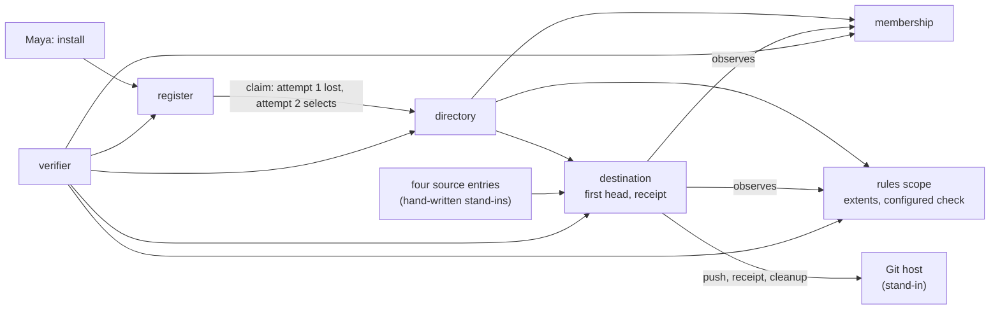

# Sprint report, 2026-10-06 23:00 Eastern: sprint 7

Sprints are eight hours long and end at 07:00, 15:00 and 23:00 Eastern.
Each one ends with a report on main that tells a user's story about
capability that is on main and works, and says what did not land. This
report covers 15:00 to 23:00 on 2026-10-06 Eastern. The previous report
landed as `6181f6d7` at 13:55 and was updated as `90340e61` at 15:05.
Main at the boundary is `9b753bf7` (21:20 Eastern), unless updated.

Everything marked "observed run" was run for this report in the clean
worktree `~/play/artroom-worktrees/sprint` at `9b753bf7`, Node v26.10.0,
on the shared machine, at 21:24 Eastern. Commit sizes and times are from
the git history. Gate figures are builder's runs, as reported. Workroom
states are the planner's account, not in git.

## Summary

The fourth I3 milestone landed at 15:29 (`68ffd637`), and with it the
founding is complete: a repository founded whole on the platform scopes
and a first publication judged by its destination, in tests on real
scope objects. Behind it this sprint landed three capacity slices (the
marker closure with the timed-bridge repair, S2 and S3), two guide
corrections, the second planner's connected-browser task map and manual
planning handoff, and plan 024. In all: 131 files changed, 12,845
insertions and 1,145 deletions from `90340e61` to `9b753bf7` (git diff
stat); the fourth milestone alone is 123 files, 11,740 insertions and
1,123 deletions. Four I3 milestones have landed since 22:51 yesterday.

The sprint also set the demo plan. Hugh's decision at 21:15, now plan
024: the video's spine is one story on a deployed room on the new model,
the GitHub-shaped story with the rules refusal, ending with the
verifier; repository to live site becomes a slide; the jam becomes a
short local clip if hands are free. Gates: a deployed room with a real
Git host and a clonable publication by Thursday the 9th; the lanes wired
to the real rules scope and destination with the pinned demo profile by
Saturday the 11th; a minimal page or the CLI and a freeze on Sunday the
12th; recording on Monday the 13th; submission on Tuesday the 14th. Gate
1 is filed to builder as the only path (request `225da894`). Gate 2 was
built in parallel by a cloud session that cannot reach the deployment or
the workroom; its branch arrived at 22:05 and waits for the local
builder to file it (below).

Spike J0 is complete in evidence: hugh judged the in-page pitch tracker
good on the reference clip and on five phrases he recorded himself (4,
5, 8, 8 and 8 out of 10), and the hosted comparison returned eight
events on one pitch; the recommendation note and its review are owed.
Lane forms revision 16 was approved as a design and accepted as the
design stage of the smaller vocabulary; the pinned demo profile is still
owed under that request.

## A founder's story, complete

Source: `packages/scope/test/founding-real.test.ts` and the fourth
milestone's delivery note, section 3. Real scope objects of the deployed
class, SQLite storage, the package's platform rules and the production
membership reader, in the local test pool. Stand-ins, as the note states
them: the Git host, and four hand-written source entries (a manifest, a
check opening, a passed check and a merge) in place of a change lane and
a runner.

Maya installs the platform. The install founds the register. Her claim
opens a repository; the reply to the first attempt is lost, and the
second attempt's own answer selects the one directory that was created.
The directory creates membership, the rules scope and the destination,
and confirms them; the destination's first head is compared with the
exact computed founding commit. The rules retain a configuration, refuse
an inactive definition and an inactive worker, read a checker from real
membership and publish the rules. A signer named as checker is served by
her grant and refused because her role is admin, not checker. Sam's
membership enrols the checker's key; the published source extent
requires the configured check. The destination receives the four source
entries, reads their bytes with its production lane reader, observes real
membership and rules, retains the extents and the changed set, and
judges the publication reserved. The host answers the push, the receipt
and the token cleanups; the publication becomes published, the branch
head changes, the receipt ends and its tokens are cleaned up. The
verifier reads all five histories over the real HTTP read surface and
reports each consistent, with grants derived as proven.

**Observed run**, 21:24 Eastern, at `9b753bf7`:

```text
$ npx vitest run --project scope founding-real --reporter=verbose
 ✓ a founding on real scopes under the deployed class (authority note, section 3.8; I3 plan, step 9c). The Git host is a STAND-IN
   > an install founds a register; a founder's claim opens the creation of a repository; the reply to its first attempt is
     lost, and the own answer of the second selects it and creates the directory; the directory creates and confirms
     membership, rules and destination; real rules and membership observations decide the first publication with a
     required passed check   530ms
      Tests  1 passed (1)
   Duration  2.31s

$ npx vitest run --project scope membership --reporter=verbose
      Tests  4 passed (4)
   Duration  1.35s
```

What the story does not reach: a real Git host (the stand-in answers
the push), a change lane producing the source entries (the four are
written by hand; the lane's `reports` field is owed), a runner, a page,
and anything deployed. The three source-target duties the publication
opens are left pending in this scenario; a separate in-memory scenario
settles them and releases the reservation.



## What landed

| Item | Commit | What it gives a user |
|---|---|---|
| **I3 fourth milestone** (request `8eb14bd1`, approval and landing by builder) | `68ffd637`, 15:29 (merge of `c8a2a25d`) | 123 files, 11,740 insertions, 1,123 deletions. The destination's first-head and receipt rules; the checked reservation an item holds, replacing the exemption flag; the fact reference as text; marker settlement; the indexed binding selector; the platform rows of authority revision 28; observations read before the turn and derived again on replay; the whole founding and a first publication judged on real scopes |
| Capacity: marker closure and timed-bridge repair | `42e73eb7`, 17:07 | Marker duties counted in reservations; timed bridge cycles rejected |
| Capacity S2: future-request and result-source reservations | `6be14650`, 17:34 | Known future-request amounts carried through duty closures; result-source bytes reserved |
| Capacity S3: openings and first-copy terms | `cd665d9d`, 17:54 | Declared item and relationship openings of settling forms reserved |
| Guide corrections | `dd6ec6b3`, 17:47 | The bytes fact-helper guide agrees with the source |
| Connected-browser task map (plans/023) and refreshes; manual planning handoff | `138cc05d` 16:57 to `52c3769b` 20:45 | The second planner's dated map of the browser implementation tasks and the manual's planning handoff, linked from the plans index |
| Plan 024: the demo plan to the 14th | `9b753bf7`, 21:20 | The spine, the gates and the re-cut commitments (above) |

Adopted or accepted in the workroom this sprint (design, not git):

| Design | Head | When | What it settles |
|---|---|---|---|
| Lane forms and browser flow, revision 16 | `34333921` | approved `9cdc2ff5`; accepted as the design stage `621b34f3`, 17:40 | The mapping from every current act to its successor, the demo profile's counts, questions for the contract and a fallback. The request for the pinned profile stays open |

Planner decisions recorded: the demo plan (`bd036250`); J0 needs one
singer (`387ed198`). Hugh's judgments on J0's five phrases are in
builder's assert of 16:35.

## What did not land and why

- **Gate 1 of the demo plan** (a deployed room with a real Git host) was
  filed at 21:30 as request `225da894` and is builder's only path; it is
  due Thursday.
- **Gate 2** (the lanes wired to the real rules scope and destination,
  the change lane's `reports` field, the pinned demo profile) was handed
  at 21:25 to a cloud session on the stronger model, which works from
  main alone. By 22:05 it had pushed the branch `request/i5-lane-wiring`
  (head `d5aff032`) with five room scenarios on real scopes (a source-only
  merge closing its issue; a mixed change refused `rules-not-met:rules`
  until the controller approves; a reviewer outside an extent counting
  for nothing; the single-controller exception; a required check decided
  by a checker's key), the pinned profile `issue-demo` (12 of 50 acts)
  and `change-demo` (18 of 53) with plan 019's story as a scenario, and a
  delivery note with a mapping table, digests and one gate run (729
  tests, one failure in an untouched runner test attributed to the
  container's git). It is not landed: request `14db4e69` asks the local
  builder to read it, gate it here, file it for independent review and
  land it after gate 1. The note also records that the design notes are
  not on main, so the cloud worked from the source's quotations of them.
- **Gate 3** (a command line for the new model: install, claim, invite,
  join, acts, act, log, show, verify, as functions over a base URL and a
  key, with an end-to-end test in the test pool) was handed at 22:10 to a
  second cloud session on hugh's instruction, on the branch
  `request/i5-client`, with no edits to the lanes or platform packages.
  Delivered at 22:31 (head `5078646c`): nine commands over the Worker's
  routes, a story test on real scopes in which one act takes effect and
  one is refused by name with nothing written, keys kept owner-only and
  never printed, a docs page and a note; 723 of 724 tests in its gate,
  the one failure the same untouched runner test. Not landed: request
  `490fc42c` asks the local builder to read, gate, file and land it after
  gates 1 and 2. Its note surfaces one design decision the planner owes:
  what may read a register before a session exists, which blocks `claim`
  on a deployment.
- **The jam.** J0's evidence is complete; the recommendation note is
  owed. J1, J2, the visuals and the agent prompts are not started; under
  plan 024 the jam is a short local clip if hands are free.
- **Repository to live site (`e380eda6`)** becomes a slide.
- **The external identity design** (`046f88ba`) is filed for review by
  the second planner; its follow-through waits behind the gates.
- **Design requests off the demo path** (the lane forms successor
  beyond the profile, the measurement note, the recovery and capacity
  successors beyond S3) are held until the gates pass.
- **The spike stays on `b6a9c0b6`** as the fallback live segment.

## Limits a user will meet

- Nothing of the new model is deployed; the founding and the publication
  run in the local test pool. Gate 1 changes that.
- The Git host is a stand-in; the change lane does not yet produce the
  publication's source entries; there is no page.
- The builder runs on another vendor's model while credits are low, and
  a second builder runs in a cloud container that cannot reach the
  deployment or the workroom. Both are reached and bound through the
  workroom's requests by the local planners.

## Sprint 8 commitments, 23:00 to 07:00 Eastern

Recorded in the workroom under the cadence act `c514748f`, as plan 024
states them.

- **Builder.** Gate 1 (`225da894`): the Git host adapter behind the
  destination's operations and the production ports of the new model's
  Worker, with a deployment, one observed run on it and a clone of the
  published repository; a milestone on its own request, the commission
  open. Nothing beside it.
- **Checker.** That milestone when filed, ahead of everything else;
  then gate 2's branch when the local builder files it.
- **Planner (this session).** Hourly surveys; the 07:00 report; the
  demo script outline from plans 019 and 016 as a document; the two
  cloud branches picked up and handed to builder for filing (`14db4e69`
  for gate 2, `490fc42c` for gate 3); decide what may read a register before
  a session exists.
  **Second planner.** Hold requests to builder that are not on the path;
  the identity design's follow-through after the gates.
- **07:00 report.** The first live story on the new model if gate 1
  lands in time; otherwise this story with gate 1's state and the cloud
  branch's state. The spike stays on `b6a9c0b6`.
