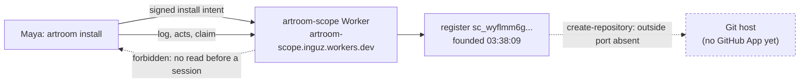

# Sprint report, 2026-10-07 07:00 Eastern: sprint 8

Sprints are eight hours long and end at 07:00, 15:00 and 23:00 Eastern.
Each one ends with a report on main that tells a user's story about
capability that is on main and works, and says what did not land. This
report covers 23:00 on 2026-10-06 to 07:00 on 2026-10-07 Eastern. The
previous report landed as `28892e99` at 22:40 and was updated as
`54cc1bd2` at 23:08. Main at the boundary is `54cc1bd2`. The sprint was closed early, at
05:33 Eastern, at hugh's request ahead of a network interruption; the
report is landed as drafted at 04:45, with the state at that time.

Everything marked "observed run" was run for this report on the shared
machine, Node v26.10.0, from planner worktrees under the scratch directory
at the heads named; the deployment runs were made against the account's
standard hostname. Commit sizes and times are from the git history.
Workroom states are the planner's account, not in git.

## Summary

Nothing landed on main this sprint. What happened instead is the sprint's
whole story: the demo plan's three gates were built in parallel, two of
them by cloud sessions that cannot reach the workroom, and the first act
of the new model took effect on a real deployment at 03:38 Eastern.

- **Gate 1** (a deployed room with a real Git host): builder's branch
  `request/demo-git-host` holds the Git host adapter, the credential
  store and the production wiring, gated locally at 747 tests (builder's
  run at `a69c90c9`). Builder paused at 00:00 and did not resume. At
  03:36 the planner deployed the new model's Worker from that branch to
  the account's standard hostname and at 03:38 founded a register on it
  with the cloud-built command line: the first live act. The next act, a
  claim, is refused on reading, because the deployed class answers no
  read before a session exists; the rule that fixes it is decided
  (`61cc5e50`, made precise at `c6499e91`) and not yet built. The real
  Git host is blocked on one thing only hugh can do: create the
  organization's GitHub App (builder's steps are in `827d4c7c`).
- **Gate 2** (the lanes wired to the real rules scope and destination,
  the change lane's `reports` field, the pinned demo profile) was
  delivered by a cloud session at 22:05 on `request/i5-lane-wiring`.
- **Gate 3** (a client) was delivered twice by cloud sessions: the
  command line at 22:31 on `request/i5-client`, and the story page with
  screenshots at 23:08 on `request/i5-page`.
- **The jam's spike J2** was delivered by a cloud session in the jam
  repository at 23:06 on `spike/j2-riffing`; the planner rendered its
  47-second clip locally for hugh to hear.

Four cloud deliverables arrived within two and a half hours of their
prompts, each with a delivery note, a gate run and a branch on GitHub;
none is landed, because landing needs the local builder's reading, a
gate on this machine, independent review and the implementer's signature.
Their requests to builder are `14db4e69`, `490fc42c` and `8942549e`.

## A founder's first act on a deployed room

Source: builder's branch `request/demo-git-host` at `9c0f5890`
(`packages/scope/wrangler.jsonc`, `packages/scope/src/worker.ts`, the Git
host adapter and the credential store), and the cloud command line on
`request/i5-client` at `5078646c` (`packages/cli`). Neither is on main.

Maya deploys the platform. The Worker `artroom-scope` carries one Durable
Object class with SQLite storage, a deployment identifier and a session
secret; no GitHub settings are set, so the outside port is absent and the
production host operations refuse, as the design says they must. She
reads a scope that does not exist and gets a plain refusal. Then she
installs: one signed `install` intent founds the register, with her
operator key as the one founder key, kept owner-only on her machine. The
register answers with its scope id. That is the first act of the new
model to take effect on a deployment.

Then she asks the register for its acts, its history, and claims a
repository. Each is refused `forbidden`: the deployed class answers a
read only to a session, and a session is issued by membership, which the
directory names, which the claim would create. The verifier, asked over
the live read surface, cannot read the register's history and stops. The
rule that lets the operator and the claim key read what they signed
within the authority window is decided and, by 04:00, built by a fifth
cloud session on the branch `claude/i5-signed-read-n0jfnf` (head
`fdfe9dd0`, 751 of 752 tests): a signed read beside a session, a client
helper, the verifier's printed refusal, and tests on real registers. It
is not deployed and not landed; its note found that the founder's key
also needs to read the scopes the claim caused (the directory, and the
membership, rules scope and destination it creates), which the planner
decided as an extension (`70a0680e`). Builder folds both into gate 1.

**Observed runs**, Eastern time, planner's worktrees:

```text
# 03:36:50  deploy, from request/demo-git-host at 9c0f5890, wrangler 4.147.0 pinned, run from the scratch directory
Total Upload: 1358.79 KiB / gzip: 318.80 KiB
Worker Startup Time: 11 ms
  env.SCOPES (DeployedScope)   Durable Object
  env.DEPLOYMENT               Environment Variable
Uploaded artroom-scope (2.21 sec)
Deployed artroom-scope triggers (0.66 sec)
  https://artroom-scope.inguz.workers.dev
Current Version ID: dfe6bd8f-9a69-412a-b46d-f917511e89fd
Success! Uploaded secret SESSION_SECRET

# 03:36:57  first reads
GET /v0/scopes/nonesuch/summary -> 404 0.133s {"error":"not-found"}
GET /                           -> 500 0.253s (the root path is not a route; the provider's error page)

# 03:38:09  install, from request/i5-client at 5078646c, tsx 4.21.0 pinned, ARTROOM_HOME in the scratch directory
$ artroom install https://artroom-scope.inguz.workers.dev --namespace generalbusiness-ai
Installed: register sc_wyflmm6g43hd4jqzt7p4sneb2j47phpqtqjmajrqrwsg32gek5ha.
The operator key key_uw3TqvKNCLDeMzENacmTxZ0YRdK9igI5FWjyum1DrDs is kept in the config directory, readable only by you. It is the one founder key.
real 2.408s

# 03:38:24  the next acts
$ artroom log sc_wyflmm6g... --limit 5
Cannot read the history of sc_wyflmm6g...: forbidden.
$ artroom acts sc_wyflmm6g...
Cannot read sc_wyflmm6g...: forbidden.
$ artroom claim demo-2026-10-07 --handle @hugh
Cannot read sc_wyflmm6g...: forbidden.
$ artroom verify sc_wyflmm6g...
SourceError: the history of sc_wyflmm6g... cannot be read   (uncaught; a client defect)
```

Stand-ins and limits: the deployment is the planner's, made to continue
builder's work under hugh's three-hour rule, and builder may replace it;
the command line's own runner is `node --experimental-transform-types`,
which refused one construct on this machine's Node, so the pinned `tsx`
ran it; nothing was published to a registry; the old spike at `b6a9c0b6`
is untouched.



## What the cloud delivered, and where it waits

| Deliverable | Branch and head | What it holds | Cloud gate | Request to builder |
|---|---|---|---|---|
| Gate 2: lanes on the real rules scope and destination; demo profile | `request/i5-lane-wiring` `d5aff032` | Five room scenarios W1 to W5 on real scopes (a source-only merge closing its issue; a mixed change refused `rules-not-met:rules` until the controller approves; a reviewer outside an extent counting for nothing; the single-controller exception; a required check by a checker's key); the change lane's `reports` field; `issue-demo` (12 of 50 acts) and `change-demo` (18 of 53) pinned, with plan 019's story as a scenario; a mapping table; new digests | 729 tests, 1 failure (an untouched runner test under the container's git 2.43) | `14db4e69` |
| Gate 3: the command line | `request/i5-client` `5078646c` | `packages/cli`: install, claim, invite, join, acts, act, log, show, verify over the Worker's routes; a story test on real scopes; keys owner-only; `docs/cli.md` | 724 tests, the same 1 failure | `490fc42c` |
| Gate 3: the story page | `request/i5-page` `4440459a` (on both branches above) | `packages/page`: room, issue, change (reviews by extent, plan 016's states), rules and settings screens; an acts panel derived from the definition and the grant; refusals with reasons; three screenshots committed under `packages/page/test/screenshots`; `docs/page.md` | 737 tests, the same 1 failure | `8942549e` |
| Jam spike J2 | jam repository `spike/j2-riffing` `09f46e1` | The record with the lookahead rule; the interpretation of the judged theme (105 bpm, a key, a sixteenth grid); three deterministic players in the order synth, percussion, lead with prompt files; an offline renderer; a 20-bar clip script; a white-stage page with figures and captions; 30 tests | 30 of 30, run locally by the planner | none (no workroom there); recorded `8fac3fd7` |

Two facts from the cloud notes that matter beyond the branches: the
design notes (lane forms, contract, authority) are not on main, only on
local branches, so the cloud worked from the source's quotations of them;
and no client can open a lane until the directory reads a definition's
bytes from the rules scope itself (decided at `732d83e6`: a client never
carries them).

## What landed

Nothing on main. Decisions recorded in the workroom this sprint: the
register-read rule (`61cc5e50`, precise at `c6499e91`); three page
findings decided (`732d83e6`); gate 1's sequencing and the GitHub App
prerequisites answered (`c6499e91`); the deployment (`65a64e03`) and the
first live act (`4bc51bde`).

## What did not land and why

- **Gate 1.** Builder's branch is gated locally and the Worker is
  deployed, but no real-host run exists: the organization's GitHub App is
  hugh's to create, and builder's 22:16 request for it (`827d4c7c`) went
  unread until 02:40 because the planner's priority-chat inbox was full
  and builder's updates were rejected. Builder's last act was at 00:00;
  the planner continued under hugh's rule from 03:35. Thursday's gate is
  at risk by about the time lost tonight.
- **The three cloud branches** wait for builder to read, gate here, file
  and land them after gate 1, in order.
- **The jam clip** waits for hugh's ear and for builder to land the
  branch in the jam repository together with the still-uncommitted J0
  work there.
- **The spike stays on `b6a9c0b6`.**

## Limits a user will meet

- The deployed room accepts an install and nothing more until the
  signed-read rule is built; then a claim can create the directory, but
  the destination's host operations refuse until the GitHub App's
  settings are given to the Worker.
- The command line and the page run on the new model only from their
  branches; main has neither.
- Two builders now work beside the local one: cloud sessions that cannot
  reach the workroom, bound through requests the planner files.

## Sprint 9 commitments, 07:00 to 15:00 Eastern

Recorded in the workroom under the cadence act `c514748f`, within plan 024.

- **Hugh.** Create the organization GitHub App as `827d4c7c` states
  (Contents and Administration read and write; installed on all
  repositories; the App ID, installation ID and PKCS8 key through the
  local secret handoff). Listen to the jam clip.
- **Builder.** Gate 1 first: fold the signed-read branch
  `claude/i5-signed-read-n0jfnf` into `request/demo-git-host` and add the
  cause-chain reads (`70a0680e`); the planner's deployment taken over or
  replaced, a claim
  and a publication on it against the stand-in host, then the real host
  when the App exists; file it under `225da894`. Then read, gate here,
  file and land `request/i5-lane-wiring`, `request/i5-client` and
  `request/i5-page` in that order; make `verify`'s refusal a printed
  line. Report in the sprint-cadence thread and as asserts, not by
  priority chat.
- **Checker.** Gate 1's milestone when filed; then the three branches.
- **Planner (this session).** Hourly surveys; the 15:00 report; the demo
  script outline; keep continuing gate 1 in the planner's worktree while
  builder is silent. **Second planner.** Hold off-path requests; the
  identity design's follow-through after the gates.
- **15:00 report.** If the signed-read rule and a claim land on the
  deployment, a founder's story that reaches the directory, membership
  and the rules scope live; otherwise this story with the state of gate 1.
