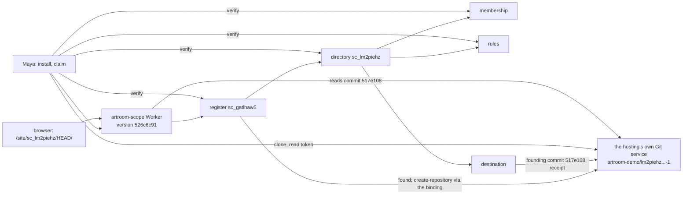

# Sprint report, 2026-10-07 15:00 Eastern: sprint 9

Sprints are eight hours long and end at 07:00, 15:00 and 23:00 Eastern.
Each one ends with a report on main that tells a user's story about
capability that is on main and works, and says what did not land. This
report covers 07:00 to 15:00 on 2026-10-07 Eastern. The previous report
landed as `5af9abde` at 05:33 (sprint 8, closed early). Main at the
boundary is `e5c641bd` (plan 025, 10:01), unless updated.

Everything marked "observed run" was run for this report on the shared
machine, Node v26.10.0, from planner worktrees under the scratch directory
at the heads named, against the deployment at the account's standard
hostname; the command line ran with the pinned `tsx` 4.21.0, and the
Worker was deployed with the pinned `wrangler` 4.147.0 from a scratch
directory. Times are Eastern. Workroom states are the planner's account,
not in git.

## Summary

One document landed on main: plan 025, published pages (`e5c641bd`). No
source landed. The sprint's story is nevertheless the largest step of the
new model so far: the founder's whole path ran live on a deployment, twice
over, on both Git hosts.

- **Gate 1, GitHub.** With the organization App hugh created at 08:11 and
  a creation token he made at 08:38, a founder installed, claimed, and the
  register created a repository on GitHub; the destination pushed the
  founding commit, which the planner cloned (08:27, and again at 09:23
  with the live-operations fixes, where install, settings and claim ran
  back to back and `verify` reported four scopes consistent).
- **Gate 1b, the room's own host.** Hugh decided at 08:55 that the demo's
  repositories live on the hosting's own Git service, reached from the
  Worker through a binding with no outside credential, with GitHub as the
  secondary, linked host. A cloud session delivered the adapter by 09:12;
  at 09:55 a founder installed on that host and claimed, the repository was
  created and its founding commit pushed in ten seconds, and the planner
  cloned it with a read token.
- **The first page.** Plan 025 (published pages) was written and landed at
  10:01; a cloud session delivered a GitHub Flavored Markdown renderer and
  the route `/site/<directory>/<ref>/<path>` by 10:40; after a live
  finding about the host's packs was repaired, the first page of a room's
  repository was served live at 11:39.
- **Clone by the room's own token, and a whole room verified.** The
  destination's read rule decided this morning was delivered by a cloud
  session at 13:30; with it deployed, a fresh room was founded at 14:19,
  `artroom clone` took a read token from the room and cloned the
  repository at 14:22, and `artroom verify` reported all six scopes of the
  room consistent. Builder's own gate 1 witness had already verified six
  scopes consistent on its review Worker at about 12:20, with a clone by an
  operator-issued token; the 14:22 run is the first on the demo deployment
  with a token the room issued.
- **Gate 1 is filed.** Builder's expanded candidate `7f467c21` under
  `225da894` folds the cloud deliveries; checker's source verdict at 13:07
  is changes requested with two findings, named below. Filed, not landed.
- **The jam.** Hugh heard the J2 clip ("great"), asked for a rockstar
  lead, heard it ("awesome"), and asked for a mood phrase that steers the
  whole band. Both were delivered by one cloud session in the jam
  repository by 10:55, and the planner rendered the clips.

Six cloud sessions ran this sprint under hugh's renewed authorization
(given at 08:35 for this sprint), each from one self-contained prompt and
each delivering a branch with a note and a gate run within fifteen to
forty minutes. Their branches are not landed: builder reads, gates, files
and lands them in order, and the first is inside the gate 1 candidate.

## A founder's room on its own host

Source: the merged planner branch `planner/i5-demo-host` at `87ba6faba`
(the gate 1 branch with the cloud deliveries: the own-host adapter
`c7955c39`, the live-operations fixes `31cd3557`, read tokens and clone
`2cba4677`, the site renderer `e380dcf5`, the destination read `87ba6fab`), deployed as
Worker versions `8093e834` (09:55), `526c6c91` (11:38) and `416b5394` (14:18). Nothing of it is on main.

Maya deploys the platform with the Git service binding. She installs,
naming the host and a namespace: one signed `install` founds the
register. She pins the register's id in the Worker's one setting for that
host. She claims a repository. The register's `found` takes effect; the
operations driver asks the host to create the repository, with no
credential beyond the binding; the directory, membership, rules scope and
destination are created and confirmed; the destination computes the
founding commit and pushes it, and its receipt, through the gateway's one
grant; Maya is seated as the first admin, with an inbox. She asks the
room for a read token: one act on the destination, answered by the host,
its plaintext kept privately and read once by her session, and `artroom
clone` clones with it. The verifier, over the live read surface, folds
every scope of the room from genesis and reports each consistent. Then
she opens the room's page: the Worker reads the published commit from the
host and renders the index.

**Observed runs**, planner's worktree, home directories in the scratch
directory:

```text
# 09:55:41  deploy with the binding (the namespace artroom-demo is created by this deploy)
Current Version ID: 8093e834-197f-44b4-bd75-80215a8fb846

# 09:55:53
$ artroom install https://artroom-scope.inguz.workers.dev --host artifacts --namespace artroom-demo
Installed: register sc_gatlhaw5upazwk4vubzeho2hcxmoza2mvqnpnz2wcsck6oxlnuca.
# 09:55:56  ARTIFACTS_CONFIG set: registerScope, namespace, host, maxBytes 8388608, credentialIdentity
# 09:55:57
$ artroom claim demo-own-host --handle @hugh
Claimed demo-own-host: directory sc_lm2piehz..., membership sc_5hfk5tpy..., rules sc_knkga4d5..., destination sc_ipwfgr6w...; each created and confirmed.
You are @hugh, an admin, on key key_M5p1...; your inbox is sc_wgxtpfct....
# 09:56:07  returned; the repository artroom-demo/lm2piehz...-1 was created at 13:56:00Z (host's record)
# 09:56:26  with a read token issued from the service
$ git ls-remote https://<service>/git/artroom-demo/lm2piehz...-1.git
517e108199a4c292e6f7e2457493828600ae0986  HEAD
2bc624fa2766a77e08cf706733dee94b5dd03263  refs/artroom/receipts/e8dc5407...
517e108199a4c292e6f7e2457493828600ae0986  refs/heads/main
$ git clone ... ; git log
517e108 2026-10-07 13:56:03 +0000 artroom Found this repository.
$ artroom verify register | directory | membership | rules
Result: consistent, for the mode, target, coverage and trusts stated below.   (each of the four)
$ artroom verify destination
Result: incomplete: ... the source holds no entry 6 of sc_ipwfgr6w...

# 11:38  redeploy with the renderer and the pack repair; 11:39:46
$ curl -D - https://artroom-scope.inguz.workers.dev/site/sc_lm2piehz.../HEAD/
HTTP/2 200   content-type: text/html; charset=utf-8   cache-control: public, max-age=60
etag: "517e108199a4c292e6f7e2457493828600ae0986.4949615abd7d7388e6e1a802"
$ curl .../site/sc_lm2piehz.../HEAD/README.md   -> 404  not-found: no file is at that path
$ curl .../site/sc_lm2piehz.../nonesuch/        -> 404  ref-not-found: no branch or tag has that name

# 14:18  redeploy with the destination read (version 416b5394); a fresh room, home artroom-home-7
# 14:19:31  install --host artifacts --namespace artroom-demo -> register sc_y6fhyph3...
# 14:19:32  ARTIFACTS_CONFIG pinned to it;  14:19:33  claim demo-clone --handle @hugh
Gave up waiting for the directory after 120 reads. ... run artroom claim demo-clone again to go on waiting
# the host created artroom-demo/pjpl7g2x...-1 at 18:21:44Z after the register object restarted
# 14:22:12  claim demo-clone again (no second found)
Claimed demo-clone: directory sc_pjpl7g2x..., membership sc_vlfh2myo..., rules sc_i2gegpd7..., destination sc_ezngnqra...; each created and confirmed.
# 14:22:34
$ artroom clone <dir>
Read token: sc_ezngnqra...:8, until 2026-10-07T19:22:36.226Z.
Remote URL: https://<service>/git/artroom-demo/pjpl7g2x...-1.git
Cloned into <dir>.          e1a3edc 2026-10-07 18:21:48 +0000 artroom Found this repository.
# 14:22:38
$ artroom verify register | directory | membership | rules | destination | inbox
Result: consistent, for the mode, target, coverage and trusts stated below.   (each of the six)
# builder's gate 1 witness recorded the same six consistent at about 12:20 on its review Worker, with an operator-issued token
```

Stand-ins and limits: on the 09:56 room the clone's read token was issued
by hand with the account's tool, and after the 14:18 deploy that room
refuses `read-token` as unauthorized and its verification reports
mismatch, because the platform definitions changed (the new act and its
role row) with no change of their version, so a room founded before the
change is judged by code that no longer matches what its genesis pinned;
a decision on definition versions is owed, and the demo founds its rooms
after the change; the claim on the fresh room waited two minutes for the
register object's restart after its setting changed, and resumed as
designed; the page is the index of an empty founding tree, because no change has been published to the
repository yet, which is gate 2 work; the deployment is the planner's;
the first register on this host (`sc_abgztv2y`, 08:17) and its GitHub
repository are strays, created before the settings existed, for hugh to
delete; the spike at `b6a9c0b6` is untouched.



## What the cloud delivered this sprint

| Deliverable | Branch and head | What it holds | Live | Request |
|---|---|---|---|---|
| Live-operations fixes | `claude/i5-live-ops-delivery-ttb16z` `31cd3557` | A driver pass on the first turn after a restart; entries read by the cause chain and a register read by a membership session; `claim` resume with `--again`; `verify` by signed reads; `docs/deploy.md` | Run at 09:23 on GitHub: install, settings and claim back to back; four scopes consistent | `4d8d543f`; inside the gate 1 candidate |
| The room's own host (gate 1b) | `claude/artifacts-host-adapter-pxbx8y` `c7955c39` | The provider over the binding, its wiring under one setting pinned to a register, routing by the register's recorded host, shared host checks, `docs/hosts.md` | 09:55, above | inside the gate 1 candidate |
| Read tokens and clone | `claude/read-token-credential-flow-6vlu8d` `2cba4677` | The destination's `read-token` act and `mint-read` operation on each host, one-time custody, the credential route, `artroom clone` and `artroom remote` | 14:22, above | `48407a70` |
| Site renderer (plan 025, section 6) | `claude/i5-site-renderer-39k7iz` `e380dcf5` | A GitHub Flavored Markdown converter with no dependency, conformance stated by its own test at 672 of 672 specification examples in the specification's mode (the served route's parity is not yet shown), the `/site` route with index, links, images, refusals by name, ETag by commit; the pack read repaired by the host's real bytes | 11:39, above | `a2317893` |
| Destination session read | `claude/destination-read-authorization-zu9wlt` `87ba6fab` | A register whole to its signing keys and sessions; a room's scopes whole to its membership's session; the story reads the destination; the note is not pushed | 14:22, above: clone by the room's token; six scopes consistent | with `48407a70` |
| Jam: rockstar lead and the mood phrase | jam repository `claude/lead-rockstar-attitude-awtqym` `5f0c458` | The lead's brief and player, glides and vibrato in the renderer, mood entries read through a lexicon into style, two reference moods, two clips | Clips rendered: `j2b-clip.wav`, `j2-mood-clip.wav` | none; recorded `8e9df12b`, `7cfb3052` |

Decisions recorded this sprint: gate 1 does not add the native hold path
(`72ccc867`); reads by cause chain extend to entries, a restart pass,
claim resume (`6b6c6400`); the demo's repositories live on the room's own
host (`97821ea7`); a register and a room's scopes answer their whole
history to the keys and sessions named (`ca8ad1cf`); design request R5,
propose-from-branch and the offline model (`af0086ff`, after gate 2); the
host's upload-pack answer ends with a flush packet (`78121cb6`, repaired).

## What landed

| Item | Commit | What it gives a user |
|---|---|---|
| Plan 025: published pages | `e5c641bd`, 10:01 | The nouns, verbs and invariants of a documentation site from a room's repository; what is missing; packaging as an application preset and later as a published repository; the order of work |

## What did not land and why

- **Gate 1** is filed as the expanded candidate `7f467c21` (the Git host
  adapter, the own host, the live-operations fixes, the pack repair).
  Checker's verdict at 13:07 is changes requested on two findings: the
  `join` command signs a new join on every retry and saves nothing until
  the end, so a lost answer cannot be resumed; and the symbolic-link walk
  of the GitHub inspection treats a finite repeated expansion as a cycle.
  Builder repairs and refiles.
- **The cloud branches** for clone, the renderer and the destination read
  wait for builder's reading, a gate on this machine, filing and
  independent review, after gate 1 lands.
- **Rooms founded before 14:18 on this deployment** refuse the new
  `read-token` act and fail verification, because the definitions changed
  without a version change (above). Decision owed to the planners, repair
  to builder.
- **The jam branches** (J0, J2, the rockstar lead and the mood phrase) are
  in the jam repository and not landed there; hugh has heard two of the
  three clips.
- **The demo script outline** (plans 019 and 016) is still owed by the
  planner.

## Limits a user will meet

- Nothing of the new model is on main; everything above runs from the
  merged planner branch on the planner's deployment.
- Repositories on the room's own host are read with a token or not at all;
  a member gets one from the room with `artroom clone`; a page is public
  to whoever holds the room's address.
- A page has content only after a change is published to the repository,
  which needs the lanes (gate 2).

## Sprint 10 commitments, 15:00 to 23:00 Eastern

Recorded in the workroom under the cadence act `c514748f`, within plan 024
as re-cut on 2026-10-07.

- **Builder.** Repair the two findings and land gate 1 (`225da894`) with
  the expanded candidate. Then, in order, read, gate here, file and land:
  the destination read, read tokens and clone, the site renderer. Then
  gate 2's lane wiring (`14db4e69`).
- **Checker.** Gate 1's refile; then the three branches in that order.
- **Planner.** Decide definition versions (a changed definition carries a
  new version, or replay uses retained bytes); the demo script outline as
  a document; hourly surveys; the 23:00 report. **Second planner.** Hold
  off-path requests; the identity design's follow-through after the gates.
- **Hugh.** Hear the mood clip; say whether cloud sessions continue past
  this sprint; delete the two stray repositories when convenient.
- **23:00 report.** A member's story: the founder invites, a member joins,
  clones by the room's token and sees the page, run live on the
  deployment; and gate 1's landing if it lands.
