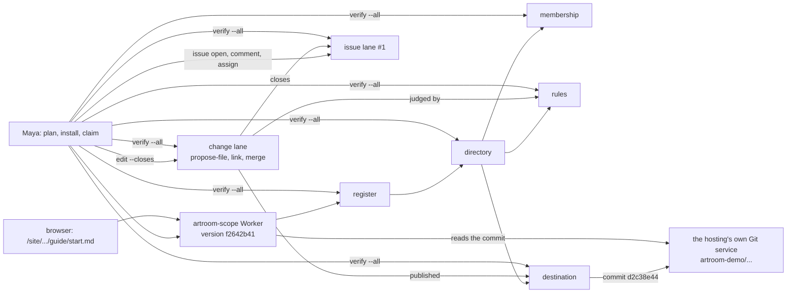

# Sprint report, 2026-10-07 23:00 Eastern: sprint 10

Sprints are eight hours long and end at 07:00, 15:00 and 23:00 Eastern.
Each one ends with a report on main that tells a user's story about
capability that is on main and works, and says what did not land. This
report covers 15:00 to 23:00 on 2026-10-07 Eastern. The previous report
landed as `e43bba65` at 14:24 and was corrected as `d158cbfe` at 15:35.
Main at the boundary is `cf4e41e2` (gate 1, 20:57), unless updated.

Everything marked "observed run" was run for this report on the shared
machine, Node v26.10.0, from planner worktrees under the scratch directory
at the heads named, against the deployment at the account's standard
hostname; the command line ran with the pinned `tsx` 4.21.0 and the Worker
was deployed with the pinned `wrangler` 4.147.0 from a scratch directory.
Times are Eastern. Workroom states are the planner's account, not in git.

## Summary

Gate 1 landed. At 20:57 builder's expanded candidate reached main as
`cf4e41e2`: the Git host adapter for GitHub, the room's own Git host, the
live-operations fixes, the pack repair and builder's own repairs of
checker's two findings; 124 files and 13,790 insertions over the demo
script draft, which landed at 18:51 as `6426b66c`. So the founder's path
of the 15:00 report is now capability on main. Off main, the sprint closed
the gap between the demo script and what runs: by 21:16 every shot of the
script's middle ran live from the command line on the room's own Git host,
in eighty seconds, start to finish.

- **The member's path** (17:35): the founder invites, a member joins on a
  second device, clones by a token the room issued, verifies, and loads
  the page; eighteen seconds.
- **Edit a page** (19:50): a fresh room founded at the new definition
  versions shows its founding README; the admin publishes the rules; an
  edit of README.md is proposed, judged, published by the room and shown
  on the page in ten seconds; a maintainer's edit of AGENTS.md is refused
  by name, the admin approves on that extent, the maintainer's merge
  publishes; a bad path is refused; clone shows three commits.
- **Issues, the verifier, and no waiting** (21:14): `artroom install
  --plan` pins the register before it is founded, so the claim no longer
  waits two minutes; an issue is opened, commented and assigned; an edit
  with `--closes` publishes and closes it; `artroom verify --all` reports
  eight scopes consistent.
- **The story page** (21:10) is served from the Worker at `/page/`, with
  screenshots of the issue, the refused change, the published change and
  the rules view.
- **Gate 1 landed** at 20:57 after a long day: checker asked for two
  changes at 13:07; builder was silent until 18:34; the planner repaired
  both under the three-hour rule at 16:50; builder returned, repaired them
  its own way with the invitation secret kept out of the public config,
  gated, refiled and landed. The sprint's first commitment is met.

Nine cloud sessions ran this sprint under hugh's authorization, each from
one prompt, each delivering a branch with a note and a gate run in twelve
to forty minutes. Their work is merged, in order, on the planner's branch
`planner/i5-demo-host`, which is deployed and is the reference for
builder's landings. Nothing of it is on main.

## A member's day in a room

Source: `planner/i5-demo-host` at `67fe67f9` (the gate 1 branch with the
cloud deliveries merged), deployed as Worker versions `b905dfe1` (19:47),
`167de28d` (21:10) and `f2642b41` (21:13). Of it, main at `cf4e41e2` holds
the founder's path: install and claim on either host, the founding commit
pushed, signed reads, the restart pass, claim resume, verify by signed
reads. The member's path, edit, issues, the page and the planned install
are not on main.

Maya runs `artroom install --plan`, which prints the register her signed
install will found. She pins that id in the Worker's host setting, runs
`artroom install --planned`, and claims a room; in nine seconds the host
holds the repository and its founding commit, whose README the page
already shows. She publishes the rules and activates the issue and change
definitions. She opens an issue, comments, assigns it to herself, and
runs `artroom edit guide/start.md --file start.md --closes #1`: the room
proposes the change, judges it by the rules, publishes a commit, closes
the issue, and the page serves the file. `artroom issues` shows the issue
closed. `artroom verify --all` folds the register, the directory,
membership, the rules scope, the destination, both lanes and her inbox
from genesis and reports each consistent.

Sam gets an invitation link from Maya, joins on his own machine, sees
what a member may do, clones by a token the room issues him, and edits
AGENTS.md: the room refuses the merge by name, because that folder's
extent needs an approval; Maya approves on that extent and Sam's merge
publishes.

**Observed runs** (planner's worktree, config directories in the scratch
directory):

```text
# 21:14:42  home 11, Worker f2642b41
$ artroom install --plan https://artroom-scope.inguz.workers.dev --host artifacts --namespace artroom-demo
Planned: register sc_knpztzw6..., under platform:register@2, on host artifacts, namespace artroom-demo. ...
# 21:14:44  ARTIFACTS_CONFIG pinned to that id
# 21:14:46
$ artroom install --planned
Installed: register sc_knpztzw6..., under platform:register@2, as planned.
# 21:14:48
$ artroom claim demo-issues --handle @hugh
Claimed demo-issues: directory sc_5bppo74a..., membership ..., rules ..., destination ...; each created and confirmed.   (returned 21:14:57)
# 21:14:57  act publish on rules (first extents); act activate change and issue definitions: took effect
# 21:15:21
$ artroom issue open --title "Add a getting-started page" --body "A page that says how to clone and edit."
Opened issue #1: Add a getting-started page. Its lane is sc_e4spqlmy....
$ artroom issue comment sc_e4spqlmy... "I will take this."        Commented: entry sc_e4spqlmy...:2
$ artroom issue assign sc_e4spqlmy... @hugh                        Assigned: entry sc_e4spqlmy...:3
# 21:15:28
$ artroom edit guide/start.md --file start.md --closes sc_e4spqlmy...
Proposed guide/start.md (53 bytes) as change sc_ggnbfbtd..., version 5.
Linked: when it is published, the change sc_ggnbfbtd... closes issue #1 (sc_e4spqlmy...).
Published: commit d2c38e4424a4bce90835e5fc71f06feddebf24df, by the merge sc_ggnbfbtd...:8.
Page: https://artroom-scope.inguz.workers.dev/site/sc_5bppo74a.../HEAD/guide/start.md
# 21:15:37
$ artroom issues
#1  closed (completed)  Add a getting-started page; assigned to @hugh; lane sc_e4spqlmy...
1 issues, 0 open.
# 21:15:39
$ artroom verify --all
register sc_knpztzw6..., entry 3: consistent.
directory sc_5bppo74a..., entry 13: consistent.
membership sc_veyxq27e..., entry 4: consistent.
rules sc_stxvxrwh..., entry 6: consistent.
destination sc_m3u3w2xj..., entry 17: consistent.
lane sc_e4spqlmy..., entry 5: consistent.
lane sc_ggnbfbtd..., entry 12: consistent.
inbox sc_lgabiajo..., entry 1: consistent.
All consistent: 8 scopes.
# 21:16:01
GET /site/sc_5bppo74a.../HEAD/guide/start.md -> 200   "Clone the room, then edit a page."

# 19:50  home 9 (admin) and home 10 (maintainer), Worker b905dfe1, room sc_7zed42be
$ artroom edit README.md --file README.md
Proposed README.md (50 bytes) as change sc_jje3epr4..., version 5.
Published: commit 1e2311fd..., by the merge sc_jje3epr4...:6.        (the page shows the text at 19:50:53)
$ artroom edit AGENTS.md --file AGENTS.md                            (as the maintainer)
Not published: the merge sc_l6rsjf6k...:6 is refused, rules-not-met:rules. The change ... stays open at version 5.
$ artroom act review-verdict --on sc_l6rsjf6k... --set manifest=5 --set verdict=approve --set extent=rules   (as the admin)
Took effect: entry sc_l6rsjf6k...:9
$ artroom merge sc_l6rsjf6k...                                       (as the maintainer)
Published: commit ff2d4dc1..., by the merge sc_l6rsjf6k...:10.
$ artroom edit ../x.md --file README.md
Not published: the merge ...:6 is refused, path-invalid. ...
$ artroom clone <dir>; git log --oneline
ff2d4dc Write AGENTS.md.   1e2311f Write README.md.   2b1a0fa Found this repository.

# 17:35  home 7 (founder) and home 8 (member), Worker 416b5394, room sc_pjpl7g2x
$ artroom invite @sam --role member                   Invited @sam as member: invitation ...:5, until 2026-10-08T21:35:46Z.
$ artroom join <link>                                 Joined as @sam on key key_57KS...; Your inbox: sc_ewnlavk3....
$ artroom clone <dir>                                 Read token: ...:10, until ...; Cloned into <dir>.   e1a3edc Found this repository.
$ artroom verify membership | destination | inbox    consistent (each)
GET /site/sc_pjpl7g2x.../HEAD/ -> 200                 (18 seconds from invite to page)
```

Stand-ins and limits: the deployment is the planner's, from a branch no
one has landed; rooms founded on this deployment before 14:18 are judged
by the old definitions and refuse the new acts, as the definition-version
delivery intends, and the demo founds fresh rooms; the planner has not yet
driven the story page in a browser against the deployment, only its
route and its recorded-answer screenshots; the old spike at `b6a9c0b6` is
untouched.



## What the cloud delivered this sprint

| Deliverable | Branch and head | What it holds | Live | Request |
|---|---|---|---|---|
| Destination session read | `claude/destination-read-authorization-zu9wlt` `87ba6fab` | A register whole to its signing keys and sessions; a room's scopes whole to its membership's session (`ca8ad1cf`) | 14:22: clone by the room's token; six scopes consistent | with `48407a70` |
| Edit a page | `claude/edit-page-command-lane-kwzyx4` `5439f8f1` | `propose-file` in the lanes and the demo profile; the destination judging and writing a one-file manifest and the edit commit; `artroom edit` and `merge` | 19:50, above | `50b608c8` |
| Definition versions | `claude/definition-versions-readme-to67yk` `f4859a3d` | Every definition's @1 restored to main's content, today's changes as @2, the version pinned at genesis, the command line founding at the newest, a founding README at @2 | 19:50, above | `9be26ef7` |
| Demo script draft | `claude/demo-script-draft-2w895f` | Fifteen shots in 6:30, the fallback, the recording-day checklist, the sentences not to say | landed as `6426b66c` | none |
| Story page | `claude/story-page-edit-command-j0clah` `6b1e3509` | The page merged forward and served at `/page/` from the Worker; repaired data functions; screenshots | 21:10: `/page/` 200 | `91bd9bf0` |
| Issues and verify --all | `claude/issue-edit-page-commands-65qhn7` `2c702757` | `artroom issue` commands, `--closes`, `verify --all`; one owed cause, an intermittent unrelated test after its scenario | 21:15, above | `0716158c` |
| Pin before install | `claude/edit-page-delivery-pq1w81` `9bae1b44` | `install --plan` and `--planned`; settings read on every call; a refused attempt resent once the port accepts | 21:14, above | `da1a2f02` |

Decisions recorded this sprint: a register and a room's scopes answer
their whole history to the keys and sessions named (`ca8ad1cf`);
definition versions (`fa35a60d` names it; the decision is in the assert
of 18:52); the two gate 1 repairs made by the planner under the
three-hour rule (`8025388b`); hugh's judgments on the three jam clips
(`2817d614`, `1925bd9d`).

## What landed

| Item | Commit | What it gives a user |
|---|---|---|
| **Gate 1** (request `225da894`, builder's expanded candidate, checker's review and builder's landing) | `cf4e41e2`, 20:57 (the successor of `7f467c21`; 124 files, 13,790 insertions, 261 deletions over `6426b66c`) | A room founded on a deployment with a real Git host: the GitHub adapter with the App, the room's own host through the binding, the credential store, signed reads by the cause chain, the restart pass, claim resume, verify by signed reads, the pack repair, join recovery, finite symbolic-link traversal, docs/deploy.md and docs/hosts.md |
| The demo script, draft 1 | `6426b66c`, 18:51 | A shot list for the recording with the exact commands and expected lines, the fallback and the recording-day checklist |
| The 15:00 report's correction | `d158cbfe`, 15:35 | The six-scope verification attributed to builder's earlier witness; the renderer's conformance figure attributed to its own test |

## What did not land and why

- **Gate 1 landed late** rather than not at all: five hours of builder
  silence after checker's findings, repaired twice (the planner's branch
  at 16:50, builder's own at 18:35), landed at 20:57.
- **Every cloud branch** waits for builder to read, gate here, file and
  land, in the order the planner named: destination read, clone, site,
  edit page with definition versions, story page, issues, pin before
  install. Builder's throughput is the constraint: one builder, nine
  branches, each needing an independent review.
- **The jam branches** are judged and not landed in the jam repository.

## Limits a user will meet

- Main holds the founder's path; the member's path, edit, issues, the
  page and the planned install run from the planner's branch on the
  planner's deployment until their branches land.
- Rooms founded before a definition change stay on their version; the
  deployment serves them, and the demo founds its rooms fresh.
- The story page is served and tested on recorded answers; a live browser
  session against the deployment is the next check.

## After this report was written (23:04 to 23:12)

Two cloud sessions hugh allowed until midnight delivered after the
report landed, and the planner ran both live:

- **The site's navigation** (`claude/artroom-edit-page-site-navigation-vjqfjo`
  `db7aaf3b`): a header with the room's name and the version, a
  breadcrumb, folder listings by title, a footer naming the rendered
  commit, a versions page of branches and tags, and the bare room address
  redirecting to HEAD. Deployed as Worker version `39aee9b5`; live at
  23:06 on the room of 21:14. Owed: the header names the repository, not
  the claim.
- **The demo runner** (`claude/edit-page-issue-commands-h08jb0`
  `18c4ab42`): `scripts/demo-run.ts` performs every shot of the demo
  script against a deployment and writes a transcript with a match table;
  `scripts/demo-captures.ts` takes the page captures. First rehearsal,
  23:07 to 23:09: the planned register printed and pinned, then all 26
  shots as the script expects, `verify --all` consistent on 12 scopes, 89
  seconds after the setting; the six captures taken from the live room.
  The recording-day rehearsal is now one command (`docs/demo.md`).

Both are merged on `planner/i5-demo-host` at `31578596` and filed to
builder at the end of the queue. Sprint 11's planner commitment to drive
the page live is met by the captures; the recording-day checklist run
once is still owed.

## Sprint 11 commitments, 23:00 to 07:00 Eastern

Recorded in the workroom under the cadence act `c514748f`, within plan 024.

- **Builder.** Land the cloud branches in the order above, as many as
  reviews allow, starting with the destination read and clone, which the
  member's path needs on main; the preparation branches opened at 21:23
  to 21:34 are the start.
- **Checker.** The branches in that order.
- **Planner.** Drive the story page live in a browser and record it; the
  recording-day checklist run once against the deployment; hourly
  surveys; the 07:00 report. **Second planner.** Hold off-path requests.
- **Hugh.** Review the demo script draft; say whether cloud sessions
  continue in sprint 11.
- **07:00 report.** The member's path on main if the destination read
  and clone land; otherwise this story with their state.
