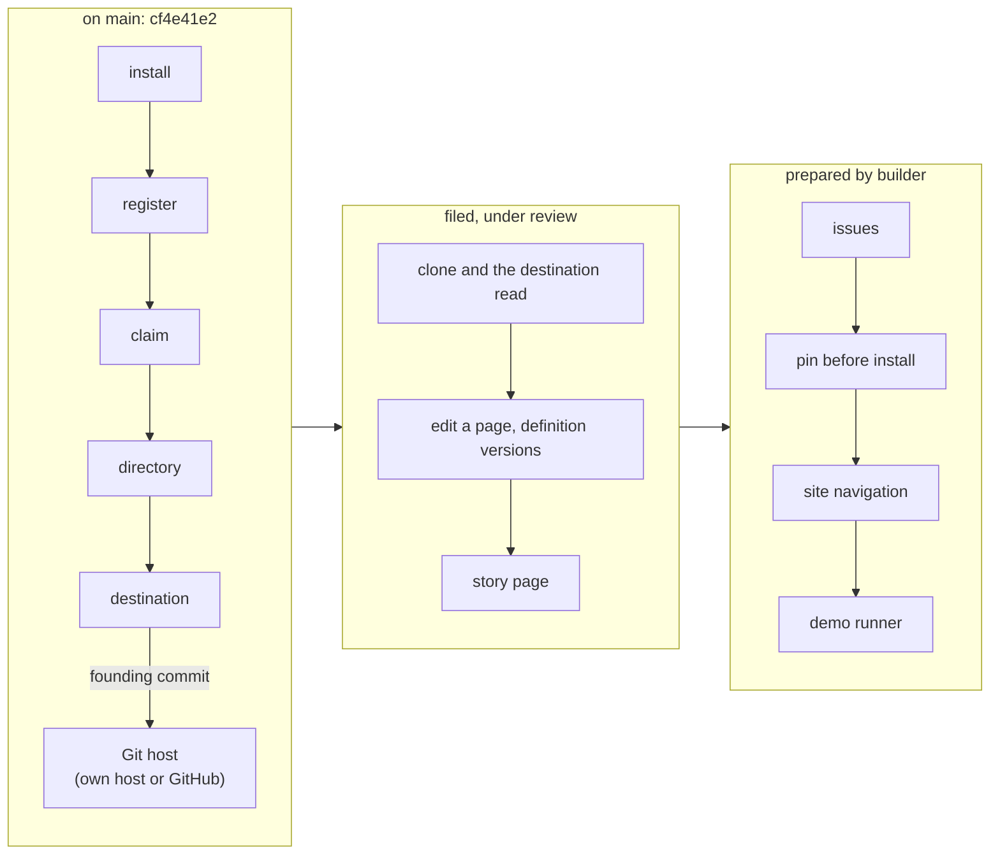

# Sprint report, 2026-10-08 07:00 Eastern: sprint 11

Sprints are eight hours long and end at 07:00, 15:00 and 23:00 Eastern.
Each one ends with a report on main that tells a user's story about
capability that is on main and works, and says what did not land. This
report covers 23:00 on 2026-10-07 to 07:00 on 2026-10-08 Eastern. The
previous report landed as `98c612e6` at 22:35 and was updated as
`1eed91aa` at 23:11. Main at the boundary is `1eed91aa`, unless updated.

Everything marked "observed run" was run on the shared machine, Node
v26.10.0, from planner worktrees under the scratch directory at the heads
named, against the deployment at the account's standard hostname, with
the pinned `tsx` 4.21.0 and `wrangler` 4.147.0 from a scratch directory.
Times are Eastern. Workroom states are the planner's account, not in git.

## Summary

Nothing landed on main this sprint. Main is still `1eed91aa`: gate 1 at
`cf4e41e2` (20:57 yesterday) and the reports above it. The sprint's work
was the landing pipeline behind it: builder filed three of the nine cloud
branches in the planner's order (clone with the destination read, edit a
page with definition versions, the story page) and prepared four more;
checker took the first and, at 05:32, confirmed an open defect in the
host write path it carries: after the driver has durably marked an
attempt as sent, a local transport denial or a stale advertised ref is
classified as a decisive refusal of the host, where the adopted rule says
it must stay unknown with its bindings kept. Approval waits on a repair. The member's path is
therefore not on main at this boundary.

What a user can do on main is the founder's path of the 15:00 and 23:00
reports: install on the room's own Git host or on GitHub with the
organization's App, claim, the repository created and the founding commit
pushed, signed reads, claim resume, verify by signed reads. What runs on
the planner's deployment from the merged branch `planner/i5-demo-host` is
the whole demo script, rehearsed at 23:07 yesterday in 89 seconds with
all 26 shots matching.

## A founder's room on main, and what waits behind it

Source on main: `cf4e41e2` (gate 1). Observed runs of this path are in
the 15:00 report (09:55 and 14:19 yesterday, on the room's own host) and
the 23:00 report; no run was repeated for this report, and nothing on
main changed.

## What landed

Nothing.

## What did not land and why

- **Clone with the destination read** (`48407a70`): filed by builder with
  real local Git helpers; checker's review at 05:32 confirmed an open
  defect in a supported path: a local transport denial or a stale ref
  after the durable sent mark is classified as a decisive refusal rather
  than unknown. Approval withheld until repaired, along the planner's
  existing repair direction. This is the gate for the member's path on
  main.
- **Edit a page with definition versions** (`50b608c8`) and **the story
  page** (`91bd9bf0`): filed, awaiting review behind clone.
- **Issues, pin before install, site navigation, the demo runner**: in
  builder's preparation branches, not filed.
- **The jam branches**: judged by hugh, not landed in the jam repository.
- **Throughput.** One builder files and lands; one checker reviews;
  each filing takes hours. Nine cloud branches arrived in one day. The
  pipeline, not the work, is the constraint; the cadence rule's nudges
  were not needed this sprint, builder and checker were active through
  the night.

## Limits a user will meet

- On main, a founder can found a room and see its founding commit; a
  member cannot yet join by the command line on main, clone by a
  room-issued token, edit a page or open an issue; the page is not on
  main.
- On the planner's deployment, all of that runs; it is not main.

## Sprint 12 commitments, 07:00 to 15:00 Eastern

Re-cut at 07:00 on hugh's direction: no cloud sessions this sprint, and
the work in flight lands on main. Recorded in the workroom under the
cadence act `c514748f` as decision `45c611cc`.

- **Builder.** Land the nine cloud deliveries as one expanded candidate,
  as gate 1 landed: take the planner's merged base `planner/i5-demo-host`
  at `31578596` (every branch merged in order, typecheck clean, deployed,
  rehearsed live with all 26 shots matching); repair on it checker's
  finding of 05:32 and the three owed items (the destination read gap,
  the membership@2 pin, the claim's name in the site header); gate once;
  file under one request with the delivery notes as primary artifacts;
  land after one independent review. Fold the separate clone, edit-page
  and story-page filings into it. No new preparation or design this
  sprint.
- **Checker.** That one candidate, in place of the queue.
- **Planner.** Answer decisions within the hour; keep the deployment on
  the candidate's head; hourly surveys; the 15:00 report; the demo script
  draft corrected to the rehearsal's observed lines. **Second planner.**
  Hold off-path requests.
- **Hugh.** Review the demo script draft and the rehearsal captures in
  `~/tmp/artroom-rehearsal-1`.
- **15:00 report.** The member's path, the edit scene and the issue scene
  on main if the candidate lands; otherwise this story with its state.
