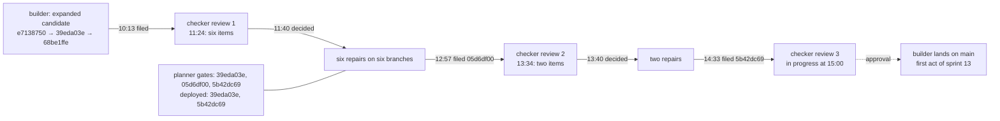

# Sprint report, 2026-10-08 15:00 Eastern: sprint 12

Sprints are eight hours long and end at 07:00, 15:00 and 23:00 Eastern.
Each one ends with a report on main that tells a user's story about
capability that is on main and works, and says what did not land. This
report covers 07:00 to 15:00 on 2026-10-08 Eastern. The previous report
landed as `81f88b9f` at 07:05 and was updated as `44684123` at 07:10
with the re-cut commitments. Main at the boundary is `44684123`.

Everything marked "observed run" was run for this report on the shared
machine, Node v26.10.0, from the planner's worktrees at the heads named;
the deployment runs were made against the account's standard hostname.
Commit sizes and times are from the git history and the workroom's
clocks. Workroom states are the planner's account, not in git.

## Summary

Nothing landed on main this sprint. The sprint was given to one thing,
on hugh's direction at 07:00: no cloud sessions, and the work in flight
lands on main as one expanded candidate. That candidate was built,
filed three times and reviewed twice, and at the boundary its third
head is under the checker's targeted review, with the planner's gate
passed and the head deployed. The landing is the first act of sprint 13.

What the candidate carries, measured from main `44684123` to its head
`5b42dc69` (git diff stat): 187 files, 23,466 insertions and 604
deletions in 146 commits; 146 of the files and 17,022 of the insertions
are under `packages`. It holds the nine cloud deliveries of sprints 10
and 11 (the clone with a read token, the site renderer, the edit page,
definition versions, the story page, the issue commands, the planned
install, the site navigation, the demo runner and captures), the three
owed repairs (the destination read gap, the membership pin, the claim's
name in the site header), the checker's finding of 05:32 on the edit
link result, and the eight corrections from today's two reviews.

| Time | Event |
|---|---|
| about 08:00 | Builder files the first head `e7138750`. The planner's gate fails it: a worker-pool crash in the operations test, a changed demo-runner line, a page rules read refused to a member session. Localized by the planner by 08:32 and told to builder |
| 09:40 | The second head `39eda03e` passes the planner's gate (842 of 844) and is deployed |
| 10:13 | Builder files `68be1ffe` (the same tree plus notes) for review; the checker begins the full review |
| 11:24 | Checker: changes requested, six items. Two P1: the first definition version must keep main's bytes at `1eed91aa`, and the site must check the recorded repository identity before serving. Four P2: client wording after an unavailable or mismatched answer, a conditional 304 answered before the path is resolved, a service-origin setting the page could not honour, a stale screenshot recorder |
| 11:40 | Planner decides all six (assert `158be2c4`); builder repairs them on six branches in parallel |
| 12:57 | Builder files the corrected head `05d6df00` (its gate 844 passed, 2 skipped) |
| 13:34 | Checker: the six corrections are supported; two small items remain (a "the change waits, run merge" tail after unavailable answers in the command line; one over-broad sentence in the page guide) |
| 13:40 | Planner decides both (assert `a049e753`); the planner's own gate on `05d6df00` passes |
| 14:33 | Builder files the third head `5b42dc69`; checker undertakes the targeted review |
| 14:36 | The planner's gate on `5b42dc69` passes and the head is deployed |

**Observed runs**, planner's worktree:

```text
# gate on 05d6df00, 13:40 to 13:42 Eastern
typecheck  exit 0  elapsed    5.2 s
test       exit 0  elapsed   62.1 s
  Tests  844 passed | 2 skipped (846)
gate passed

# gate on 5b42dc69, 14:35 Eastern
typecheck  exit 0  elapsed    4.9 s
test       exit 0  elapsed   62.5 s
  Tests  844 passed | 2 skipped (846)
gate passed

# deploy of 5b42dc69, 14:36 Eastern, wrangler 4.147.0 pinned, run from the scratch directory
Uploaded artroom-scope (4.02 sec)
Deployed artroom-scope triggers (0.66 sec)
Current Version ID: ed97eb81-4154-4dca-b812-03b68b17402c
GET /v0/scopes/nonesuch/summary -> 404 0.19s
```

## What a user can do on main today

Unchanged since the 07:00 report: main holds gate 1 (`cf4e41e2`), so
a founder can install a register on the deployed Worker, claim a
repository on the hosting's own Git service or on GitHub, invite a
member, and have the member join, act and verify; the lanes run on the
real rules scope and destination. The member's path, the edit scene,
the issue scene, the published site and the demo runner are on the
candidate, deployed, and were rehearsed live yesterday (all 26 shots of
the demo runner matching, in the 23:00 report); none of it is on main
until the candidate lands.



## What else happened

- **A usability review** was delivered by builder at 14:18 under the
  second planner's request `ded25d6f`, from the rehearsal captures: an
  evidence-based review, command-line defaults, responsive design
  guidelines, sample screens and four implementation handoffs, as plan
  027 in a builder worktree (`plans/027-artroom-usability`). Not on main;
  it is a document-only landing for sprint 13 once the candidate is in.
- **Decisions recorded** by the planner: the six-item repair steering
  (`158be2c4`) and the two-item steering (`a049e753`), both on the
  candidate's request `86206b55`; the pool-crash localization of the
  morning (`9fb617f3`, `3018fb91`). The second planner corroborated
  every checker finding from the source before each decision.

## What did not land and why

- **The expanded candidate.** Three filings and two full review
  rounds in eight hours: each review took 70 to 80 minutes and each
  repair round 60 to 90 minutes, so the third review ran into the
  boundary. The reviews found real regressions (the first definition
  version had lost value places that gate 1 shipped; the site served a
  repository by name without checking its recorded identity), which is
  what the one-review rule is for. The candidate is gated by the planner
  and deployed; it lands when the targeted review returns.
- **The demo script correction** (planner) was not done; the planner's
  hours went to gate runs, decisions and localizing the morning's crash.
- **Hugh's review** of the demo script draft and the rehearsal captures
  is not recorded.
- **Everything parked** at 07:10 (`c878b983`) stays parked: the jam
  repository landing, design request R5, the off-path requests.

## Limits a user will meet

- Main has the founder's path and the lanes, but not the member's edit
  and issue commands, the published site or the page; those are on the
  deployment from the candidate's head only.
- The site publishes every ref of the backing repository under the
  deployment's authority, by design and as documented; selected
  publication is owed under its own record.
- One-file required checks still lack a manifest tree, so publication
  fixtures run with no checks configured; the cross-origin page setting
  is refused by name rather than supported.

## Sprint 13 commitments, 15:00 to 23:00 Eastern

Recorded in the workroom under the cadence act `c514748f`.

- **Builder.** Land `5b42dc69` on main the moment the targeted review
  approves it, and say the main commit in the cadence thread. Then, in
  order: land the jam repository's rockstar lead and mood branch
  (`5f0c458`); file plan 027 as a document-only landing; the manifest
  tree for one-file required checks. Nothing else; no new preparation.
- **Checker.** The targeted review of `5b42dc69`; then the jam branch.
- **Planner.** Re-run the member's path, the edit scene and the issue
  scene live against main once it lands, with captures for hugh; correct
  the demo script to the observed lines; hourly surveys; the 23:00
  report. **Second planner.** Hold off-path requests.
- **Hugh.** Review the demo script draft and the rehearsal captures in
  `~/tmp/artroom-rehearsal-1`; say whether the usability plan's
  direction should enter the demo before the 12th.
- **23:00 report.** The member's path, the edit scene and the issue
  scene as observed on main; otherwise the landing's state.
- **No cloud sessions** unless hugh says so.
