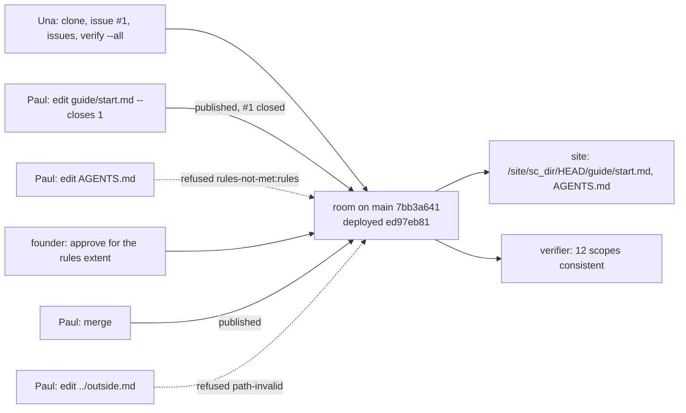

# Sprint report, 2026-10-08 23:00 Eastern: sprint 13

Sprints are eight hours long and end at 07:00, 15:00 and 23:00 Eastern.
Each one ends with a report on main that tells a user's story about
capability that is on main and works, and says what did not land. This
report covers 15:00 to 23:00 on 2026-10-08 Eastern. The previous report
landed as `9341c76a` at 14:37 and was updated as `16d7ba44` at 15:40
when the expanded candidate landed. Main at the boundary is `6afa0377`
unless updated below.

Everything marked "observed run" was run on the shared machine, Node
v26.10.0, against the deployment at the account's standard hostname,
from the planner's worktree at main `7bb3a641` or by builder from its
own worktree at the heads named. Commit sizes and times are from the git
history. Shot times are the demo runner's own, summed by script, not
wall clock. Workroom states are the planner's account, not in git.

## Summary

Five landings on main and one in the jam repository, measured from the
15:00 report's update `16d7ba44` to `6afa0377` (git diff stat): 30
files, 5,990 insertions, 167 deletions, in 12 commits.

- **The expanded candidate** itself, `7bb3a641`, pushed at 15:30 (its
  story and size are in the 15:00 report's update).
- **The demo script corrected** to the observed run (`3b574854`, 16:41).
- **The usability review** as plan 027, a document (`60e83222`, 19:07).
- **The developer start page** `docs/start.md` and a docs index
  (`3b468cd0`, 19:24).
- **The demo runner on GitHub**, with the observed 26-shot transcript
  and the demo script's shot 13 corrected (`6afa0377`, 21:26).
- **The jam**, with the rockstar lead, the mood phrase and the four
  repairs the checker asked for, on the jam repository's main
  (`2de9235`, 19:11).

Two directions from hugh changed the plan during the sprint. At 17:55:
no UI rebuild from plan 027, a separate session owns the redesign. At
21:20 and 21:30: that redesign's output, plan 027 v2, is the workroom's
UI design and the basis of the recording, and the Sunday freeze moves
if the page needs it. So the page's implementation to v2 is now first
on the demo path. The second planner's session stopped at 17:56; this
planner answers every requester judgment.

## A member's day on main

Source: main `7bb3a641` (the same packages tree as `6afa0377`),
deployed as version `ed97eb81`. The demo runner (`docs/demo.md`) played
all 26 shots against it at 15:36, and again through GitHub at 19:49 by
builder; both matched every expected line. The lines below are the
15:36 run's, with the room's ids shortened.

Una is a member of a room founded on the hosting's own Git service.
She clones it with a read token the room issues, and the history has
one commit, the founding. She opens issue #1, "Add a getting-started
page"; Paul, a maintainer, comments and the founder assigns it to him.
Paul edits `guide/start.md` with `--closes 1`: the change is proposed,
linked to the issue, published as a commit by the room's merge, and the
page is served. Then Paul edits `AGENTS.md`, a file in the rules extent:
the merge is refused by name, `rules-not-met:rules`, and the change
stays open. The founder, who controls the rules extent, approves it;
Paul's merge publishes. Paul tries `../outside.md`: refused,
`path-invalid`. Una lists the issues: #1 is closed by the merge. She
runs the verifier over every scope of the room: twelve scopes, all
consistent.

**Observed run**, 15:36 Eastern, 26 shots, sum of shot times 77.3 s:

```text
$ artroom clone site                                            (1.2 s)
Read token: sc_<destination>:8, until 2026-10-08T20:37:05Z.
Remote URL: https://<host>/git/artroom-demo/<directory>-1.git
Cloned into site.
$ git -C site log --oneline
5924bde Found this repository.

$ artroom edit guide/start.md --file start.md --closes 1        (8.0 s)
Proposed guide/start.md (53 bytes) as change sc_<change>, version 5.
Linked: when it is published, the change sc_<change> closes issue #1 (sc_<issue>).
Published: commit 9c37c983..., by the merge sc_<change>:7.
Page: https://artroom-scope.inguz.workers.dev/site/sc_<directory>/HEAD/guide/start.md

$ artroom edit AGENTS.md --file agents.md                       (5.4 s, exit 1)
Proposed AGENTS.md (31 bytes) as change sc_<controlled>, version 5.
Not published: the merge sc_<controlled>:6 is refused, rules-not-met:rules. The change stays open ...
$ artroom act review-verdict --on sc_<controlled> --set manifest=5 --set verdict=approve --set extent=rules
Took effect: entry sc_<controlled>:9, hash sha256:54dec834d28b.
$ artroom merge sc_<controlled>                                  (3.4 s)
Published: commit 59a3eb77..., by the merge sc_<controlled>:10.

$ artroom edit ../outside.md --file start.md                    (5.4 s, exit 1)
Not published: the merge sc_<bad>:6 is refused, path-invalid. ...

$ artroom issues
#1  closed (completed)  Add a getting-started page; assigned to @paul; lane sc_<issue>
1 issues, 0 open.
$ artroom verify --all                                          (28.4 s)
register sc_..., entry 3: consistent.
directory sc_..., entry 23: consistent.
membership ..., rules ..., destination ..., four lanes, three inboxes: consistent.
All consistent: 12 scopes.
```

The same 26 shots through GitHub (builder, 19:49, transcript in
`notes/2026-10-08-demo-github-transcript.md`): the two-step install,
the register pinned by the planner within the plan's window, the
repository created in the organization, the clone from GitHub by the
room's read token, the same publication, refusal, approval and merge,
and the twelve-scope verifier; sum of shot times 591.7 s, which includes
the wait for the pin.

Captures of the room's page and the published site from the 15:36 run
are in `~/tmp/artroom-rehearsal-2` for hugh (six pictures, the
transcript, the room's ids). They show today's page; the recording will
use the v2 page.



## What landed

| Item | Commit | When | What it gives a user |
|---|---|---|---|
| The expanded candidate | `7bb3a641` | 15:30 | The member's commands, the clone, the planned install, definition versions, the page, the site with navigation, the demo runner (15:00 report) |
| Demo script corrected | `3b574854` | 16:41 | Every line of shots 3 to 12 is an observed line |
| Plan 027, the usability review | `60e83222` | 19:07 | The review, handoffs and samples as documents; no implementation |
| Developer start page and docs index | `3b468cd0` | 19:24 | `docs/start.md`: nouns, verbs, invariants, then validate, pin, scenarios, found |
| Demo runner on GitHub | `6afa0377` | 21:26 | `--host github.com` plays the same shots; shot 13's lines observed; the gate's intermittent timeout diagnostic named, not hidden |
| The jam | jam repository `2de9235` | 19:11 | J0, J2, the rockstar lead, the mood phrase; the empty-theme crash and the lost final onset fixed; the J0 harness binds results to phrases and states its trust scope |

Decisions recorded this sprint, all on the cadence act or the request
named: the jam's route by ordinary Git in its own repository
(`1c8991d7`); the manifest list for propose-from-branch, no pack this
week (`d9e4baa4`, `135a11e1`: the reservation is the check's origin and
is staged on the host before the check); the GitHub gate's diagnostic
accepted with a localization request (`66861d63`, `45405ec5`); plan 027
accepted as documents (`23acbfa6`); the v2 page as the recording's
basis (`7530fa07`). Requests filed to builder: propose-from-branch
(`b8c5a3c8`), the GitHub shot (`42ad54c2`, landed), the start page
(`2f03aac9`, landed), the v2 documents (`fe968556`), the v2 page
(`3fd8cedf`), and the backlog tier: selected publication (`6ec330fd`),
Markdown completeness (`8aa398b2`), a paced recording mode
(`34734d79`), the service-origin removal (`f1b97d17`), the offline and
sync design (`47923460`), the timeout diagnostic (`45405ec5`).

## What did not land and why

- **The v2 design documents** were filed at 21:24 (`ca193768`) and are
  under the checker's document review at the boundary.
- **Propose from a branch** is in progress: the reservation's staging on
  the host is written (`9218fb70`); its review is due Saturday noon.
- **The v2 page** was commissioned at 21:25; builder names the day it
  files the candidate by Friday noon.
- **The second planner** stopped at 17:56; its open requests are this
  planner's.
- **The rest of the backlog** (I3 follow-ups, design successors R1 to
  R4, measurement and capacity, the native attachment of the jam
  repository) stays parked behind the filed tier.

## Limits a user will meet

- The page a member sees today is the one the captures show; the v2
  page replaces it before the recording.
- A change carries one file; many files and a branch come with
  propose-from-branch.
- The site serves every ref of the backing repository under the
  deployment's authority until selected publication lands.
- The gate's test log sometimes shows an uncaught timeout from the pool
  after a passing run; its cause is not yet localized.

## Sprint 14 commitments, 23:00 to 07:00 Eastern

Recorded in the workroom under the cadence act `c514748f`.

- **Builder.** First, the v2 page (`3fd8cedf`) with every subagent it
  can use; say by Friday 12:00 the day the candidate is filed. Beside
  it: land the v2 documents on approval; propose-from-branch
  (`b8c5a3c8`) toward Saturday 12:00; then the tier in order: the paced
  runner, selected publication, Markdown completeness, the
  service-origin removal, the timeout diagnostic, the offline design.
  Never idle a subagent on a planner question: take the next item and
  ask in the thread.
- **Checker.** The v2 documents tonight; the v2 page candidate ahead of
  everything else when filed; then propose-from-branch; then the tier.
- **Planner.** Answer within the hour; re-cut the freeze and recording
  dates when builder names the page's day; re-take the captures on the
  v2 page and update the script's cues; hourly surveys; the 07:00
  report.
- **Hugh.** Review the corrected demo script and the captures in
  `~/tmp/artroom-rehearsal-2`.
- **07:00 report.** The member's story on the v2 page if it lands;
  otherwise this story with the page's state.
- **No cloud sessions** unless hugh says so.
