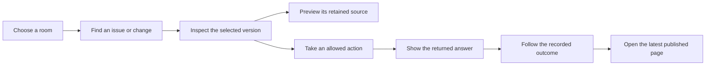

# Sprint 14 report — 9 October 2026, 07:00 Eastern

**Page v2 is on main.** A member now has a clearer room view, searchable
Issues and Changes, contextual controls and a preview of a selected
proposal's retained source. The multi-file branch workflow is still in
progress; it has not passed its final gate or landed.

This report covers 23:00 on 8 October to 07:00 on 9 October. Main at the
boundary was `4b6d42a7`. The report is published late, after the planner
handover. The two overnight landings below are checked against Git history
and the workroom. New hosted observations are kept separate from source
and recorded rehearsal evidence.

## A member's path

Una opens the room's Issues view, searches for the work she needs and
switches between open and closed issues. The room is identified once.
Opening an issue or change gives her one current condition and the actions
her role and that subject allow. Detailed records remain available through
inspection.

For a change, **Preview source** shows the selected retained proposal's
literal text, authenticated against its recorded path, digest and author.
**Open latest page** remains a separate navigation action. A successful
internal step does not earn a Merged label: that requires the selected
version's recorded publication.

*Retained Page v2 rehearsal view at source `efb5c56d`, using recorded
answers. It shows the presentation, not a new hosted-provider run or the
later source guards. [Capture details and six views](2026-10-09-demo-captures/README.md).*

The landed Page also fences an uncertain submission against another
signature and keeps returned answers associated with their original
context. Create room reuses the existing claim workflow where native
eligibility permits it. The typed name is a local label; the repository's
recorded generated name remains distinct.

The latest confirmed 26-shot hosted journeys remain yesterday's runs on
the earlier Page source. The overnight memory records a Page v2 deployment
and the start of another rehearsal, but its completed outcome has not yet
been reconciled for this report. Finishing that observation is a sprint
15 commitment.

## What landed

| Result | Main commit | Commit time, Eastern |
|---|---|---|
| Page v2: responsive presentation, authenticated source preview and claim/Join fencing | `d0a3bdcc` | 01:55 |
| Four planning notes reconciled with their reviewed clarifications and condition maps | `4b6d42a7` | 03:36 |

Page v2's exact candidate `b733d663` received independent approval and a
passing gate of record: 875 tests, two opt-in recorder skips and six
active-source checks. The earlier failed planner gate remains separate;
the later pass does not establish its failure's cause. The documentation
landing adds no runtime mechanism or protocol adoption. Original planning
commitments keep their own conditions.

## What remains open

**Propose from a branch is the next demo-critical delivery.** Its current
delivery note records a failed whole gate: one CLI-story timeout and an
uncaught cancellation diagnostic. An isolated pass is useful evidence,
but does not turn that gate into a pass. Hosted positive and refused
proposals, complete independent review and landing are still owed.

The planner has now resolved its three pending owner matters: authenticated
snapshot reads must retain the ordinary history-floor protection; the
narrow Page compatibility repair belongs in the manifest review; and the
next final gate follows actual scoped corrections, with no competing gate
or blind suite repetition. [Current delivery](2026-10-08-manifest-tree-delivery.md)
remains on its development branch until those requirements are met.

Selected Site publication, Markdown completeness, paced recording and
service-setting cleanup remain active work. Page v2's deferred Join
recovery and completed-comment draft handling remain required follow-ups.
Durable cloud workspaces, cross-device continuity, complete native Jam
hosting and the broader platform obligations are not completed by these
landings.

## Sprint 15 commitments — 07:00 to 15:00

- **Builder:** compose the scoped manifest repairs and provide an exact
  filing plan toward Saturday 10 October, 12:00. Keep spare capacity on
  paced recording, selected publication, Markdown and service-setting
  work. Report a concrete blocker immediately and take the next ready
  owned task while it is resolved.
- **Checker:** finish the current manifest assessment and review the exact
  corrected candidate when filed. Use ready bounded tier deliveries next;
  keep design approval, source approval and publication evidence distinct.
- **Planner:** own hourly surveys at `:07`, prepare the 15:00 report at
  14:35, answer participant requests promptly, reconcile the started
  Page v2 rehearsal, and maintain explicit owners for deferred work.
  No parallel planner gate is needed.
- **Demo:** retain Sunday 11 October, 12:00 as the provisional source
  freeze and Monday 12 October as the recording day. Re-cut those dates
  if the actual branch workflow or Page v2 rehearsal requires it.
- **Next report:** show the observed member journey on landed Page v2 and
  the actual branch-proposal state, with appropriately sourced visuals.

No new cloud agent sessions are commissioned. Focused invariant checks
and one coordinated final gate remain the testing policy.
