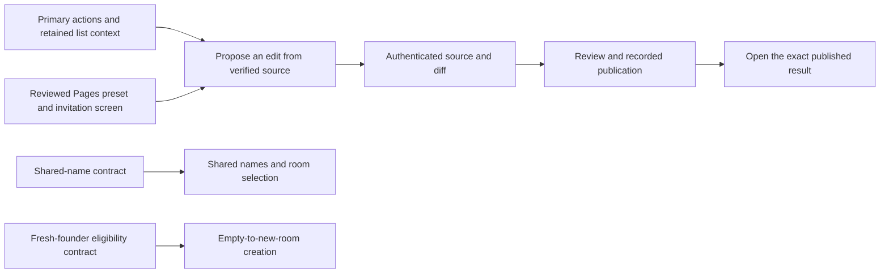

# Sprint 14 survey — 9 October 2026, 08:26 Eastern

This updates the priorities in the [07:00 sprint report](2026-10-09-07-sprint-report.md). That report remains the record of the boundary. No new product delivery or hosted rehearsal is claimed here.

## What changed

Hugh has prioritized the secondary planner's UX recommendations. The primary room name will be shared and managed by authorized members; the generated repository name remains separate. The name needs an authoritative native contract before implementation.

The first complete browser experience will start with an invitation into a prepared room. Empty-to-new-room creation remains required. Planning found a concrete gap: a fresh key can satisfy the founding policy but lack permission for the register read used before founding. A bounded specification now owns that gap.

The Pages starter will require one distinct human approval by default, with owner review and the single-controller exception disabled. It will use an explicit supported protocol cohort and a reviewed preset. The demo's zero-approval configuration is not the product default.

## Delivery sequence

The diagram shows planned deliveries, not capabilities already completed.

| Work | Owner and next result |
| --- | --- |
| Actions and list context | Builder has accepted `12cc35cd`. Put ordinary actions first and preserve search/filter through detail, back and refresh. Reuse the existing accepted-comment-draft duty. |
| Editing and path correction | Planning is accepted. `bc78fa68` implements a new proposal from verified one-file text. Correcting an invalid path creates a new proposal and retains the old history. |
| Review and exact result | Reuse N1 `53016b8e` and A1 `6ec330fd`. N1 needs its existing design repairs and current-model mapping. A1's bounded existing-destination proof seam is adopted for implementation; independent Source review remains required. |
| First use | Planning is accepted. `d01aa495` delivers the reviewed preset and invitation screen. `d40e7f09` specifies the fresh-founder read/eligibility gap. Public package release remains with its existing owner. |
| Shared room names | Builder has accepted specification `07eee7f6`. It must define rename authority, recorded outcomes, concurrent changes and cross-device observation. |

Builder must return a candidate or explicit remaining work and ETA by 15:00 for the Page deliveries. Checker remains responsible for independent review of ready source. These tasks share a coordinated gate; they do not each justify another whole-suite run.

## Critical path and test cost

The manifest delivery remains in progress. Its exact `679d7a96` gate failed: 927 tests passed, two were skipped and four failed. Builder recorded 200.4 seconds of test elapsed time and 241 seconds of CPU time. A five-test ordered follow-up passed, but that short sequence does not explain the failures or establish a fix.

Builder is investigating one lifecycle hypothesis with bounded stage timings and active-wait counts. No whole-suite repetition, timeout increase or deletion of useful invariants follows from that negative result. Deployment and hosted acceptance wait for the required passing gate.

**08:37 correction after the retained-cost survey:** the original 10× test-overhead task was accepted and landed. Its reviewed historical report records a 12.1× reduction in observed gate elapsed time and 10.6× in process CPU. Separately timed step sums gave 10.1× and 9.5×; the report distinguishes those boundaries. The survey did not recheck the historical raw timings. Today's architecture and workload differ, and a comparable current edit-to-review cost or current 10× gain is unknown. The current reliability and cost investigation stays with A4; the completed original task is not reopened. A shorter smoke run or fewer test names cannot establish a comparable gain.

The obsolete service-address setting has been reconciled to its actual delivery in the already reviewed Page landing. No duplicate merge or gate was run. The separate cross-origin obligation remains open.

## What acceptance still needs

The initial editor will explicitly say when comparison with the current file is unavailable. It creates a proposal and does not publish automatically. It must retain exact original requests and known results within the loaded Page; reload and cross-device recovery remain separate unfinished duties.

Current authenticated diff, exact rendered-result links, shared naming, cold creation and public-package onboarding are not complete merely because their plans are accepted. Full browser continuity and hosted workspace work remain owed. The prior report's screenshots are retained evidence from their stated source, not new hosted captures. Actual hosted journeys, physical-device and assistive-technology acceptance still need recorded results.

The next hourly survey is at 09:07; the next sprint boundary is 15:00 Eastern. The provisional Sunday freeze and Monday recording remain subject to the actual working journey and rehearsal.
