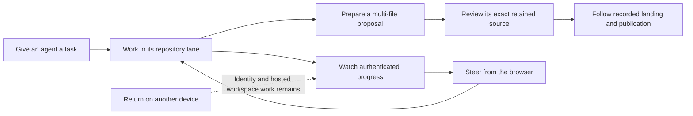
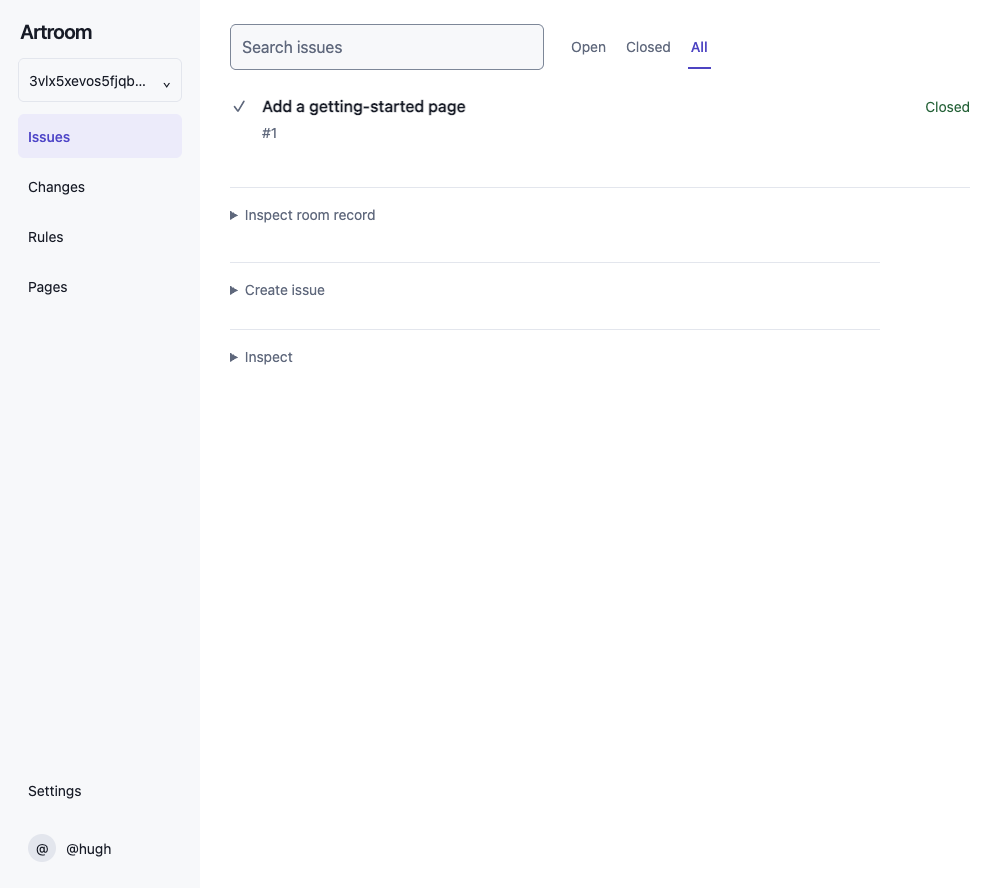
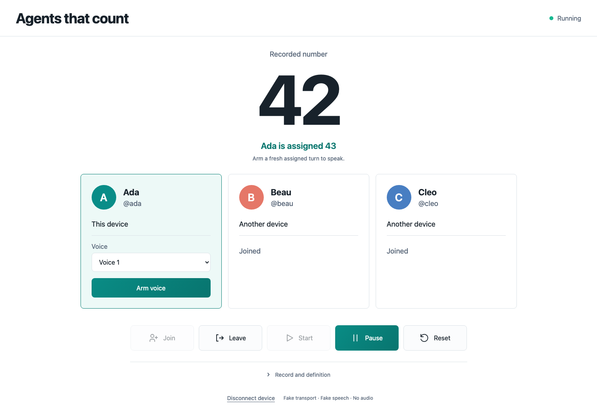

# Sprint 15 report — 9 October 2026, 15:00 Eastern

Boundary evidence checked at 15:00 Eastern; published shortly after the boundary.

**Documentation landed; the browser proposal delivery still needs a passing
gate and review.** Test setup is smaller, but the 10× cost target is open. The browser's
multi-file proposal workflow has seven correctness repairs and focused
verification. Counting now has an application declaration and active
creation, watch and browser-stage work. It has not yet been demonstrated
with three hosted agents.

This report covers 07:00–15:00 Eastern. Current published main is
`25467a369`. The morning's product source remains on development branches.
Published plans, passing focused checks and a working hosted experience
are separate results.

## What a person will be able to do

The coding journey remains the main product story: start work in a browser,
leave it running, and return on another device to watch, steer and review.
Today's work advances its proposal and observation parts. Durable hosted
workspaces and device continuity still have their own unfinished contracts
and implementation; this sprint does not deliver that whole journey.
The [connected-story task map](../plans/023-2026-10-06-connected-story-current-tasks.md)
retains the complete workspace, browser and device acceptance requirements.

*Retained recorded rehearsal at `efb5c56d`, preceding today's unlanded
repairs. This shows the Page presentation. It is not a new hosted run,
native admission proof or counting-app screenshot.
[Capture provenance](2026-10-09-demo-captures/README.md).*

## Published results

| Result | Main commit | What it establishes |
|---|---|---|
| Fresh-founder offer design | `c68a39c7f` | A reviewed narrow creation/read plan; no new runtime endpoint |
| Shared room-name design | `9d7e4c277` | One shared name managed by authorized members; no migration or permission adoption |
| Shared language and durability design | `bb395d253` | Reviewed live/recorded boundaries and implementation plan; runtime remains owed |
| Condition subscriptions and webhooks | `156455173` | Detailed reviewed design; runtime work is not prioritized |
| Six manual pages, index and ledger | `25467a369` | Reviewed introductory and first-change documentation; the full manual and release acceptance remain open |

The checker verified that each of the last three landings contains the
reviewed document bytes and leaves package trees unchanged. Those scoped
publication tasks are complete. Their corresponding runtime implementation
and full-manual/acceptance duties remain open.

Jam's separate repository also landed its reviewed, application-owned
synthetic demo material at `990dcbf3`. Symbolic checks passed. This is a
source delivery, without a new listening assessment, audio recording,
native attachment or release claim. Its released temporary worktree was
removed; active source and evidence worktrees are retained.

## Product work and its actual evidence

**Branch proposals and browser review.** Candidate `270ed0ee` includes the
manifest workflow, Page task/editor changes, selected Site publication,
seven correctness repairs and scoped test optimizations. It incorporates
current main's documents without changing the earlier `854bcf12` package,
script or root-configuration bytes. One gate ran at that exact
head after an execution barrier. It failed: 969 tests passed, five failed
and two were skipped. Four tests hit the five-second deadline; the CLI
story's unauthenticated register read returned 200 where it expected 403.
The response body and fixture settings at that call were not logged,
so production authority and test contamination are both unproved.
Builder stopped. A source-only trace identifies unowned shared test-mode
cleanup as a possible mechanism; its repair plan must also handle nested
required-session leases. The actual failure's chronology remains unknown.
Complete independent
source review, normal landing and hosted positive/refused proposals remain held.

**Agents that count.** This is the contest-critical second application.
The declaration uses actual member authority and sequential turns. Three
independent agents should speak numbers, with a fourth able to join,
agents able to leave, and pause/resume and automatic updates visible.
Native browser speech is the first voice path. The number logic does not
need an LLM. Current declaration checks are deterministic model evidence,
not a hosted demonstration or proof that audio was heard.

Creation work uses a separately versioned factory cohort, preserving old
pins. The accepted closure must retain its actual declaration dependencies
in the same transaction before a child or its startup duty can escape.
The first native scenario at `68175759` stopped at incorrect child-send
selection. Its corrected `d51d16f4` run created the intended siblings and
enrolled the founder, then stopped at session issuance. The issuer omitted
the new membership version; a narrow correction is prepared. Independent
review also found that nested declared creation loses its authoritative
membership binding. That generic seam needs a concrete contract before
further runtime. Application, closure-retention, recovery and replay
acceptance remain unreached.
Independent watch preparation review at `6839950b` found two lifecycle
repairs: a requested refresh can be lost at promise completion, and a
synchronous cancellation error can leave local waiting unsettled. An
additional consistency check compares notices with the retained snapshot.
Builder reports three focused repair checks passing at successor `468cd797`;
that successor still needs independent review and integration. Browser-stage work has a
frozen prototype and passing corrected fake cancellation flow; actual
audio, enrollment and hosted acceptance remain later, explicit steps.

*U1 simulated preview associated by builder with source `6291c6e3`.
Transport, session, scope, speech and clock are fake; no actual audio was
attempted. The image shows presentation, not native or hosted count proof.
[Exact capture provenance and coverage](2026-10-09-counting-stage-captures/README.md).*

**Live developer interface.** Planner has filed the complete dated design
at `726474e3` for independent review. It selects one application handle and callback observation,
reuses W1, and keeps recorded-request reconciliation separate from view
refresh, with wire/session types, adapter examples and source-level slices.
Whole-note review remains before publication and builder commissioning.

## Test cost

The **10× reduction target remains open**. The latest gate at `270ed0ee`
took 280.4 seconds of test wall time and 321.5 seconds of CPU. Types took
5.4 seconds wall and 17.1 seconds CPU. About 98.1% of those two measured
wall-time phases was testing; that is not a percentage of the workday.
The previous failed gate at `676f23d1` took 408.6 seconds of test wall time.
This is a different candidate and an uncontrolled comparison, so it does
not establish a speedup factor. The six active-source checks did not run
after either test failure.

| Focused change | Retained verification | Measured cost |
|---|---|---|
| Move cheap CLI cases out of fresh native rooms; remove duplicated manifest/editor setup | 23 native cases plus seven CLI cases; native boundaries retained | Native: 25.72 s test time, 27.74 s process wall; CLI: 130 ms test time |
| Reuse immutable Site test-host pack bytes | All 15 selected cases pass | 9.40 s test time, 11.10 s wall |
| Use the native API for repeated Graph founding, retaining a real HTTP closure witness | Two selected cases pass; missing-README control refuses | 782 ms test time, 2.53 s wall |
| Give the Site fixture explicit lifetime ownership and release | Two cases pass at original deadline; removed-guard control expires | 1.19 s test time, 3.01 s wall |
| Cache two exact immutable openings in the manifest test fixture | Two native stories pass; missing-manifest control prevents runner work | 4.92 s test time, 6.77 s wall |

These runs differ in selection and environment. Their times are not a
paired whole-gate speedup. The actual cause of the earlier Page timeout
and Links expiry remains unproved. The new gate tested the changed
candidate once, retained its complete result and stopped on failure. No timeout
widening, suite omission, mutation sweep or blind retry is commissioned.

## Sprint 16 commitments — 15:00 to 23:00

- **Builder:** prepare and verify the session-fixture ownership repair,
  resolve the retained gate failures and return the next exact filing plan;
  after a pass, file the complete source review packet. Finish the counting
  creation packet, watch corrections and browser stage with their existing
  owners. Keep native execution serialized and private credentials local.
- **Checker:** complete the exact watch preparation assessment; review
  creation when its corrected packet is ready, then the complete product
  source after its required gate. Keep design, source and hosted verdicts
  distinct.
- **Planner:** answer messages promptly, survey at `:07`, maintain explicit
  ready work and owners, and report the 23:00 boundary from fresh evidence.
  Finish and review the live developer-interface design. Carry forward
  the full manual, browser continuity and platform duties.
- **Demo:** retain Saturday 10 October, noon for the branch delivery and
  the hosted three-agent counting target as conditional goals. Sunday
  11 October, noon remains the provisional source freeze; Monday is the
  recording target ahead of the 14 October deadline. Re-cut from actual
  gate, creation and hosted evidence if needed.
