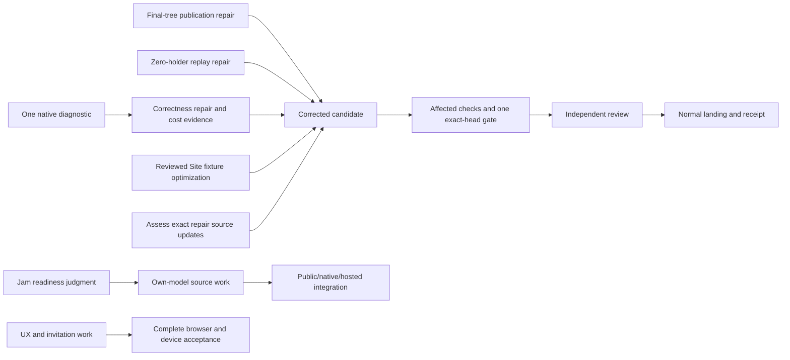

# Sprint progress — 9 October 2026, 23:00 Eastern

Snapshot at 2026-10-10 03:00 UTC, the 23:00 Eastern sprint boundary. Refreshed workroom messages and retained public evidence; the planner ran no project runtime. Main and origin/main remain clean at `18a1288d`; the actual remote was verified at 22:57 Eastern.

The initial delivery has useful focused checks, but cannot land yet. Its last full gate failed with four native timeouts. The publication source repair now passes its affected checks, and the empty-holder replay repair has a smaller native witness ready for validation. The next full gate must run on the composed repair candidate, with its exact source and evidence map.

## Progress and next work

| Work | Evidence retained | Next action and owner |
|---|---|---|
| Initial delivery | `059853a2`, 224 actual changed paths. Typecheck passed; gate failed with 1,001 passes, four timeouts and two original recorder skips. Active-source checks did not run after failure. Both independent whole-source preparations are now complete; no additional concrete untracked blocker was found. | Builder prepares the corrected candidate after repairs. Checker assesses the exact changed repair boundaries before the next gate and normal final review. |
| Native failures | Current `fc0f4e04`: three compiler roots and all five cases passed once; owner handle `59814` ended with exit 0. Exact coverage and all 56 stage records agree with raw logs. Outer cost: 7.47 elapsed / 11.89 CPU seconds. Static review removed finish hooks before the run because they would add timers. | Retain the result without repeating it. The short cohort does not resolve the earlier full-suite failures. Builder composes the repairs and cost improvement; checker batches remaining findings before the next gate. |
| Test economy | Editor pipeline: 1.74 elapsed / 3.07 CPU seconds for two compilers and three cases in one invocation, without separate discovery. Last full gate: 325.935 elapsed / 382.97 CPU seconds. | The 10× goal remains highest priority. Identify passing-test cost from existing evidence or the next required gate; avoid another profiling run. Preserve useful invariants when removing work. |
| Publication repair | `941b113f` builds final affected trees and checks allowance before copying. All four compiler contexts and seven cases passed; terminal handles `15957`/`83059`. Both regression controls failed their intended assertions while other cases passed; isolated worktrees restored. Checker `2aada682` found no new source blocker. | Retain the two separately measured pipelines (3.37 and 1.65 elapsed seconds) and controls without baseline repeats. Compose with the other repairs. Formal whole-candidate review and landing remain required. |
| Empty-holder replay | Current `66ce1125` preserves the one-line positive-bound fix and reuses the original protected proposal. It adds one zero-holder judgment, native grant removal/restoration and one prefix replay. Extra issues, proposal lanes and corruption matrix were removed. | Builder freezes the guarded three-compiler/all-five-case selection and validates once. Checker `0175f380` assesses the exact changed boundaries. Known ancestry incompleteness remains explicit. |
| Site fixture cost | Complete `c058f186` fixture source read: 741 lines, all 15 functional cases. Exact wanted objects avoid repeatedly packing unrelated megabyte blobs; immutable wire reuse preserves real codec checks and fresh HTTP/token work. | Builder refreshes the isolated source/guarded recipe onto current lineage under existing `aadee9b4`. Validate once after the diagnostic; no stale-head repeat or overlapping runtime. |
| Editor and UX | Editor `0dd52d2b`: two compilers and all three cases passed; both distinguishing guard controls failed their intended assertions. UX `26325475`: all 40 cases passed. Combined UX `03d1647d`: two compilers passed, verified in `73d772d4`. | Preserve each result at its exact subject. Initial and UX delivery stay separate. Complete rendered-entry/assets, real browser/accessibility, native authority and device acceptance in the UX handoff. |
| Counting and invitations | C1 declaration preparation; M1 `2961d8c0` has three compiler and five Node passes. I1 codec is source work; I2 trust/custody preparation is explicit. | Builder progresses one coherent native capacity/session/grant witness and invitation integration. Preserve original pending enrollment identity and signed envelope before replacing the legacy facade (`375a78fc`). |
| Jam | First own-model source `a89bcf46` now exists: bounded contribution declaration, lossless integer codec, recorded scheduling reducer and one unexecuted symbolic witness. Original tunes, rhythm and local histories are preserved. | Correct the release-owner/evidence attribution and map native fields/verified facts into the reducer. The own-module Node witness does not technically require public SDK publication; builder should separate that check from native integration. Public release, hosting and actual music/listening remain owed. |
| Documentation and public delivery | Main `18a1288d` contains the reviewed five-file manual corrections. Full manual and cold-user delivery remain unfinished. N3 is a design commission, not a registry publication. | Continue the full manual and identify the actual coordinated release candidate/owner. Repository publication of planner-owned approved notes remains distinct from workroom attachments. |

The older usability-review request `ded25d6f` is now satisfied: planner read the complete report, all four handoffs and preview limits, then ratified report `aa6a99c5` in `bdd0ad79`. Publication repair preparation `9f08c645` is also satisfied by checker report `5e5e2b0d` and ratification `cfa5c316`. These close planning/preparation scopes. The current UX implementation and formal whole-candidate review remain open.

## Next sprint priorities

1. Finish reduced replay validation, preserving the passing publication and diagnostic baselines and completed controls. Bring the Site fixture cost improvement into the candidate when ready. Compose the exact source once, reconcile generated assets, run one appropriate gate, and obtain normal review and landing.
2. Continue the 10× test-cost reduction from measured evidence. Identify the expensive passing work in the next required gate, remove redundant work only with named surviving invariants, and keep routine edit-to-review checks in the guarded pipeline.
3. Progress the declared acts and concrete Jam blockers. Continue Jam's own-model source and the full manual in parallel. Complete native capacity, grants, supported public release and invitation custody through their existing owners.
4. Carry the accepted UX through actual rendered browser, accessibility and device acceptance. Preserve the complete hosted coding and cross-device stories; the separate UX delivery does not disappear from the sprint.

## Delivery flow

## What the evidence means

The four failed case durations total 20.059 seconds, about 5.88% of Vitest's reported aggregate test time of 341.20 seconds. Aggregate durations overlap; they are not elapsed wall time. Fixing those four cases alone cannot substantiate the 10× target. The focused editor pipeline is a different cohort and does not supply a full-suite factor.

Stage markers identify the last visible high-level group, not a proven causal RPC or physical native drain. A short diagnostic pass cannot clear the earlier long shared-pool failure. Preserve original five-second limits, assertions and zero retries. Do not repeat the unchanged `059` suite.

Scripted DOM, Git providers, clocks and local stores are labeled at their actual boundaries. No new real browser, device, provider, hosted Counting or audio proof is available at this boundary. Use screenshots only when they document the rendered subject actually verified; earlier fake-stage captures do not prove hosted or audible behavior.

Checker's holder-indexed cleanup recommendation `cf4771cf` is tracked as P3 request `63c63be6`. It is a separate later optimization, with no measured factor or new correctness failure. It does not delay the immediate candidate.

## Complete scope carried forward

The product still must let a person start useful repository work in the browser, disconnect, and return from another authorized device to observe, steer and review it. Real workspace edits, command results, prepared commits and uncertain side effects need durable recovery; device enrollment/revocation and hosted agent lifecycle need clear recorded authority. Model claims do not replace Room outcomes.

Keep the full acts/durability work, bounded capacity, retained evidence and replay, complete manual, public packages/starter, declared Counting commitments with independent browser/macOS voices, actual hosted delivery and Jam self-hosting/listening obligations. Existing C1/M1/I1/I2/A1/R1/S1/V1 and connected-story owners retain their full acceptance scope. Selected passes and partial notes do not close it.

At the boundary, builder is proceeding from completed publication controls to reduced replay validation. Checker has claimed exact reduced-source preparation under `9c2cf7af` and is corroborating the whitelisted public diagnostic evidence. No live runtime handle for the replay run has yet been supplied, so this report records that work as in flight, without assuming a process is running. No current source/check action is waiting for a decision from Hugh. The next hourly survey is at 23:07 Eastern; the next sprint boundary is 07:00 Eastern.

This report is maintained as a dated Markdown artifact and workroom evidence. That publication does not itself land a repository commit, approve application source or close product acceptance.
