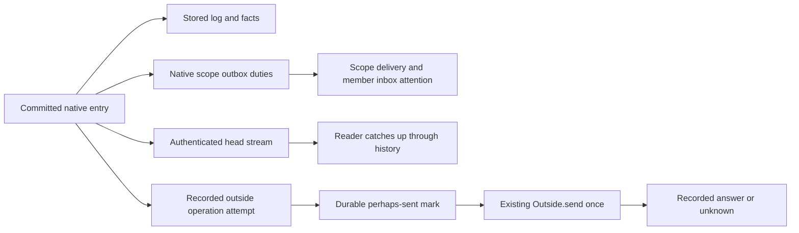
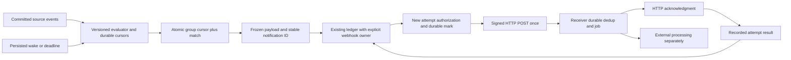
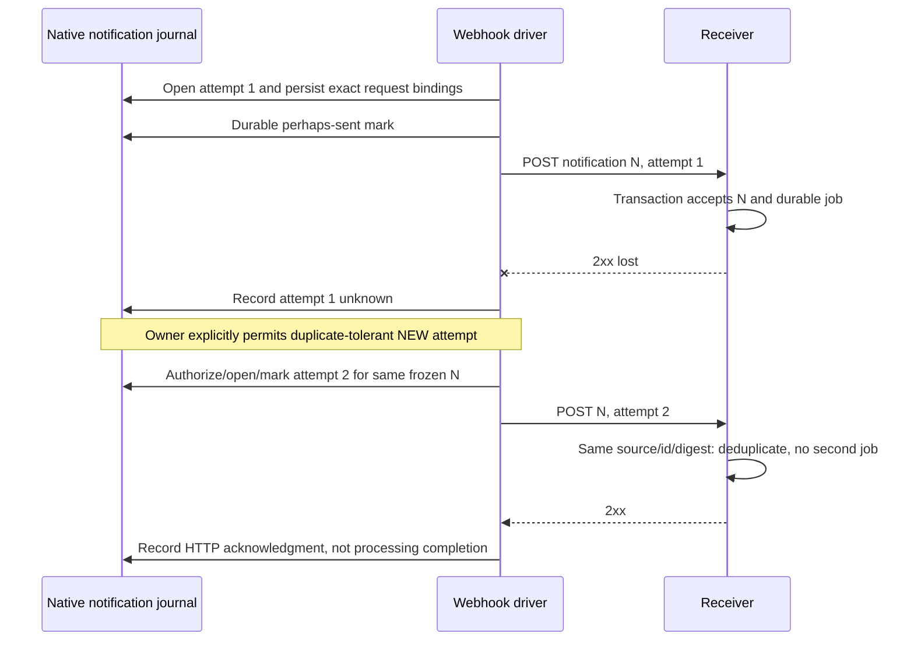

# Durable condition subscriptions and outbound webhooks

9 October 2026. **Design only. Runtime implementation is NOT PRIORITIZED.**
This note proposes contracts; it adopts no protocol, egress grant, definition,
provider or deployment. Delegated request
`03d475b87fbde702957c54ce5392c7f79b440df6`, promise
`12b83fdb1757a730b1ff3fe542d172206eb394e0`, preserves all conditions of original
`22e8265a9167c96681a0b41c2e475d9db0a3a8f4`. Inspected source baseline:
`f6d80b3996df7ad3e7d00feff88d48cf29877ddc`, tree
`7b0e8ef8778051257ff98b078c959dffa8caf374`. Browsing below reads public primary
documentation only; no endpoint, account, browser app or provider was probed.

## 1. Goals, boundaries and terms

A subscription asks: **when this defined condition becomes true for this exact
subject/version, record a notification and attempt authorized delivery**.
HTTP is one channel. In-app attention and an authorized event feed remain
other possibilities; the condition model must not depend on a webhook being up.

| Term | Meaning |
|---|---|
| Source event | A committed native entry/fact, with full scope incarnation, sequence/hash and pinned definition. An uncommitted intent or head hint is not an event. |
| Evaluation | A bounded, versioned computation over identified source facts/cuts and declared clock semantics. |
| Condition match | A durable claim that the evaluator found its condition true at the stated evidence cut; not a new judgment of the work itself. |
| Notification | One immutable match identity plus frozen allowed payload bytes, provenance, target binding and expiry. |
| Delivery attempt | One separately marked request of that notification, with its own identity and result. |
| Acknowledgment | Observed HTTP acceptance under the receiver contract; not downstream processing or Artroom work success. |
| External processing | The receiver's later job/effect. Its completion is outside a 2xx response and requires separate evidence if wanted. |

For example: a docs/** change enters readiness, once per exact proposal
version; or an open issue has a complete recorded unassigned interval lasting
two hours. These are illustrative requirements, not existing APIs.

An Artroom publication means the actual selected version's judged native
publication and destination evidence. A raw Git-host push, branch movement,
provider webhook or imported ancestor alone cannot mean valid Artroom Merged.
A delivery timeout changes notification delivery, never the original merge.
Non-goals: arbitrary subscriber JavaScript, network predicates, a global
atomic snapshot, exactly-once external effects, a generic relay/outbox rewrite,
new anonymous export authority or completion of existing continuity duties.

## 2. Subscription schema and authorized lifecycle

Proposed immutable subscription revisions contain:

- Full owning room/integration reference, logical subscription ID and revision;
  evaluator implementation/version, canonical condition digest and compiled plan.
- Explicit source/dependency full references and pinned schema/definition
  digests; permitted fields/relationships; exact subject/version and grouping key.
- Firing mode/rearming policy, activation cursors and baseline, backfill epoch,
  clock domain, expiry and bounded evaluation/delivery/retention budgets.
- Payload field allowlist/schema; endpoint identity and immutable configuration
  revision; private signing/credential references, not plaintext secrets.
- Actual managing/export principal and permission bindings, lifecycle state and
  durable progress/firing/deadline records. A name or endpoint URL grants nothing.

Create validates authority, pins, compilation, bounds and endpoint verification.
Edit creates a new revision with an explicit activation cut; it never rewrites
old evidence/payloads. Pause stops new matching/delivery admission. Default Resume from now records
new per-source activation cuts and baselines, an explicit skipped-range record
and retained firing keys; it sends no historical paused-window notices and
does not silently flush old queued notices. Resume with catch-up is a distinct
authorized range/epoch choice using the saved cursor. Partial/unavailable cuts
leave resume blocked.
Remove is a retained tombstone that prevents new work; it does not erase sent
attempts or unknown outcomes. Expiration stops new matching/automatic attempts,
with the reason recorded. No silent reset or loss of pending work is allowed.

Separate ordinary configuration from private custody. Native room records
may contain nonsecret IDs/digests/status, but raw private payloads, endpoint
credentials and signing material need the existing reviewed private-resource
boundary. A native history broadly readable by members is not automatically
an appropriate secret/payload store.

Illustrative proposed configuration; angle-bracket values are symbolic, not
valid deployed references or advertised schemas:

```json
{
  "schema": "artroom-subscription-proposed-1",
  "subscription": "sub-7",
  "revision": 3,
  "owner": "<full integration/room reference>",
  "evaluator": {"version": 1, "digest": "<condition and compiler digest>"},
  "sources": [{"scope": "<full change scope reference>", "definition": "<exact pin>"}],
  "condition": {
    "all": [
      {"state": "ready-for-review"},
      {"pathsMatch": {"pattern": "docs/**", "version": "selected"}}
    ]
  },
  "groupBy": ["subject", "proposalOpeningFact"],
  "fire": "once-per-subject-version",
  "activation": {"mode": "from-now", "after": "<verified source cursor>", "epoch": 1},
  "payloadFields": ["subject", "subjectVersion", "matchedAt", "matchingPaths", "authenticatedLink"],
  "endpoint": {"id": "endpoint-4", "revision": 2, "signingKeyRef": "<private custody reference>"},
  "expiresAt": "2026-11-09T00:00:00Z",
  "budgets": {"evaluationSteps": 1000, "catchupEvents": 128, "automaticAttempts": 8}
}
```

The ready-for-review term needs an adapter for each actual pinned lane schema;
it is not a literal new native state inferred from this example. Current
single-file and future manifest-list versions cannot be silently interchanged.

## 3. Bounded declarative conditions

Reuse the existing Guard/Condition vocabulary only where its meaning is sound:
state/transition/equality, declared labels/actors, valid recorded paths, bounded
counts, relationships and exact presented/retained facts. A subscription
compiler is a **new proposed evaluator**, not an instruction to run current
act guards outside their native judgment context.

Compile against exact pins, field types and permitted read surfaces. The plan
records dependency indexes by source, type, relevant fields and subject key;
changes to irrelevant fields may avoid expensive computation, but still need
sequence accounting. Validate finite joins, depth, row counts, byte budgets and
clock dependencies. Unsupported schemas or guards that require arbitrary code,
capability effects/network access or an unbounded scan are rejected.

Evaluation is three-valued: true, false, unknown. Unknown includes unavailable,
incomplete, unauthorized, stale or incompatible evidence. Negating unknown
remains unknown; an `unless` form must not accidentally convert it to success.
Compilation therefore names the supported subset and evaluator semantics,
including its adaptation of conditions and failure grammar.

Paths come from authorized exact proposed content/facts, not a latest Git diff
or provider event. An actor filter specifies recorded actor/role at occurrence
versus current sampled authority; it never uses the current roster to invent
historical attribution. Correlations name exact referenced facts and bounded
cuts, not a search for a convenient current match.

Complex logic uses a broader **authorized** event feed and receiver-side
processing. That feed needs its own read/disclosure/retention contract and is
not a bypass around private export or source completeness.

## 4. Firing, rearming, deadlines and revision changes

| Mode | Proposed precise identity/firing rule |
|---|---|
| Each relevant event | At most one occurrence per committed event and explicit group. |
| Entering state (default) | Fire on a proven false→true transition, not on unrelated entries while true. |
| Once per subject/version | One admitted notification for the logical subscription epoch and exact version; re-entry of that same version does not create another. |
| Repeated true | Only an explicitly configured bounded interval/episode policy, with a persisted next deadline. |
| Rearm | Requires proven false, or an explicit reset/new epoch. Unknown does not rearm. |

Initial activation samples a baseline at verified source heads and starts
**after** them; an already true condition does not silently fire retrospectively.
An unknown baseline blocks edge interpretation until it can be established.
Historical backfill is a separate authorized run with explicit source range,
condition revision, epoch and historical flag. It cannot use current facts to
claim past truth. No backfill is implicit in editing or resuming.

Ordinary edits preserve already-fired subject/version keys unless an explicit
new firing epoch/backfill is authorized. Semantic edits recompute the baseline
at their activation cut without emitting merely because it is now true.
Old evaluators are fenced by revision/cursor at commit; old notifications keep
original revision/payload/endpoint binding. Endpoint URL edits do not silently
redirect them. Signing-key rotation is a separate private credential change.

For docs readiness, the exact proposal opening fact identifies a version.
Validate its complete path set and its schema's readiness transition. Comments,
later review/check events or unrelated directory indexes while still ready do
not create more notices. A new proposal version has a different grouping key.

For the unassigned-issue example, persist the start fact, interval generation,
source clock domain, deadline=start+7200s and cancellation/rearming rules.
Assignment or closure ends the interval; reopening/unassignment starts another
explicit episode. Catch-up must detect an interval that reached its deadline
and ended before evaluation, rather than sampling only today's assigned state.
Proposed boundary: an unassigned interval whose ending source time is at or
after the deadline qualifies once, including equality. Catch-up uses that
ending fact and the complete interval; a recorded native deadline occurrence
uses its actual sequence. A pinned source with different boundary semantics
needs an explicit adapter/version; transport arrival order decides nothing.

An evaluator alarm is durable and has no browser dependence. **Strong temporal
absence requires a source-qualified clock/cut**: complete local sequence since
start plus a recorded native deadline fact, or a separately adopted bounded
source-clock/head observation. The current Summary's last entry time is not
current source time. Without that seam, expose only explicitly observational
clock semantics or report unknown; do not claim authoritative continuous
absence from evaluator wall time alone. Clock-behind/incomplete history suspends
certainty; late evaluation is visible and does not rewrite source occurrence.

## 5. Local truth and cross-scope cuts

Each match retains the trigger/deadline identity, exact definition/plan,
subject/version, source facts and source head/incarnation for every dependency,
observation start/freshness, completeness and match-decision time. Hash equality
alone does not establish authoritative source; facts must come through the real
authorized native read/retention/replay boundary.

Local evaluation folds committed events in sequence, so a short true interval
between two heads remains visible. Negative/count predicates require complete
coverage of their declared finite domain; missing pages are not zero. A history
floor or an unreadable source cannot become no assignee/no review/no dependency.

Cross-scope evaluation has separate observation phases. A match says true at
this recorded causal cut, not that independent scopes were jointly atomic.
Pin each dependency and follow its declared causal links; keep a per-source
cursor, deduplicate repeated facts and reject foreign incarnations or lower
qualified heads. Delayed/out-of-order delivery wakes catch-up, not last-arrival
wins. If a needed fact arrives later, resume the **same** pending occurrence/
version; do not substitute a newer version that happens to satisfy the test.

An advisory observation and an actual recorded judgment have different claims.
A notification may say an evaluator observed readiness; it cannot say an
Artroom review/merge was admitted unless it cites that actual native judgment.
Timed or cross-scope payloads explicitly identify clock/cut/freshness limits.

## 6. Crash-safe processing and durable enumeration

Persist activation/cursors, materialized condition state, firing keys, pending
incomplete occurrences and timers in the proposed subscription-owned journal.
Use a single local transaction for cursor advancement **and** its durable match,
frozen payload reference/digest and delivery intent. Fetch/validate outside the
transaction; recheck subscription revision, source cursor and authority/budgets
inside it. A crash exposes both progress and result, or neither.

Core currently permits only one item opening per entry. For one event with
several groups, process a stable bounded group order with cursor
`(sourceRef, nextSequence, groupOffset)`. Each commit opens at most one match
and advances that group offset atomically; advance beyond the source event only
after every relevant group is recorded. No-match groups still record progress/
truth. Do not implement a batch by silently opening many native items. Another
storage layout needs exact native contract review, not an assumed Core exception.

Concrete proposed ledger profile: one existing subscription-control item owns
the bounded cursor/group state; one new notification item contains the match,
firing key and frozen payload reference. A proposed admitted action checks the
control revision/cursor and duplicate key, updates that existing control item
and opens **one** notification in the same native entry/transaction. A no-match
action updates only control state. Delivery attempt openings occur in separate
owned operation entries. This requires an independently reviewed definition,
guard/effect shape and storage transaction, not merely calling a host database
transaction around unrelated native writes. If this atomic form is unavailable,
activation is refused until its owner supplies a reviewed settlement contract.
The provisional profile below bounds groups and pending occurrences at 64,
source dependencies at eight and control bytes at 32KiB; an event exceeding a
bound blocks at its cursor instead of dropping excess groups. Outstanding
notifications also have a configured retained-count/byte ceiling. Retirement
cannot discard unresolved deliveries or the firing keys needed by the admitted
replay/backfill range; quota exhaustion blocks admission. These bounds are
proposed, not evidence that an existing Core definition accepts this layout.

Match identity is a domain-separated digest of logical subscription/epoch,
exact subject/version and firing occurrence/group. Evaluator/condition revision
is retained evidence. A unique firing-key decision fences competing revisions;
existing emitted keys are not overwritten with a different payload. The same
source event after restart or duplicate wake cannot create another notification.

Unknown local inputs stop the relevant cursor at its last complete point.
Cross-scope pending occurrences may advance only when their exact unresolved
identity/evidence obligation is durably retained. Pending/budget exhaustion
backpressures evaluator progress, not the original room decision; no silent
skip, false baseline or discarded transient match.

Catch up in bounded pages from authenticated committed history, checking sequence,
previous hash/full reference and completeness. Retention floors produce
`blocked-history`; authorized restore/backfill or an explicit new epoch must
acknowledge the gap. A latest head cannot repair missing history. Activation,
revision change and cursor recovery are native journal operations, not a
browser memory or queue acknowledgment.

Head streams are wake hints only. Their current backpressure omits intermediate
heads; durable history enumeration supplies each occurrence. A persisted
periodic evaluator wake/cursor repair covers a crash between source commit and
hint delivery. Optional native outbox wake hints may improve latency, without
an endpoint call or subscriber execution on the authoritative room path.

## 7. Frozen delivery, attempts and recovery

Freeze selected allowed payload bytes, evidence and target revision before
opening delivery. Notification ID stays stable; attempt IDs are different for
every permitted new request. Retrying delivery never reevaluates current work
or changes the body to a later source/version. A conflicting body digest for
an existing notification ID is corruption, not a new notification.

Proposed initial policy (values require adoption/cost evidence): eight automatic
attempts within 24h, exponential delay with recorded deterministic jitter and
one-hour maximum delay; bounded Retry-After may adjust the next persisted time.
A prepared timestamp/permit that expires before the send mark remains unsent;
the owner records that result and opens a permitted NEW attempt rather than
refreshing the same attempt’s frozen authentication invisibly.
HTTP 429/5xx and transport loss may be retryable; most other 4xx, TLS/destination
policy failures or invalid authentication need intervention. A status is not
permission to repeat the same marked attempt. Redirects are not followed.

States distinguish queued, attempt-recorded, perhaps-sent, retry-wait,
acknowledged-http, blocked-authority/endpoint, paused, expired-unacknowledged
and stopped. Expiry/budget exhaustion means no further automatic attempt,
not that prior requests did nothing. Pause/remove/revocation cannot recall a
sent packet or erase its unknown result.

Manual redelivery is an explicit authorized NEW attempt, or a new delivery
operation referencing the same notification when the old operation is terminal.
It retains the original body/notification identity and records reason, new
budget and current authorization. It cannot silently expand total quotas or
redirect to a different endpoint. An endpoint change requires an explicit
separate reviewed target binding; default redelivery uses the original target.
A historical re-evaluation/backfill is a different action and identity.

Under the proposed receiver contract, a valid 2xx follows durable acceptance/
deduplication and job enqueueing. The sender observes HTTP acceptance, not
that storage really persisted or downstream work completed; stronger proof
needs an independently specified receiver receipt/work protocol. Lost ack
means the receiver may already have processed it. Retained payload/attempt
metadata stays within authorized custody until its actual retention policy can
close it; do not erase unresolved external duties to free quota.

Retry language is qualified: delivery may be repeated while endpoint, budgets,
retention and authorization permit. Neither endless eventual delivery nor an
exactly-once outside effect is promised.

## 8. Existing operations, not a hidden resend loop

Current `Outside.send` makes one request per call/marked attempt; unknown/late
answers do not authorize another send. A safe recovery port retrieves the same
retained answer or repeats a safe read, never an outside mutation. The native
scope-to-scope outbox's retry policy is a different guarantee.

Prefer reusing the current operation ledger/driver with a **new explicitly
adopted versioned webhook owner/policy**, not a second generic relay. The owner
must declare duplicate tolerance and when an unknown/refused attempt may lead
to a NEW numbered attempt of the same notification. Record its opening and
request/authentication bindings; the existing driver durably marks perhaps-sent
before its single POST. A marked attempt is never unmarked or re-sent.

The owner may record unknown as the attempt result while leaving the
notification unacknowledged/retryable. A new attempt requires a new native
record and renewed permitted dispatch, with distinct attempt identity. No HTTP
client automatic mutation retry, redirect replay or transparent queue replay
may hide behind one `Outside.send`. Transport recovery/late answers keep their
original attempt and cannot overwrite a contradictory known result.

A separate queue/worker can be a wake/transport adapter only if this record
contract survives it. It does not become source truth, the match journal or
an alternate authority. This is an owner decision, not an added relay project.

## 9. Wire and receiver contract

Propose the stable CloudEvents 1.0.2 JSON profile with `specversion: "1.0"`;
its required source+id identity supports duplicate recognition. The linked
main spec currently says 1.0.3-wip, so it is not silently selected as a stable
protocol. CloudEvents describes an envelope, not delivery/external-effect
certainty. [Stable specification](https://github.com/cloudevents/spec/blob/v1.0.2/cloudevents/spec.md),
[requested main](https://github.com/cloudevents/spec/blob/main/cloudevents/spec.md).

Suggested immutable payload (illustrative, not an implemented schema):

```json
{
  "specversion": "1.0",
  "id": "notification-9",
  "source": "https://artroom.example/evaluators/eval-7/incarnation-2",
  "type": "ai.generalbusiness.artroom.condition-match.v1",
  "subject": "change-42/version-5",
  "time": "2026-10-09T14:00:00Z",
  "datacontenttype": "application/json",
  "dataschema": "https://artroom.example/schemas/condition-match/v1",
  "data": {
    "subscription": {"id": "sub-7", "revision": 3, "epoch": 1},
    "subjectVersion": "<exact proposal opening fact>",
    "conditionDigest": "<exact digest>",
    "assertion": "observed-ready-for-review-at-recorded-cut",
    "matchingPaths": ["docs/start.md"],
    "provenance": {"facts": ["<native fact references>"], "cut": ["<full source/head>"], "jointAtomic": false},
    "link": "https://artroom.example/page/#/change/change-42"
  }
}
```

`time` consistently means recorded match decision time; source occurrence/
deadline/observation times are separate provenance. Links carry no sessions,
private keys, invitation secrets or automatic read permission. Schema URLs
above are examples, not published resources.

Serialize/freeze one exact canonical UTF-8 JSON body and content type before
delivery; reject duplicate keys, invalid scalars/nonfinite numbers and invalid
CloudEvents attributes, with proposed maximum JSON depth32. Never normalize
Unicode, pretty-print, compress or rewrite the body between attempts. Use
structured `application/cloudevents+json`; no batching in this proposed profile.
[Stable HTTP binding](https://github.com/cloudevents/spec/blob/v1.0.2/cloudevents/bindings/http-protocol-binding.md),
[stable JSON format](https://github.com/cloudevents/spec/blob/v1.0.2/cloudevents/formats/json-format.md).
Propose
integration-specific high-entropy HMAC-SHA256 keys, separate from native device
keys. Authenticate a length-prefixed, domain-separated byte sequence containing
protocol version, notification ID, attempt ID, prepared timestamp, key ID,
POST, target URL digest and the **raw frozen body**. For exact proposed framing, prepend ASCII `artroom-webhook-1`, then encode
each UTF-8 field in order (N,A,T,K,POST,D), followed by raw body bytes, each
prefixed by its unsigned32-bit big-endian byte length. IDs/key IDs are bounded
ASCII without whitespace/newlines; T is canonical decimal Unix seconds; D is
the digest of the approved canonical target URL. Reject duplicate/conflicting
headers and any disagreement with the body/selected endpoint.

```http
Content-Type: application/cloudevents+json
Artroom-Webhook-Version: 1
Artroom-Notification-Id: notification-9
Artroom-Delivery-Id: delivery-9-2
Artroom-Timestamp: <canonical epoch seconds>
Artroom-Key-Id: key-version-3
Artroom-Target-Digest: <canonical target digest>
Artroom-Signature: sha256=<lowercase 64-hex MAC>
```

These are proposed Artroom headers, not GitHub headers or implemented APIs.
Verify raw bytes before JSON parsing with a constant-time MAC comparison.
The GitHub reference validates a secret-based HMAC over payload bytes; Artroom's
additional delivery/timestamp/target binding is this proposal, not a GitHub
behavior claim. [GitHub signature validation](https://docs.github.com/en/webhooks/using-webhooks/validating-webhook-deliveries).

Prepare timestamp/key-version/signature once per attempt and retain them
privately before mark/send. A new attempt has a fresh timestamp/attempt ID but
the same frozen event. Proposed receiver replay tolerance: five minutes with
explicit clock-skew failure; reject malformed/mismatched metadata and duplicate
attempt bindings with conflicting bytes. A matching same-attempt transport
duplicate can acknowledge the already accepted notification. This is not an
authorization lease. The receiver's durable
notification dedup key is `(source,id)`, with matching body digest. Reused ID
with different bytes is rejected; a matching duplicate can be acknowledged
without enqueueing another job.

Receiver transaction: validate signature/target/schema/expiry; atomically
insert the accepted notification and its durable processing job (or recognize
same-digest duplicate); then return 2xx and process asynchronously. A memory
queue or unawaited job scheduling before 2xx is insufficient. Receiver crash
after commit/before ack is the ordinary duplicate case. Receiver downstream
side effects need their own idempotency/transactional contract.

Rotation changes a private key version, not old payloads. Record the actual
key ID/version on each attempt; define bounded verification overlap and no
fallback to a retired secret. An unavailable/revoked signing key blocks new
attempts. Never place secrets/signatures/raw private payloads in public logs.
HMAC holders can forge messages; the MAC is not nonrepudiation or a native
Artroom judgment. A receiver wanting authoritative verification needs its own
legitimate native reads/proof contract, not a copied operator credential.

## 10. Authorized export and concrete HTTP boundary

Proposed integration-management and outbound-delivery actions need explicit
native authority/defaults/delegation and exact versions. Creation requires
permission for every dependency/field and target. Dispatch rechecks current
integration/endpoint state, export permissions and a bounded native authorization
permit; a frozen match is not perpetual permission to export it. The principal
must be an actual enrolled/scoped integration actor with its legitimate owner/
controller, not the operator impersonating a person.

Default payload: small selected work facts, exact subject/version, reason/time
and an authenticated link. Even metadata needs authorized export. Full private
content requires explicit field/resource permission and private custody; raw
owner/admin resources cannot inherit permission from a delegated read session
or a mere member handle. Policy removal blocks a queued body rather than
redacting/replacing the supposedly frozen notification in place.

Ordinary current membership grants have 300s reusable observations; existing
work.export uses a 10s once window. The new dispatch/export action contract
must explicitly choose and enforce its actual windows. This note does not
promise instantaneous global revocation, atomic membership-read+HTTP-send or
physical cancellation. Observed revocation/pause stops new permitted attempt
admission/marking; perhaps-sent work remains unknown/known on its actual result.
Stronger guarantees remain with R3/egress/private-export owners.

HTTP requirements proposed for adoption:

- HTTPS with certificate verification; no userinfo, URL secrets or fragments;
  exact approved endpoint identity/origin/path and bounded URL parsing.
- Operator-controlled destination policy, all IPv4/IPv6 results checked against
  allowed public destinations; reject loopback, private, link-local, metadata
  and otherwise forbidden ranges, including alternate encodings.
- Connect only to the validated address while preserving host/SNI/certificate
  checks. Revalidate every NEW attempt/fallback; never use an unchecked second
  resolution. Disable redirects, including mutation-preserving redirects.
- Explicit per-endpoint/integration rate limits, concurrency and retry budgets;
  proposed 32KiB payload, 16KiB response headers, 4KiB optional diagnostic prefix
  and 10s HTTP deadline. Cancel/drain within the adopted transport budget.
- Endpoint verification is an authorized distinct synthetic challenge/test with
  no real private work; it proves declared endpoint control/reachability, not
  permission to receive arbitrary fields. Subscription test notices are never
  genuine condition matches or source cursor updates.
- Logs use IDs, status, timings, body/target digests and redacted errors. No
  secret URL query, credential/signature, response echo or raw private payload.

DNS hostname allowlisting alone cannot stop rebinding; connection-time policy
and disabled redirects are material. [OWASP SSRF guidance](https://cheatsheetseries.owasp.org/cheatsheets/Server_Side_Request_Forgery_Prevention_Cheat_Sheet.html).
Actual Cloudflare/host IP pinning, response allocation/draining, DNS and network
exclusion behavior is **unverified here**. If the selected transport cannot
meet those guarantees, arbitrary endpoint dispatch remains unavailable until
an existing owned egress boundary is reviewed; do not claim string checks solve
SSRF or commission a generic relay as the default fix.

## 11. Person-facing actions and inspection

Ordinary actions: Create subscription, Send test, Edit condition, Pause,
Resume, Remove, Inspect notifications, Retry notification and Backfill range.
Use a field/condition task form, not a protocol-field catalog. Preview explains
selected facts and export audience before confirmation. Endpoint/private key
management stays an authorized administrative surface.

Inspection shows condition/evaluator revision, activation/cursor/deadlines,
exact fired group/version/evidence, not-fired/unknown reasons, frozen-body digest,
export authorization state and attempt timeline. A test is clearly labelled
synthetic. Unknown history/authority is never displayed as no match. Retry
states that the receiver may already have processed the same notification.
Backfill states the chosen historical range/epoch and changed retention limits.
No completion essay or fake business-success badge follows a 2xx.

Delivery record example (public/authorized metadata; no private bytes):

```json
{
  "notification": "notification-9",
  "payloadDigest": "<frozen raw-byte digest>",
  "endpoint": {"id": "endpoint-4", "revision": 2},
  "attempt": {"id": "delivery-9-2", "number": 2, "operation": "<native operation identity>"},
  "request": {"preparedAt": "2026-10-09T14:02:00Z", "keyId": "key-version-3", "sentMark": "<durable mark>"},
  "outcome": {"state": "acknowledged-http", "status": 202, "processing": "not-established"}
}
```

## 12. Resource, latency and wake design

Nothing waits for an endpoint, browser heartbeat, full-history scan or arbitrary
subscriber code on an authoritative room commit. Native committed history is
the durable source. The proposed evaluator owns persisted wakes/cursors and
bounded catch-up; optional coalesced hints merely shorten polling latency.
A lost hint is recovered by the next persisted wake. Wake placement/registration
must be checked against the existing alarm/output-gate ownership, not assumed
crash-safe from an unawaited callback.

Provisional quotas: 64 subscriptions/integration, 8 source dependencies,
128 source entries and 1000 predicate steps per pass, 64 groups/event/pending
incomplete occurrences, bounded bytes per source page and notification, eight
automatic attempts/24h and small per-endpoint concurrency. These are design
candidates, not measured capacities. Match/reference/private-payload storage
must fit configured Core entry/uses/retention and actual available quota.
An over-budget calculation is unknown/blocked, not false or truncated success.

Fair scheduling separates catch-up from egress; use bounded turns and persisted
continuation, per-integration/endpoint isolation and explicit fan-out quotas.
Keep source sequence per scope and deterministic group order. Default HTTP
attempt order is not global notification processing order; a blocked earlier
notice cannot silently serialize unrelated rooms. A strict per-subject order
option must define head-of-line blocking, expiry gaps and receiver processing,
not claim it from network send order.

A bounded delivery latency depends on source wake/catch-up, active authority,
retention, quota and receiver availability. Late notices carry actual times;
no SLA is claimed here. Coordinate measurements with existing R4 responsiveness/
query/notification assessment and wake owners; this design creates no benchmark
or implementation priority.

## 13. Foundation, gaps, alternatives and decisions

| Available at inspected baseline | Proposed/missing capability and existing owner |
|---|---|
| Guard/Condition, conditional effects/sends, member Notify | Versioned three-valued subscription compiler/index/firing grammar: contract/derive and R1 query/condition owners. Notify is not HTTP. |
| Sealed committed entries, scoped history/retained reads | Authorized durable evaluator feed/cursor/floor/backfill and replay evidence: event/read/retention owners, R0/R1/N1. |
| Native timed rules and persisted alarm/deadline machinery | Subscription deadline state and source-clock-qualified cuts/absence semantics: existing timed/wake/C3/R4 owners. |
| Native scope outbox/duties/inbox attention | Wake/attention coordination only; inbox currently sends no webhook: attention request24711ceb/C3, not a new relay. |
| Outside operation ledger, per-attempt marks/unknowns/late answers | Explicit duplicate-tolerant webhook owner/policy, egress/authentication/attempt readiness and inspector: operations/private-egress owners. |
| Membership grants/session/signed reads | Integration management, field/resource export, dispatch windows/revocation and private credential/payload custody: R3/C4/188153, not borrowed authority. |
| Native publication/receipt and current source/latest Site distinction | Notifications of actual judged publication use its real evidence; A1/N1 remain publication/source owners. Provider pushes stay separate. |

Existing retargeting ledger R0 `30c06d80`, R1 `c69b573d`, R2 `fe47970e`,
R3 `f2d23e6f`, R4 `b18554a6` and C3 `13dfc613` retain their original scope.
Exact request identities remain in the project's planning ledger; these names
are ownership references, not new assignments or satisfaction claims.
New schema/definition/operation-owner/read versions require independent contract/
authority design review; existing pinned scopes must not gain hidden webhook
rules or field/export authority. An implementation handoff must enumerate all
changed versions/byte closures and old-room compatibility, not guess newest.

A design option is local committed events/transitions plus signed retryable
HTTP and inspection first, then time-qualified and explicitly bounded correlated
conditions. Another is an authorized event feed with receiver logic. Neither
is a commissioned roadmap. Proposed code areas are contract/derive schemas,
Scope evaluator journal/cursor/wakes/operation owner, client management/
inspector, private custody and a dedicated receiver example; each must reuse
its owned primitive rather than add a parallel broker.

Cloudflare Queues is optional. Its official documentation allows duplicate
message delivery and does not guarantee published order; it could carry wake
hints or a fenced transport job, never substitute for native cursor/match truth.
[Delivery guarantees](https://developers.cloudflare.com/queues/reference/delivery-guarantees/),
[queue ordering](https://developers.cloudflare.com/queues/reference/how-queues-works/).

GitHub advises prompt acknowledgment, secrets/HTTPS and stable delivery
identification, and says it does **not** automatically redeliver failed hooks.
Those conventions do not supply Artroom's proposed retry owner.
[Best practices](https://docs.github.com/en/webhooks/using-webhooks/best-practices-for-using-webhooks),
[using webhooks](https://docs.github.com/en/webhooks/using-webhooks).
Forgejo documents repository-admin configuration and event/delivery headers;
no automatic retry or host guarantee is inferred from its examples.
[Forgejo webhooks](https://forgejo.org/docs/latest/user/repository/webhooks/).

Decisions before implementation: exact scope/definition/owner and atomic journal
form; clock/cross-scope observation semantics; source/export/dispatch authority
and stronger revocation guarantees; private payload/key custody; proof/byte/
quota/retention budgets; endpoint verification/egress transport; stable schema/
signing framing; pause/edit/backfill/manual-redelivery policy and receiver
retention. All remain proposed until normal independent review/adoption.

## 14. Diagrams and verification design

Current inspected primitives (not a condition-webhook implementation):



Proposed separation from original work decisions:



Match transaction crash boundaries:

```mermaid
sequenceDiagram
  participant S as Source log
  participant E as Evaluator
  participant J as Subscription journal
  participant D as Delivery driver
  E->>S: Read bounded committed range at exact refs/pins
  S-->>E: Events and complete evidence cut
  E->>J: Transaction with expected revision/cursor
  Note over E,J: Crash before commit: neither cursor nor match changes
  J->>J: Commit group progress + unique match + frozen payload reference
  Note over E,J: Crash after commit: result survives; replay cannot duplicate it
  E->>D: Wake hint (may be lost)
  D->>J: Restart/wake enumerates durable pending notification
```

Lost HTTP acknowledgment and permitted new attempt:



Meaningful future witnesses, using existing owners/cheapest boundaries:

| Invariant | Required distinction |
|---|---|
| Transient match | True then false between head reads still produces its original occurrence through durable enumeration. |
| Repeated true/rearm | Unrelated event while true emits nothing; proven false/re-entry follows configured mode; unknown cannot rearm. |
| Exact version/paths | New version changes grouping; incomplete/foreign/invalid paths cannot justify docs readiness. |
| Duplicate/event restart | Same event/group after crash yields one match/ID/body; cursor never advances without its corresponding decision. |
| Atomic boundaries | Fail before commit rolls back cursor/match; fail after commit recovers durable notice without re-evaluation. |
| Edits/backfill | Revision races are fenced; ordinary edit does not refire old groups; explicit historical epoch uses historical facts. |
| Deadline | Restart/no browser still wakes; interval ending after deadline is detected; stale generation/assignment cancels correctly; missing source clock/cut is unknown. |
| Cross-scope order/absence | Out-of-order facts resume same pending cut; truncated/stale/unreadable coverage is not false, zero or atomic truth. |
| Lost HTTP ack | One request per marked attempt; new attempt keeps notification/body; receiver commit-before-ack deduplicates job. |
| Delivery ordering | Different scopes can progress; strict ordering option exposes blocking/gaps and makes no downstream order claim. |
| Revocation/pause | Actual adopted permission/window check blocks new marks; sent/unknown packets are not claimed recalled; removed fields block frozen body. |
| Rotation/replay | Old key/timestamp/attempt misuse rejected; new valid attempt preserves body/ID; conflicting body for ID never accepted. |
| Endpoint security | Redirect/DNS rebind/private/metadata address blocked at actual connection; no cookie/credential leak; host limitations remain failures. |
| Budgets/retention | Over-budget work neither truncates provenance nor loses cursor/firing keys; floors/expired attempts remain explicit unknown/blocked states. |
| Export privacy | Unauthorized field/dependency/signing-key lookup and delegated raw-resource reads fail before private export; logs remain nonsecret. |

Pure compiler/identity/firing functions need focused distinguishing unit
witnesses. Atomic cursor/match, timed wake, native authority and operation
restart/loss properties require their real Scope/SQLite/HTTP boundary, not mocks
that bypass it. Receiver durable inbox/queue and transport SSRF need their
actual implementation boundary; deployed cold/private/physical acceptance is
separate. One coordinated implementation gate would follow an authorized source
change, not this prose. No tests, benchmark, provider probes or runtime work were
performed to write this note.

Static evidence inspected: contract definition170–238 and entry effects;
Scope operations95–140 and durable-send path358–383; outbox/wake1–58;
sessions419–529; Worker scoped history/stream routes; client handle/settlement;
platform inbox declarations; current ownership/attention planning. Public
primary references were checked on the authoring date and are cited beside
claims. Host-specific DNS/draining/durability behavior remains unverified;
references and illustrative diagrams are not execution or capacity proof.
