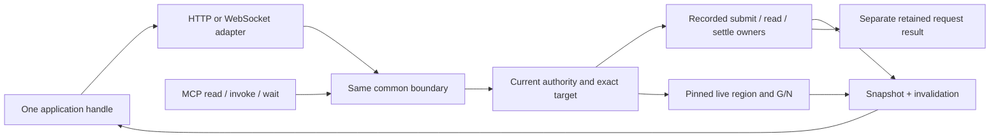

# Observe a scope, invoke acts, stay current

9 October 2026. Draft 1 for independent design review under request
`785a5447`, planner promise `0b4676c6`. The note selects the public API,
shared contract and builder slices. Source adoption, implementation,
runtime proof and publication remain separate from this design verdict.

Use one application handle. It discovers the pinned application, reads an
authorized view, invokes an act and watches that view. The application code
does not route socket frames or coordinate subscription races. Execution
guarantees belong to the installed application region, not its transport.

## 1. Existing source and the first useful slice

Inspected published main is `25467a36901817f18c792d350dede9765546168e`.
The critical product candidate `270ed0ee` failed its coordinated gate;
its source is not approved. Client watch `6839950b80e443620e3869e294d544c3734f41ef`
and factory `681757590186e1f0b9ca5226527d850171c2f917` are separate unlanded
successors. Their preparation evidence does not transfer formal approval.
F1's test-only successor `d51d16f4` fixed child-send selection, then stopped
at session issuance; its issuer excludes supporting membership@4. The
narrow correction is commissioned under `239238d0`, without a passing
factory acceptance claim. W1 independent feedback `f37b1a2e` requires
refresh-slot handoff, synchronous-cancel handling and notice/snapshot hash
comparison repairs before L1 adopts its lifecycle. The note specifies the
required behavior, not approval of those unfinished implementations.

| Current owner or symbol | What exists | Boundary retained |
|---|---|---|
| `ScopeHandle`, `declaredHandle`, `DeclaredHandle.intent/submit` | Native reads, exact definition checking, typed preparation and signed submission | No grant or guard is judged by a client |
| `ScopeHandle.settle/followReceipt/followDuty` | Exact recorded request and receipt reads | A head notice settles no request |
| `sessions.ts: Streams`, `worker.ts: stream/relay` | Authenticated native NDJSON head stream; one unread head and release | Read-only sessions; no historical event delivery |
| W1 `observeScope`, `completeSummary`, `openHttpHeadStream` | Subscribe-first snapshot lifecycle and context/cancellation guards | Current preparation source only; HTTP-specific opener |
| F1 `APPLICATION_COHORT`, `applicationValues`, `definitionClosure` | Explicit recorded-DO child factory cohort and retained closure | First native scenario stopped before application checks; corrected fixture pending; no live installer or Git custody |
| Head-aware query handoff `a4f7a082` | Bounded primary/list/publication design | Proposed endpoints/indexes and limits are not deployed |
| `parked/mcp` | Historical tool server; tools-only source capability | Inactive, not built or deployed; not a current MCP adapter |
| Shared-language note, sections 5–9 | Proposed live sessions, G/N, leases and snapshot/watch semantics | New grammar and executor remain implementation work |

The first complete recorded slice is an authorized native Summary watched
through W1. It is useful independently of the volatile executor and WebSocket.
Reuse it for counting. Do not make counting wait for a second transport.
Named live queries arrive with the shared interpreter. Bounded domain queries
follow their existing owner; no client predicate or full-history reconstruction
is added to this API.

## 2. Selected TypeScript shape

Choose callback consumption. `watch` returns one explicit disposable handle;
there is no parallel iterator, event bus or reactive framework API.
Keep `ScopeHandle` and `DeclaredHandle` as compatible lower-level primitives.
One new public application interface composes them; it is the same interface
for all execution regions and transports.

```ts
type Position =
  | { execution: "recorded-do"; scope: ScopeRef; definition: Digest;
      head: Head }
  | { execution: "live"; scope: ScopeRef; application: Digest;
      region: string; generation: string; revision: number };

type Selection = { kind: "summary" }
  | { kind: "query"; name: string; arguments: Record<string, FieldValue> };

type Snapshot<T> = {
  position: Position;
  value: T;
  complete: boolean;
  readAt: Timestamp;
  validUntil: Timestamp;
};

type View<T> =
  | { state: "connecting" }
  | { state: "current"; communication: "connected";
      snapshot: Snapshot<T> & { complete: true } }
  | { state: "stale"; communication: "connected" | "disconnected";
      snapshot: Snapshot<T>; reason: "newer" | "disconnected" | "incomplete" }
  | { state: "reset" }
  | { state: "blocked"; reason: "access" | "expired" | "unavailable"
      | "incomplete" | "gap" }
  | { state: "closed" };

type Invoked =
  | { execution: "recorded-do"; requestId: string; answer: Answer }
  | { execution: "recorded-do"; requestId: string; unknown: true }
  | { execution: "live"; requestId: string; result: LiveResult }
  | { execution: "live"; requestId: string; unknown: true };

interface Watch { close(): void; readonly done: Promise<void> }

interface Application<D extends ApplicationDefinition> {
  discover(): Promise<Discovery>;
  read(selection?: Selection): Promise<ReadView<StateOf<D>>>;
  invoke<K extends ActKind<D>>(kind: K, asked: ActInput<D, K>): Promise<Invoked>;
  watch(listener: (view: View<StateOf<D>>) => void): Watch;
  watch(selection: Selection, listener: (view: View<unknown>) => void): Watch;
  reconcile(requestId: string): Promise<Reconciliation>;
  close(): void;
}
```

These are proposed public types. `ScopeRef`, `Digest`, `Head`, `Answer`,
`Timestamp`, `Kind` and `AskedOf` reuse current contract/client meanings.
`ApplicationDefinition` is the existing native declaration or the selected
live region from the shared-language envelope. `ActKind`/`ActInput` select
the recorded or live types below. One interface is retained; a live item
never inhabits today's native integer `on`. No successful implementation
typecheck is claimed by this design.

```ts
type LiveItemRef = {
  scope: ScopeRef; application: Digest; region: string;
  generation: string; id: number;
};
type LiveExpected = Record<string, { item: LiveItemRef; revision: number }>;
type LiveRefusal = "unauthorized" | "expired" | "invalid-input"
  | "wrong-session" | "stale-expected" | "guard-failed"
  | "capacity" | "unsupported";
type LiveResult =
  | { result: "applied"; generation: string; revision: number;
      opened?: LiveItemRef }
  | { result: "refused"; reason: LiveRefusal }
  | { result: "reset" }
  | { result: "unavailable"; reason: string };
type ReadView<T = unknown> =
  | { ok: true; snapshot: Snapshot<T> }
  | { ok: false; reason: ReadRefusal | "reset" | "unsupported-view" };
type Reconciliation =
  | { execution: "recorded-do"; requestId: string; settlement: Settlement }
  | { execution: "live"; requestId: string; unknown: true };
type ApplicationDefinition = DeclaredDefinition | LiveRegionDefinition;
type ActKind<D extends ApplicationDefinition> =
  D extends DeclaredDefinition ? Kind<D> : keyof D["acts"] & string;
type ActInput<D extends ApplicationDefinition, K extends ActKind<D>> =
  D extends DeclaredDefinition ? AskedOf<D, Extract<K, Kind<D>>>
  : LiveAskedOf<Extract<D, LiveRegionDefinition>, K>;
type StateOf<D extends ApplicationDefinition> =
  D extends DeclaredDefinition ? Summary : LiveViewValue;
type LiveViewValue = {items:readonly LiveItem[]; effectiveReading:Timestamp};
type Discovery = {v:1; target:TargetBinding; definition:ApplicationDefinition;
  operations:readonly ("discover"|"read"|"invoke"|"watch"|"wait")[];
  selections:readonly SelectionSchema[];
  acts:readonly {kind:string; schema:ActSchema; action:string}[]};
```

For a recorded D, `ActKind<D> = Kind<D>` and `ActInput<D,K> = AskedOf<D,K>`.
For a live region D, its act keys are the kinds; derive fields from the
actual declared field map using the shared typed-value mapping. Open acts
have no `on`; transition acts require a `LiveItemRef`; all calls carry G and
`LiveExpected`. An empty expected map is legal only where the declaration
names no existing primary/also item. The ordinary facade supplies captured
G/session/pin, not expected revisions. The live extension to `ValueOf`
maps address/session/live-item/nullable exactly as the shared-language
validator, without changing recorded `FieldValue` or native fact types.
`StateOf<D>` is native Summary for a recorded D; for a live region it is
`{items: readonly LiveItem[]; effectiveReading: Timestamp}`. Each LiveItem
has its full LiveItemRef, declared type/state, item revision, permitted
parties/refs/values. No native opening fact is manufactured. A named query
returns its declared projection and completeness. Counts cover only the
authorized query universe; do not disclose hidden subjects through totals.
Live refusal reasons are a closed schema: unauthorized, expired,
invalid-input, wrong-session, stale-expected, guard-failed, capacity and
unsupported. A caller without read authority gets no current position
or detailed existence information. Wrong G yields Reset only after the
context is legitimately identified; otherwise refuse access.

`Discovery` contains full identity, exact declaration/pin, schema version1,
region execution, supported selections and operations, and actual query/act
schemas with required action names. Authority hints are explanatory;
invocation still judges grants. `reconcile` on a live handle is a local
unknown result: no new server settlement endpoint or replaying lookup.
`LiveRegionDefinition`, `LiveAskedOf`, `LiveItem`, SelectionSchema and ActSchema
are the shared-language schema/field mappings delivered by its compiler
owner; reuse them rather than define another live grammar in the client.
Their live item/on/expected/default/nullability semantics are fixed above.
The public opener returns `{ok:true,application:Application<D>}` or
`{ok:false,reason:ReadRefusal|"definition-mismatch"|"unsupported-region"}`.
Its signature preserves the caller's exact definition literal:

```ts
declare function openApplication<const D extends ApplicationDefinition>(
  scope:ScopeHandle, definition:D, authority:ApplicationAuthority
): Promise<{ok:true;application:Application<D>}|
  {ok:false;reason:ReadRefusal|"definition-mismatch"|"unsupported-region"}>;
```

ApplicationAuthority is a plain private configuration value: trusted
origin/deployment/membership/member/key context, existing Signer, legitimate
`authenticate():Promise<SessionResult>`, and optional reviewed request-custody
adapter. Live opening uses that signer for the selected challenge proof;
its credential is kept in private handle state with redacted diagnostics.
Transport preference is one optional advanced enum, auto/http/socket;
auto selects a supported socket after checked discovery, otherwise HTTP.
Selection happens before sending a request. It is not failover after an
unknown invocation, nor a change to execution guarantees. No connection,
session or transport factory class is required in application code.

The opener is `openApplication(scopeHandle, definition, authority)` and
returns a checked result containing `application`. The authority is one
plain options value with the existing signer, exact trusted deployment/context,
read-session callback and recorded request-custody adapter. It is not a
new per-transport session class. Region selection, when necessary, is explicit
at open; the default recorded region is the actual native definition.
Discovery reports unsupported regions instead of silently downgrading them.
The authority callback returns the existing checked `Session` result.
Validate its deployment, membership fullref, member and key against trusted
bootstrap context before use. Add a narrow internal `ScopeHandle.withReader`
copy helper so a renewed session supplies fresh read handles over the same
transport; do not reinterpret existing constructor readers as callbacks.
Freeze the captured context. Close the previous application when it changes;
no old callback may repaint the newly selected scope.

```ts
const opened = await openApplication(scope, counting, authority);
if (!opened.ok) return showUnavailable(opened.reason);
const app = opened.application;
const observation = app.watch(renderBoard);

// `board` is the exact row the person selected in a complete snapshot.
const serial = board.values["serial"];
if (typeof serial !== "number") return showUnavailable("invalid board");
const result = await app.invoke("pause", {
  on: board.id, expected: { on: board.revision },
  fields: { nextSerial: serial + 1 }
});
renderActResult(result);
// Unknown recorded result: keep its custody; reconcile deliberately.
// Closing the view does not withdraw the signed act.
observation.close();
app.close();
```

This example uses the actual Counting pause field and native `on` expected
revision at C0 `af33638b`. A form captures its selected
full reference, pin, values and revisions. The caller supplies the expected
map; refresh never replaces it, signs again or retries a refused act. A
stale form stays a stale form until the person deliberately refreshes it.

Before recorded submission, prepare through `DeclaredHandle.intent`, retain
the exact signed envelope, grants and side bytes privately, and verify the
custody adapter's readback. Failure to retain means no POST. `invoke` returns
its stable local request ID. An unknown result keeps that record and exposes
`reconcile`, which calls existing `settle` and follows the exact receipt.
`not-found` is not definite absence. Any authorized retry uses the saved
bytes and original binding, not a freshly prepared request. This adapter
belongs to existing request/device custody work; the observer adds no outbox.
The custody interface is `retain(prepared)`, `read(requestId)` and
`recordAnswer(requestId, answer)`, each asynchronous with definite success
or refusal. `prepared` contains exact origin/deployment/fullref/pin, signed
intent, original grants, side bytes and operation discriminator, plus a
digest of its canonical record. Namespace records by member/key and scope;
readback must match every byte/binding before the first send. The existing
private-custody owners must provide reviewed storage/locks/quotas and reload
recovery; the current client has no generic persistent request journal.
Keep unresolved records pinned; quota failure blocks new sends. An app
without such an adapter may read/watch, but recorded `invoke` refuses
before signing/sending rather than offer undocumented reload durability.
Preparation capabilities are explicit advanced operations through existing
`preparationOf/sendPreparation`; invoke never silently runs a preparation
step, changes its expected revisions or consumes a different signed act.

Distinguish a received first-attempt service refusal from refusal recovery.
A directly correlated first response can be known without a recorded refusal
entry; native settle cannot recover a lost refusal. The ordinary current
Fetch ABI exposes only status/body, so it does not establish redirect/response
identity. The new facade's private HTTP adapter must require redirect:error,
actual response URL/redirected/MIME metadata, exact request closure and bounded
Answer parsing before marking that first response known. Use the same narrow
trusted-response seam being prepared by U1; do not add a refusal journal to
Core. Trusted service bindings and correlated socket replies use their actual
owning boundary instead. An earlier inflight/unknown attempt remains unresolved
even if a later POST returns refused. Persist inflight before POST and known
answer afterward; reload cannot manufacture a fresh first-response ticket.

## 3. One semantic contract and transport inventory

Identity is the configured deployment plus full ScopeRef, actual definition
or application pin and region. Native heads and live G/N are disjoint types.
Discovery, view read, act invocation and observation use those same identities
and refusal meanings across adapters. A view and an invocation have separate
correlation IDs; a frame sequence is not an application revision.

| Adapter | Invoke | Snapshot | Watch | Bounded wait | Continuity aid | Unsolicited output |
|---|---|---|---|---|---|---|
| Current HTTP | Signed native act | Native reads | Native head NDJSON; W1 client prepared | Not a public wait method today | Current reread; no stream replay | Head stream |
| Current service binding | Existing ScopeApi | Existing ScopeApi | Public ABI absent | Public ABI absent | Explicit reads | Absent |
| First WebSocket slice | Same signed native envelope | Same authorized snapshot | Invalidation plus automatic reread | Cancelable wait over same observer | Resnapshot | Authorized watch frames |
| Planned live executor, HTTP/WS | Same live-intent contract | G/N snapshot | Snapshot/invalidation; no body delivery claim | Current generation only | Optional bounded aid | Declared best-effort outputs |
| First current-model MCP slice | Prepared native call via common owner | Explicit resource/tool read | Not required initially | Explicit tool, bounded | Returned position then reread | Optional only after capability/host proof |

WebSocket is the preferred frequent-interaction transport once implemented.
HTTP streaming remains a live transport and the immediate recorded slice.
Plain HTTP and agent callers remain useful through explicit snapshots and
bounded waits. Service-binding streaming and MCP notifications are deferred
until their actual adapters exist; compatibility is not a guessed capability.

The MCP source inspected here is parked. Its tools-only capability and
stateless historical handler cannot establish a negotiated deployed version
or host notification behavior. The current specification changed in
2026-07-28: long-lived notifications use `subscriptions/listen`, while
2025-11-25 resource subscriptions use `resources/subscribe`. Match the
actual supported revision and host capabilities before advertising either.
A received notification does not schedule an agent turn.
[Current resources](https://modelcontextprotocol.io/specification/2026-07-28/server/resources),
[current Streamable HTTP](https://modelcontextprotocol.io/specification/2026-07-28/basic/transports/streamable-http),
[earlier resources](https://modelcontextprotocol.io/specification/2025-11-25/server/resources).

## 4. Watch and local-view lifecycle

Use authoritative snapshots and invalidations first, not typed patches.
For recorded Summary, register/open the native stream and receive its first
validated head before requesting the snapshot. Every later commit is covered
by that snapshot or makes its registered head notice newer. Coalesced heads
are sufficient for current state, not event delivery. W1 already owns this
lifecycle and must remain the implementation owner.

One complete read runs at a time. A notice during a read marks it dirty;
the result is retained as stale if newer state is known, then reread. A
lower head cannot replace a higher one. Same position/different hash,
incarnation or pin mismatch blocks the view. Paged components must share
the same owner head and finish within the selection's bounds. Partial data
may be shown as partial; it cannot become current/complete by reaching a
client loop limit. Several scopes retain separate positions, not a Room head.

`validUntil` is the earliest session/read window or a 30-second observation
freshness deadline. Client expiry makes a view stale and schedules a read-only
status/read; it never calls a presence Renew. A received head is not an
authorization renewal. Current means complete at the returned position and
covering every observed invalidation while continuity remains valid, not a
claim that no concurrent mutation can now occur. Effective lease deadlines
may make live rows logically absent sooner, without incrementing N.

For live snapshots, complete asynchronous authorization/resolution first.
Then enter a synchronous local serialized turn: recheck G, pin, source and
permission windows; take the bounded snapshot and register the watcher at N
without an await between them. Mutation N+1 is offered after that watermark.
Transfer overflow, missing frames or reset breaks continuity visibly.
Presence may coalesce. Messages are read from the bounded authorized view;
no coalesced stream is presented as complete delivery of message bodies.

Disconnect retains a recorded snapshot visibly stale. Reconnect uses a new
authorized subscription and actual snapshot, with bounded backoff. Expiry
renews only through the legitimate authority callback. Forbidden renewal
blocks and suppresses private content; EOF alone does not prove revocation.
Context switch or close invalidates the old emission token before aborting
resources. A late opened body is disposed once; `done` does not depend on
an ignoring upstream accepting physical cancellation. W1's exact683
same-turn correction is retained.

## 5. Durability, sessions and generation loss

Recorded invocation preserves native signatures, grants, expected revisions,
commit/receipt gates and exact-request submit/settle recovery. Observing its
head on a socket adds no command receipt. Volatile Applied means only local
application at G/N; state, timers, messages and dedup aids can disappear.
Lost response plus generation reset remains unknown. No offline queue,
automatic speech replay or transparent old-G resubmission is introduced.

Cloudflare hibernation can retain a socket while discarding in-memory state.
Therefore socket-open cannot mean generation-current. On a new object run,
mint fresh G for each volatile region and invalidate old-G sessions/views.
Use hibernatable sockets with only bounded public routing metadata in their
attachments, not application state, dedup results or private credentials.
Before private output or act admission, require fresh authentication. Send
a payload-free reset/reauthentication control to attached sockets; clients
discard volatile data and never renew or Enter by implication. The detailed
challenge, refresh and attachment schema remains to be completed in this draft.
[Cloudflare hibernation](https://developers.cloudflare.com/durable-objects/best-practices/websockets/).

Existing read sessions stay read-only. Recorded acts remain signed. Live
action authority requires the proposed session-bound proof and current
action/read checks in the shared-language note; a socket ID or read token
is insufficient. Each tab/device/agent has a distinct live session owner.
Presence Renew is an explicit declared act, not a ping effect. HTTP clients
reuse their bounded session without Enter on every call. Session end and
lease expiry bound missed disconnects; transport reopening restores neither
attention nor ownership.

Current native session verification does not reread key/member standing on
each private output. A token remains valid until its issued end, at most600
seconds on membership's clock plus reading-clock difference; revocation blocks
new issuance. The L1/recorded wrapper preserves that rule. Tests for revoked
native read access must reach its actual window rather than claim immediate
rejection. Proposed live120-second sessions and known-revocation checks are
separate adopted-implementation duties, not an existing native guarantee.

## 6. Builder slices and decisive acceptance

1. Extend W1's owner with the checked application facade and callback watch;
   reuse `handle.ts`, `declared.ts`, `session.ts`, `observe.ts` and
   `head-stream.ts`. Record exact pending-request custody integration.
2. Add the small common view/invoke/wait contract in `packages/contract`,
   then HTTP/service-binding adapters in client and Scope. Domain query
   projection remains with the head-aware query owner.
3. Add WebSocket framing in the Scope Worker/Object and a private client
   adapter. Delegate admission/reads to the same native boundary; preserve
   old HTTP, CLI and Page callers. No old definition pin changes.
4. Implement live sessions, executor and named queries through durability
   infrastructure request578 and the shared-language owner. Add the same
   public facade with typed live operands/results and generation reset.
5. Add a current-model MCP read/invoke/bounded-wait adapter, then optional
   notifications only after actual revision and host evidence. Do not revive
   the parked Room engine.

| Meaningful boundary | Required observation |
|---|---|
| Concurrent recorded read/subscribe | Commit is in initial snapshot or makes it stale and automatically refreshes |
| Pending recorded act | View refresh cannot settle it or replace its confirmation barrier |
| Lost recorded response | Same privately retained signed envelope/grants/side bytes reconcile once |
| Live generation lost with socket open | Reset visible; obsolete state and old-session writes rejected |
| Slow reader/incomplete page | Gap or incomplete visible; no current/complete delivery claim |
| Authority across adapters | Expired/revoked/foreign context cannot disclose or invoke |
| Poll/MCP without notifications | Explicit bounded read/wait remains useful, with transient-history limits |
| Cancel/reconnect | Resources released once, old repaint suppressed, no duplicate effects |
| Two clients | Authorized recorded views converge; volatile reset discards old G on both |

Use a few deterministic client cases plus native serialized handoff and
authority boundaries where changed. Reuse existing W1 and native stream
witnesses; add no per-guard sweep. Builder runs affected checks and one
coordinated source gate before normal review under `docs/testing.md`.
No checkout tool installs or broad benchmark project. Any later latency
comparison is bounded and on the same actual deployment.

## Selected wire and session decisions

These are the selected public semantics for independent design review.
The source implementation and its evidence remain separate work.

- The first socket serves one full host scope, with at most four watches
  across its explicitly installed regions. No multi-scope connection or
  cross-scope frame order is introduced. Version is `artroom-observe-1`.
  Authenticate in the first private message, not URL query parameters.
  Validate the configured Origin before upgrade. No snapshot or act runs
  before authentication; close an unauthenticated connection after five
  seconds. A read credential authorizes only reads.
- Correlated operations are `discover`, `read`, `invoke`, `watch`, `wait`
  and `close`. Requests have a bounded connection-local ID; watch IDs name
  subscriptions, not authority. `invoke` carries the existing native signed
  envelope/grants/side bytes or a separately signed live envelope. Closing
  a wait/watch releases observation, not the admitted act. One unknown
  invocation keeps its request identity independently of reconnect.
- Keep the existing HTTP request cap of 1MiB. The initial socket's ordinary
  control/act frame cap is 32KiB, checked before JSON parsing; this cannot
  prevent the runtime's initial frame allocation. Select HTTP before sending
  a larger recorded envelope. Never try another adapter automatically after
  an uncertain send. Snapshot output uses the shared-language indexed
  transfer: 20KiB raw parts, at most64, at most1MiB total, one digest and
  one frozen position. Existing 8MiB/16-transfer reservations remain the
  proposed live snapshot cap, not physical-capacity proof.
- A native bounded wait opens the same authenticated head subscription,
  compares its first head to the caller's exact position, and returns the
  newest authorized snapshot after a change or at a 30-second deadline.
  Limit32 waiters within the existing64 stream slots; cancellation calls
  the same once-only release. This is a proposed new common operation,
  not today's `waiting/:list` incident read. Polling can miss transient
  states and returns no event-history claim.
- A live session challenge expires after30 seconds and binds the configured
  deployment, full scope, application pin, region, G, nonce and request ID.
  The device signs those values plus its key and requested bounded actions
  in domain `artroom-live-session-1`. The server checks possession and
  actual current membership/delegation before issuing an independent public
  session handle and private credential. Its lifetime is at most120 seconds
  and no later than its admitted read/action windows. Every live invocation
  signs domain `artroom-live-intent-1`, the same full binding, public session,
  request ID, act/on/expected/fields and deadline; present its private
  credential only in the adapter's private authentication channel. A
  credential without the device signature cannot invoke.
- Socket restart/hibernation retains only bounded public routing metadata.
  A new object run sends a payload-free reset/reauthentication control;
  after successful fresh authority checks it reports the new G. The client
  discards old live values immediately, cancels speech and retains an
  unknown old-G act as unknown. Read-only status traffic may reveal reset;
  it neither renews presence nor repeats Enter. Hibernation can reset idle
  live state before its nominal lease deadline: that is permitted by zero
  durability and must be stated in operator/user documentation. Clients
  mark observation stale when its bounded freshness period ends even if
  the socket is still open. No heartbeat promises generation survival.

## Exact adapter contract and implementation mechanics

The proposed versioned `ApplicationPort` is one flat service value with
`discover`, `read`, `invoke`, `observe` and `wait`. Keep current `ScopeApi`
unchanged: HTTP and binding transports that implement only it continue to
work, and advertise no new method. The facade adapts the current native
Summary/W1 path first. Server-side expected-fullref read binding is a new
operation; today's GET summary validates the reader and returns its actual
ref, which W1 then checks. Do not describe that client check as a currently
implemented pre-disclosure server selector check.

Every new port request includes `v:1`, exact target ScopeRef, native pin or
application/region binding, and an operation-specific body. Every read
checks that identity against actual stored scope/application before private
output. Reads and invokes use the same permission/resolution/admission owners
regardless of adapter. An application-level refusal is a normal typed result;
malformed framing is a protocol error, and a lost invocation response is
unknown. A cancelled read is no assertion that a sent command was cancelled.

Proposed HTTP extension under the current scope route family:

| Route | Operation |
|---|---|
| `POST /v1/scopes/:scope/observations` | Versioned discover/read/wait request, with read credential in Authorization |
| `POST /v1/scopes/:scope/observations/watch` | Authorized snapshot/watch NDJSON transfer, same target/selection body |
| `GET /v1/scopes/:scope/socket` | Origin-checked WebSocket upgrade, credentials in first private frame |
| `POST /v1/scopes/:scope/live-sessions` | Bounded challenge/proof/refresh for an installed live region |
| `POST /v1/scopes/:scope/live-acts` | Exact signed live invocation and private session credential |

Recorded invocation continues to use `/acts` and `/settlements` and native
ScopeApi methods. WebSocket forwards those same values to the same methods;
it does not turn its authenticated read token into the signer. Existing
routes retain their old shapes and meanings. All new routes are proposed;
actual unknown routes return unsupported/not-found until installed.

Choose text JSON WebSocket frames with exact own-key schemas:

```ts
type TargetBinding =
  | { execution:"recorded-do"; scope:ScopeRef;
      definition:Digest | PlatformDefinition }
  | { execution:"live"; scope:ScopeRef; application:Digest;
      region:string; generation:string };
type InvocationBody =
  | { execution:"recorded-do"; signed:SignedIntent;
      grants:readonly Grant[]; beside:Beside }
  | { execution:"live"; signed:SignedLiveIntent };
type OperationBodies = {
  discover:{target:TargetBinding};
  read:{target:TargetBinding; selection:Selection};
  invoke:{target:TargetBinding; request:InvocationBody};
  watch:{target:TargetBinding; selection:Selection};
  wait:{target:TargetBinding; selection:Selection;
    after:Position; waitMs:number};
  close:{watch?:string; request?:string};
};
type RequestFrame = {[K in keyof OperationBodies]:{
  v:1; id:string; op:K; body:OperationBodies[K]
}}[keyof OperationBodies];
type ReplyFrame = { v: 1; id: string; result: OperationResult };
type NoticeFrame = { v: 1; watch: string;
  notice: "invalidate" | "reset" | "blocked" | "closed";
  position?: Position };
type PartFrame = { v: 1; id: string; watch?: string; snapshot: string;
  part: number; parts: number; bytes: number; digest: Digest;
  data: string }; // bounded unpadded base64url raw snapshot part
```

OperationBodies and OperationResult are the tagged common port types, not
arbitrary topic payloads. IDs are at most64 ASCII characters; new invocation
IDs are independently random128-bit values, while a native idempotency key
keeps its current native constraints. A pending frame ID cannot be reused.
Record answers by that ID, never by last frame received. Watch notice order
is per region/position; a connection supplies no order across regions.
Close names its watch or pending read ID. Unknown version/binary/oversize/
duplicate-key/wrong-shape frames close as protocol errors without invocation.
Authenticate frames use a separate fixed schema `{v:1,auth:{...}}`, cap8KiB,
and never enter public reply/debug serialization.

Each OperationResult is exactly the discover/read/invoked/view/wait/closed
result defined here; decode it against its correlated operation, not a
permissive union. Close requires exactly one watch or request ID. Wait uses
integer0…30000ms and an exact same-binding Position; movement returns reset/
changed with a new authorized view, never a false no-change result. The
initial `openApplication` discovers through the authenticated native host
and its installed region manifest before obtaining a live G-bound session;
subsequent live port operations carry that actual current G. Reauthentication
may reacquire a new read-only view automatically after visible Reset, but
cannot transfer an old form/act's G or issue its rejoin/write.

The first WebSocket implementation admits four in-flight operations and four
watches per connection within64 total scope watchers. No more than32 native
waits share that64-slot cap. Allocate the socket/watch IDs only after bounded
shape/rate checks. Use the shared-language256KiB per-watcher queue and8MiB
aggregate ceiling; a snapshot buffer has its separate8MiB/16-transfer cap.
Reserve before copying and release on every finish, cancel, reset and timeout.
When an authorized invalidation cannot fit, mark gap/reset and end the watch;
never keep an unbounded queue behind a slow reader. These are selected initial
design limits, without throughput or physical-memory evidence.

Native read/response bounds remain unchanged, including HTTP client's current
4MiB reply cap. The new assembled observation is capped at1MiB and supports
only a selection that fits. Larger existing history/retained reads remain
available through the explicit lower-level API. Read size preflight and work
budgets belong to existing query/retention owners; a post-serialization size
check is not preallocation protection. One scope's callback processing yields
under W1's16KiB/32-head-frame fairness rule. Server live judgments use the
shared bounded batch of16 before yielding to queued recorded turns.

Recorded client state machine:

```text
capture immutable application/context; retire old emission token
authenticate current reader; open owned native subscription
await first validated head; mark dirty
while not closed:
  if dirty and no read in flight:
    clear dirty; read actual authorized complete selected view
    validate fullref/pin/head and same-head completeness
    if lower/mismatched: block; preserve request custody separately
    if incomplete: retain explicitly partial/stale, never current
    if newer notice or subscription ended: emit stale; dirty = true
    else emit current at returned head
  on newer notice: latest = notice; dirty = true
  on EOF: abort attempt; emit stale; bounded reconnect then resnapshot
  on observed forbidden: suppress private content; block
close: invalidate emissions first; abort/read-dispose/release once
```

Reconnect delays are 250ms,1s,2s, then5s maximum with bounded jitter. Stop
after five consecutive failed attempts as unavailable; a new explicit watch
can restart. Each reauthentication/open/first-head/read has a30-second limit,
bounded by credential end. Busy-scope dirty reads yield between attempts;
emit valid stale data instead of hiding it until traffic ceases. No reconnect
path prepares, invokes or settles an act.

Live server handoff and wake:

```text
resolve exact subject and current read/action observations asynchronously
enter local serialized turn; no await or subscriber callback inside
recheck G/pin/source/session/end/observation binding
reserve snapshot and bounded watcher transfer resources
freeze complete selection at G,N; register watcher after N; exit turn
recheck permission before each private output part
on apply: publish invalidation N+1; on overflow: break continuity visibly
on new object run: fresh G; old live sessions/admission invalid
send payload-free reset/reauthenticate to attached connections
reauthorize before any private view; old-G invocation stays Reset/unknown
```

Live session-open proofs bind the challenge and requested action set exactly;
Ed25519 signs domain, newline and canonical JSON, following existing byte
helpers without reusing the native intent domain. A challenge is single-use,
max64 outstanding per logical scope. Its reply may be recovered from a bounded
same-G private challenge result aid; losing that aid supplies no session
recovery promise. Reopen explicitly obtains a new session, with no automatic
Enter or ownership transfer. At most256 sessions/16 per actor use the
shared-language caps. The live credential uses a separate versioned MAC
domain over those actual claims; reuse the configured secret owner with
domain separation, not a credential exposed through an attachment or URL.
Action observation refresh failure blocks admission. These choices do not
upgrade current300-second reusable membership windows to instantaneous
global revocation. Observed revoked authority stops admission/output; already
sent bytes cannot be recalled.

```ts
type LiveChallenge = {v:1; deployment:string; scope:ScopeRef;
  application:Digest; region:string; generation:string;
  challenge:string; nonce:string; ends:Timestamp};
type LiveSessionRequest = {v:1; challenge:LiveChallenge; actor:KeyId;
  actions:readonly string[]; operation:string};
type SignedLiveSessionRequest = {request:LiveSessionRequest; sig:Base64Url};
type LiveIntent = {v:1; deployment:string; scope:ScopeRef;
  application:Digest; region:string; generation:string; session:string;
  actor:KeyId; requestId:string; kind:string; on:LiveItemRef|null;
  expected:LiveExpected; fields:Record<string,FieldValue>; notAfter:Timestamp};
type SignedLiveIntent = {intent:LiveIntent; sig:Base64Url};
```

Challenge/G/session IDs are fresh128-bit unpredictable values, bounded by
the declared96-character public-handle cap. Requested actions are at most32
distinct bounded native action names, without wildcard expansion. Session
claims add actual resolved MemberRef/principal/key, checked read/action
windows and the exact above binding; those are resolved by the server, not
copied from caller member handles. MAC claims bind them in domain
`artroom-live-session-token-1`. A current live signature plus credential
proves possession and session binding; current action observations still
decide permission. Protocol/source owners validate the exact canonical bytes
and size/depth bounds before interpreting them. N and item revisions are
safe nonnegative integers; item allocation begins at1; overflow resets G
before unsafe arithmetic rather than wrapping an old reference.

Native reconciliation remains existing session-free `ScopeApi.settle` over
HTTP or service binding, even when the original submit used a socket.
The initial socket adds no competing settlement implementation. An
unavailable Answer keeps custody unresolved; an accepted receipt is followed
by its exact fact, not replaced by latest view. This note adds no cross-device
private journal synchronization: its existing identity/custody owner must
deliver that separately. New devices may observe legitimate recorded state
without possessing another device's original pending envelope.

Client pause/cancel of media precedes disposal on G/context reset. A live
request with no whole reply returns unknown and is never queued for automatic
replay. Within a surviving G, deliberate exact retry can use the declared
bounded dedup aid; after aid expiry it may duplicate and needs a fresh user
decision. A new G requires the application's explicit new-invocation/rejoin
policy. A live reconciliation call issues no retry and returns unknown.

## Same affordances for presence, messages and polling

The following use the proposed shared-language declarations, not today's
native validator. `subject` is a checked ContentAddress resolved from an
existing scope/item/exact-version route, never an arbitrary fetched URL.
`liveAuthority` privately supplies the legitimately opened live session.

```ts
const opened = await openApplication(host, presenceRegion, liveAuthority);
if (!opened.ok) return showUnavailable(opened.reason);
const presence = opened.application;
const watch = presence.watch({kind:"query",name:"presentAt",
  arguments:{about:subject}}, renderPresence);
const entered = await presence.invoke("Enter", {
  expected:{}, fields:{about:subject,status:"busy",focus:[subject]}
});
// If Applied, retain its actual full live ref and item revision from a
// checked read/result; Renew names that same session-owned item explicitly.
// Reset discards it; it does not run Enter again.
watch.close();
presence.close();
```

Message bodies use the same handle and their declaration's Say/Reply acts.
A Say names the exact subject, bounded payload and validated recipients.
Reply captures the selected parent's full LiveItemRef and expected revision;
reset/unreadable parent refuses rather than choosing a new conversation.
An Applied result describes local application, not delivery, receipt or saved
speech. Read the current authorized message query; no notification stream
silently stands for complete retained body delivery. The shared-language
message query and argument types are carried unchanged at implementation.

The first MCP slice supports four tools: `artroom_discover`, `artroom_read`,
`artroom_invoke` and `artroom_wait`. They call
the common port with full typed target/pin/region; invoke requires the exact
request identity and separately owned signer/prepared-request custody.
The server never signs as a member from a read token. A host unable to own
private signing/custody gets read/wait tools and an honest invoke refusal.
Resources expose authorized current views at existing scoped route URIs;
the contents carry the verified typed full identity/position. URI names alone
are neither incarnation pins nor authority. Optional content selectors remain
with the URI/read owner, not invented chat topics.

```ts
// `target` is the checked TargetBinding; `previous` is a successful read.
const arguments_ = {target, after:previous.snapshot.position,
  selection:{kind:"summary"}, waitMs:30000};
const result = await callMcpTool("artroom_wait", arguments_);
// A plain HTTP client sends the same operation body through its adapter:
const response = await fetch(`${origin}/v1/scopes/${target.scope.scope}/observations`, {
  method:"POST",
  headers:{"content-type":"application/json",authorization:session.reader()},
  body:JSON.stringify({v:1,op:"wait",body:arguments_})
});
```

`callMcpTool` is the host's normal versioned tool-call adapter, not a new
Artroom session class. Read and validate the bounded response through the
same common result decoder; the naked fetch illustrates framing, not a
replacement unbounded client implementation. The result is a current view or
typed refusal/timeout with its position, not all intervening events. Repeat
reads/waits deliberately when the agent is scheduled. The MCP integration
owner records actual request metadata/version and host behavior before
enabling notifications. Support2026-07-28 per-request metadata and
subscriptions/listen only when actually negotiated/supported;2025-era
initialization/resource subscriptions stay a separate tested compatibility
adapter. No host notification support is assumed for the first read/wait slice.

## Compatibility, source map and resolution points

| Slice | Exact source responsibilities | Dependencies and resolution |
|---|---|---|
| L1 recorded facade | New `packages/client/src/application.ts`; `handle.ts` internal reader-copy; reuse `declared.ts`, `observe.ts`, `head-stream.ts`, `session.ts`; client exports/docs | W1 owner; integrate existing narrow custody adapter before invoke. Counting may keep its already-owned API while this wrapper is reviewed |
| L2 common observation/wait | New contract `application.ts`/`transport` extension; Scope `reads.ts`, `sessions.ts`, `object.ts`, `worker.ts`; client HTTP/binding adapters | Scope/authority/query owners review exact identity/disclosure operation. Existing ScopeApi remains compatible; no old pin gains meaning |
| L3 WebSocket | New private client adapter and Scope socket framing/watcher module; Worker upgrade and Object event dispatch | Reuse L2 owners/admission; implement Origin/auth-first, quotas and exact unknown-request handling before public capability |
| L4 live region/session | Shared-language validator/interpreter plus new Scope live executor/session modules; typed live client mapping |578 durability owner and reviewed installation manifest/authority choices; existing F1 supports recorded-do only. Recorded commit/outside ports remain unchanged |
| L5 MCP | New current-model MCP adapter/package; current CLI wiring only after release review | Existing public-tools/MCP owner; no import of parked Room code. Verify SDK/request revision and actual chosen host before notification capability |

Contract additions include exact LiveItemRef/position/result/session domains,
operation-tagged bodies and frame validators; bytes helpers own canonical
domain/signature/MAC encoding. No application rule runs in a socket or MCP
adapter. An implementation chooses internal file layout within these named
packages; it cannot defer the public semantics back to another architecture
round. Normal independent Source review owns actual emitted code/pins.

Scheduling: finish current gate-failure/test-economy and F1/W1/U1 work first.
L1 may follow W1 without waiting for live execution; L2 and L3 follow common
contract review, using spare existing owner capacity. L4 needs its shared
language/session adoption, and L5 needs the current-model public-tools
boundary. No broad new cloud agent, provider, audio or benchmark run is
commissioned by this note. The contest counting path does not depend on L3–L5.

Open evidence premises have named resolution points: the authority owner
must verify live admission/read windows and the signer/custody boundary at
L2/L4 review; query/R4 owners must prove preallocation/capacity at actual
implementation; MCP owner must record negotiated/deployed host behavior
before L5 notifications; provider/runtime owner proves hibernation/reset
at L3/L4 focused acceptance. These are verification duties, not alternative
public API designs. The chosen interface, callback consumption, snapshot/
invalidation model, request recovery and transport-independent durability
remain the decisions of this note.



The simplifications are deliberate: one handle, one callback watch, bounded
snapshots rather than patches, one scope per socket and existing native
settlement. Their limits are explicit: no historical message-delivery stream,
no joint Room head, no instant cross-scope revocation, no generation survival
from an open socket, and no transport-selected durability. These limits do
not remove the full browser/workspace/device or test-economy obligations.
