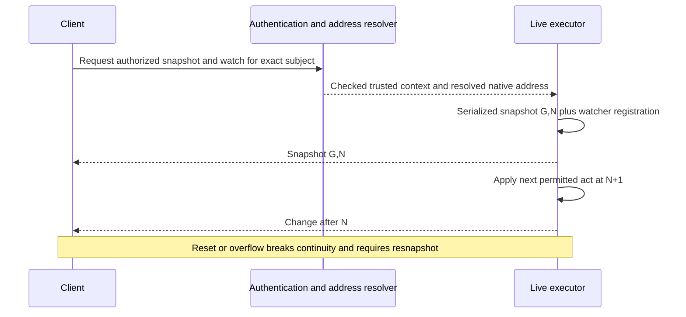
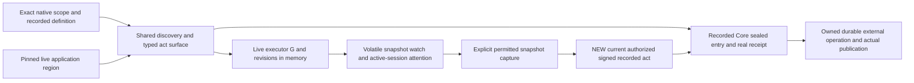

# Shared application language and volatile acts

9 October 2026. **Proposed design and implementation plan; no runtime adoption.**
Request `f5b286d71a3243c809d152fd7cd95e6d945e4256`, promise
`1fcb44a526683a7ebbfabbd02331773518c69e09`, preserves original
`8a13f7b84eae5d2656a49352300fccf66696280f`.
Artroom baseline `9d7e4c2777ea8d35441b4a9d79b407cd701065fa`, tree
`e3e9e0099bc097a0b1bebbed9c932608ffb2eb05`. Amended on the same date under
durability infrastructure request `578edf653772749b5fa9b47f6782f6db4d0ab720`
and planner promise `aa3d387b595f6cfe553ddb993cb9fd0043b10a3e`.
That request commissions bounded implementation/planning; this amendment is its
design/source-plan artifact, implements nothing and adopts no protocol. Keep
the seven current correctness repairs and their coordinated gate ahead of
runtime expansion. The original full volatile brief and all 14 sections remain.

## 1. Guarantees, goals and current foundations

Use **one live act profile** for presence, messaging and other live coordination.
These are applications expressed in shared items/acts/guards/effects/timed forms,
not separate mandatory signal, chat and live-act APIs. The guarantee is **ZERO
durability**. Any live state, recent messages, deduplication aid or timer may
vanish at any time, including immediately after an Applied response.

| Result or observation | Meaning |
|---|---|
| Applied | The act changed volatile state in generation G at revision N. It says nothing about subsequent retention, readers or publication. |
| Saved | Use only when a separately specified local/device store actually saved bytes. It is not this profile's server result. |
| Recorded | The ordinary native entry was sealed and committed through existing Core/SQLite semantics; use its actual receipt. |
| Published | The destination's actual publication evidence satisfies the current operation/lane contract. A Git push alone is insufficient. |
| Reset | This generation/cursor/old live reference cannot be resumed. Rejoin and resnapshot; a previous lost act may have applied. |

No guaranteed history, broadcast reception, offline inbox, continuity of leases,
timer execution across reset, durable exactly-once result or outside effect is
provided. Malformed or unauthorized acts are still refused; amnesia is not
permission to skip judgment. Presence is advisory attention, and a message is
speech, never a native review, grant, commitment or Merged decision.

Current source provides declared item types, fixed/required slots, act grants,
guards, conditional effects, sends and timed transitions
([definition.ts](../packages/contract/src/definition.ts)). Its `profile` selects
the rules language. Current `Intent.expected` names item revisions; `FactRef`
names a sealed entry; the receipt is built **after sealing**. Core/Turn writes
canonical entry bytes/hash, retained inputs and folded state in its storage
transaction before background work. `applyEntry` enforces sequence/previous
hash, one opening whose item ID is the entry sequence, durable fact/attribution
and send/operation accounting. Memory replay of that same fold still models
recorded history. Replacing a `Store`/derive state adapter with memory therefore
does not implement a volatile act contract.

Current authenticated head streams observe durable heads and lose their stream
subscriptions on restart. They are not a volatile application executor.
`change` becomes Merged through the actual published destination outcome;
deferring external Git publication does not weaken its prior SQLite durability.
See [Store](../packages/scope/src/store.ts),
[Turn sealing](../packages/scope/src/turn.ts),
[Core receipts](../packages/scope/src/core.ts),
[fold](../packages/derive/src/fold.ts),
[streams](../packages/scope/src/sessions.ts) and
[publication transition](../packages/lanes/src/change.ts).
This is a targeted source audit, not full runtime/deployment verification.
Physical scope combining is out of scope. Persistent-state-only execution is
not a prerequisite or additional initial mode.

### The two establishment questions

Person-facing policy asks only **What must survive?** and **Does confirmation
wait for local application or JOURNAL COMMITMENT?** The application author and
legitimate establishment authority limit the legal answers; a participant may
choose only among those declared options. Discovery explains their actual
barrier. It does not expose a collection of archive/publication switches.

| Legal established contract | What must survive? | Confirmation barrier and present support |
|---|---|---|
| Live | Nothing: state/messages/dedup/timers may reset immediately. | Local application in G/N; Applied, no durable fact. Proposed executor/session/establishment support is still owed. |
| Recorded, DO journal | Complete canonical acts, judgments and required evidence/pins, preserving native replay and custody duties. | Existing Core/SQLite journal commitment and its actual receipt/output gate. Reuse this working recorded path; generic application establishment is still owed. Optional later Git archive is not promised by this acknowledgment. |
| Recorded, required Git/Artifacts custody | The complete declared journal/evidence closure in the exact required store, not merely a queue or current-state snapshot. | Final confirmation waits for verified required journal commitment. This capability is **UNSUPPORTED** until its actual backend, exact custody proof and recovery seam are delivered/adopted. It does not block the other two paths. |

The third row is an alternative journal barrier, not a third user question or
another initial volatile mode. A binding that requires it cannot quietly use
the DO-only acknowledgment. If supported later, persist the exact operation,
canonical bytes/digests, target/ref/predecessor and authorization before dispatch;
separate local-pending, custody-unknown, confirmed and actual refusal. A timeout
or lost reply retains the same operation and exact request for legitimate
reconciliation; no fresh signature/ref write guesses success or abandons it.
DO and Git are not an atomic transaction. A provisional local receipt may be
shown as pending but is not the final confirmation of required external custody.

Git may hold work product, definition/role source, a derived materialization,
a signed canonical log or longitudinal archive. Name the role per dependency;
do not confuse optional archival progress with actual destination publication
and Merged. Retain the rule/authority versions and evidence that each judgment
used. A materialization is disposable only if the retained complete journal and
recipe reconstruct it. Current checkpoints do not license history purging, and
replay starts at genesis; no contest checkpoint-deletion project is proposed.
Gitless complete journals can support replay; snapshots alone cannot. Gitseq's
Git-bound record identities are not implicitly replaced by this application
envelope.

Cloudflare documents that synchronous SQL execution can finish before write
confirmation; the output gate delays outgoing responses until relevant writes
confirm. Therefore local SQL timing is not the recorded acknowledgment latency.
The proposed DO-journal adapter preserves that barrier; it never opts out with
`allowUnconfirmed` to advertise recorded success.
[SQLite/output gates](https://blog.cloudflare.com/sqlite-in-durable-objects/),
[storage confirmation options](https://developers.cloudflare.com/durable-objects/api/sqlite-storage-api/).

## 2. Shared definition language and three complete proposed applications

**Choice proposed for adoption:** execution belongs to a declared **state
region**, not each invocation, transport, individual field or caller flag.
All types/acts/timers in a region share its execution contract. Initially the
only new region profile is `artroom-live@1`; ordinary recorded definitions keep
their existing pinned format, profile and entry semantics unchanged.

Introduce a versioned `artroom-application-1` envelope with the current
`profile: {name: "restricted", version: 1}` rules-language selection, an
explicit host recorded-definition binding and named regions. A deployment
manifest pins this envelope's canonical bytes/digest and the executor/validator
versions for an existing full ScopeRef. `existing-host-pin` below is a declared
binding mode: the manifest must resolve it to the scope's **actual** existing
recorded-definition pin; it never means newest or a replacement genesis.
The envelope is a proposed language wrapper, not currently accepted by
`DeclaredDefinition` or its validator.

Coexistence uses one logical scope identity and discovery surface: the existing
recorded definition remains a recorded region, while the registered live
application regions live beside it. For live acts, qualified operation identity
is `(fullScopeRef, applicationDigest, region, act)`; recorded invocation still
names its actual native definition/act and signed envelope. Application names
are not opaque chat topics. Routing may be colocated with the owning Scope object without
merging physical scopes or histories. Existing scopes advertise live support
only after explicit installation; missing support is unavailable, never an
implicit downgrade of a recorded act.

### Establishment is an owned generic dependency

The region's execution binding is fixed when an application/act family is
established; `definition.profile` still selects the rules language. A proposed
common establishment descriptor binds canonical application/definition pins,
legal execution/barrier choices, verified native membership/full scope identity,
actor/session action policy, content address bindings and query/watch version.
Validation rejects unsupported effects and a required unavailable barrier before
establishing the family. Ordinary invocation cannot pass `ephemeral=true`, edit
this binding or downgrade review/authority/publication. Changing it requires an
authorized versioned establishment/migration, preserving old identities and
outstanding requests; an old scope is not silently upgraded.

Current `POST /v1/scopes`/`Core.found` accepts declared founding data and pins
definition bytes, but `foundedKind` makes non-register direct founding a
directory-kind scope. It does not supply arbitrary app-kind establishment or
automatically attach verified room membership/action grants. Unmatched or absent
recorded host wiring uses `NO_OUTSIDE`; bare production ports read no grant and
permit no reader. An import UI, URI or choosing a profile cannot repair these
boundaries. The first source slice must select and review the actual legal
register/directory-owned establishment path, membership provenance and definition
closure/read policy, rather than claim a working generic factory already exists.
Reuse Core's canonical recorded commit, retained inputs, grants, expected
revisions, due transitions and receipts; do not add app-specific logic to Core.

Concrete proposed first path: an owned generic directory `establish-application`
act on the existing signed `/v1/scopes/:directory/acts` route, default-admin with
explicit legitimate delegation. The directory binds its verified membership and
approved definition/closure/execution choice; the caller cannot inject another
membership or weaken the family's legal profiles. A DO-journal app is a declared
child scope through reviewed native creation; a live app installs its pinned
region on an existing full host scope. Use existing content-scope kinds where
legal; exact new act/grant/genesis binding and platform/cohort versions are owner
decisions before execution, not hidden additions to existing pins. This path is
**proposed and currently unsupported**, not a claim the direct custom found API
already establishes a room-authorized app. The initial counting slice should keep `NO_OUTSIDE` deliberately
unless a separately authorized recorded boundary is actually required.

Counting companion `b855290c83c525d16b12ba7555df7c6b6fce0cf1`, promise
`66c8baf9530fec97ef76d798b6b3d809487c6815`, owns its complete declaration,
roster/turn/reset/Spoken semantics and any demonstrated generic declaration gap.
Stable join order, native member identity and validated proposals come first;
new arithmetic, sorting or key-projection effects are not mandatory and are not
commissioned by this note. The counting owner's current reduction uses ordered
`sameSet`, increasing native item IDs, exact member parties and independently
guarded proposed number/serial/generation/next-item fields with existing copy
effects. It needs no sorting, device-key projection or computed-effect extension;
generic establishment and reusable SDK watch remain its identified shared gaps.
That domain logic is not duplicated here. Its proposed
Spoken/next-turn decision commits to the existing DO journal, with no Git push per
number. Volatile connections observe/invalidate and request permitted acts; they
cannot increment, choose a speaker or rewrite the durable roster. Shared work is
only the generic establishment/session/SDK snapshot-watch seam. Counting does not
wait for the volatile executor. Presence/messages require a working live executor
and session boundary, but do not wait for a custodial Git backend.

The current authenticated head stream plus complete native reads can form an
invalidation-and-resnapshot adapter; a reusable SDK lifecycle, affected-view
refresh and legal app establishment remain actual source gaps. The accepted
planning handoffs `a4f7a082fe073ec1402cb205984fa04fb764a067` (head-aware query)
and `394fd247be1899d811a38bb0bba791bc4a664643` (native Artifacts read feasibility)
do not adopt their proposed public APIs, indexes or numeric budgets. Preserve
full refs/heads, completeness, bounded reads, native authorization and current
unknown-command custody. Native blob reuse remains conditional on deployed
byte-fidelity/object-format and preallocation bounds; documentation or post-read
size checks are not provider-memory proof or general canonical Git proof.

Reusable syntax: item `many/max/states/initial/parties/refs/values`; act
`step/on/also/fields/grant/guards/effects/sends/attention`; typed bounded text,
record/list/enum/member/time; fixed and required slots; state/equality/count
and conditional guards/effects; timed state exits. Empty maps/lists in the
examples are intentional. New forms have these exact proposed meanings:

| Extension in examples | Required meaning/validation |
|---|---|
| `regions.*.execution` | Pinned region-wide executor contract; no caller override. |
| `address` | Authorized resolved ContentAddress from section 4; no arbitrary URL fetch. |
| `session` | Public session handle, independently minted; never a bearer credential. |
| `live-item` | Full scope/app/region/generation/item identity with declared target type; cannot inhabit a native fact field. |
| `nullable: true` | Explicit JSON null permitted; omission remains distinct. Required fields still require a key. |
| `{context:"session"}` | Trusted invocation's public session handle, not a field. `{signer:true}` resolves the currently authorized member as before. |
| `{liveSelf:true}` | New live item reference determined by this application; never a fabricated FactRef or native `self` entry. |
| `fieldPresent` / `anyPresent` | Presence of an own field key; null counts present. |
| `addressReadable` / `membersReadable` | Bounded resolution and current read/recipient validation performed before judgment, then checked on the captured context at apply; no network inside the guard. |
| `queries` / `{argument:...}` | Typed read-only declared selection; explicit arguments checked before the same bounded predicate evaluator. |
| `leases` / `retention` / `limits` | Declarative live lifetime/capacity policy, enforced by the executor; no persistence guarantee. |
| attention `delivery:"active-sessions"` | Best-effort notification to permitted active sessions of the party list. It creates no native inbox duty. |

These context/query/address forms need explicit validator and operand support.
The current `Notify` native member-attention mechanism is not silently reused
with its durable effects. Live attention is a declared best-effort output of the
same act. A `{time:{plusSeconds:...}}` source uses the single trusted live
application reading in this profile, rather than a sealed-entry commit clock.

Every named slot/type/act/query must exist; fixed slots change only at opening,
including generated session/author; required slots have a value after effects.
Validate guards/effects against types, bounded ranges and also-item operands.
One act opens at most one live item; every transition names all affected
expected revisions. Expire changes only its timed item and exits timed states.
Names, list distinctness, depth and byte/count limits are checked before mutation.
Text bounds count UTF-8 bytes; final encoded envelope/frame limits also apply,
so escaping cannot bypass capacity. Queries declare their typed arguments.
Compile range indexes for the equality keys used by uniqueness queries; a range
that cannot fit its row/work budget blocks rather than scans unboundedly.
The complete examples below are **valid by this proposed grammar**, not claimed
valid under today's validator. Their numerical limits are adoption candidates,
not measured capacities. A future compiler must accept these exact complete
shapes and refuse the invalid cases below; JSON parsing alone cannot prove it.

### Presence declaration

```json
{
  "format": "artroom-application-1",
  "name": "presence",
  "profile": {"name": "restricted", "version": 1},
  "host": {"recordedDefinition": "existing-host-pin"},
  "regions": {
    "live": {
      "execution": {"name": "artroom-live", "version": 1},
      "capabilities": [],
      "limits": {"items": 256, "bytes": 1048576, "overflow": "refuse"},
      "items": {
        "presence": {
          "many": true,
          "max": 256,
          "initial": "present",
          "states": {"present": {"final": false}, "absent": {"final": true}},
          "parties": {"actor": {"fixed": true, "required": true, "list": false, "author": false}},
          "refs": {"about": {"fixed": true, "required": true, "to": {"type": "address"}}},
          "values": {
            "session": {"fixed": true, "required": true, "of": {"type": "session"}},
            "status": {
              "fixed": false,
              "required": false,
              "of": {"type": "enum", "of": ["available", "busy", "waiting", "blocked"], "nullable": true},
              "default": "available"
            },
            "focus": {"fixed": false, "required": true, "of": {"type": "list", "of": {"type": "address"}, "max": 8}, "default": []},
            "note": {"fixed": false, "required": false, "of": {"type": "text", "max": 160, "nullable": true}},
            "leaseUntil": {"fixed": false, "required": true, "of": {"type": "time"}}
          }
        }
      },
      "acts": {
        "Enter": {
          "step": "open",
          "on": "presence",
          "also": {},
          "fields": {
            "about": {"type": "address", "required": true},
            "status": {"type": "enum", "of": ["available", "busy", "waiting", "blocked"], "nullable": true, "required": false},
            "focus": {"type": "list", "of": {"type": "address"}, "max": 8, "required": false},
            "note": {"type": "text", "max": 160, "nullable": true, "required": false}
          },
          "grant": "live.presence",
          "guards": [
            {"addressReadable": {"field": "about"}},
            {
              "count": {
                "type": "presence",
                "states": ["present"],
                "where": [
                  {"equals": {"a": {"slot": "session"}, "b": {"context": "session"}}},
                  {"equals": {"a": {"slot": "about"}, "b": {"field": "about"}}}
                ],
                "max": 0
              }
            }
          ],
          "effects": [
            {"party": {"slot": "actor", "from": {"signer": true}}},
            {"ref": {"slot": "about", "from": {"field": "about"}}},
            {"value": {"slot": "session", "from": {"context": "session"}}},
            {"value": {"slot": "leaseUntil", "from": {"time": {"plusSeconds": 30}}}},
            {"value": {"slot": "status", "from": {"field": "status"}}, "if": [{"fieldPresent": "status"}]},
            {"value": {"slot": "focus", "from": {"field": "focus"}}, "if": [{"fieldPresent": "focus"}]},
            {"value": {"slot": "note", "from": {"field": "note"}}, "if": [{"fieldPresent": "note"}]}
          ],
          "sends": [],
          "attention": []
        },
        "Renew": {
          "step": "transition",
          "on": "presence",
          "also": {},
          "fields": {
            "status": {"type": "enum", "of": ["available", "busy", "waiting", "blocked"], "nullable": true, "required": false},
            "focus": {"type": "list", "of": {"type": "address"}, "max": 8, "required": false},
            "note": {"type": "text", "max": 160, "nullable": true, "required": false}
          },
          "grant": "live.presence",
          "guards": [{"state": ["present"]}, {"equals": {"a": {"slot": "session"}, "b": {"context": "session"}}}],
          "effects": [
            {"value": {"slot": "leaseUntil", "from": {"time": {"plusSeconds": 30}}}},
            {"value": {"slot": "status", "from": {"field": "status"}}, "if": [{"fieldPresent": "status"}]},
            {"value": {"slot": "focus", "from": {"field": "focus"}}, "if": [{"fieldPresent": "focus"}]},
            {"value": {"slot": "note", "from": {"field": "note"}}, "if": [{"fieldPresent": "note"}]}
          ],
          "sends": [],
          "attention": []
        },
        "SetAttention": {
          "step": "transition",
          "on": "presence",
          "also": {},
          "fields": {
            "status": {"type": "enum", "of": ["available", "busy", "waiting", "blocked"], "nullable": true, "required": false},
            "focus": {"type": "list", "of": {"type": "address"}, "max": 8, "required": false},
            "note": {"type": "text", "max": 160, "nullable": true, "required": false}
          },
          "grant": "live.presence",
          "guards": [
            {"state": ["present"]},
            {"equals": {"a": {"slot": "session"}, "b": {"context": "session"}}},
            {"anyPresent": ["status", "focus", "note"]}
          ],
          "effects": [
            {"value": {"slot": "status", "from": {"field": "status"}}, "if": [{"fieldPresent": "status"}]},
            {"value": {"slot": "focus", "from": {"field": "focus"}}, "if": [{"fieldPresent": "focus"}]},
            {"value": {"slot": "note", "from": {"field": "note"}}, "if": [{"fieldPresent": "note"}]}
          ],
          "sends": [],
          "attention": []
        },
        "Leave": {
          "step": "transition",
          "on": "presence",
          "also": {},
          "fields": {},
          "grant": "live.presence",
          "guards": [{"state": ["present"]}, {"equals": {"a": {"slot": "session"}, "b": {"context": "session"}}}],
          "effects": [{"state": "absent"}],
          "sends": [],
          "attention": []
        }
      },
      "receives": {},
      "timed": {
        "Expire": {"on": "presence", "states": ["present"], "deadline": "leaseUntil", "effects": [{"state": "absent"}], "attention": []}
      },
      "rules": {},
      "queries": {
        "presentAt": {
          "items": {"type": "presence", "states": ["present"]},
          "where": [{"equals": {"a": {"slot": "about"}, "b": {"argument": "about"}}}],
          "arguments": {"about": {"type": "address", "required": true}}
        }
      },
      "leases": {"presence": {"sessionSlot": "session", "deadline": "leaseUntil", "seconds": 30, "endOnSessionEnd": true}},
      "retention": {"presence": {"final": "reclaim", "overflow": "refuse"}}
    }
  }
}
```

Presence is unique for `(application, generation, session, about)` while leased.
Enter refuses a collision; it does not silently renew or overwrite another item.
Omitted status/focus/note keep their defaults at Enter and their previous value
on Renew. Explicit null clears status or note; explicit `[]` clears focus.
SetAttention requires at least one supplied key and **does not** extend the
lease. Renew both extends the lease and may apply explicit attention changes.
All focus addresses also require the same authorized address validation; the
example's field declaration implies recursive address validation, not a missing
optional bypass. Session ownership, state and expected revision are checked
on every transition. Expire is trusted timed work, not an unauthenticated act.

### Messaging declaration

```json
{
  "format": "artroom-application-1",
  "name": "messaging",
  "profile": {"name": "restricted", "version": 1},
  "host": {"recordedDefinition": "existing-host-pin"},
  "regions": {
    "live": {
      "execution": {"name": "artroom-live", "version": 1},
      "capabilities": [],
      "limits": {"items": 256, "bytes": 1048576, "overflow": "refuse"},
      "items": {
        "message": {
          "many": true,
          "max": 256,
          "initial": "active",
          "states": {"active": {"final": false}, "expired": {"final": true}},
          "parties": {
            "author": {"fixed": true, "required": true, "list": false, "author": false},
            "recipients": {"fixed": true, "required": true, "list": true, "author": false, "max": 8}
          },
          "refs": {
            "about": {"fixed": true, "required": true, "to": {"type": "address"}},
            "parent": {"fixed": true, "required": false, "to": {"type": "live-item", "of": "message"}},
            "conversation": {"fixed": true, "required": true, "to": {"type": "live-item", "of": "message"}}
          },
          "values": {
            "session": {"fixed": true, "required": true, "of": {"type": "session"}},
            "payload": {
              "fixed": true,
              "required": true,
              "of": {
                "type": "record",
                "of": {
                  "kind": {"type": "enum", "of": ["note", "question", "answer"], "required": true},
                  "text": {"type": "text", "max": 16384, "required": true},
                  "code": {"type": "text", "max": 128, "required": false}
                }
              }
            },
            "expiresAt": {"fixed": true, "required": true, "of": {"type": "time"}}
          }
        }
      },
      "acts": {
        "Say": {
          "step": "open",
          "on": "message",
          "also": {},
          "fields": {
            "about": {"type": "address", "required": true},
            "payload": {
              "type": "record",
              "of": {
                "kind": {"type": "enum", "of": ["note", "question", "answer"], "required": true},
                "text": {"type": "text", "max": 16384, "required": true},
                "code": {"type": "text", "max": 128, "required": false}
              },
              "required": true
            },
            "recipients": {"type": "list", "of": {"type": "member"}, "max": 8, "required": false}
          },
          "grant": "live.message",
          "guards": [{"addressReadable": {"field": "about"}}, {"membersReadable": {"field": "recipients", "ifPresent": true}}],
          "effects": [
            {"party": {"slot": "author", "from": {"signer": true}}},
            {"value": {"slot": "session", "from": {"context": "session"}}},
            {"value": {"slot": "payload", "from": {"field": "payload"}}},
            {"value": {"slot": "expiresAt", "from": {"time": {"plusSeconds": 600}}}},
            {"ref": {"slot": "about", "from": {"field": "about"}}},
            {"ref": {"slot": "conversation", "from": {"liveSelf": true}}},
            {"party": {"slot": "recipients", "from": {"field": "recipients"}}, "if": [{"fieldPresent": "recipients"}]}
          ],
          "sends": [],
          "attention": [
            {
              "notify": {"slot": "recipients", "of": "on", "when": "after", "reason": "message", "delivery": "active-sessions"}
            }
          ]
        },
        "Reply": {
          "step": "open",
          "on": "message",
          "also": {"parent": {"item": "message", "by": "parent"}},
          "fields": {
            "parent": {"type": "live-item", "of": "message", "required": true},
            "payload": {
              "type": "record",
              "of": {
                "kind": {"type": "enum", "of": ["note", "question", "answer"], "required": true},
                "text": {"type": "text", "max": 16384, "required": true},
                "code": {"type": "text", "max": 128, "required": false}
              },
              "required": true
            },
            "recipients": {"type": "list", "of": {"type": "member"}, "max": 7, "required": false}
          },
          "grant": "live.message",
          "guards": [
            {"state": ["active"], "of": "also.parent"},
            {"addressReadable": {"slot": "about", "of": "also.parent"}},
            {"membersReadable": {"field": "recipients", "ifPresent": true}}
          ],
          "effects": [
            {"party": {"slot": "author", "from": {"signer": true}}},
            {"value": {"slot": "session", "from": {"context": "session"}}},
            {"value": {"slot": "payload", "from": {"field": "payload"}}},
            {"value": {"slot": "expiresAt", "from": {"time": {"plusSeconds": 600}}}},
            {"ref": {"slot": "about", "from": {"slot": "about", "of": "also.parent"}}},
            {"ref": {"slot": "parent", "from": {"item": "also.parent"}}},
            {"ref": {"slot": "conversation", "from": {"slot": "conversation", "of": "also.parent"}}},
            {"party": {"slot": "recipients", "from": {"field": "recipients"}}, "if": [{"fieldPresent": "recipients"}]},
            {"party": {"slot": "recipients", "from": {"slot": "author", "of": "also.parent"}, "list": "add"}}
          ],
          "sends": [],
          "attention": [
            {
              "notify": {"slot": "recipients", "of": "on", "when": "after", "reason": "message", "delivery": "active-sessions"}
            }
          ]
        }
      },
      "receives": {},
      "timed": {
        "Expire": {"on": "message", "states": ["active"], "deadline": "expiresAt", "effects": [{"state": "expired"}], "attention": []}
      },
      "rules": {},
      "queries": {
        "messagesAt": {
          "items": {"type": "message", "states": ["active"]},
          "where": [{"equals": {"a": {"slot": "about"}, "b": {"argument": "about"}}}],
          "arguments": {"about": {"type": "address", "required": true}}
        }
      },
      "leases": {},
      "retention": {"message": {"ageSeconds": 600, "final": "reclaim", "overflow": "refuse"}}
    }
  }
}
```

Say starts a conversation rooted in its live message reference. Reply retains
an active parent's exact generation/reference, inherits its stable about address
and conversation root, and adds the parent author to recipients. Also-item
selection requires the parent's expected revision; seven supplied recipients
plus the parent fit the eight-recipient bound, with exact MemberRef deduplication.
Missing recipients on Say means an empty target list, not private visibility.
Author, session, about, payload, parent and root are immutable after opening.
The declared payload is a bounded typed record, not executable arbitrary JSON.
No edit, server-side seen acknowledgment or Acknowledge act is provided initially;
clients may show local seen state without claiming sender-visible receipt.
An optional future acknowledgment needs its own declared item/act and the same
zero-durability contract. HTTP/stream delivery is not proof that a person read it.

### Further application: a short discussion turn

```json
{
  "format": "artroom-application-1",
  "name": "discussion-turn",
  "profile": {"name": "restricted", "version": 1},
  "host": {"recordedDefinition": "existing-host-pin"},
  "regions": {
    "live": {
      "execution": {"name": "artroom-live", "version": 1},
      "capabilities": [],
      "limits": {"items": 64, "bytes": 262144, "overflow": "refuse"},
      "items": {
        "turn": {
          "many": true,
          "max": 64,
          "initial": "held",
          "states": {"held": {"final": false}, "released": {"final": true}},
          "parties": {"holder": {"fixed": true, "required": true, "list": false, "author": false}},
          "refs": {"about": {"fixed": true, "required": true, "to": {"type": "address"}}},
          "values": {
            "session": {"fixed": true, "required": true, "of": {"type": "session"}},
            "purpose": {"fixed": true, "required": true, "of": {"type": "enum", "of": ["explain", "review"]}},
            "leaseUntil": {"fixed": false, "required": true, "of": {"type": "time"}}
          }
        }
      },
      "acts": {
        "Take": {
          "step": "open",
          "on": "turn",
          "also": {},
          "fields": {
            "about": {"type": "address", "required": true},
            "purpose": {"type": "enum", "of": ["explain", "review"], "required": true}
          },
          "grant": "live.coordinate",
          "guards": [
            {"addressReadable": {"field": "about"}},
            {
              "count": {
                "type": "turn",
                "states": ["held"],
                "where": [
                  {"equals": {"a": {"slot": "about"}, "b": {"field": "about"}}},
                  {"equals": {"a": {"slot": "purpose"}, "b": {"field": "purpose"}}}
                ],
                "max": 0
              }
            }
          ],
          "effects": [
            {"party": {"slot": "holder", "from": {"signer": true}}},
            {"ref": {"slot": "about", "from": {"field": "about"}}},
            {"value": {"slot": "session", "from": {"context": "session"}}},
            {"value": {"slot": "purpose", "from": {"field": "purpose"}}},
            {"value": {"slot": "leaseUntil", "from": {"time": {"plusSeconds": 30}}}}
          ],
          "sends": [],
          "attention": []
        },
        "Renew": {
          "step": "transition",
          "on": "turn",
          "also": {},
          "fields": {},
          "grant": "live.coordinate",
          "guards": [{"state": ["held"]}, {"equals": {"a": {"slot": "session"}, "b": {"context": "session"}}}],
          "effects": [{"value": {"slot": "leaseUntil", "from": {"time": {"plusSeconds": 30}}}}],
          "sends": [],
          "attention": []
        },
        "Release": {
          "step": "transition",
          "on": "turn",
          "also": {},
          "fields": {},
          "grant": "live.coordinate",
          "guards": [{"state": ["held"]}, {"equals": {"a": {"slot": "session"}, "b": {"context": "session"}}}],
          "effects": [{"state": "released"}],
          "sends": [],
          "attention": []
        }
      },
      "receives": {},
      "timed": {
        "Expire": {"on": "turn", "states": ["held"], "deadline": "leaseUntil", "effects": [{"state": "released"}], "attention": []}
      },
      "rules": {},
      "queries": {
        "turnAt": {
          "items": {"type": "turn", "states": ["held"]},
          "where": [
            {"equals": {"a": {"slot": "about"}, "b": {"argument": "about"}}},
            {"equals": {"a": {"slot": "purpose"}, "b": {"argument": "purpose"}}}
          ],
          "arguments": {
            "about": {"type": "address", "required": true},
            "purpose": {"type": "enum", "of": ["explain", "review"], "required": true}
          }
        }
      },
      "leases": {"turn": {"sessionSlot": "session", "deadline": "leaseUntil", "seconds": 30, "endOnSessionEnd": true}},
      "retention": {"turn": {"final": "reclaim", "overflow": "refuse"}}
    }
  }
}
```

Take offers one advisory discussion turn per existing subject and declared
purpose. Renew/Release are session-owned; its expiration uses the same vocabulary
as presence. It is **not a distributed lock, resource reservation or exclusive
permission**. Reset can remove it while its holder still believes they have the
turn; another participant may then Take. Actual editing/merging/resource rights
remain ordinary authorized recorded acts. This demonstrates generality without
adding a fourth built-in API or irreversible side effects.

### Invalid declarations and the shared constraint boundary

| Declaration/call | Required refusal |
|---|---|
| Existing recorded `merge` with caller `ephemeral:true` | Unknown field/unsupported request; recorded act still uses native signed submit/receipt. |
| `profile:{name:"volatile",version:1}` used as storage choice | Unsupported rules profile; execution is region metadata, separately pinned. |
| A live effect `ref.from:"self"` into `fact`, hold, capability, create/tell/relate send or outside operation | Static incompatible effect/type; no native durable facts/duties from live state. |
| One act transitions both recorded and live items | Static cross-region mutation refused; use explicit promotion. |
| Timer remains in its timed state or changes unrelated items | Invalid timed rule. |
| Caller supplies author/session, wrong generation or foreign live parent | Unknown/forged field or reset/misaddressed; never bind it as trusted context. |
| Fixed payload/author updated; required about cleared; text/list over bound | Static incompatible effect or runtime invalid field/capacity refusal. |
| Missing grant, arbitrary JS rule, unbounded scan or network condition | Invalid/unsupported declaration; grants and finite judgments remain mandatory. |

Complete invalid proposed declaration: all ordinary local fields/effects are
bounded, but `sends.tell` demands a durable scope-to-scope duty. The live profile
validator must reject the whole application before it is installed; a runtime
cannot execute the local opening and quietly omit the forbidden send.

```json
{
  "format": "artroom-application-1",
  "name": "invalid-live-outbox",
  "profile": {"name": "restricted", "version": 1},
  "host": {"recordedDefinition": "existing-host-pin"},
  "regions": {
    "live": {
      "execution": {"name": "artroom-live", "version": 1},
      "capabilities": [],
      "limits": {"items": 8, "bytes": 32768, "overflow": "refuse"},
      "items": {
        "announcement": {
          "many": true,
          "max": 8,
          "initial": "visible",
          "states": {"visible": {"final": false}},
          "parties": {"author": {"fixed": true, "required": true, "list": false, "author": false}},
          "refs": {"peer": {"fixed": true, "required": true, "to": {"type": "scope", "kind": "lane"}}},
          "values": {"body": {"fixed": true, "required": true, "of": {"type": "text", "max": 256}}}
        }
      },
      "acts": {
        "Send": {
          "step": "open",
          "on": "announcement",
          "also": {},
          "fields": {
            "peer": {"type": "scope", "kind": "lane", "required": true},
            "body": {"type": "text", "max": 256, "required": true}
          },
          "grant": "live.coordinate",
          "guards": [],
          "effects": [
            {"party": {"slot": "author", "from": {"signer": true}}},
            {"ref": {"slot": "peer", "from": {"field": "peer"}}},
            {"value": {"slot": "body", "from": {"field": "body"}}}
          ],
          "sends": [{"tell": {"to": {"slot": "peer"}, "message": "note", "fields": {"body": {"slot": "body"}}, "result": {}}}],
          "attention": []
        }
      },
      "receives": {},
      "timed": {},
      "rules": {},
      "queries": {},
      "leases": {},
      "retention": {"announcement": {"overflow": "refuse"}}
    }
  }
}
```

For a complete existing recorded declaration, use the actual
[issue definition at this baseline](../packages/lanes/src/issue.ts), with its
existing genesis, capabilities, grants and exact native forms. It is not
rewritten into this proposed envelope or relaxed to pass live validation.
Missing grants, unknown states/slots, malformed typed fields and invalid timed
rules remain invalid in recorded declarations too. Its actual state/equality/
count guards provide the recorded side of the shared constraint comparison.

State/equality/count/typed-field constraints are common to both profiles.
A recorded act can guard an existing item state/revision and grant; a live act
can do the same for its live item. The common syntax does not make their heads,
facts, clocks, recovery or attention outputs interchangeable. Recorded-only
fact/capability/send forms retain their current strong semantics.

## 3. Executor and shared interpreter boundary

Proposed apply pipeline: decode bounded canonical envelope → resolve pinned
application/operation → authenticate trusted actor/session and source address →
obtain legitimate current authority/read observations → enter a fair local
serialized turn → recheck generation, session validity, permission window,
expected revisions, lease visibility and capacity → bounded deterministic
judgment on a working copy → atomically replace touched memory state and increase
region revision → enqueue permitted best-effort view/attention output → return
Applied(G,N,items). No await/network happens between final memory snapshot,
judgment and replacement. Failed judgment changes nothing.

Reuse field/type validation, safe own-key access, compatible pure operands,
state/range/equality/conditional evaluation and effect derivation concepts.
Do not pass a pretend sealed entry/hash to `applyEntry`. Split reusable pure
judgment machinery only after distinguishing recorded provenance/attribution,
clock, history facts, retained inputs, holds, sends and operation accounting.
Recorded Core/Store/sealing/receipt functions stay on their present path. A
memory implementation of the **new LiveState/LiveApplyResult contract**, not
a memory implementation of native Store, owns live items and dedup aids.

Live results are a discriminated type separate from `Answer.accepted.receipt`:
`applied`, `refused`, `reset`, `unavailable`, or transport `unknown`. Applied
includes full scope/app/region, G/N, request digest and opened/touched LiveItemRefs;
it has no native seq/hash/FactRef/receipt. Unknown may mean an applied result was
lost or reset; it cannot become refused or a recorded settlement. Discovery
rejects missing/incompatible pins before invoking. The caller chooses a declared
act, never its persistence/publication mode.

## 4. Existing scope/content addresses and URI integration

| Current form | Identity and limitation |
|---|---|
| `ScopeRef {scope,inc,kind}` | Full native scope identity; bare `sc_…` lacks incarnation/kind verification. |
| `FactRef {at,seq,hash}` | Exact sealed entry under its full scope; canonical fact text is RFC 8785 JSON and public ref names encode its hash. Hash-only ref names need full reference reconstruction/verification. |
| Local item ID | Native opening entry's sequence, interpreted under full scope; collection reads currently expose items, not a canonical individual-item URI. |
| `GET /v1/scopes/:scope` | Existing summary route at configured service origin; response supplies actual full reference/frontier. URI alone is not an immutable incarnation pin. |
| `/entries/:seq`, `/history`, `/log`, `/retained/:kind/:digest` | Existing scoped read routes; exact facts require returned scope/hash verification; retained values may also require their domain argument. |
| `/page/#/issue/:scope`, `/page/#/change/:scope` | Existing human navigation aliases in a selected room, not full immutable subject identity. |
| Selected change manifest's opening fact and item | Existing exact native proposal-version identity, distinct from HEAD/latest published site or raw provider commit. |

Sources: [native references](../packages/contract/src/scope.ts),
[fact text/ref names](../packages/bytes/src/facttext.ts),
[HTTP routes](../packages/scope/src/worker.ts),
[client routing](../packages/client/src/http.ts),
[Page route parser](../packages/page/src/shell.ts). No `artroom://` topic/address
scheme or universal content URI resolver was found in these targeted sources.
Do not invent one or use a person-facing name/room label as native identity.

Proposed `ContentAddress` keeps the existing configured service/deployment
identity, full ScopeRef and typed selector: scope, local item(type,id), exact
FactRef, retained input(kind,digest,domain), or proposal/version identified by
its selected manifest's exact opening fact/item. Its display/navigation URI is derived from existing
routes, not the authority/identity itself. Equality compares canonical typed
components, including incarnation and exact version, not raw URL strings.

Use existing summary/entry/retained routes first. A canonical item URI and exact
version fragment/selector mapping are actual gaps: extend the existing scoped
route family only after read/URI-owner review. Do not introduce opaque chat
roots as a substitute. Until that mapping is adopted, the client carries the
existing route **plus the typed full selector**; a Page alias resolves once to
that address before Enter/Say. A `latest` selector is an explicit read operation,
never equal to the immutable version it later selects. A retained-input URI
names storage content, not permission to broadcast its private bytes.

Normalization permits only configured service aliases/origins and known scoped
route forms: parse with bounded lengths, decode each component once, reject
ambiguous encodings/duplicate selector keys/credentials/fragments used as hidden
parameters, verify canonical identifiers and returned full refs. Page fragments
are parsed only by the known Page adapter. Resolving this address uses legitimate
Artroom read APIs/bindings, **never fetches an arbitrary URL**, follows no redirect
and makes no provider request. It does not search all scopes for a convenient
item. Owner-approved aliases map to one deployment identity, preventing accidental
cross-deployment equality.

Every read/watch/act validates read permission for the addressed subject and
focus/reply dependencies. Deleted/unreadable or mismatched content is unavailable;
reject new Enter/Say/Reply and suppress existing presence/message rows and target
notifications on a failed permission check. Existing records may be reclaimed.
Do not disclose existence through counts, recipient status or detailed failure
reasons to an unauthorized requester. A superseded version remains its exact
subject if legitimately readable; do not retarget its replies to the new version.
Stable ContentAddress is separate from generation-scoped live item identity.

## 5. Authentication, session ownership and authority

Current read sessions bind deployment, membership incarnation, member/key,
permitted reads and end time. They are read credentials, **not live write
capabilities or session-owned item operands**. Signed ordinary intents likewise
prove a key, not a particular browser tab/agent session. A new session binding is
therefore an owned C4/authority dependency, not caller `author`/`session` fields
or reuse of an unsigned WebSocket connection ID.

Proposed session-open proof binds domain/version, configured deployment/full
scope, application pin, current G, device key, fresh challenge and requested
bounded live actions. Verify proof of possession and actual membership/delegation before
minting a private bounded credential and independent public session handle.
Transport adapters produce trusted invocation context with member/principal,
key, public session handle, scope/application binding and checked current action/
read observations. Only public member/key identifiers and the independent public
session handle may enter authorized attribution views; no private credential,
secret key or session proof enters public snapshots, URIs, notification logs or
examples. A stolen public handle grants nothing.

Browser, HTTP/RPC and agent/MCP all invoke the same act schema. Independent signed
live invocations bind domain `artroom-live-intent-1` (proposed), scope/app/region,
G, act/on/expected, fields, request identity and bounded notAfter **and the session
proof/binding**. An actor-only signature cannot renew another session's presence.
A transport authenticated by a session credential must still enforce current
action authority, read permissions and exactly bound fields. No operator signs
as the person or imports another person's secret to provide this surface.

One actor may hold multiple sessions across tabs/devices/agents. A session may
operate at multiple legitimately readable subjects within its explicit scope/
action bindings; each presence lease belongs to that session and subject.
Actor ownership governs immutable authorship; session ownership governs renew/
leave/turn release. Another session of the same actor may not silently modify
it. Explicit administrative/session close is separate permission, not an author
shortcut. Delegated principal attribution must remain visible under actual policy.

Use actual current action/read windows. Ordinary membership observations are
300s reusable today; current once-limited export differs. A proposed live session
has a maximum 120s lifetime and cannot outlive its observed grant/credential end;
every admission and private view checks validity, lower/changed authority heads
and known revocation. Refresh observations before their window ends; unavailable
or clock-behind refresh blocks, never authorizes. A read token alone cannot
supply a missing action grant. Exact live action names/defaults/delegation and
revalidation cadence need authority-owner adoption. This is not instantaneous
global revocation or an atomic foreign-membership-change/local-apply claim.
Observed revocation closes/suppresses affected views and ends new admission;
previously emitted bytes cannot be recalled.

## 6. Generations, revisions, ordering and duplicate results

Fresh live initialization/reset mints an unpredictable generation G, never
reused. LiveItemRef contains full ScopeRef, application digest/region, G and a
bounded monotonically allocated item ID. Old G+id cannot alias new state, including
when native item ID numbers coincide. Region revision N orders successful local
applications/visible timed exits, not native entry sequence. Item revision begins
at one and changes with that item; expected records name exact live references.
Unrelated live items need not conflict merely because region N advanced.

Changing state requires current G and complete expected revisions for primary/
also items. Stale expected is a refusal with only permitted current metadata;
wrong G is Reset. Each current G binds application/session state; session handle
length is bounded (proposed 96 ASCII bytes), and signed live requests must end no
later than the session, action permission and proposed 120s invocation limit.
Two simultaneous same-subject Enter/Take calls serialize:
one may apply, the second fails the uniqueness guard; reset can remove both
claims afterward. No outside/network await permits hidden method interleaving
of partial mutations. Internal working copies are discarded on any failed turn.

Temporary dedup aid: keyed by `(G, session, requestId)`, storing canonical request
digest and bounded result. Same key/digest can return its previous result within
the retained window; different bytes are mismatch. Proposed limits: 4096 entries,
five-minute age, 2KiB per stored digest/result record and 4MiB aggregate aid bytes
per logical scope. Whichever bound is reached first controls admission; 4096 is
not a promise to fit that many maximum-size records. Refuse new requests while
the aid is full until entries expire, rather than claim indefinite dedup.
All aid can reset/vanish. These numerical limits remain unadopted candidates.
If a valid request repeats after aid expiry, a newly opened message can duplicate;
clients must describe this possibility or obtain a fresh user decision, not
infer durable exactly-once. A delayed old-G request is Reset, not reapplied under
the new generation. A lost response followed by reset remains unknown whether
old application occurred. Rejoin explicitly prepares a NEW current-generation
act rather than rewriting/signing an old request invisibly.

Latest-value/coalesced presence views are declared observations, not a replay log.
Immutable messages/replies retain their IDs while available; transport omission
never means their authors did not speak. No global cross-scope order is asserted.

## 7. Presence leases and projection

Lease deadline uses a trusted monotonic application clock within G; time fields
exposed on the wire have a declared UTC mapping and are advisory, not native
fact timestamps. Clock regression invalidates/reset temporal state instead of
extending stale leases. At each judgment/read/snapshot, items at or beyond lease
end are logically absent before uniqueness, counts or queries run. Opportunistic
bounded Expire/reclamation produces a live revision only if state survives;
a late callback checks G/item/revision/deadline and cannot expire a renewed item.
No persistent alarm is required to clean memory; reset already removes it all.
The snapshot includes its effective clock reading/deadlines: N orders actual
applications, not advancing wall time. Clients must honor displayed lease ends
even without a new frame. Logical expiration therefore needs no notification
delivery promise; bounded physical cleanup records a timed exit if it runs.

Explicit Renew is the application act. A transport heartbeat/ping proves only
transport activity. It may invoke Renew solely under explicit session capability
and the same ownership/permission/expected rules, never invent attention changes.
SetAttention does not keep a disconnected actor present forever. Leave exits
one session/subject; best-effort disconnect handling may leave/end it, but missing
close delivery is bounded by lease expiry. Session end makes all its leases
logically absent even if physical cleanup is later. Delayed old renewals must
fail stale expected/G/session checks; they cannot resurrect a left/final item.
A new Enter after Leave gets a new live item ID.

PresentAt returns permitted leased sessions. Actor summary retains each session's
lease and attention; it may expose a deterministic union of focus addresses,
statuses and notes with session attribution, without choosing an invented single
actor status. If a compact status is desired, the declared UI projection uses
priority blocked > waiting > busy > available, clear/no-status lowest, and labels
it a projection. A busy tab does not erase another active agent's focused subject.
Projection never extends leases or claims actor intent beyond reported attention.

## 8. Messaging, visibility and capacity

Every accepted message is immutable while retained, bound to authenticated
member/session and exact subject/version. Conversation identity is the first
message's full live reference; reply edges never cross generation/application
without an explicit snapshot/excerpt. A missing/expired/reset parent causes
Reply refusal/reset, not a guessed conversation reconstructed from body text.
Optional grouping is supplied by replying to a retained root/parent; it does not
create unrelated topic namespaces. No message edits or durable seen receipts are
part of the initial declaration.

Recipients are actual full MemberRefs validated in the subject's room context.
Malformed, foreign-context or unreadable recipient references refuse the act
before application. A valid recipient with no eligible reachable active session
does not refuse speech: the act may apply with no attention output and no ack.
After apply, the bounded notification adapter selects active recipient sessions
with current subject read permission; newly inaccessible/expired sessions receive
nothing. Offline or unavailable recipients get no promised delivery/backlog.
The act may still apply; any reported target count describes sampled eligible
sessions, not receipt. Senders must not learn private recipient activity beyond
what their read policy permits. Recipient addressing sets attention priority;
all authorized subject readers can read the message. Confidential messaging needs
an explicit separate visibility/export policy, not an `@recipient` convention.

The initial message profile refuses at declared item/byte/fanout/body limits.
It does not silently evict an acknowledged payload to make a capacity promise.
Natural expiry permits reclamation; zero-durability reset always remains possible.
Presence can coalesce view updates; message bodies do not coalesce. An overloaded
message transport signals a resnapshot/gap or closes rather than silently claim
complete delivery. Bounded active-session inbox views are volatile projections,
not the current native inbox/offline duties. No pending live speech is fed into
native recovery loops or outside webhooks.

## 9. Common discover, invoke, query and watch contract

Proposed common client affordances are discover-definition, invoke-act,
read-items and watch-changes. Discovery reports exact recorded/live definitions,
region execution guarantees, grant requirements and schema/result versions.
An invoke of a recorded act delegates to the existing signed submit/settle path;
an invoke of a live act returns the separate live result. Transports adapt one
contract, rather than duplicate presence/message protocol types.

A live snapshot contains full scope/app/region, G/N, permitted items, effective
lease reading and bounded completeness metadata. Watch receives that snapshot
then changes **after N**. Complete async authorization/enrichment first; inside
the local serialized section recheck G, application/local revision, session end,
actual read-permission window, observed revocation and the exact resolved source
binding. If captured context no longer qualifies, refresh outside the turn or
refuse/reset, never use a stale allow. Then take the final snapshot and register
the watcher without an await/gap. Every later mutation is included in the snapshot or offered
on the registered stream. This is a local handoff guarantee while the generation
survives, not guaranteed broadcast/replay. Reset/overflow/backpressure breaks
continuity visibly; client discards prior live state and resnapshots.

If a bounded recent-change ring can resume `(G,N)`, use it only as an aid; missing
G/N/history yields Reset/resnapshot, never false up-to-date. Slow presence clients
may receive latest-value snapshots/coalescing with explicit cursor; message gaps
are explicit. Bounded frames/queued bytes/timeouts/fanout prevent a slow watcher
from retaining unbounded memory. Validate read/session permission before each
private output; removal invalidations themselves must disclose no forbidden data.

Proposed snapshot framing: freeze one complete authorized snapshot at G/N, with
at most 1MiB total encoded bytes, then stream at most 64 indexed frames, each at
most 32KiB encoded (at most 20KiB raw snapshot bytes, unpadded base64url in a
bounded frame). All frames
carry the same snapshot identity/G/N, total count/byte length and final digest;
the client exposes the new view only after complete validated assembly. Missing
frames, reset, expiration or a snapshot exceeding the aggregate cap produce a
visible unavailable/resnapshot outcome, not a truncated complete view. Recheck
permission before each private frame. Changes after N wait in the bounded watch
buffer while the frozen snapshot is transmitted; overflow requires a new snapshot
instead of an unbounded handoff backlog. Pagination across fresh state readings
cannot masquerade as this single snapshot. Snapshot copies have a proposed 8MiB
aggregate scope ceiling and 16-transfer count ceiling; reserve before copying,
refuse excess and release on completion/cancel/reset/timeout. These framing and
memory numbers are proposed limits, not verified throughput or allocation costs.

Composite observation is `{recorded:{fullRef,head,definition,readAt}, live:{G,N,
application,readAt}}` with separate completeness/authority freshness. A live
cursor never stands for a native head, and neither establishes a joint atomic
snapshot. A native change invalidates stale source-derived live projections;
the observer uses real native reads to reconcile, not an invented shared head.
Any same-object atomic read promise beyond this needs owned review. Native
history/stream semantics remain unchanged.



## 10. Crossings and deliberate durable promotion

| Crossing | Contract |
|---|---|
| Recorded→live | Reconstructable view/hint tagged with exact native source facts/head. Reset can recreate by permitted reread, but reconstruction is not itself a durable act. |
| Live→recorded | Explicit capture of permitted exact snapshot bytes, then NEW authorized signed recorded act with current grants/constraints and retained bytes/evidence. |
| Live→live across scopes | Best-effort addressed invocation/observation with full refs, G/expected/freshness/reset; no durable delivery/outbox or shared order. |
| Recorded→recorded | Existing native provenance, outbox, retention, recovery and publication contracts stay intact. |

Promotion UI names subject/version and selected message/presence/excerpt, shows
that the source can move/reset, and freezes exact canonical bytes plus digest,
app/profile/G/N/session attribution and sampled native frontier. Obtain legitimate
current read/export authority for those bytes. The device signs a new recorded
act (for example a permitted comment) with its current actual grants and recorded
expected revisions; retained content is part of that act's real admission.
Record what the person claimed/captured, not a synthetic foreign live FactRef or
proof that a whole conversation was complete/true. A signed excerpt can prove
who signed which bytes/context, not the truth or absence of omitted statements.

Source mutation/reset after capture cannot replace the frozen bytes. Promotion
can still succeed if its actual recorded constraints and read/export permissions
permit the already held bytes, or refuse if the recorded target/authority moved.
A lost recorded response uses existing exact signed-envelope settlement/retry
and custody; a live Reset is not that recovery. No automatic promotion after
lost live acknowledgment. Private fields require the existing C4/export custody
boundary, not a copied operator key or link-based disclosure.

No irreversible external effect, capability hold/reservation, durable creation/
send or outside mutation is allowed in initial live regions. A future request
for one must first enter the ordinary durable operation record/custody before
any effect can leave, with its owner/attempt/authority/recovery reviewed. A
signed live frame, connection attachment or saved client message is not such a
record. Existing webhook design does not authorize a volatile resend shortcut.

## 11. Bounded resource use, lifecycle and fairness

Provisional limits per full logical scope: 256 sessions, 16 per actor, 1MiB live
item bytes/application, 64 guard steps/range rows per judgment, 32KiB invocation/
frame, 64 watchers, 256KiB queued bytes/watcher with an 8MiB aggregate watch-buffer
ceiling, eight target actors/message, bounded resolved addresses and the explicit
snapshot/dedup limits above. Definitions impose lower type limits above;
host/per-actor quotas also apply. These are design candidates, not a performance
claim or proof of Core-fit.

Pre-authentication rate limiting uses a fixed global bucket (proposed100 requests/s,
burst200) and at most 1024 canonical trusted-transport source-address buckets
(proposed10/s, burst20, 60s idle expiry, 512KiB total bucket storage). Never key a
new bucket by arbitrary caller strings/URLs/claimed session handles. At capacity,
use one fixed shared overflow bucket with the same per-source budget and refuse
when that budget is exhausted; evict only expired idle buckets, not an
unbounded least-recently-used insertion loop. Authenticated buckets are keyed only
by already admitted public session handles and fixed action categories, capped
at 1024 keys/256KiB and reclaimed at session end. Unknown handles use a fixed
rejection bucket. Rate-check before expensive signature/authority/resolution;
bounded shape checking still precedes interpretation. Exact rates/policies need
adoption and load evidence, with no promise against all denial-of-service traffic.
Async observation work has bounded concurrency and captured-context fencing.

One fair scheduler gives durable turns precedence under live flood, and at most
a bounded live batch (proposed16 small judgments) before yielding to queued
recorded work; live guards cannot call network, access unbounded history or await
subscriber code. Shared admission/permission work must not block the native
commit on unbounded live tasks. For separate queues in the same object, specify
ordering/priority and never interleave partial recorded transactions. Memory
pressure may reset a live application, explicitly; it never changes the native
scope incarnation or recorded history. Avoid persistent reset/revision writes
merely to offer this ZERO-durability layer.

Cloudflare documents that hibernation discards in-memory state while hibernated
WebSockets may remain connected. A constructor/restart therefore mints new G
and surviving connections must receive Reset/re-authenticate before application
use. Connection attachments are an optional different lifetime, never live
history, dedup or trusted still-current authority. Keeping callbacks active to
prevent sleep is not a retention guarantee and has cost implications.
[Official Durable Object lifecycle](https://developers.cloudflare.com/durable-objects/concepts/durable-object-lifecycle/).

Measure actual invocation/visible latency distributions, admission/resolution/
authority cost, allocation/retained memory, fanout, reset frequency and recorded
turn delay under mixed load. Compare equal auth/semantics/source/concurrency;
vanished storage costs do not justify a claimed speedup or bypassing permission.
Coordinate responsiveness/R4 and existing wake/session owners; no benchmark was
run for this design.

## 12. Developer and person-facing flows

Generated schemas/help list each declared act's fields, authority, ownership,
expected refs, execution guarantee and typed result. Browser and agent/MCP can
both use the following conceptual flow; these names are proposed client methods,
not existing APIs:

```text
subject = resolve the existing /page/#/change/<scope> alias
          to this room's exact readable selected manifest opening fact/version
application = discover-definition(subject.scope)
session = open authenticated live session for allowed actions
snapshot/watch = read-items + watch-changes(subject, application, session)
invoke-act presence.Enter(about=subject, focus=[subject], status=busy)
invoke-act presence.Renew(on=returned LiveItemRef, expected=its revision)
invoke-act presence.SetAttention(note=null, focus=[], expected=current revision)
invoke-act messaging.Say(about=subject, payload={kind:question,text:...},
                         recipients=[actual member reference])
invoke-act messaging.Reply(parent=exact retained live reference,
                           expected={parent:revision}, payload={kind:answer,text:...})
Reset -> clear live view, resnapshot and explicit rejoin; no automatic old-message resend
Capture selected exact reply -> inspect disclosure -> NEW signed recorded comment
```

Presence controls say Enter/Renew/Change attention/Leave; messaging says Say/Reply.
Applied responses show volatile status without pretending saved/recorded/published.
Unknown/rejoin warns about a possible duplicate in plain language. Offline targets
show no delivery promise. Refreshing the Page selects the same actual subject;
it does not promise the old session/lease/messages survive. MCP/HTTP callers need
no persistent socket, but explicit session/lease requests obey the same rules.
A browser display label never replaces full room/content identity.

## 13. Comparisons, inspected revisions and adoption decisions

| Locally inspected repository HEAD | Narrow lesson and distinction |
|---|---|
| Gitseq `c324aae7ce7bea6d0778e73efad1471d5db2c86d` | `host/live/live.go` uses process-generation cursors, signed frames and leased session attention; CompositeCursor separates durable/live frontiers. Its addressed attention does not imply private conversation or retained delivery. |
| Terse `924e5cd1ed87607e3e04e5eb29e20d335e733670` | Declared persisted/ephemeral fields and shared typed clients; transient broadcasts differ from committed field updates. Interleave allows concurrent progress across await and disables rollback across the class. Do not borrow that failure model for recorded turns. |
| OpenInspect `8642fd42346840645db5b9f2afb60843c6445dce` | Presence projects authenticated active connections separately from canonical persisted session state; shared contracts and synchronous final snapshot/registration avoid handoff gaps. Sandbox execution and Git lifecycle remain separate. |
| PartyKit `2faaaffcadec0856dcbcfd68d3b97e3f779be6e4` | Connection awareness, optional document persistence, storage and process lifetime differ. A broadcast is not a storage commit. Use its successor's deployment model only if separately selected; no Artroom migration is commissioned. |

Public primary references checked while writing this note:
[Gitseq exact live source](https://github.com/generalbusiness-ai/gitseq/blob/c324aae7ce7bea6d0778e73efad1471d5db2c86d/host/live/live.go);
[Terse exact TypeScript guide](https://github.com/TerseAI/durable-actors/blob/924e5cd1ed87607e3e04e5eb29e20d335e733670/docs/reference/typescript-guide.md);
[OpenInspect shared-contract ADR](https://github.com/ColeMurray/background-agents/blob/8642fd42346840645db5b9f2afb60843c6445dce/docs/adr/0002-shared-session-contracts-and-correlation-boundary.md),
[snapshot handoff ADR](https://github.com/ColeMurray/background-agents/blob/8642fd42346840645db5b9f2afb60843c6445dce/docs/adr/0003-session-snapshot-handoff.md);
[PartyKit exact migration guide](https://github.com/partykit/partykit/blob/2faaaffcadec0856dcbcfd68d3b97e3f779be6e4/apps/docs/src/content/docs/guides/migrate-to-partyserver.md);
[PartyServer official source documentation](https://github.com/cloudflare/partykit/tree/main/packages/partyserver).
The official migration guide identifies PartyServer as successor and says the
managed PartyKit platform is winding down. This dated hosting statement is not
an inferred current market claim or a dependency on that managed platform.

Primary documentation/source reads establish these narrow comparisons, not
Artroom runtime support, interoperability, timings or deployed acceptance.
Terse's connection authorization also does not supply Artroom's proposed ongoing
native action/read checks. Artroom keeps its own authority/replay/publication
contracts and adopts no arbitrary user-code actor methods.

Decision blockers before implementation: exact application envelope/region
binding/installation authority and pin domain; address/item/version URI mapping;
trusted live session/signature actions and actual grant windows; live clock/
generation/ID/result schemas; accepted guard/effect subset and query/watch
framing; transport retention/backpressure and fairness budgets; and promotion's
private export/retained-evidence contract. Proposed choices here need independent
contract/authority/source review. They are not versions already adopted in old
scopes and must not silently alter existing native definition bytes.

Alternatives rejected: caller persistence flags; separate presence/message/signal
APIs; a memory native Store with fake receipts; physical scope combining;
opaque topics instead of scope contents; unbounded JS/network guards; treating
broadcast as commit; live locks granting irreversible rights. Optional future
persistent state-only profiles may be evaluated separately but do not block this
single ZERO-durability profile.

## 14. Bounded implementation plan and acceptance

Planner now sequences the smallest coherent slices for the contest deadline
under the infrastructure request, after design adoption and current correctness/gate work. Existing
contract/derive, Scope/session/authority, client/Page/MCP, C4/188153 private custody,
read/URI/N1 and responsiveness/R4 owners resolve their existing seams. This note
assigns no new runtime commission or generic relay project.

### Contest source sequence and honest cut line

The 14 October deadline is the planning constraint supplied by the requester.
The following are decision windows, **not delivery estimates or unconditional
promises**; planner owns disposition and the counting owner supplies its exact
domain contract. Keep development/review/publication as one demonstrated app,
counting as another, with live presence/messaging around existing scope contents.

| Window (America/New_York) | Smallest useful generic slice and condition |
|---|---|
| Friday 9 October | Finish correctness and source/gate obligations first. Adopt exact establishment/authority/pin choice and counting dependencies. Prepare the shared typed discovery/confirmation descriptor and bounded authenticated snapshot/head-invalidation SDK adapter; reuse existing DO journal. No broad storage rewrite. |
| Saturday 10 October, conditional | If the legal factory/session path, any demonstrated declaration gap and SDK synchronization are reviewed/runnable, prove a hosted three-actor counting slice alongside recorded work. Implement only the bounded live region/session/generation executor needed by adopted presence/messaging declarations. If blocked, report the exact gap and retain accurately discoverable unsupported live/custodial capabilities; do not substitute an unrelated external coordinator. |
| Sunday 11 October, noon | Freeze the demonstrated source, pins, supported choices and client behavior; record cold/warm/reconnect/unknown/reset/authority evidence and remaining limitations. No late new backend requirement. |
| Monday 12 October | Record the actual supported multiuser flows and measured confirmation/peer updates. Use real pending/recorded/publication states and disclosed stand-ins; a video is not custody/replay proof. Preserve time to correct failures before Wednesday's deadline. |

Source ownership: contract/derive owners supply legal declarations/bindings and
generic effect gaps; Scope/authority/C4 owners supply verified establishment,
session, memory generation and actual confirmation barriers; client/Page/MCP
and query/read owners supply one SDK observation lifecycle and progressive
affected-view refresh. Counting owner supplies only its domain app. Existing
operations/private-export/Git owners alone may later supply custodial commitment
and exact recovery; if it is too costly, the source slice ends at an explicit
unsupported seam. Each slice is reviewable; one final coordinated gate belongs
to the integrated source, not concurrent whole-suite runs.

Measure only a bounded same-deployment/connection comparison: volatile local
application, DO-journal confirmation and small Git custody **if actually
supported**; p50/p95, cold/warm, response-path steps and peer-visible update time.
Artifacts exposes operation-duration percentiles with a `push` event filter;
those metrics are not native journal/receipt or end-to-end peer measurements.
[Official Artifacts metrics](https://developers.cloudflare.com/artifacts/observability/metrics/).
Suggested targets from the request—ordinary peer update about 150ms p95 and
simple recorded acknowledgment about 200ms p95—remain targets, not current
guarantees. The older deployed spike's simple acts were about 68–73ms p50,
83–90ms p90; its sub-resolution local SQL timing did not measure a single-digit
production commitment barrier. The 8 October rehearsal's comment 0.6s,
assignment 0.5s, merge 3.6s and full edit/link/publication 8.5s were individual whole
workflows, not isolated provider writes or a controlled comparison with this
source. See [spike limits](2026-10-01-spike-room-core.md); retained rehearsal
transcript is external evidence. This amendment runs no new measurements.

| Phase and dependency | Exact bounded work scope | Completion evidence |
|---|---|---|
| 0. Independent design decisions | Adopt exact syntax/execution/session/address/authority/result/clock/limits and compatibility; enumerate format/byte-domain/definition pins. | Reviewed contract and typed valid/invalid examples; no existing pin replacement. |
| 1. Shared schema/compiler | `contract/definition`, new application/live result/context types, `bytes` domains/validators, `derive/validate` and compatible pure guards/effects. Preserve native entry/fold APIs. | Pure acceptance/refusal witnesses for complete definitions, ownership operands and forbidden effects; recorded declaration/hash fixtures unchanged. |
| 2. Resolver and session boundary | Existing Scope read/Worker/client routes and C4 session service; approved ContentAddress adapters, independent session handles/proofs and actual action/read grants. | Real authenticated resolver/session witnesses: forged context, wrong incarnation/version, unreadable targets, revoked/expired grants; no arbitrary URL/provider fetch. |
| 3. Volatile executor | New Scope live-state/judgment module beside Core; serialized memory application, G/revisions/expected/dedup/leases/capacity/fair scheduler and reset/result handling. | Real owning-object boundary for immediate reset, collision/race/late timer and native-turn fairness; no native entry, receipt, outbox or external effect generated. |
| 4. Declared applications | Pin presence/messaging/discussion-turn declarations under the one executor; typed queries/active-session attention and expiry/reclamation. | Definitions drive behavior without bespoke presence/chat APIs; multi-session/omission/clear/reply/overflow witnesses. |
| 5. Common client/observation | Shared discover/invoke/read/watch schemas in client and HTTP/RPC/MCP; bounded snapshots/stream handoff, reset/resnapshot and composite frontiers. | Real handoff/backpressure/revocation/generation races; browser and agent use the same definitions/results. |
| 6. Explicit promotion/coexistence | Recorded projection invalidation; exact snapshot capture/current authorized signed act/private retained bytes; mixed live/native scheduling and ordinary Page controls. | Capture while source changes/resets preserves exact bytes; native grants/hash/replay/receipt/publication unchanged. |
| 7. Coordinated acceptance | Small mixed flows and measured latency/memory/fanout at actual boundaries; source review and normal deployment only if separately commissioned. | Focused witnesses below, one coordinated implementation gate per docs/testing; capacity/latency claims only from retained measurements. |

The implementation must keep original APIs compatible or explicitly version new
ones, refuse unsupported live discovery and retain one logical full scope binding.
An initial local presence/message demonstration is not deployed cold/private
acceptance and cannot close existing identity/export/publication duties.

| Required invariant | Distinguishing planned witness |
|---|---|
| Declaration equivalence and bounds | Complete valid examples compile; missing grants, unknown fields, forbidden durable effects, cross-region mutation and unbounded guards fail. Common state/equality/count constraints agree where semantics are shared. |
| Identity and multi-session | Two tabs/agents of one member have distinct public session-owned leases; forged author/session and another tab's Renew fail. |
| Omission vs clear | Renew with omitted attention preserves it; null/[] clear precisely; SetAttention does not extend lease. |
| Timed lease | Read at deadline excludes item even with blocked callback; late old deadline cannot expire a renewed item; disconnect loss does not extend it. |
| Zero durability | Reset immediately after Applied removes state; lost response plus reset remains unknown, and old refs/requests cannot alias new items. |
| Dedup | Same request bytes return prior aid result; conflicting bytes refuse; expired/reset aid never implies durable exactly-once. |
| Messages/replies | Retained parent/root and immutable payload/author; unavailable parent prevents Reply. Malformed/foreign/unreadable recipient refuses validation; valid offline or delivery-unavailable recipient permits Apply with no attention/ack. Wrong generation and full capacity follow declared results; addressing does not restrict read audience. |
| Watch handoff | A mutation during controlled snapshot/register boundary is included or offered after N; overflow/reset visibly resnapshots instead of missing changes silently. |
| Authority | Existing adopted windows expire; observed role/key revocation suppresses new apply/private outputs; read-only token cannot authorize speech. |
| Fairness and capacity | Flooded live traffic cannot starve real recorded turns; bounded states/frames/fanout reject or visibly reset under pressure. |
| Same scope coexistence | Live operations produce no native entries/facts/receipts; recorded act still has the same canonical hash, authority, retention, replay and publication result. |
| Cross-scope | Stale G/freshness/unreadable remote content does not apply a guessed current-version act or promise delivery/order. |
| Exact promotion | Freeze excerpt, then mutate/reset live source before recorded admission; accepted native act retains those exact bytes, current authority and real receipt, or actual refusal. |
| External effect exclusion | Live capabilities/sends/outside operations refuse statically; any separately adopted future mutation has durable custody before dispatch. |
| Legal establishment/barrier | Disallowed caller downgrade and unverified membership fail; discovery reports actual support. DO journal keeps canonical acts/evidence/hash/replay. Unsupported required Git custody cannot yield final success from a local queue. |
| Custody reconciliation, if adopted | Lost commit reply/restart retains exact operation/bytes/target and pending/unknown state; only authenticated required-store proof permits final acknowledgment, without changing work-product publication meaning. |
| Demonstrated synchronization | Two authenticated peers automatically reconcile affected views with separate live/durable cursors; real unknown/reset/backpressure/current-grant failures remain visible and live traffic does not starve recorded turns. |

Put pure grammar/identity/guard distinctions in contract/bytes/derive Node tests;
real application ordering/reset/session/custody/handshake in the cheapest real
Scope/object/transport boundary; client result/schema handling in client tests;
only rendered controls/flows in the browser. Preserve existing native hash/replay
witnesses and add one distinguishing coexistence scenario, not duplicate whole
suites. Run focused affected checks while authorized implementation proceeds,
then one coordinated `npm run gate` before review per
[docs/testing.md](../docs/testing.md). No mutation sweeps or blind repeated full
suites. This design note ran no product tests, gate or provider/runtime probes.



Inspected authored source spans: definition18–43/62–103/170–238; intent/reference/
session/transport shapes; fold opening/provenance; Store transaction contracts;
Turn335–351 sealing; Core42 receipts; sessions419–465 head stream; Worker31–46/
246 onward routes; client HTTP routing; Page shell route parser; change published
transition near1642. Comparisons use the exact local revisions above, targeted
live/session/decorator/presence/storage/ADR sources, and cited primary documents.
No claim of a full source audit, current deployed support or measured speedup.
