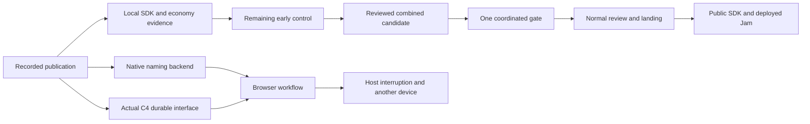

# Artroom sprint report — 10 October 2026, 07:00 Eastern

Filed at the 07:00 Eastern boundary after a fresh workroom survey. This draft covers progress toward the whole project, not a claim that Artroom is complete.

The sprint has published the initial reviewed increment and six manual guides, accepted complete local SDK validation, and verified meaningful test-economy component evidence. The 10× test-overhead target, public SDK/Jam release and complete cloud/browser/device experience remain open.

| Outcome | What the evidence proves | What remains |
|---|---|---|
| Initial increment | Exact reviewed candidate landed at a127, with owner terminal and live remote proof; local tree and path correspondence verified | Full product, native, hosted and demo acceptance |
| Six manual guides | Exact independently approved prose landed at cf6; executable sources, tests and dependencies unchanged | All full manual outcomes, samples, public release and cold-reader/agent acceptance |
| SDK local staging | One reader case, four packages, compiled clone journey and NodeNext/Bundler/ambient-only strict contexts passed; public evidence and current source/tools/dependencies verified | Normal candidate gate/review/landing, verified publisher, public install and cold consumer, hosted/native/browser/Jam acceptance |
| Economy component baseline | Three compilers passed; 41 active cases passed with one original optional skip | Original wrapper remains failed; no 10× factor or causal benchmark |
| Reuse control | Disabling Hub reuse caused the exact intended assertion after both responses were decoded; source/cache/pool restored | Original wrapper remains failed because of its incorrect ready-callback assumption; later assertions were unrun |
| Early control | Corrected early-only recipe ran once: wrapper exited 0 and the one native case produced the intended allocation assertion; source/cache/pool restored | Planner accepted actual handle 64535 and its public evidence; normal candidate gate/review/landing remain owed |
| Combined candidate | Owner-reported source head composes 13 disjoint paths; primary planner verified 12 donor blobs and unchanged receiving-main entries | Two note traceability corrections, completed integration/gate preparation, one released gate and normal review/landing |
| Worktree maintenance | One released old report checkout was removed with normal Git removal; planner verified directory/registry absence and preserved branch/commit | The broader cleanup remains open; the older dependency-bearing checkout remains held |

The flow is a work plan. It does not depict completed hosted or device runs. No new screenshot or listening witness was captured for this report.

For the next sprint, keep this order:

1. Use the completed useful control evidence, review the combined candidate and run one coordinated ordinary gate at its exact head. Preserve all failed attempts and avoid unchanged baseline, reuse and SDK validation reruns. Continue the source-only audit of expensive demo/manifest setup as the next economy wave.
2. Close concrete public SDK and Jam blockers. Local staged packages are not registry packages. Publishing ownership must be explicit; Jam must use genuine public packages and a deployed service. A new Jam-owned handoff resolves declaration/codec key coherence and the verified native-history adapter, preserving the accepted pure model and real integration requirements. Its own acts work may proceed under the builder’s readiness judgment without a blanket Artroom-complete gate.
3. Use independent source capacity for the native shared-name backend and actual C4 credential-reference/operation interface. Integrate browser controls only after those real boundaries are reviewed. Preserve frozen revisions, original signed custody, known answers, durable failure blocking and separate accepted/verified/latest-read states.
4. Continue documentation and maintenance in free capacity. Review the four-checklist candidate; write the full planned Checks page; remove released worktrees through normal Git operations, preserving evidence and held dependency/private contexts.

The three connected product stories remain whole: a durable cloud coding workspace tied to conversation/fork/lease/credentials; a complete browser journey through attention, steering, review and authoritative publication; and the same member returning on another device with enrollment, revocation and recovery. The hosted-authority task still names removed Room paths, so its current-model reconciliation must identify real Scope mechanisms and gaps before dependent implementation. It does not reduce the contract to existing source.

Declared acts, Counting, M1 identity, capacity, provider adapters, public cold-consumer proof, developer interface, complete manual, legacy naming attachment and publication-label proof/budget/disclosure remain owned. R5 work behind Gate 2 remains conditional. None is closed by a smaller source preparation or fixture.

Review capacity is constrained: the checker stopped its goal and has unclaimed work. The user has been asked to resume that existing session. Planner continues independent coordination and evidence preparation. The npm publishing owner question is also pending; neither local staging nor this report authorizes registry publication.

Measured test share remains 96.55% of three earlier whole gates: 488.58 of 506.04 seconds. That is not all work today. The latest SDK run took 4.21 seconds wall time and 5.14 seconds CPU; reuse control took 4.52 and 4.79. These separate measurements do not prove a 10× reduction. Avoided repeats are concrete workflow decisions, not measured savings.

Boundary update: builder confirms no project runtime is live and the gate is unrun. Final combined note/candidate rebinding is active after correcting a message sent to a completed worker; no code/evidence loss or gate retry occurred. Current candidate/recipe acceptance and formal checklist review remain owed. Remaining cleanup, checker resumption and publishing ownership are still open. The next hourly survey is at 07:07 Eastern.
