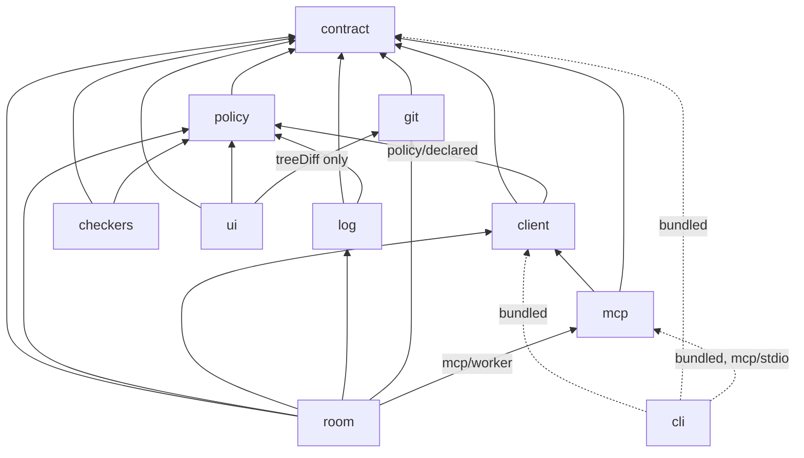

# Layering review of Artroom packages

Date: 2026-10-04. Reviewed head: `origin/main` at
`4a7a13a11313e7c26a21e5735d3d1c0df269b291`, on branch
`review/cloud-2026-10-04-layering`.

Purpose: map the current package layering, and say which parts I1 and later
packages should carry forward and which they must not repeat. This review
changes no runtime source.

Every claim has one of these labels:

- **[code]**: I read it in the source.
- **[cmd]**: I confirmed it by running a command. The scripts used are in
  `notes/cloud-reviews/scripts/`. Run them from the repository root.
- **[inferred]**: my judgement from the evidence. It was not tested.

## Summary

- The package graph has no cycles. `contract` is a real base layer: it holds
  types and pure guards, and nothing above it is imported from below
  [cmd].
- The layering problems are mostly inside and beside the layers, not between
  them:
  - The same low-level encodings are written up to five times: canonical
    JSON, strict JSON parsing, base64url, ID patterns, glob checks and error
    construction.
  - Several of those copies already behave differently on the same input
    [cmd].
- `room/src/core.ts` (2,274 lines) is a hub of at least twelve concerns.
- Every Room source file reaches the whole 12,300-line Durable Object test
  suite, so any Room change runs all of it [cmd].
- The strongest property to keep is one admission path for every
  transport. For example, the MCP endpoint is the real client, looping back
  into the Room's own wire [code].
- The clearest mistake not to repeat is putting shared low-level behaviour
  (encodings, ID checks, error tables) in runtime packages instead of in one
  small, tested, dependency-free layer.

## 1. Dependency graph

This graph is built from each package's `package.json` and from the
`@generalbusiness/artroom-*` imports in `src/` [cmd].

A dashed arrow means the dependency is bundled by esbuild and listed only
in `devDependencies`. `docs/release.md:58-59` says this is deliberate [code].

### Cycles

- The package graph has no cycles. Nothing depends on `room`, `cli` or `ui`
  [cmd].
- Inside packages, `scripts/cycles.mjs` finds no cycle through value imports
  across 190 source files [cmd].
- When type-only imports are counted, it finds four cycles [cmd]:
  - `contract`: roster, evidence, lanes and acts;
  - `room`: core and jobs;
  - `room`: room and founding;
  - `checkers`: sandbox and checker.

  These four are harmless at run time, but they show where two modules
  describe one concept [inferred].

### Upward and unusual dependencies

| Edge | What it is | Evidence |
|---|---|---|
| client → policy | The client builds declared envelopes and grants with `builtForBinding`, `governs`, `isPlatformKind` and `expandGrant`, so the client carries evaluation logic. | `client/src/grants.ts:12-20`, `client/src/room.ts:81` [code] |
| ui → git | The UI uses git's `treeDiff` and `DEFAULT_BOUNDS`, so a diff in the UI hits the same bounds as a proposal (R-PROP-6). That is reasonable, but it is the only reason the browser bundle depends on the Workers-side git package. | `ui/src/room/changes.ts:27-37` [code] |
| room → mcp → client | The Room hosts the MCP endpoint by running the real client against its own `RoomWire`. This is a deliberate loopback, not a layering error. | `room/src/mcp.ts:1-17` [code] |
| log/scripts → room/src | `log/scripts/memory.ts:39-40` imports `room/src/crypto.ts` and `room/src/logremote.ts` by relative path. This goes upward: log is below room, and log does not declare room as a dependency. | [code] |
| tests across packages | `cli/test/harness.ts:26`, `cli/test/workspace.test.ts:25` and `mcp/test/support.ts:3` import `../../client/test/support/fake-room.ts`. `mcp/test/mcp-core-9ca1d290.test.ts:20` imports `../../client/src/room.ts`. `room/measure/checks.mjs:15` imports `policy/src/helpers.ts`. | [code] |
| checkers → git | Listed in `dependencies`, but used only by `test/fixture.ts:13` and the measure harness. | [cmd] |

### Manifest inconsistencies

These are all [cmd]:

- The six published packages pin each other at `0.1.0-dev.1`.
- `room`, `git` and `checkers` are at `0.0.0`, use `"*"`, and are not
  marked `private`.
- `ui` is `private`, and pins `git` at `0.0.0` but the published packages
  at `0.1.0-dev.1`.

### Packages that must type-check through generated declarations

All [code]:

- `room/tsconfig.types.json` emits `.d.ts` files for log, client and mcp,
  and `room/tsconfig.json` maps those packages to them. The reasons are in
  the comments (`tsconfig.types.json:1-6`): log assumes a `TextDecoder` that
  differs from the Workers types, and client and mcp assume the DOM lib.
- `ui/tsconfig.json:7-11` does the same for policy.
- So each package silently assumes one runtime, and the build works around
  the mismatch instead of declaring it.

## 2. The contract boundary

### Where it holds

- `contract/src` is types, pure guards and frozen data, with no runtime
  dependencies [code]:
  - `guards.ts` holds guards only.
  - `legacy.ts` is data plus a private `deepFreeze`.
  - `transports.ts`, `policy.ts` and `checker.ts` hold interfaces and
    `declare` signatures.
- Implementations are checked against the contract's declarations at
  compile time, for example `client/test/contract.types.ts:10-17` for
  `connect`, `join` and `redeem` [code].
- The UI imports contract in one place only: `ui/src/room/contract.ts`
  re-exports about 90 types and 6 guards, and no other UI file imports
  contract [cmd].
- mcp, checkers and policy import the shared shapes rather than copying
  them, with the exceptions below [code].

### Where runtime packages reach past it

**ID patterns are copied instead of calling the contract's guards.** The
contract's patterns are at `contract/src/guards.ts:14-19`. All copies below
are [code]:

- Exact copies: `room/src/ids.ts:18-34`, `log/src/declared.ts:163-169`,
  `ui/src/room/acts.ts:26-32`, `checkers/src/job.ts:60-68`,
  `policy/src/validate.ts:14-15`, `client/src/keys.ts:44`,
  `client/src/envelope.ts:59`.
- Copies that already differ:
  - `cli/src/main.ts:582,975,1045` use `act_\d+_`, which accepts leading
    zeros.
  - `log/src/verify.ts:1230,1286` use `[1-9][0-9]*`, which has no 16-digit
    limit.
  - The contract's `isActId` also checks that the number is a safe integer
    (`guards.ts:42`).
- The contract has no guard for operation IDs or obligation IDs, so the
  local checks differ: `op_` takes 1 to 120 characters at
  `checkers/src/job.ts:172`, but 1 to 64 at `cli/src/main.ts:902`.

**Some concepts are defined twice under the same name.** All [code]:

- `Signer`: `checkers/src/signing.ts:22` repeats
  `contract/src/transports.ts:73`.
- `ExecResult`: `git/src/publisher/gitops.ts:21` names the field `code`,
  where `contract/src/checker.ts:85` names it `exitCode`.
- `TreeEntry`: `git/src/diff/treediff.ts:23` has `{name, mode: string,
  hash, type}`, while `log/src/git.ts:41` has `{name, mode: "100644" |
  "40000", sha}`.
- `LogPushOutcome`: written in both `git/src/publisher/log-push.ts:31-34`
  and `log/src/git.ts`. The comment says they are "the same type, both
  ways".
- `Refusal`: `log/src/calls.ts:66` has a local `{rule: string; reason:
  string}`.

**The "may this role sign this kind" rule is written three times.** It is
derived from `ARTROOM_LEGACY_V1` in [code]:

- `policy/src/vocabulary.ts:133` (`roleMaySign`);
- `log/src/roster.ts:73-89`;
- `mcp/src/toolsets.ts:54` (`legacyRoleMaySign`), even though mcp does not
  depend on policy. I confirmed the mcp copy by reading the line.

**Interfaces are stringly typed.**

- `string` is used where a contract type exists [code]:
  - `client/src/bearer.ts:51,113,225` (`kind`, `idempotencyKey`);
  - `client/src/wire.ts:99,105` (`room`);
  - `log/src/fold.ts:63,91`;
  - throughout `git/src/publisher/*` (`lane`, `head`).
- Refusal codes are kept as `ReadonlySet<string>` at
  `log/src/calls.ts:323-338`, and the declared-act codes are re-listed by
  hand instead of using the `PlatformRule` union (`contract/src/errors.ts`)
  [code].
- About 150 casts such as `as …Id` or `as Sha` appear outside contract.
  The largest groups are in `room/src/memory/artifacts.ts`,
  `room/src/core.ts`, `room/src/roster.ts` and `log/src/verify.ts`. I
  counted them with grep, so the count is approximate [cmd].
- `envelopeOf` in the contract is an unchecked cast,
  `as unknown as AnyEnvelope` (`contract/src/guards.ts:88`) [code].

**Contract subpaths each have one consumer.** `./policy` is used only by
`policy/src/helpers.ts`. `./client` is used only by a client type test.
`./checker` is used by no runtime package. Each acts as a conformance hook,
not a shared surface [cmd].

## 3. Duplication across packages

Most copies differ in their edge cases. I re-ran these comparisons
(`scripts/canon.mts`, `b64.mts`, `glob.mts` and `sig.mts`) and they give
the results below [cmd].

| Concept | Copies | Behaviour difference |
|---|---|---|
| Canonical JSON (RFC 8785) | `client/src/canonical.ts:58`, `log/src/canonical.ts:37`, `room/src/canonical.ts:41`, `policy/src/integrity.ts:22` | Client silently drops a property whose value is `undefined`; the other three throw. Policy refuses the keys `__proto__` and `constructor`; the other three accept them. Each throws a different error type: `CanonicalError`, `ArtroomError`, or `PolicyEvalError` [cmd]. Checkers signs with policy's copy (`checkers/src/signing.ts:12,42`) [code]. |
| Strict JSON parse | `log/src/canonical.ts:73`, `room/src/canonical.ts:86` | Room refuses nesting deeper than 64. Log has no limit and fails with a `RangeError` (stack overflow) at 20,000 levels. For a raw control character, log throws `SyntaxError` and room throws `CanonicalError` [cmd]. |
| Base64url | `log/src/crypto.ts:36,54`, `room/src/crypto.ts:49,68`, `client/src/keys.ts:12,18`, `git/src/publisher/log-push.ts:51,58`, `checkers/src/signing.ts:29,35`, and `room/src/logremote.ts:107` (a deliberate low-memory copy) | Every encoder gives the same output. The decoders differ: log and room refuse non-canonical `"QR"`, and the other three accept it. Only checkers accepts padded `"AA=="`. Client, git and checkers throw a raw `DOMException` on input whose length leaves a remainder of 1 when divided by 4 [cmd]. |
| SHA-256 and digests | `log/src/crypto.ts:13-31` and `room/src/crypto.ts:19-41` are synchronous, using @noble. `client/src/canonical.ts:71,75` and `policy/src/integrity.ts:13,27` are asynchronous, using WebCrypto. | Log and room are the same code [code]. |
| Ed25519 signing bytes | `log/src/crypto.ts:94,108`, `room/src/crypto.ts:135,173`, `client/src/keys.ts:93,104`, `checkers/src/signing.ts:41,71` | For the `artroom-entry-v1` domain, client signs the JSON string with its quotes, while room and log sign the raw text. This is a latent difference: today nothing calls client with that domain [cmd for the bytes; read for the callers]. The argument order differs between log's `verifySig` and room's `verify` [code]. |
| Glob validation | `policy/src/glob.ts:11`, `room/src/glob.ts:150` | Room refuses patterns over 256 characters and a `**` that is not a whole path segment. Policy accepts both [cmd]. Room's own schema uses its own stricter copy, while log verify and the UI use policy's laxer one (`log/src/declared.ts:26`, `ui/src/room/glob.ts`) [code]. |
| Error construction | `client/src/errors.ts:9-73`, `room/src/errors.ts:9-44` | The same retryable and HTTP status tables. Only the table name (`STATUS` or `HTTP_STATUS`) and the key order differ [code]. Other places build the object by hand and skip the table: `mcp/src/run.ts:42`, `mcp/src/toolsets.ts:37,157`, `git/src/workspace/workspaces.ts:128-135`, `checkers/src/checker.ts:94,99`. `cli/src/main.ts:699` marks `unavailable` as not retryable, against the table [code]. |
| Admin-approval obligation | `room/src/obligations.ts:36-47`, `policy/src/admin.ts:21-30` | Same values. Log imports policy's copy (`log/src/obligations.ts:56`) [code]. |
| Recover ops list | `log/src/roster.ts:97`, `room/src/authority.ts:54`, `log/src/decode.ts:138`, `room/src/schema.ts:38` | Same lists under two names [code]. |
| Step-field table | `policy/src/steps.ts:41`, `log/src/declared.ts:62`, and the admission schema in `room/src/schema.ts` | The values match. Log adds `need: "scope"`. A Room test checks that they agree (`policy/src/steps.ts:6-7`) [code]. |

Three in-memory models of the Room's rules sit beside the real one, as test
or demo doubles [code]:

- `client/test/support/fake-room.ts` (1,437 lines);
- `ui/src/room/mock/world.ts` (1,121 lines);
- `git/test/support.ts`, which has its own `FakeRoom`.

Each says it is "not the room". They can drift from the Room without any
test noticing [inferred].

### Two copies that have a stated reason

- Log's verifier keeps its own copies "so verify does not trust the Room's
  code" (`log/src/obligations.ts:16-19`, `log/src/roster.ts:1-5`,
  `log/src/declared.ts:17-19`) [code]. The aim is sound, but it is applied
  unevenly: verify imports policy's `adminObligation` and glob, which the
  Room's admission also uses, while the Room keeps a private copy of the
  same obligation [code]. So the independence is neither complete nor
  stated per helper [inferred].
- `room/src/canonical.ts:10-11` says canonicalisation must be synchronous
  for SQLite [code]. Log's copy is also synchronous and is exported, so
  that reason explains why the copy is not WebCrypto, not why it is not
  imported from log [code].

## 4. The ten largest source files

Test files are excluded. The counts are from `wc -l` [cmd].

| # | File | Lines | One concern? |
|---|---|---|---|
| 1 | `room/src/core.ts` | 2,274 | **No.** One class, `RoomCore`, runs from line 205 to the end of the file, with about 94 methods. It has 12 section markers: identity, founding, policy, policy inputs, the queue, sealing, attention, landing host, alarm work, notify, log publication, and durable alarm work [cmd]. |
| 2 | `room/src/admission.ts` | 1,874 | **Mostly.** It is one pipeline of 11 numbered steps (header `:1-20`), but it also holds roster semantics (`:428`), lane and lease checks (`:723-835`) and record building (`:837`) [code]. |
| 3 | `log/src/verify.ts` | 1,561 | **One concern, but one function.** `verifyLog` runs from line 273 to the end of the file, about 1,290 lines with 62 inner functions [cmd]. |
| 4 | `cli/src/main.ts` | 1,320 | **No.** It holds argument parsing, the journal and replay (`journaled`, `:446`), the landing wait, output formatting, and one `COMMANDS` object literal from line 625 to line 1257 [cmd]. |
| 5 | `git/src/workspace/workspaces.ts` | 1,134 | **Yes:** lane workspaces and their durable duty protocol (header `:1-80`). It is one class from line 153 to line 1120 [cmd]. |
| 6 | `ui/src/room/mock/world.ts` | 1,121 | **Yes, but it is a third model of the Room's rules** (see section 3) [code]. |
| 7 | `log/src/publisher.ts` | 1,097 | **Yes:** log publication. It mixes layout planning, git object building and push logic, all for one job [code]. |
| 8 | `git/src/landing/core.ts` | 1,056 | **Yes:** a synchronous landing state machine with no I/O. This is the clearest file in the repository [code]. |
| 9 | `client/src/room.ts` | 1,053 | **Yes:** one implementation of every act and read, with the HTTP and RPC transports as thin subclasses (`:733`, `:922`) [code]. |
| 10 | `git/src/mints.ts` | 951 | **Yes:** the canonical mint ledger and its record states [code]. |

The largest test files are `git/test/landing.test.ts` (1,754 lines),
`room/test/workerd/log-tokens.test.ts` (1,698) and
`git/test/workspaces.test.ts` (1,601) [cmd].

## 5. Test layering

The counts are from `wc` and `npx vitest list --filesOnly`. Test bodies
were not run [cmd].

| Layer | Where | Files | Lines |
|---|---|---|---|
| Node unit tests (vitest) | policy 11, log 15, client 9, mcp 9, cli 6, checkers 5, room node 5 entry files + 16 case files | 60 entry files + 16 case files | about 18,600 |
| workerd: real Durable Objects with SQLite (Miniflare) | room workerd: 10 entry files + 18 case files | 28 | 12,259 |
| workerd, runtime checks only | policy 3 (the same files again), log 1 (golden), client 1 (a 32-line signing vector) | 5 | about 600 |
| Declared witness set | `room/test/workerd/declared-run.test.ts` reruns chosen tests under `v2` | 1 | 91 |
| Node's test runner with real git subprocesses | git | 12 | 8,190 + 993 support |
| UI unit tests (happy-dom) | ui | 10 | 3,400 |
| Browser | `ui/e2e/smoke.spec.ts` (Playwright, Chromium) | 1 | 222 |

`contract` has no tests of its own [cmd].

### What is end to end in effect

All [code]:

- **Real git:** the git package (10 of its 12 files), the checkers fixture,
  the CLI harness, and log's `gitcli` and `cli` tests.
- **Real HTTP to a fake Room:** every client, mcp and cli test that uses
  `FakeRoom`, which listens on 127.0.0.1 (`fake-room.ts:1193`).
- **Real MCP SDK client over streamable HTTP:** `mcp/test/stage0.test.ts`.
- **A real CLI subprocess:** `cli/test/cli.test.ts:267` (`artroom mcp`
  over stdio).
- **A second node process:** `cli/test/lock.test.ts`, which polls and
  sleeps on the wall clock at lines 104-118, against `docs/testing.md`.
- **Not tested:** no test runs wrangler or a real container. Checkers
  models its containers as host processes.

### Where one change runs everything

`scripts/graph.mjs` reproduces the import graph that the root vitest run
uses to select tests [cmd]:

| Source file | Test files reached (of the 72 in the root run) |
|---|---|
| `policy/src/errors.ts` | 71 |
| `contract/src/index.ts` | 70 |
| `client/src/room.ts` | 35 |
| `room/src/core.ts`, and every other `room/src` file | 11: all 10 Room workerd entry files plus `declared-run`, the whole 12,300-line Durable Object suite |

The rules in `scripts/test-changed.mjs` add more [code]:

- A change to a root manifest, the lock file, a root `tsconfig` or the root
  `vitest.config.ts` runs all three runners.
- A change in contract or policy runs the git and ui suites whole, because
  those suites are chosen by package dependency, not by import.

The Room's workerd entry files all import `test/workerd/support.ts:36`,
which imports `../../src/index.ts`. So the Room's suite has no finer
selection than "all of it" [cmd].

## 6. Carry forward, and do not repeat

### Properties worth keeping in I1 and later packages

1. **A contract package of types, pure guards and declarations only, with
   no runtime dependencies, at the bottom of an acyclic graph.**
   `contract/package.json` has no dependencies, and the graph has no cycle
   [cmd]. Keep it at the bottom. Keep "implementation checked against a
   `declare` signature at compile time" (`client/test/contract.types.ts`)
   [code].
2. **One admission path for every transport.** `room/src/admission.ts:1-20`
   lists the same 11 steps for every act. The MCP endpoint reuses the real
   client over the Room's own wire, so it decides nothing itself
   (`room/src/mcp.ts:1-13`) [code]. Composed scopes should keep one
   admission function per scope.
3. **Synchronous state machines with the I/O kept in a separate driver.**
   `git/src/landing/core.ts:1-20` runs each step in one transaction, with
   no `await`. Tests can stop the driver between any two steps [code]. The
   same pattern serves the mint ledger and workspace duties
   (`git/src/mints.ts`, `git/src/workspace/workspaces.ts`) [code]. This
   fits "recoverable effects" in plan 017.
4. **One client implementation with transports as thin subclasses**
   (`client/src/room.ts:733,922`) [code].
5. **A single import site for the contract in the UI**
   (`ui/src/room/contract.ts`) [cmd].
6. **A verifier that does not run the Room's code**, as an aim
   (`log/src/obligations.ts:16-19`) [code]. Keep the aim, and state it per
   module, which today it is not (see section 3).
7. **Testing at the cheapest boundary** (`docs/testing.md`), and a selector
   that follows imports (`scripts/test-changed.mjs`) [code].

### Mistakes not to repeat

1. **Shared low-level behaviour written in each runtime package.**
   Canonical JSON (4 copies), base64url (5), ID patterns (8 or more), glob
   validation (2) and the error tables (2, plus hand-built objects) differ
   on real inputs (section 3) [cmd]. I1 should put each encoding and
   validator in one small, runtime-neutral module with no dependencies
   (WebCrypto and plain TypeScript only), next to the contract, and test it
   there. Where a verifier needs its own copy, a test should prove the two
   copies agree.
2. **Guards missing from the contract.** Operation and obligation IDs have
   no contract guard, so the copies disagree on length (64 or 120
   characters) [code]. Every identifier the protocol names should get a
   guard in the contract.
3. **A hub class.** `RoomCore` gathers 12 concerns, and any change to it
   reruns the whole Durable Object suite (sections 4 and 5) [cmd]. A scope
   should be a small core: log, fold and admit. Founding, publication,
   landing, workspaces and alarm loops should be separate modules that the
   core calls through narrow ports.
4. **Silent runtime assumptions.** Packages assume Node, DOM or Workers
   libs implicitly, so room and ui type-check others through generated
   declarations (section 1) [code]. Each package should declare its target
   runtime. Shared layers should compile against the narrowest common lib.
5. **Evaluation logic leaking into the client and MCP.** The client
   imports `policy/declared`, and mcp re-derives `roleMaySign` from the
   legacy table (section 2) [code]. A client should get what it may do from
   the scope's published declaration through one function, not re-derive
   it.
6. **Reaching across packages by relative path.** Tests and scripts import
   other packages' `src/` and `test/support/` by relative path, including
   upward from log to room (section 1) [code]. Shared test doubles belong
   in an exported test-support entry, or in one fixture package.
7. **Parallel models of the Room's rules.** Three in-memory models sit
   beside the real Room (section 3) [code]. Each rule they copy can drift
   [inferred]. Prefer one in-process implementation of the real fold as the
   fake.
8. **Manifests out of step.** Version specifiers and `private` flags are
   inconsistent, and checkers lists a test-only dependency as a runtime
   dependency (section 1) [cmd].
9. **Names reused for different shapes**: `TreeEntry`, `ExecResult`,
   `Signer`, `Binding` [code]. When the model is replaced, give each concept
   one name and one home.

## 7. Limits of this review

- **I could not read the I1 plan.** The branch `request/i1-scope-substrate`
  does not exist on `origin`, and neither `git ls-remote origin` nor
  `git branch -r` lists it [cmd]. The advice in section 6 is therefore
  written against plans 017 and 018 only, and may repeat or contradict
  decisions already made there [inferred].
- **No tests were run.** I ran `npm ci` and `npm run typecheck`, and both
  passed [cmd]. I did not run the gate or any test suite, so any claim
  about tests comes from configuration, listing and import analysis.
- **The import analysis is regex-based**, not compiler-based. It follows
  static imports and skips type-only ones. A dynamic or computed import
  would be missed. One known dynamic import is
  `cli/src/main.ts:1238`, which loads `mcp/stdio`; it is counted in the
  graph [code].
- **The behaviour comparisons ran under Node 22, not workerd.** Results may
  differ where a copy uses WebCrypto or `atob` differently in workerd
  [inferred].
- **The duplication search is not exhaustive.** It started from repeated
  file names and common helpers (encoding, hashing, signing, IDs, errors,
  globs), so duplication with different names may remain.
- **Part of the evidence was gathered by sub-agents.** I re-ran the four
  behaviour comparisons, the test-reach counts and the cycle check myself
  and spot-checked about a dozen file references. The other file:line
  references are as reported and were not each re-opened.
- **I did not review `examples/`, `spikes/`, `release/` or
  `packages/*/measure`**, except where noted.
- **The `[cmd]` count of about 150 casts comes from grep**, and includes
  some legitimate casts at trusted boundaries.
