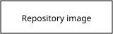

# Site completeness

## Getting *started*

## Getting *started*

Use [the first section](#getting-started) and [the repeated section](#getting-started-1).

*Emphasis*, **strong emphasis**, ~~strikethrough~~ and `inline code`.

- First bullet
- Second bullet
  - Nested bullet

1. First ordered item
2. Second ordered item

- [x] Finished task
- [ ] Open task

| Feature | State |
| :--- | ---: |
| Links | working |
| Images | working |

```ts
const answer = 42;
```

> A quoted paragraph.
>
> With another paragraph.

Visit https://example.com/guide, www.example.com and reader@example.com.

Read [the companion page](companion.md#linked-section),
[the repository root](/README.md) and [the parent page](../index.md).



Inline HTML <em>stays text</em>.

<div>Block HTML stays text.</div>

[An unsafe link](javascript:alert(1))

Footnote syntax is outside GFM: a note[^note].

[^note]: This is ordinary text, not a footnote.

Wiki syntax is also ordinary text: [[Companion]].
