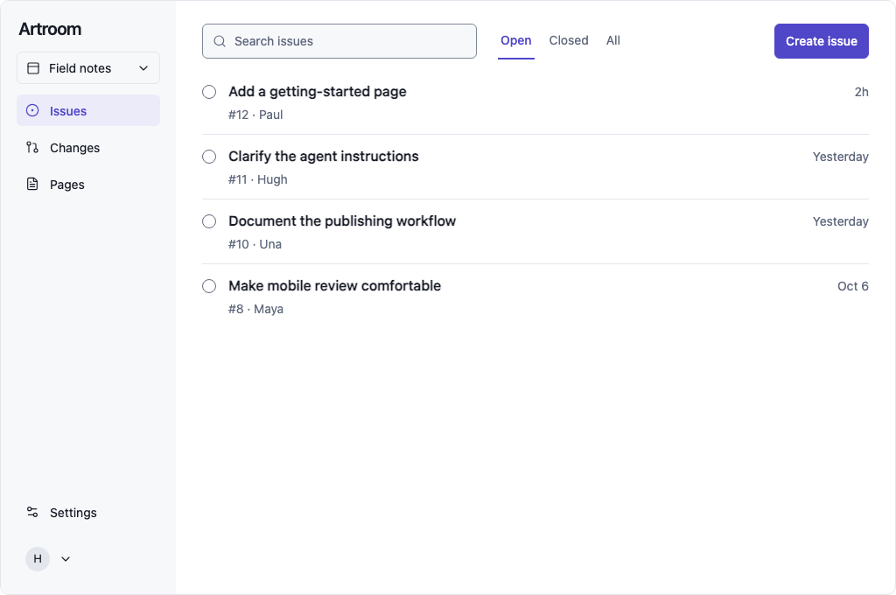
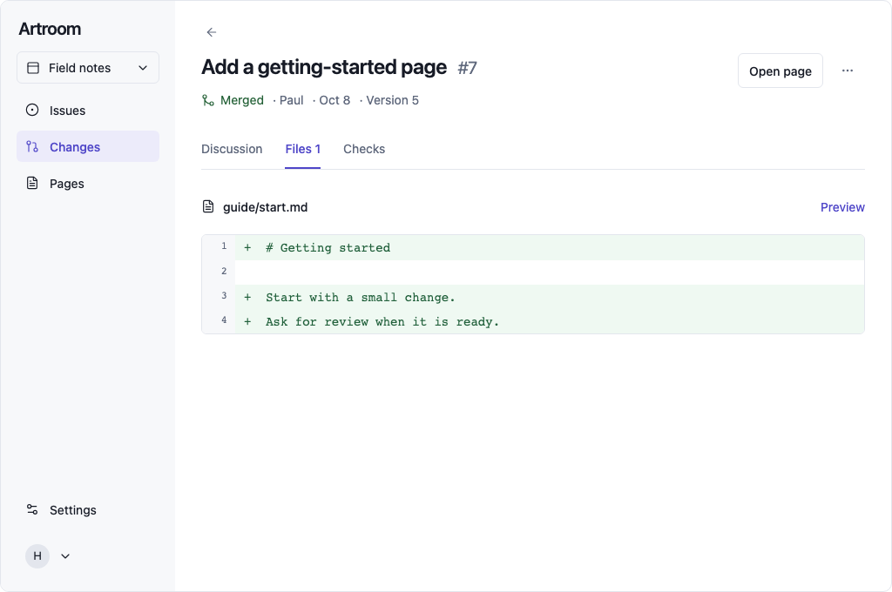
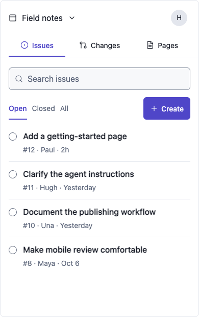
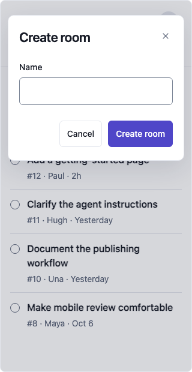
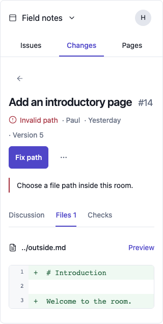
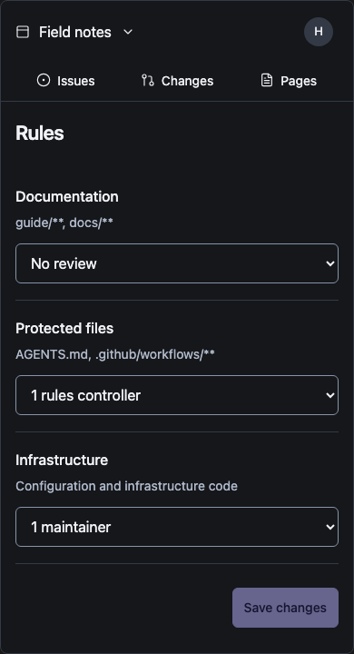

# Artroom design revision

The rebuilt concept puts the work first. The room appears once in the switcher. A change has one current status and one useful next action. Creating a room asks for its name. Routine views contain no setup lesson, protocol schema, success essay or empty metadata panel.

[Explore the interactive design](artroom-refined-design.html). The existing [editable report](https://chatgpt.com/space/page_61475ce61cc081918847b035bf0c82b3) also contains this revision. The first concept remains in the parent directory as historical evidence.

## What changed

| First concept | Rebuilt design |
|---|---|
| Room name in a breadcrumb and a heading | One room switcher; no room heading in content |
| Navigation, list heading and explanatory tagline | Selected navigation identifies the list; the heading remains available to screen readers |
| Merged badge plus Published panel and success prose | One Merged label beside author and version; Open page is the next action |
| Open badge plus panels explaining that the change is still open | One current condition: Open, Needs review, Invalid path or Awaiting confirmation |
| Ready for the first edit and a paragraph about enabled features | Name-only Create room form |
| Room name, room address and repeated generated path | One editable name; address and provisioning belong to their actual contracts |
| Separate changed-file sidebar, empty links and other None rows | File information lives in Files; missing optional metadata gets no standing panel |
| Repeated preview and published-site links | Preview beside the selected file; Open page on the merged change; Pages for current published content |
| Policy lecture before applying rules | Editable review requirements, with a precise before/after confirmation only when changed |
| Readonly pattern input repeating the protected-file summary | Matching paths appear once under the relevant rule group |
| A picker containing one eligible reviewer | Request review from Maya names the recipient and acts directly |
| Permanent sample-success disclaimers after each action | The content updates; concise completion announcements are available to assistive technology |
| Multiple navigation variants and visible screen/state controls | One coherent design; optional Explore screens controls sit below it |

## Design rules to carry into implementation

1. **Give each fact one default home.** Room identity belongs in the switcher, status in the change metadata, file identity in Files, and policy in Rules. Inspecting a record or opening a picker can legitimately show more context; ordinary reading must not repeat it.
2. **Let controls explain actions.** Use Create issue, Propose change, Review change, Merge change, Open page and Save changes. Keep ordinary destination names such as Issues and Pages. Remove prose that merely translates a visible button.
3. **Use consistent outcome language.** The user merges a change; the confirmed result is Merged. Branch publication and individual operation outcomes remain distinct evidence in the record. A confirmed internal operation never earns the main Merged label.
4. **Show requirements where they affect a decision.** A protected edit leads to review. It does not require a lecture during room creation. A path error appears beside the path being corrected. An uncertain merge offers Check status rather than a duplicate submission.
5. **Prefer real content to completion notices.** A new room shows its name and an empty list. A comment appears in the conversation. Saved rule values remain visible. Avoid adding a second panel that announces the same result.
6. **Avoid false choices and false affordances.** A single eligible target needs no picker. A readonly text field that looks editable is unsuitable. Omit unsupported controls until a real contract and action exist.
7. **Preserve the subject.** Reviews and previews identify an exact version. Opening a merged page preserves that version; editing uses the content the person was looking at. Names, drafts, rules and work belong to their room.
8. **Make narrow layouts a designed surface.** Use a compact room header and navigation on phones. Keep titles full width, metadata below, and at least 44px effective task targets. Use 16px editable text, including on a tablet with a coarse pointer.

## Visual system

The selected direction is a quiet desktop rail and an unboxed work list, with the same content hierarchy on phones. The app uses white paper, a cool neutral rail, charcoal text and one violet accent. Separators group content; cards and shadows are reserved for an actual dialog.

| Element | Specification |
|---|---|
| Body and editable content | System font, 16px with 24px line height |
| Navigation, labels and metadata | 14px; no routine text reduced to tiny captions |
| Item heading | 24px desktop, 22px phone |
| Canvas / rail | Light `#FFFFFF` / `#F7F8FA`; independently checked dark colors |
| Primary / secondary text | Light `#171B26` / `#5F687C` |
| Accent | Light `#4F46C8`, with white primary-button text |
| Essential input boundary | Light `#7D8798`; dark `#8894A8` |
| Controls | 6px corners; 44px core touch targets |
| Status | Text and icon; color supports meaning rather than carrying it alone |

The native primary-screen concept was compared at 1536px width. The implementation uses a 1024px CSS window at 1.5 device scale for that comparison. Its 680px canvas is four physical pixels shorter than the generated 1024px-height image; content does not depend on that canvas difference.

## Concept and render comparison

Concepts were generated with the built-in Image Gen tool, then implemented as native text, controls and local state. They are retained in `concepts/`: `issues-desktop.png`, `change-merged-desktop.png`, and `issues-mobile.png`.

| Comparison | Result and intentional change |
|---|---|
| Information hierarchy | Rail identifies the room once; list begins with search and actions; detail leads with the item and its current condition |
| Copy | Four primary issue titles retained; setup copy and repeated success text removed; core action labels match the chosen workflow |
| Typography | System UI text, readable metadata and native editable fields; browser-default control typography replaced |
| Palette | White canvas and cool rail preserved; primary accent stays restrained; stronger input boundaries meet measured contrast |
| Containers and spacing | No nested information cards; list rows tightened after direct screenshot comparison |
| Icons | One consistent supplied outline family; closed issues use a checked shape; decorative icons are excluded from accessible names |
| Phone layout | Rail becomes a compact header; the Create button stays on one line; titles retain usable width |
| Version and state | Merged appears once; Preview names its version; Open page retains the selected merged content |

Intentional changes from generated imagery: the invented Taylor Kim name/photo was replaced with the sample H account control; duplicate destination text in back controls became labelled arrows; essential input boundaries were strengthened; the merged sample uses #7 so it does not collide with issue #12 in the room's shared numbering. These were explicit relevance, accessibility and domain-consistency corrections. No unrelated decorative asset was added.

## Verification

The flow under test was: room creation → issue or page work → review → merge request → confirmation → selected page. Search/filtering, correction and settings were tested as part of that flow.

The Browser/IAB inventory contained no available browser surfaces. Verification used the already cached Playwright 1.63.0 and its Chromium, with the visualization skill's sandboxed renderer at `http://127.0.0.1:8124/index.html`. No package was installed and no application source or dependency file changed.

| Check | Result |
|---|---|
| Page identity and meaningful content | Passed |
| Framework overlay / relevant console errors | None |
| Responsive state matrix | 99 checks passed across 320, 352, 390, 600, 736, 768, 800 and 1056px browser widths, including dark views |
| Duplication | One visible room name; one detail status; no repeated room heading, setup paragraph or Merged/Published success panel |
| Creation | One input and no explanatory paragraphs; collision preserves the entered name |
| Local interactions | Search/filter/clear, create room/issue, close/reopen, comments, path correction, review, merge/confirmation, exact page and rule save passed |
| Drafts and scope | Comment survives navigation; new rooms start empty and retain their own work and rules |
| Keyboard | Modal trap/Escape/focus return, detail-tab arrows and route focus checked |
| Touch | Phone buttons checked at 44px; coarse-pointer desktop search uses 16px text and 44px target |
| Contrast | Ten key rendered color pairs passed: text 4.5:1 and essential boundaries 3:1 |
| Visual inspection | Both selected concepts and final desktop/phone renders inspected with view_image; checked copy, layout, typography, palette, controls and wrapping |

Measured light contrast: title 17.20:1, metadata 5.59:1, placeholder 5.26:1, input boundary 3.41:1 and primary-button text 6.90:1. Corresponding dark pairs were 15.90:1, 9.19:1, 8.45:1, 5.38:1 and 9.04:1. These are specific component checks, not a full conformance claim.

Fixed during the loop: narrow Create-button wrapping, over-tall list rows, competing back/navigation labels, own-state echo recursion and stale echo resets, lost draft context, cross-room sample leakage, unreviewed protected edits, duplicate room-wide item numbers and a redundant single-option reviewer form.

The implementation was checked against the selected visual direction and the adjusted copy inventory. The deliberate changes above are recorded rather than silently described as pixel-identical. There are no known script, overflow or duplicate-information failures in the checked views.

The preview uses local fixtures. Production membership, authorization, full rule evaluation, hosted founding, signed publication and retention remain implementation work under the existing handoffs. Physical Safari/iOS/Android, virtual-keyboard, assistive-technology, zoom and live-provider acceptance remain to run. The native Page embed is verified by save/readback; its host was not visually inspected. Connecting the Browser plugin would enable future in-app browser verification.

Application source and tests are unchanged. The review worktree's before/after source tree is `2d00a7ee9b664322f73267923f1e7466d10d23b7` at `1eed91aacac56649ac0b75c0652215b0418eeff8`; the earlier gate remains applicable per `docs/testing.md`. No whole suite or mutation sweep was repeated.

## Prompt set and retained files

The generation briefs specified: a complete Artroom desktop Issues screen with one Field notes switcher, one toolbar and four unboxed rows; a matching merged-change screen with one Merged label and file diff; and a matching 390px mobile list with compact header, native-sized controls and whole-word titles. They explicitly excluded duplicate headers, breadcrumbs, setup/success panels, metrics, decorative cards and irrelevant prose. The two companion concepts used the desktop Issues concept as the style reference. All three used the built-in tool, without CLI fallback.

The final source is `artroom-refined-design.html`. Concepts are in `concepts/`; selected renders are in `screens/`. Temporary verification scripts and the renderer wrapper stay outside the repository. Detailed raw checks are in `checks.json` and `contrast-and-flow-checks.json`.

## Screenshots

